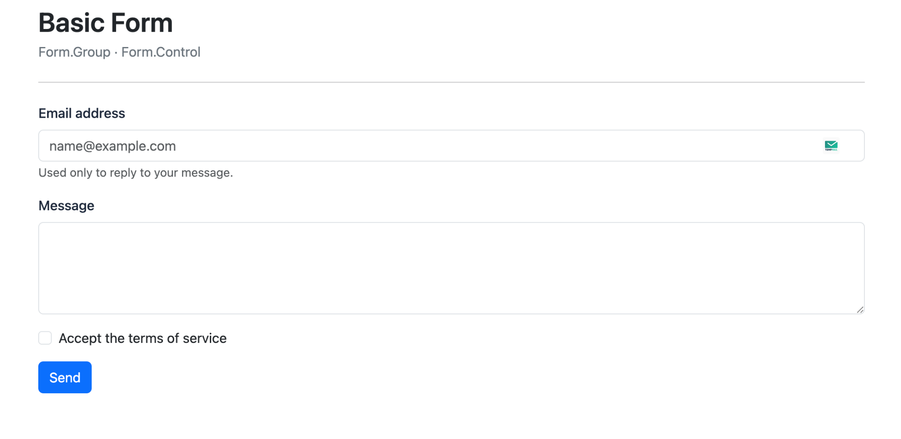
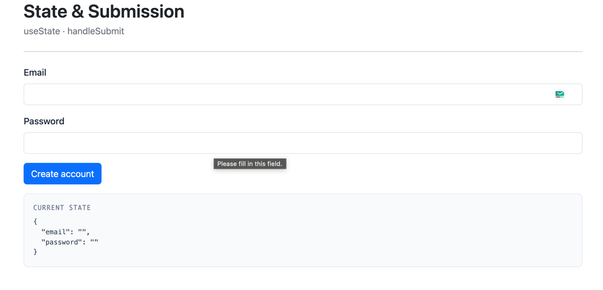
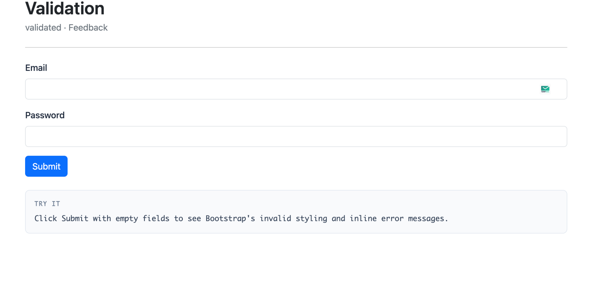
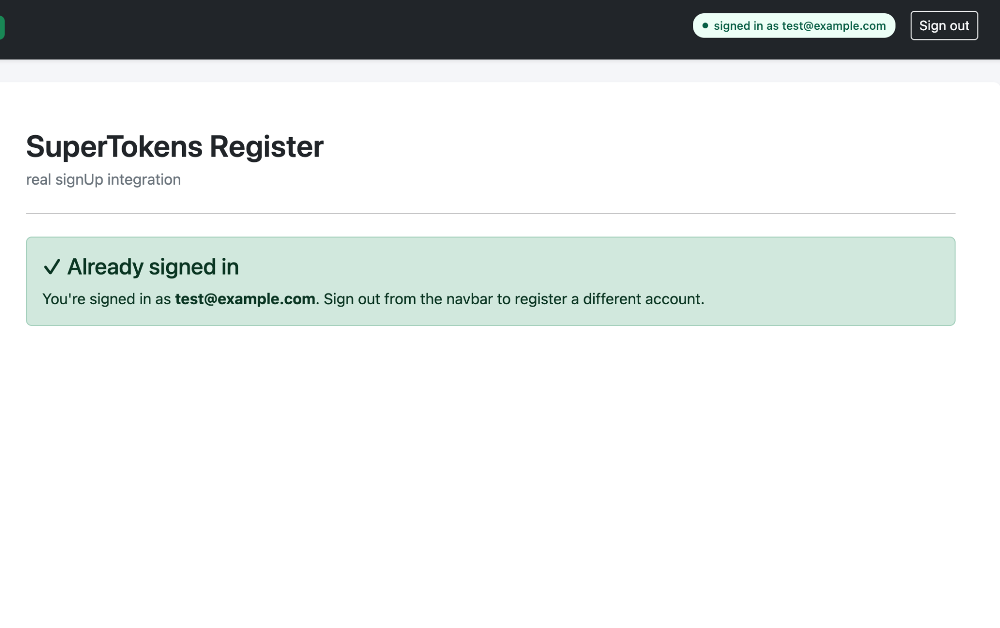
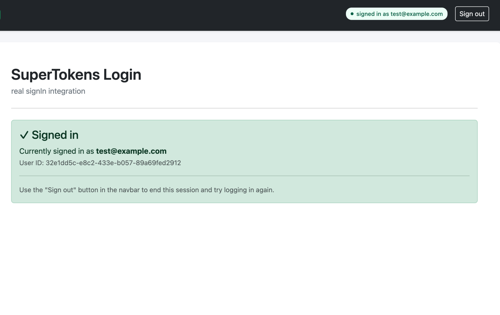
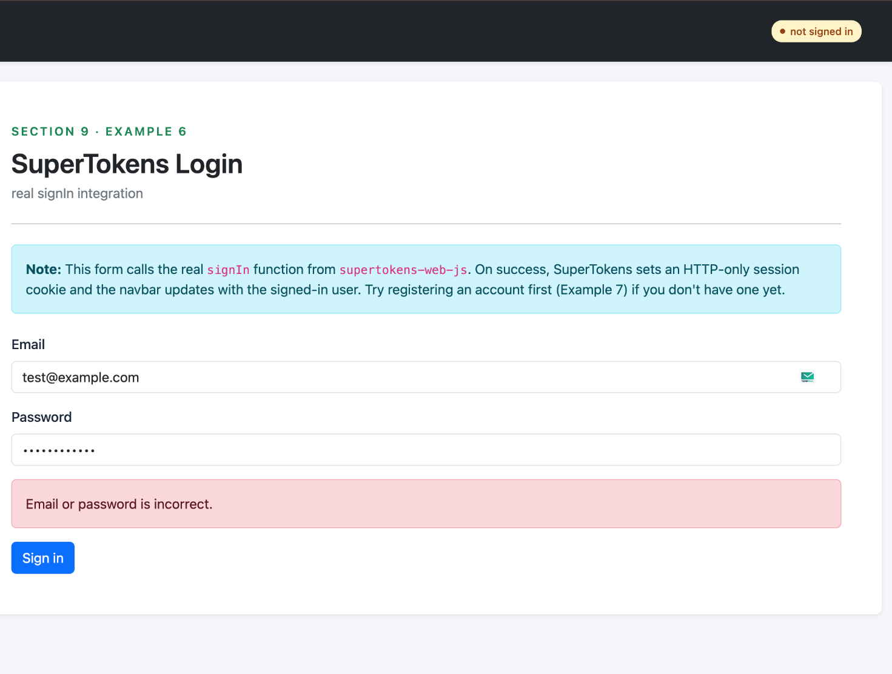

Forms are the most common surface where a React application meets the user. Login, signup, checkout, settings, contact. Each has the same underlying requirements: consistent styling, responsive layout, clean validation, accessible error messaging, and code that stays maintainable as the field list grows.

React Bootstrap solves a large share of that work out of the box. The library wraps Bootstrap's CSS framework in React components that handle styling, layout, and accessibility wiring so application code can focus on data and behavior. This guide walks through building a form from installation to submission, with validation, styling, and a real SuperTokens authentication integration covered along the way.

## What Are React Bootstrap Forms?

React Bootstrap is a React component library that ships Bootstrap-styled components with idiomatic React APIs. With plain Bootstrap, you write raw class names by hand, `form-group mb-3`, `form-control`, and so on. React Bootstrap replaces that with purpose-built components like `<Form.Group>` and `<Form.Control>` that produce the same markup underneath.

The result is form code that feels native to React while staying fully compatible with Bootstrap's styling and documentation.

### Core Form Components

React Bootstrap forms are built from a small set of composable components:

- `<Form>` is the root element, accepting `validated` and `onSubmit` props.
- `<Form.Group>` wraps a single field. Its `controlId` prop wires the label to the input for accessibility.
- `<Form.Label>` renders an accessible label for the field.
- `<Form.Control>` is the actual input element. Use the `type` prop for variants like `email` or `password`, or swap the underlying element with `as="textarea"` or `as="select"`.
- `<Form.Control.Feedback>` shows validation messages, controlled by `type="valid"` or `type="invalid"`.
- `<Form.Check>` renders checkboxes and radio buttons.
- `<Form.Text>` renders helper text beneath a field.

These components map one-to-one onto Bootstrap's form documentation, so anything described there translates directly into React Bootstrap code.

## Why Choose React Bootstrap for Form UIs?

- **Prebuilt, consistent styling:** Bootstrap's design system covers spacing, typography, color, and component states. Using `React Bootstrap` inherits all of that without writing CSS, so forms in a settings page look like forms in a signup flow.
- **Responsive layout utilities:** Bootstrap's 12-column grid is exposed through `<Row>` and `<Col>`, plus spacing, flex, and display utility classes. A two-column desktop layout collapsing to a single column on mobile takes one prop, not a media query.
- **Accessibility by default:** Setting `controlId` on `<Form.Group>` automatically associates the label with the input via matching `id` and `htmlFor` attributes. This is one of the most commonly missed pieces in hand-rolled forms.

The tradeoff is opinionation: forms built with React Bootstrap look like Bootstrap forms. For products with a strong custom design system, a headless library like React Hook Form paired with Tailwind is usually a better fit. For everything else, the speed and consistency wins outweigh the visual constraints.

## How to Install and Configure React Bootstrap

The library requires two packages: `react-bootstrap` for the components and `bootstrap` for the underlying CSS.

```bash
npm install react-bootstrap bootstrap
# or
yarn add react-bootstrap bootstrap
```

Then import the Bootstrap stylesheet once at the application entry point, typically `main.jsx` or `App.js`:

```js
import 'bootstrap/dist/css/bootstrap.min.css';
```

This import order matters. The Bootstrap CSS should load before any custom stylesheets so application-specific overrides take precedence. Components are imported individually rather than from a top-level barrel, which keeps the bundle lean:

```js
import Form from 'react-bootstrap/Form';
import Button from 'react-bootstrap/Button';
```

## How to Create a Basic Form with React Bootstrap

The smallest useful form has a label, an input, and a submit button:

```jsx
import { useState } from 'react';
import Form from 'react-bootstrap/Form';
import Button from 'react-bootstrap/Button';

export default function ContactForm() {
  const [submitted, setSubmitted] = useState(null);

  const handleSubmit = (e) => {
    e.preventDefault();
    const formData = new FormData(e.currentTarget);
    setSubmitted({
      email: formData.get('email'),
      message: formData.get('message'),
    });
  };

  return (
    <Form onSubmit={handleSubmit}>
      <Form.Group className="mb-3" controlId="contactEmail">
        <Form.Label>Email address</Form.Label>
        <Form.Control type="email" name="email" placeholder="name@example.com" />
        <Form.Text className="text-muted">
          Used only to reply to your message.
        </Form.Text>
      </Form.Group>

      <Form.Group className="mb-3" controlId="contactMessage">
        <Form.Label>Message</Form.Label>
        <Form.Control as="textarea" name="message" rows={4} />
      </Form.Group>

      <Form.Check
        type="checkbox"
        id="acceptTerms"
        label="Accept the terms of service"
        className="mb-3"
      />

      <Button variant="primary" type="submit">Send</Button>
    </Form>
  );
}
```



The `controlId` on each `<Form.Group>` wires the label to the input via matching `id` and `htmlFor`. The `className="mb-3"` adds Bootstrap's standard bottom margin between fields. The `as="textarea"` prop changes the underlying element while keeping the Bootstrap styling, and `as="select"` works the same way for dropdowns.

## How to Handle Form State and Submission

React Bootstrap stays out of the way on state management. The recommended pattern uses `useState` with a single state object holding all fields, plus one `handleChange` that updates by `name`:

```jsx
import { useState } from 'react';
import Form from 'react-bootstrap/Form';
import Button from 'react-bootstrap/Button';

export default function SignupForm() {
  const [formData, setFormData] = useState({ email: '', password: '' });

  const handleChange = (e) => {
    const { name, value } = e.target;
    setFormData((prev) => ({ ...prev, [name]: value }));
  };

  const handleSubmit = async (e) => {
    e.preventDefault();
    console.log('Submitting:', formData);
  };

  return (
    <Form onSubmit={handleSubmit}>
      <Form.Group className="mb-3" controlId="signupEmail">
        <Form.Label>Email</Form.Label>
        <Form.Control
          type="email"
          name="email"
          value={formData.email}
          onChange={handleChange}
          required
        />
      </Form.Group>

      <Form.Group className="mb-3" controlId="signupPassword">
        <Form.Label>Password</Form.Label>
        <Form.Control
          type="password"
          name="password"
          value={formData.password}
          onChange={handleChange}
          required
        />
      </Form.Group>

      <Button type="submit">Create account</Button>
    </Form>
  );
}
```



Key conventions: every input has a `name` matching a key in `formData`, `handleChange` reads `e.target.name` to update the right field, and `handleSubmit` always starts with `e.preventDefault()` to stop the browser's default navigation behavior.

## How to Add Validation to React Bootstrap Forms

`React Bootstrap` supports two layers of validation: native HTML5 attributes (`required`, `minLength`, `maxLength`, `pattern`) and the `validated` prop on `<Form>`, which controls when Bootstrap applies its valid/invalid styling. The standard pattern uses a `validated` state flag that flips after the first submit attempt:

```jsx
import { useState } from 'react';
import Form from 'react-bootstrap/Form';
import Button from 'react-bootstrap/Button';

export default function ValidatedForm() {
  const [validated, setValidated] = useState(false);

  const handleSubmit = (e) => {
    const form = e.currentTarget;
    e.preventDefault();

    if (form.checkValidity() === false) {
      e.stopPropagation();
      setValidated(true);
      return;
    }

    setValidated(true);
    // proceed with submission
  };

  return (
    <Form noValidate validated={validated} onSubmit={handleSubmit}>
      <Form.Group className="mb-3" controlId="userEmail">
        <Form.Label>Email</Form.Label>
        <Form.Control
          type="email"
          required
          pattern="[^@\s]+@[^@\s]+\.[^@\s]+"
        />
        <Form.Control.Feedback type="invalid">
          Please enter a valid email address.
        </Form.Control.Feedback>
      </Form.Group>

      <Form.Group className="mb-3" controlId="userPassword">
        <Form.Label>Password</Form.Label>
        <Form.Control type="password" required minLength={8} />
        <Form.Control.Feedback type="invalid">
          Password must be at least 8 characters.
        </Form.Control.Feedback>
      </Form.Group>

      <Button type="submit">Submit</Button>
    </Form>
  );
}
```



The `noValidate` attribute disables the browser's native validation popups, leaving Bootstrap's styling in charge. `<Form.Control.Feedback type="invalid">` only renders when `validated` is true and the input fails its constraints. For complex validation (cross-field rules, async checks), pair `React Bootstrap` with a library like `Yup`, `Zod`, or `React Hook Form`. The validation library handles the rules, and `React Bootstrap` handles the display.

## How to Style Forms and Layout

Multi-column layouts come from `<Row>` and `<Col>` working with `<Form.Group>`. The `as={Col}` prop tells `<Form.Group>` to render as a column:

```jsx
import Form from 'react-bootstrap/Form';
import Row from 'react-bootstrap/Row';
import Col from 'react-bootstrap/Col';
import Button from 'react-bootstrap/Button';

export default function AddressForm() {
  return (
    <Form>
      <Row className="mb-3">
        <Form.Group as={Col} md="6" controlId="firstName">
          <Form.Label>First name</Form.Label>
          <Form.Control type="text" defaultValue="Jane" />
        </Form.Group>
        <Form.Group as={Col} md="6" controlId="lastName">
          <Form.Label>Last name</Form.Label>
          <Form.Control type="text" defaultValue="Doe" />
        </Form.Group>
      </Row>

      <Row className="mb-3">
        <Form.Group as={Col} md="12" controlId="address">
          <Form.Label>Street address</Form.Label>
          <Form.Control type="text" placeholder="1234 Main St" />
        </Form.Group>
      </Row>

      <Row className="mb-3">
        <Form.Group as={Col} md="6" controlId="city">
          <Form.Label>City</Form.Label>
          <Form.Control type="text" />
        </Form.Group>
        <Form.Group as={Col} md="3" controlId="state">
          <Form.Label>State</Form.Label>
          <Form.Select>
            <option>CA</option>
            <option>NY</option>
            <option>TX</option>
            <option>WA</option>
          </Form.Select>
        </Form.Group>
        <Form.Group as={Col} md="3" controlId="zip">
          <Form.Label>ZIP</Form.Label>
          <Form.Control type="text" />
        </Form.Group>
      </Row>

      <Button type="submit">Save address</Button>
    </Form>
  );
}
```

`md="6"` means each field takes six out of twelve columns on medium screens and up. On smaller screens, columns stack automatically. Bootstrap's spacing utility classes control padding and margins inline: `mb-3` adds bottom margin, `px-2` adds horizontal padding, `mt-4` adds top margin. The numbers go from 0 to 5, and the prefixes `mb-`, `mt-`, `mx-`, `my-`, `px-`, and `py-` cover most form layout needs.

## How to Ensure Accessibility in Your Forms

React Bootstrap handles the most important accessibility wiring automatically when forms are structured correctly. Two rules cover the rest:

**Always set `controlId` on `<Form.Group>`.** This generates the matching `id` on the input and `htmlFor` on the label. Without it, the label and input have no programmatic connection, and screen readers will not announce the label when the input receives focus.

**Announce errors to assistive technology.** Bootstrap's invalid styling is visual. To make validation errors equally visible to screen reader users, add `aria-invalid` to the input when it's in an error state, and `role="alert"` on the feedback element:

```jsx
import { useState } from 'react';
import Form from 'react-bootstrap/Form';
import Button from 'react-bootstrap/Button';

export default function AccessibleForm() {
  const [email, setEmail] = useState('');
  const [emailError, setEmailError] = useState('');

  const handleBlur = () => {
    if (!email) {
      setEmailError('Email is required.');
    } else if (!/^[^@\s]+@[^@\s]+\.[^@\s]+$/.test(email)) {
      setEmailError('That email address does not look valid.');
    } else {
      setEmailError('');
    }
  };

  return (
    <Form onSubmit={(e) => { e.preventDefault(); handleBlur(); }}>
      <Form.Group className="mb-3" controlId="accessibleEmail">
        <Form.Label>Email address</Form.Label>
        <Form.Control
          type="email"
          value={email}
          onChange={(e) => setEmail(e.target.value)}
          onBlur={handleBlur}
          isInvalid={emailError !== ''}
          aria-invalid={emailError !== ''}
          aria-describedby="emailError"
        />
        <Form.Control.Feedback type="invalid" role="alert" id="emailError">
          {emailError}
        </Form.Control.Feedback>
      </Form.Group>

      <Button type="submit">Submit</Button>
    </Form>
  );
}
```

Beyond those: ensure visible focus indicators are not removed by CSS resets, color is not the only signal of an error, and the form is fully usable with keyboard alone.

## How SuperTokens Enhances React Bootstrap Form-Based Authentication


Authentication forms are where the styling and validation work pays off most, because login and signup are usually the highest-traffic forms in any application. [SuperTokens](https://supertokens.com) is an open-source authentication solution that handles credentials, sessions, and security primitives, with a clean integration path for React Bootstrap.

The integration uses `supertokens-web-js` on the frontend, which exposes a `signIn` function the form calls on submit. SuperTokens handles the credential check, password hashing on the backend, session creation, and secure cookie management. The application code only deals with the UI.

First, initialize SuperTokens once at app startup, typically in `main.jsx` right before rendering:

```js
import SuperTokens from 'supertokens-web-js';
import Session from 'supertokens-web-js/recipe/session';
import EmailPassword from 'supertokens-web-js/recipe/emailpassword';

SuperTokens.init({
  appInfo: {
    appName: 'Your App',
    apiDomain: 'http://localhost:3001',
    apiBasePath: '/auth',
  },
  recipeList: [
    Session.init(),
    EmailPassword.init(),
  ],
});
```

Then build the login form using React Bootstrap and call `signIn` from the submit handler:

```jsx
import { useState } from 'react';
import Form from 'react-bootstrap/Form';
import Button from 'react-bootstrap/Button';
import { signIn } from 'supertokens-web-js/recipe/emailpassword';

export default function LoginForm() {
  const [credentials, setCredentials] = useState({ email: '', password: '' });
  const [error, setError] = useState('');
  const [fieldErrors, setFieldErrors] = useState({});
  const [loading, setLoading] = useState(false);

  const handleSubmit = async (e) => {
    e.preventDefault();
    setError('');
    setFieldErrors({});
    setLoading(true);

    try {
      const response = await signIn({
        formFields: [
          { id: 'email', value: credentials.email },
          { id: 'password', value: credentials.password },
        ],
      });

      if (response.status === 'FIELD_ERROR') {
        // SuperTokens validators failed on the backend
        const errors = {};
        response.formFields.forEach((f) => {
          errors[f.id] = f.error;
        });
        setFieldErrors(errors);
      } else if (response.status === 'WRONG_CREDENTIALS_ERROR') {
        setError('Email or password is incorrect.');
      } else if (response.status === 'SIGN_IN_NOT_ALLOWED') {
        setError(response.reason);
      } else if (response.status === 'OK') {
        // Session cookie now set automatically by SuperTokens.
        window.location.href = '/dashboard';
      }
    } catch (err) {
      setError('Something went wrong. Please try again.');
    } finally {
      setLoading(false);
    }
  };

  return (
    <Form onSubmit={handleSubmit}>
      <Form.Group className="mb-3" controlId="loginEmail">
        <Form.Label>Email</Form.Label>
        <Form.Control
          type="email"
          value={credentials.email}
          onChange={(e) => setCredentials({ ...credentials, email: e.target.value })}
          isInvalid={!!fieldErrors.email}
          required
        />
        <Form.Control.Feedback type="invalid" role="alert">
          {fieldErrors.email}
        </Form.Control.Feedback>
      </Form.Group>

      <Form.Group className="mb-3" controlId="loginPassword">
        <Form.Label>Password</Form.Label>
        <Form.Control
          type="password"
          value={credentials.password}
          onChange={(e) => setCredentials({ ...credentials, password: e.target.value })}
          isInvalid={!!fieldErrors.password}
          required
        />
        <Form.Control.Feedback type="invalid" role="alert">
          {fieldErrors.password}
        </Form.Control.Feedback>
      </Form.Group>

      {error && (
        <div className="alert alert-danger" role="alert">
          {error}
        </div>
      )}

      <Button type="submit" disabled={loading}>
        {loading ? 'Signing in...' : 'Sign in'}
      </Button>
    </Form>
  );
}
```




The signup flow uses the same pattern with the `signUp` function. SuperTokens enforces its default password policy on the backend (minimum 8 characters, must contain a number), and returns `FIELD_ERROR` with a specific error string when the policy fails:

```js
import { signUp } from 'supertokens-web-js/recipe/emailpassword';

const response = await signUp({
  formFields: [
    { id: 'email', value: email },
    { id: 'password', value: password },
  ],
});

if (response.status === 'OK') {
  // Account created AND signed in in one call
} else if (response.status === 'FIELD_ERROR') {
  // Validation failed. response.formFields has per-field errors
}
```



Underneath this integration, SuperTokens provides the security primitives that hand-rolled authentication tends to get wrong: HTTP-only session cookies (tokens never exposed to JavaScript, so they cannot be exfiltrated through XSS), built-in CSRF protection applied automatically to authenticated requests, and automatic session refresh through the SDK's fetch interceptor.

## What Are Best Practices for Building React Bootstrap Forms?

A few patterns consistently produce form code that stays maintainable as the application grows.

**Create reusable field components.** The label-control-feedback trio repeats on every field. Encapsulating it into a single `<FormField>` component cuts the boilerplate and centralizes accessibility wiring:

```jsx
function FormField({ id, label, type = 'text', error, ...props }) {
  return (
    <Form.Group className="mb-3" controlId={id}>
      <Form.Label>{label}</Form.Label>
      <Form.Control
        type={type}
        isInvalid={!!error}
        aria-invalid={!!error}
        {...props}
      />
      {error && (
        <Form.Control.Feedback type="invalid" role="alert">
          {error}
        </Form.Control.Feedback>
      )}
    </Form.Group>
  );
}
```

Any form is now a sequence of `<FormField>` instances, and any improvement to accessibility or styling happens in one place.

**Centralize validation logic.** Inline validation works for two-field forms. Beyond that, schema-based validation with Yup or Zod is worth the small extra dependency. The same schema can run on the client for UX and on the server for security.

**Manage focus on error.** When validation fails, the first invalid field should receive focus. Without this, keyboard users have to tab back to find the problem.

## Troubleshooting Common React Bootstrap Form Issues

- **Validation feedback not showing.** The most common cause is that `validated` is not being set on `<Form>` after the submit attempt. Verify that `setValidated(true)` is being called in the submit handler. The second most common cause is missing `noValidate` on `<Form>`, which lets the browser's native validation UI fire instead of Bootstrap's.
- **Styling conflicts.** Custom CSS that imports before `bootstrap.min.css` gets overridden, which usually shows up as components looking unstyled. Ensure the Bootstrap import comes first in the entry file.
- **Labels and inputs not linked.** If clicking the label does not focus the input, `controlId` is missing or set on the wrong element. The `controlId` prop must go on `<Form.Group>`, not on `<Form.Control>`.
- **Controlled input warning.** A "changing an uncontrolled input to controlled" warning means a field's initial state was `undefined`. Initialize every field in `useState` to an empty string.
- **SuperTokens session not persisting.** If the navbar or session check doesn't update after a successful login, the cookie isn't reaching subsequent requests. Make sure CORS is configured with `credentials: true` on the backend, and that `fetch` calls from the frontend include `credentials: 'include'`. The browser's Network tab is the fastest way to confirm the cookie is being set on the login response.

## Final Thoughts

React Bootstrap pairs well with form-heavy applications because it gets the boring decisions out of the way. Spacing, accessibility wiring, responsive layout, and validation styling all come prebuilt, leaving application code to focus on data and submission logic. The components are unopinionated about state management, so any approach from raw `useState` to React Hook Form fits cleanly.

Pairing React Bootstrap forms with SuperTokens for authentication closes the loop on the highest-traffic, highest-risk forms in any application. The form itself stays under the team's control, and the cryptographic primitives, session management, and CSRF protection are handled by an audited SDK rather than rebuilt from scratch.
