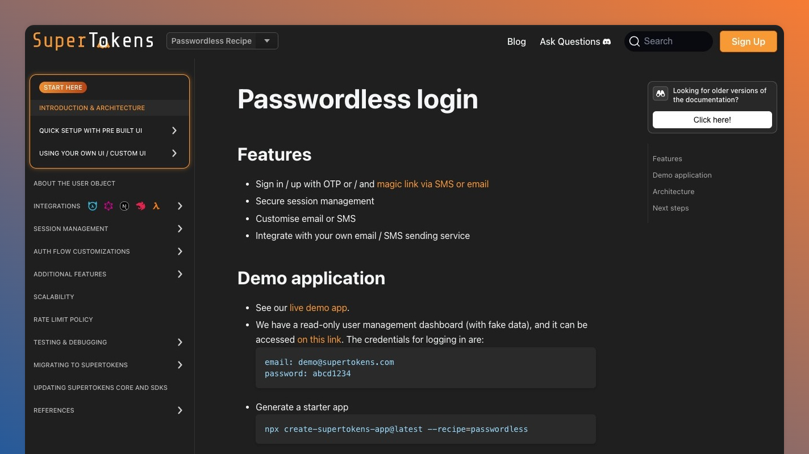
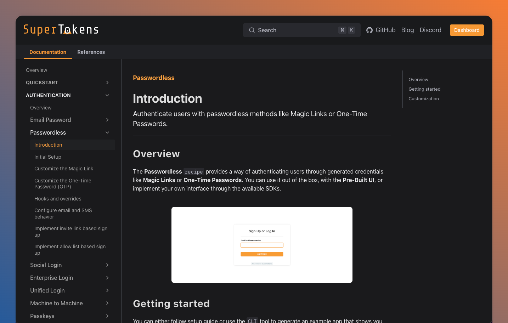

In any successful product, especially in the realm of developer tools, documentation is not just a reference guide. It’s an essential part of the product experience.
Our authentication solution has always been an easy fit for our customers, given the endless customization possibilities and extended support. But, as the saying goes, "your product is as good as your documentation". And, until recently, our documentation lagged behind what the engineering team was delivering.

The general feedback that we used to receive from our users was that going through it was a confusing experience. With this in mind we decided to rethink our approach and to reorganize the documentation from the ground up.

## The initial challenges

The previous documentation couldn’t keep up with the growth of our product. Our initial assumptions about how information should be presented to users were hitting a ceiling in terms of scaling.

After an internal evaluation, that took into account user feedback, we identified two different aspects on which we wanted to focus on in the process of improving the documentation:

### Structure

Initially, we based our documentation on one of the core concepts of our authentication solution, **the recipe**. Each feature that we expose has an equivalent _recipe_ that you need to use inside your application.
If you want to build a login form that authenticates users through a magic link you need to use the _Passwordless_ recipe. Pretty simple, right?

It works well when you are writing a code snippet.
And it also fits basic use cases, that do not involve too many recipes at once.
You want to know how to integrate SuperTokens with _Email/Password_ authentication? Just select the _Email/Password_ option from the top navigation menu and read the tutorial.
Want to enable and configure _MFA_? Select the _Multi-Factor Authentication_ option and give it a go.

But what happens when you need to to configure an authentication flow that uses multiple login methods?
What if you need to do some customization and you need to reference different SDK functions?
Where do you add a new product offering that’s cross cutting and involves multiple recipes?
As a user you end up frustrated that you need a compass to hop around different hidden sections.
And, as a technical writer, you end up cramming and duplicating information in order to follow the baseline structure.

While our product was growing, users kept reporting that locating the necessary customization details for their chosen authentication method required sifting through numerous unrelated sections.
This inconsistency not only slowed down the learning process but also increased the risk of errors during implementation

### Consistency

The old pages had a large variation in terms of writing style and structure. Each page was created in isolation, with different developers applying their own writing styles and organizational methods. As a result, some pages were dense with technical jargon and lengthy paragraphs, while others featured a more informal tone with scattered bullet points and inconsistent heading hierarchies. This lack of uniformity not only hindered the user experience by confusing the navigation process but also made it difficult to locate specific and reliable information. The absence of a standardized template meant that similar topics were presented in varied formats, leaving users to spend extra time deciphering and piecing together the necessary details from a jumble of inconsistent content.

## Designing a solution

To address the challenges outlined above, we embarked on a mission to completely restructure our documentation. Our guiding principles for this overhaul were clear:

- **Unified Navigation**: We wanted users to have immediate and logical access to every part of our documentation without having to jump between different nested sections.
- **Consistent Layout**: Every documentation page should adhere to a consistent format that guides the user naturally from introduction to advanced topics.
- **Logical Grouping**: Information should be organized in a way that mirrors the real-world process of authentication, enabling users to follow a step-by-step workflow.

### The Two Layers: Documentation and References

Figuring out what’s the best structure was an iterative process. We started by creating a list of all the pages that we had in the previous version. After removing the duplicate content we drafted a couple of different navigation structures. We had several approaches that tried to group things together based on common patterns.

From a high level perspective we have divided the main website into two main layers to account for different types of content:

- **Documentation:**

  - Contains tutorials and guides that explain how to use the product, covering the entire authentication journey from initial setup to advanced customization.

- **References:**
  - Provides direct references on the SDKs and APIs exposed by the product, offering low-level insights and technical details which experienced developers appreciate.

### Structuring each main section

Deciding on how the **References** section should be organized is an easy task. Things are grouped by a specific domain: Frontend SDKs, Backend SDKs, API References.

For the actual tutorials and guides, the **Documentation** section, things are a bit more challenging.
Our initial assumption was that information should be clustered around their common denominator. _Authentication methods_, _Users_ or _Sessions_ are terms that make sense in the context of authentication. But, as we looked at it from the perspective of different tasks that a user might want to accomplish while navigating our documentation, that logic became brittle.

This led us to a new form of organization that follows the natural progression of an authentication process. Here’s the structure that we ended up with:

- **Quickstart**

  - Tutorials that help you integrate the product from scratch, making it easy to get up and running within minutes.

- **Authentication**

  - Detailed guides on the various authentication methods available, including customization and troubleshooting tips.

- **Additional Verification**

  - Information on implementing custom session verification, multi-factor authentication (MFA), email verification, and role verification.

- **Post Authentication**

  - Guidance on managing sessions, handling user data, linking accounts, and other post-login tasks that ensure smooth user operation.

- **Migration**

  - Step-by-step instructions on how to migrate from other authentication solutions, ensuring a seamless transition.

- **Platform Configuration**

  - Comprehensive instructions on configuring core services and the email/SMS sending options within your environment.

- **Deployment**
  - In-depth documentation on hosting options, best practices for self-hosting the core service, and tips for ensuring uptime and security.

This restructuring not only streamlines the user journey but also allows our users to pick up the exact piece of information they need without excessive navigation. Each section is tailored to a specific phase of the authentication process, providing a logical flow from concept to implementation.

### Consistency between pages

Now this step involved more research than just “let’s bring every page to the same structure”. There are plenty of good books on how to write documentation and resources that tell how to structure information efficiently. If you want to explore more on this subject we recommend the [book]. It helped us figure out what rules we should enforce in terms of how each page should be written and how to think about creating useful guides and tutorials. Additionally, we have to give a shoutout to the “[The Good Docs Project](https://www.thegooddocsproject.dev/about)”. Their template pages are a good reference into how to structure information on a page.

With that information in mind and the specific aspects of our product we went ahead and drafted a series of rules and template pages that should be used as a reference for our documentation. We use vale, a popular linting tool, to enforce the aforementioned rules check for them in our CI. Additionally, we consistently review new pages against the existing templates to make sure they respect our conditions.

## Evaluating the changes

Our initial metrics indicated an improvement in terms of the usage of our documentation. Users completed quickstart guides in less time and the average session involved less hoping between pages. But the main indicator of our success was the general feedback from our customers. Users were happier with how the new website was structured and were finding it easier to find answers to their questions. This confirmed that the changes we made met their expectations and improved the overall user experience.

## Next Steps

While our recent restructuring has been met with enthusiastic feedback, the journey doesn’t end here. Our commitment to providing an outstanding developer experience means that we are continuously looking for ways to improve our documentation.

### Enhancing our References

One of the next major initiatives is focused on improving the “References” part of the documentation. Our planned improvements include:

- **Improved Examples**: We aim to extend our code snippets and to expose more comprehensive examples which show the full capabilities of our SDKs.
- **Enhanced Search Capabilities**: By incorporating more granular indexing and cross-referencing within our guides, users should be able to quickly locate the exact part of the code or API they need to modify or extend.

We have already migrated the full API specification pages, and we are working on updating the SDK References.

### Integration with LLM Workflows

As we all know, developers nowadays tend to vibe code their way into a working application rather than going through a step by step tutorial. With that in mind our plan is to make sure that everyone can integrate SuperTokens seamlessly with the help of their favorite AI coding tool. The documentation already exposes llms.txt and llms-full.txt files, and we plan to add specific guides that will show how to efficiently use our documentation in LLM workflows.

## Conclusion

The journey to restructure the SuperTokens documentation has been both challenging and immensely rewarding. By addressing the fragmentation and inconsistencies of the past, we’ve improved the overall experience of our product through a well-organized, user-friendly resource.
