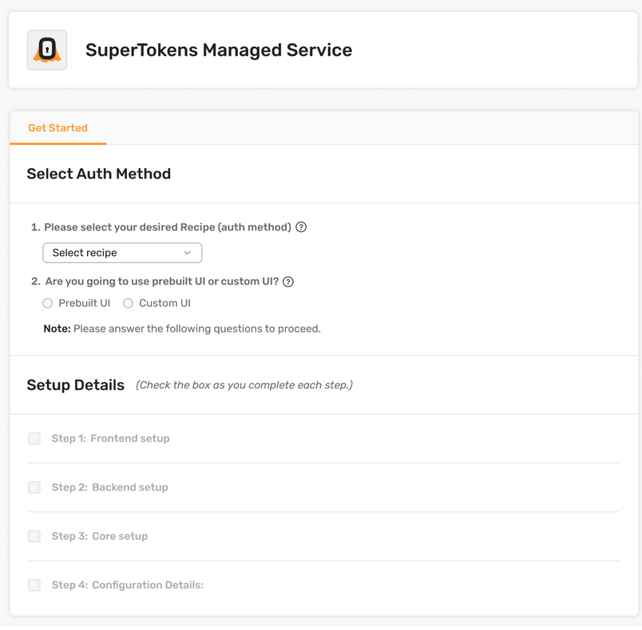
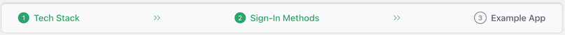
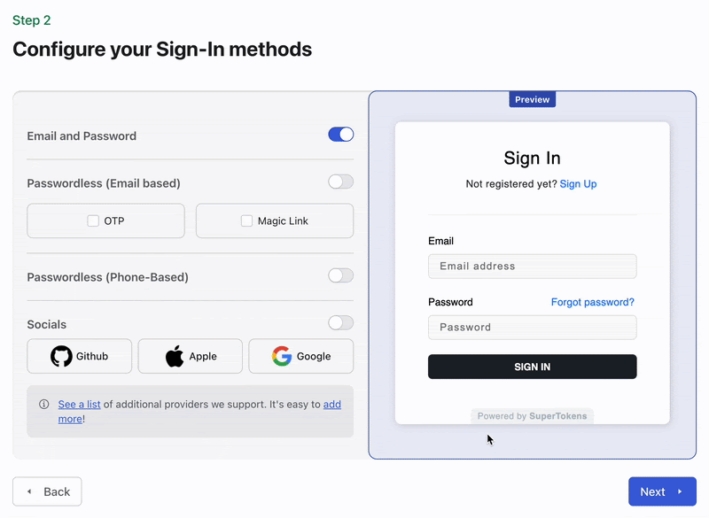

At SuperTokens, we believe first impressions matter—especially when it comes to onboarding. So we rebuilt the entire experience to deliver a setup flow that's intuitive, interactive, and tailored to your tech stack. The result? Developers get to their first "aha" moment faster than ever before.

Our new onboarding experience is live—and it’s already converting **68% better** than the old one.

## 🧩 What Was Broken?
Before this overhaul, setting up SuperTokens felt more like assembling IKEA furniture without a manual:
Fragmented flow: Setup steps bounced you between the dashboard and docs, causing context-switching and cognitive fatigue.

- **Zero progress tracking**: You had to mentally keep track of what was done and what remained.
- **Cluttered dashboard**: Inconsistent visual cues made navigation confusing.
- **One-size-fits-none**: The UI was rigid, offering no way to skip steps or personalize setup.
- **Overwhelming information**: Every option was thrown at you from the start, leading to paralysis instead of progress.

The result? Drop-offs. Confusion. A first impression that didn’t reflect the power or flexibility of SuperTokens.

## 🧭 Listening to Users (and Our Metrics)

We didn't just guess. We listened:

- Developers described the old experience as “outdated” and “unclear.”
- New users got lost trying to decide between **managed vs. self-hosted** setups.
- Heatmaps showed high activity in navigation menus—users were hunting for guidance.
- Even veterans were frustrated by the lack of structure and visual hierarchy.

## ✨ What’s New in the SuperTokens Onboarding Experience

We rebuilt the journey from scratch. Here's what's changed:

### ✅ 1. A Guided Wizard That Just Makes Sense

No more guessing. A step-by-step onboarding wizard walks you through configuration:

- Choose your frontend framework, backend language, and auth methods
- Generate a ready-to-run app tailored to your stack
- Download, run, and you're live with auth—fast

🛠️ Inspired by our CLI flow, but with more context and real-time UI feedback.

## 🧱 2. Modular, Visual, and Interactive

We added a modular layout with progress indicators and collapsible advanced settings:

- Know exactly where you are in the setup journey
- Visual transitions and hover effects help orient users
- Icons show the selected tech stack for instant context
- A live preview shows what your auth form will look like with selected providers

## 🪄 3. Personalization at the Core

Whether you're using **React** with **Express** or **Vue with Go**, the onboarding flow adjusts dynamically:

- We generate code examples and a working starter app that reflects your exact stack and auth settings
- Advanced users can dive deeper with configuration toggles—without overwhelming new users

## 🧼 4. A Dashboard That Breathes

The UI got a full makeover:

- Clear visual hierarchy with structured typography
- CTAs like “Get Started” and “Skip” stand out without being pushy
- Optimized whitespace for less clutter, more focus
- The new design doesn’t just look better—it helps users make faster decisions.

## 📈 The Results Speak for Themselves

Our metrics show the difference:

- **Core onboarding completion rate** jumped from **40.2% → 67.6%** — a **68.2%** increase 🚀
- **Bounce rates** dropped
- **First-deployment time** shrank significantly
- Users report clearer guidance, smoother flow, and better engagement

## 🧪 Behind the Scenes: The Design Journey

Building this wasn't just a UI polish. It was a full-cycle design process:

- **Research**
  - We reviewed user feedback, community threads, and analytics (Amplitude, session recordings).
- **Prototyping**
  - We mapped wireframes for different personas—from solo devs to enterprise teams—and removed steps that created friction.
- **Design Iteration**
  - We focused on a minimalist experience. Every element had to earn its place.
- **Dev Collaboration**
  - Designers and engineers worked hand-in-hand to ensure responsiveness, accessibility, and performance across stacks.
- **Post-launch Validation**
  - With usage analytics and user interviews, we verified the experience wasn’t just better in theory—it actually worked.

## 🙅‍♂️ What Didn't Make the Cut

Not everything made it into the final design. Here’s what we dropped:

- ❌ **Heavy tutorials**: Longform video guides were too much, too early. Users can still find them—but only when they’re needed.
- ❌ **Force-initialization**: Requiring frontend/backend setup before dashboard access slowed down fast starts.
- ❌ **Early multi-tenancy config**: Adding SaaS-style complexity up front confused new users. It’s now deferred until later.

Each removal was a step toward clarity, not complexity.

## 🛠 Built for Devs. Whether You’re New or Scaling Fast.

This onboarding upgrade isn't just a UX win—it reflects our larger philosophy:

- Developers should be able to test fast, tweak faster, and launch with confidence.
- You shouldn't have to dig through docs just to get started.
- And your stack shouldn't dictate your velocity.

Whether you're evaluating SuperTokens or embedding it into your next big product, this onboarding flow puts your goals first.

## 🚀 Try It Now

Start from zero and deploy auth in minutes with the new SuperTokens onboarding flow.

👉 [Try it yourself](https://supertokens.com)
🧑‍💻 [View the example app generator](https://github.com/supertokens/create-supertokens-app)
💬 Got feedback? Join our [Discord](https://supertokens.com/discord)