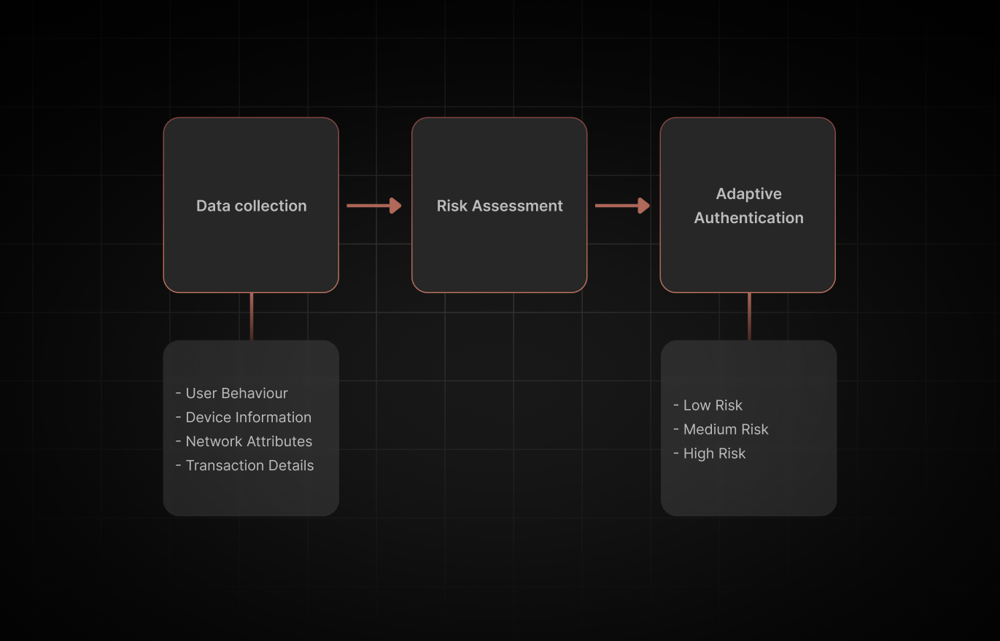

## Table of Content

```toc
tight: true
toHeading: 3
```

## What is Risk-Based Authentication?

Risk-Based Authentication (RBA) is an adaptive security measure that evaluates the risk associated with each login attempt in real-time. By analyzing various contextual factors, RBA determines the appropriate level of authentication required, ensuring that higher-risk attempts to undergo stricter verification while legitimate users experience minimal friction.

Have you noticed that sometimes when you travel to a foreign country and try to log into your email account, your email provider may suddenly supplement the authentication flow with an additional identity check? Or if you try to log into your account with multiple devices in a short amount of time, you may get additional security checks. This is Risk-Based Authentication kicking in.

---

## How Does Risk-Based Authentication Work?

RBA operates by collecting and analyzing data to assess the risk level of each authentication attempt. The process can be broken down into 3 high level steps:



### Data Collection

RBA systems gather information from multiple sources, including:

- **User Behavior:** Patterns such as login frequency, time of access, and typical actions performed.
- **Device Information:** Details like device type, operating system, browser version, and device fingerprinting.
- **Network Attributes:** IP address, geolocation, and network type (e.g., public Wi-Fi vs. private network).
- **Transaction Details:** Nature and sensitivity of the requested resources or actions.

### Risk Assessment

The collected data is analyzed to identify anomalies or deviations from the user's typical behavior. For example, an attempt to access sensitive data from an unfamiliar device in a different country would be flagged as high-risk.

### Adaptive Authentication

Based on the assessed risk level, the system enforces appropriate authentication measures:

- **Low Risk:** Standard authentication (e.g., username and password) is sufficient.
- **Medium Risk:** Additional verification, such as answering security questions or receiving a one-time passcode.
- **High Risk:** Strict measures like multi-factor authentication (MFA) or blocking the attempt until further verification.


## Benefits of Risk-Based Authentication

Implementing RBA offers several advantages:

### Enhanced Security

By continuously monitoring and assessing risks, RBA provides a robust defense against unauthorized access and potential breaches. Prevention is always easier than repairing the damage done by data breaches/unauthorized access.

### Improved User Experience

By contextually augmenting the authentication flow with additional challenges, legitimate users enjoy a seamless authentication experience without unnecessary hurdles. 

### Fraud Prevention

RBA effectively reduces the likelihood of fraudulent activities by identifying and mitigating high-risk authentication attempts. It can also detect if accounts have been compromised and issue session termination to ensure all account access is terminated until manually reinstated.

### Regulatory Compliance

Many industries mandate stringent security measures. Implementing RBA helps organizations meet compliance requirements by demonstrating a proactive approach to safeguarding data.

---

## Common Challenges in RBA Implementation

While RBA offers significant benefits, organizations may encounter challenges during implementation:

### Data Privacy Concerns

Collecting and analyzing user data necessitates strict adherence to privacy regulations, such as GDPR and CCPA. Organizations must ensure transparent data handling practices and obtain necessary user consents.

### Integration Complexity

Seamlessly integrating RBA into existing systems can be technically challenging, requiring careful planning and execution to avoid disruptions.

### User Education

Users may be unfamiliar with adaptive authentication processes. Providing clear communication and support is essential to prevent confusion and enhance acceptance.

---

## Best Practices for Effective RBA

To maximize the effectiveness of RBA, consider the following best practices:

### Leverage Machine Learning

Employ machine learning algorithms to analyze vast amounts of data, enabling the system to detect subtle anomalies and adapt to emerging threats.

### Regularly Update Risk Models

Continuously refine risk assessment models to account for new attack vectors and evolving user behaviors, ensuring the system remains resilient against sophisticated threats.

### Prioritize User Privacy

Implement robust data protection measures, anonymize user data where possible, and maintain transparency about data collection and usage practices.

### Conduct Ongoing Monitoring and Audits

Regularly review authentication logs and perform security audits to identify areas for improvement and respond promptly to potential vulnerabilities.

---

## Choosing the Right RBA Solution

Selecting an appropriate RBA solution involves evaluating several factors:

### Scalability

Ensure the solution can accommodate your organization's growth and handle increasing authentication requests without compromising performance. This includes transparency with pricing. Some providers may seem like a perfect fit initially, but as your product and user base scales, you might find yourself in a situation where your billing may double or triple as you get pushed into an enterprise tier.

### Customization

Opt for a solution that allows tailoring of risk assessment criteria and authentication responses to align with your organization's specific needs and risk tolerance. Extensibility is the cornerstone of a good RBA solution. 

### User Experience

Choose a solution that balances security with usability, minimizing friction for legitimate users while effectively deterring unauthorized access.

### Vendor Support

Partner with vendors that offer comprehensive support, regular updates, and a proven track record in delivering reliable security solutions.

---

## How SuperTokens Fits In

SuperTokens provides an "[Attack Prevention Suite](https://supertokens.com/docs/additional-verification/attack-protection-suite/introduction)", a set of purpose built tools to prevent suspicious activities in authentication and user sessions. 

You find an overview of the features in our complete breakdown [here](https://supertokens.com/blog/anomaly-detection-with-supertokens), but through leveraging features like "Impossible Travel Detection", "Bot Detection", "Suspicious IP Detection", "New Device Detection" etc, users can augment their customers' authentication experience to be more secure.

SuperTokens additionally offers features that complement and enhance Risk-Based Authentication strategies:

- **Granular Role Management:** Define and assign roles with specific permissions, allowing precise control over user access based on assessed risk levels.
- **Seamless Integration:** Integrate effortlessly with existing authentication frameworks, enabling the incorporation of RBA without overhauling current systems.
- **Adaptive Authentication:** Combine RBA with Multi-Factor Authentication (MFA) to provide layered security tailored to the risk profile of each access attempt.

Explore how SuperTokens can bolster your authentication strategy by visiting our [product page](https://supertokens.com/product).

---

## Conclusion

Risk-Based Authentication represents a sophisticated approach to securing digital assets, offering a balance between stringent security measures and user convenience. By assessing the context of each login attempt, RBA ensures that security protocols are dynamically adjusted to mitigate risks effectively. Implementing RBA, especially when integrated with solutions like SuperTokens, empowers organizations to stay ahead of evolving threats while maintaining a seamless user experience.
