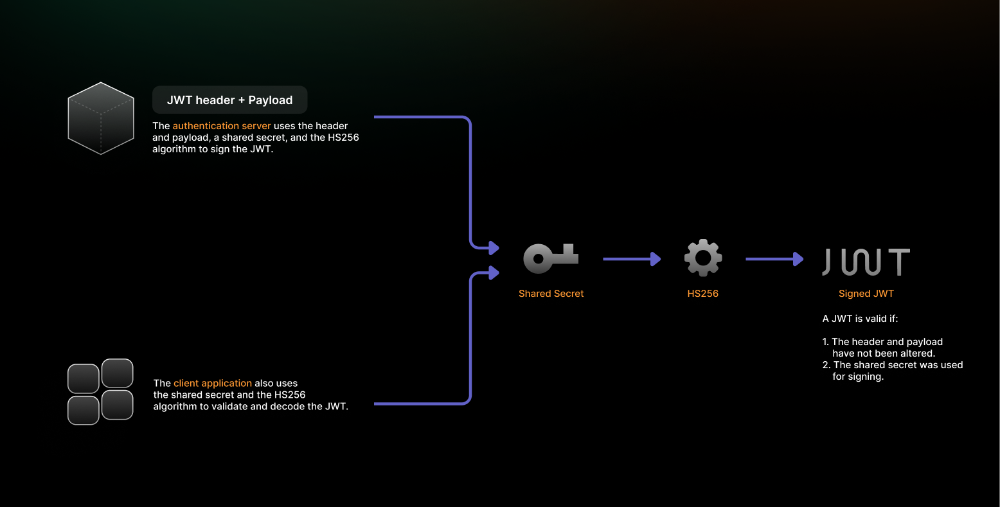
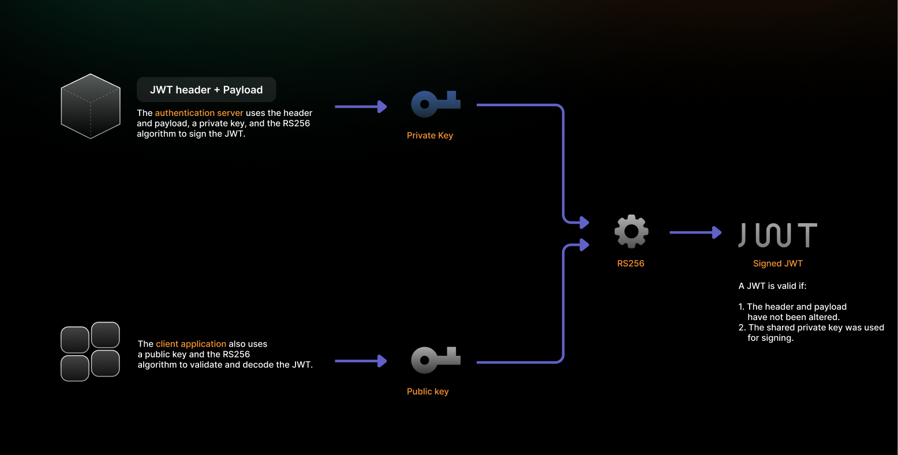

When building secure applications that rely on JSON Web Tokens (JWTs) for authentication and authorization, one of the most critical decisions you\'ll make is choosing the right signing algorithm. Two of the most popular algorithms&mdash;RS256 and HS256&mdash;serve different purposes and offer distinct security characteristics that can significantly impact your application\'s architecture and security posture.

Understanding the fundamental differences between these algorithms is essential for developers, security architects, and anyone involved in building modern web applications. The choice between RS256 vs HS256 isn\'t just a technical preference&mdash;it\'s a strategic decision that affects everything from security boundaries to scalability and key management complexity.

In this comprehensive guide, we\'ll explore both algorithms in detail, examine their strengths and weaknesses, and provide practical guidance to help you make an informed decision for your specific use case. Whether you\'re building internal microservices, public APIs, or federated identity systems, understanding these algorithms will help you implement JWT-based authentication securely and effectively.

## **What Are JWTs and Why Do Algorithms Matter?**

A [JSON Web Token (JWT)](https://jwt.io/introduction) is a compact, URL-safe format for securely transmitting claims between parties. A JWT consists of three parts: header, payload, and signature. The header specifies the signing algorithm, the payload contains claims, and the signature ensures integrity and authenticity.

The signing algorithm is JWT security\'s cornerstone, determining how tokens are created and verified. It ensures token authenticity (confirming the issuer) and integrity (preventing tampering). Choosing
the wrong algorithm can lead to [token forgery](https://supertokens.com/blog/what-is-jwt), unauthorized access, and authentication bypass.

Algorithm choice also impacts architecture, scalability, and operational complexity. Some require shared secrets distributed across services, while others use public-key cryptography, enabling flexible trust models.

### **What Is HS256?**



### **Definition and Basics**

**HS256 (HMAC with SHA-256)** is a symmetric algorithm that uses the same secret key for both signing and verifying JWTs. HMAC combines a hash function (SHA-256) with a secret key, to produce signatures that authenticate message origin and integrity.

-   It offers several advantages:
    -   High computational efficiency.
    -   Ease of implementation.
    -   Suitability for environments with simple infrastructure or where performance is a primary concern.

-   The symmetric nature means:
    -   Any party capable of verifying tokens can also create valid tokens.
    -   Suitable for scenarios where all parties are trusted and within the same security perimeter.

However, it also introduces a significant security risk if the shared secret is exposed, as any compromised service can issue unauthorized tokens. Therefore, HS256 should be carefully managed with strict secret rotation policies and access control in place when used in production systems.

### **How It Works**

HS256 signing begins with Base64URL encoding in the JWT header and payload, then concatenating them with a period separator. This combined string is then passed into the HMAC-SHA256 function, along with the shared secret key. The resulting hash is Base64URL-encoded to produce the final signature.

This process ensures the JWT is:
-   Compact and URL-safe 
-   Easily transmitted via HTTP headers or query parameters
-   Portable across various web-based services

Verification reverses the signing steps. The verifier uses their copy of the secret key to apply HMAC-SHA256 to the header and payload. The resulting hash is then compared with the signature attached to the token.

-   If both signatures match:
    -   The token is authentic.
    -   It has not been tampered with.
    -   It was signed by using the correct shared secret.

Security depends entirely on keeping the shared secret confidential with sufficient entropy to resist brute-force attacks. The secret should be at least 256 bits (32 bytes) long and cryptographically random.

Proper key management practices are essential, including storing secrets securely (e.g., using environment variables or vault systems), rotating keys periodically, and restricting access to trusted services only.

### **Use Cases**

HS256 excels in scenarios where simplicity and performance are key priorities, particularly when all JWT-handling services are under the same administrative control. Its ease of implementation and speed make it well-suited for systems with minimal infrastructure complexity.

Common use cases include:

-   Internal microservices architectures that require lightweight token validation.
-   Single-tenant applications where both authentication and resource servers are managed by the same organization.
-   Development and testing environments where quick setup and minimal configuration are preferred.

### **Security Considerations**

The primary security concern with HS256 arises from its symmetric nature. If the shared secret is compromised, any malicious party could issue valid tokens, potentially gaining unauthorized access across the
entire system.

Key challenges include:

-   A single secret compromise can affect all connected services.
-   Secure distribution of the shared secret to every participating service is required.
-   As the number of services grows, managing and rotating the secret becomes increasingly complex.

To mitigate these risks, strong key management practices and secure access controls are essential when using HS256 in production environments.

## **What Is RS256?**



### **Definition and Basics**

**RS256 (RSA Signature with SHA-256)** is an asymmetric algorithm using a public-private key pair for JWT signing and verification. It combines RSA public-key cryptography with SHA-256 to create digital signatures that provide authentication and non-repudiation.

This ensures that any party verifying the token can:
-   Trust the identity of the issuer.
-   Be confident that the token's contents have not been tampered with during transmission.

Unlike symmetric algorithms, RS256 uses **different keys** for signing and verification:
-   The **private key**, known only to the token issuer, is used to create signatures.
-   The **public key** is distributed to verification parties for validating those signatures.

This asymmetric property enables more secure and scalable architectures.

RS256 is particularly effective in distributed systems where:

-   Multiple services must validate tokens without needing access to the signing key.
-   Key sharing risks must be minimized.
-   Use cases include third-party integrations, multi-region deployments, and federated identity systems.

These benefits make RS256 a strong choice for maintaining integrity and trust across diverse, decentralized environments.

### **How It Works**

RS256 signing creates a SHA-256 hash of the JWT header and payload, then encrypts this hash by using the issuer\'s RSA private key to generate the digital signature. This signature is then appended to the token, to form the complete JWT.

This process ensures that:

-   The content of the token cannot be altered without invalidating the signature.
-   Recipients can trust the integrity of the data being transmitted.

**Verification** involves the following steps:

-   The signature is extracted and decrypted by using the issuer\'s RSA public key.
-   The verifier independently computes the SHA-256 hash of the header and payload.
-   This hash is then compared with the decrypted signature.

If the hashes match, it confirms both the authenticity of the token and that it has not been tampered with.

Because only the legitimate issuer holds the private key used to sign the JWT, verification provides a reliable way to confirm the token's origin. The mathematical relationship between the RSA key pair ensures that signatures created with the private key can only be verified by the corresponding public key, delivering strong guarantees of authentication and non-repudiation.

### **Use Cases**

RS256 is well-suited for scenarios involving multiple parties with different trust levels, where public key distribution supports flexible and secure authentication flows.

Common use cases include:

-   Federated identity systems
-   Third-party API integrations
-   Single sign-on (SSO) implementations

Public APIs that accept tokens from multiple issuers benefit from RS256's asymmetric nature, which allows independent verification without sharing the private key. Multi-tenant SaaS platforms often adopt RS256 for tenant-specific token signing while supporting centralized, platform-wide token verification.

### **Security Considerations**

RS256's security primarily relies on robust key management practices, particularly safeguarding the private key from unauthorized access.

Key recommendations include:

-   Using RSA keys of at least 2048 bits
-   Using 3072-bit keys for long-term security

Unlike HS256, RS256 provides stronger security boundaries&mdash;compromising the public key does not enable token forgery. However, a private key compromise is critical and requires immediate action, including:

-   Key rotation
-   Token invalidation
-   Re-issuance of new tokens across affected systems

Effective implementation of RS256 depends on maintaining strict control over private keys and following industry-standard cryptographic practices.

## **RS256 vs HS256: Key Differences at a Glance**


|**Feature** |       **HS256**       |          **RS256**             |
|------------|-----------------------|--------------------------------|
| Key Type   | Symmetric             | Asymmetric                     |
| Signature Verification| Same secret key| Public key                 |
| Performance| Faster                | Slightly slower                |
| Key Management| Simple             | Requires a public/private pair |
| Best For   | Internal apps         | Public APIs, SSO, OAuth        |
| Risk of Key Leakage| Higher        | Lower                          |


## **Which One Should You Choose?**

### **Trust Boundary Analysis**

Algorithm selection requires analyzing trust boundaries. If all JWT-verifying parties are within your organization's security perimeter and under direct control, **HS256** may be preferable due to its simplicity and performance benefits.

However, if tokens are verified by **external parties or untrusted clients**, **RS256** offers stronger security isolation through its asymmetric nature.

This distinction becomes especially important in:

-   Hybrid or API-driven ecosystems.
-   Scenarios where external services must verify tokens without accessing private signing keys.

RS256 allows:

-   Private keys to remain securely within the issuer's environment.
-   Public key distribution for safe, external verification.
-   Reduced risk of key compromise in less-trusted environments.

**Multi-tenant environments** further benefit from RS256. Each tenant can be assigned an independent key pair, while platform-wide verification is still supported through public keys&mdash;providing both isolation and scalability.

### **Simplicity vs Security Trade-offs**

**HS256** offers implementation and deployment simplicity, making it appealing for straightforward use cases. The algorithm requires minimal configuration and has fewer potential failure points.

-   Ideal for internal systems with simple authentication needs.
-   Reduces developer onboarding time.
-   Lowers operational overhead.
-   Suitable for rapid prototyping or environments with well-defined user access boundaries.

However, **security often demands greater complexity**. While **RS256** introduces more involved key management, it provides:

-   Stronger security boundaries
-   Public-private key separation
-   Greater flexibility in distributed or multi-party systems

In production environments where security is a primary concern, the added complexity of RS256 is often justified to ensure long-term robustness and risk mitigation.

### **Key Rotation and Scalability**

Key rotation is essential for maintaining long-term security, and each algorithm handles it differently.

**HS256** presents operational challenges:

-   Requires simultaneous secret updates across all services.
-   Increases the risk of human error during rotation.
-   May involve service restarts or manual configuration synchronization.
-   Less suited for dynamic or highly distributed environments.

**RS256**, by contrast, supports more scalable and resilient rotation strategies:

-   Allows key overlap periods, enabling multiple valid keys during transition.
-   Facilitates zero-downtime rotations and gradual rollouts.
-   Improves auditability and key versioning, supporting rollback or deprecation of compromised keys.

Additionally, public key distribution through [JSON Web Key Set (JWKS)](https://supertokens.com/blog/understanding-jwks) endpoints automates key propagation and supports scalable trust relationships across distributed systems.

## **How SuperTokens Handles JWT Signing**


### **Default Algorithm**

[SuperTokens](https://supertokens.com/), an open-source authentication solution, uses **RS256 by default** for signing access tokens. This default reflects modern best practices by prioritizing **security**, **scalability**, and **support for complex authentication scenarios**, such as:

-   Multi-tenant applications
-   Federated identity systems
-   Distributed microservices environments

By choosing RS256, SuperTokens reduces the likelihood of security issues stemming from inappropriate algorithm selection and ensures that token signing mechanisms are secure by default.

### **Why RS256 in SuperTokens?**

RS256 supports **asymmetric encryption** by using public/private key pairs, which separates the signing and verification processes:

-   The backend holds the **private key** and signs the tokens.
-   The frontend or third-party services verify the tokens by using the **public key**.

This separation offers several security and architectural advantages:

-   Enhances protection in distributed and multi-service systems.
-   Enables safer verification without exposing the signing key.
-   Simplifies **key rotation and management** for long-term maintainability.

Additionally, this design aligns with industry standards like **OAuth 2.0** and **OpenID Connect**, helping developers to build secure and standards-compliant applications.

### **Flexibility**

SuperTokens provides flexibility by allowing developers to:

-   Configure the JWT algorithm (e.g., switch from RS256 to HS256, if necessary).
-   Manage keys based on the deployment model (e.g., self-hosted vs. managed service).

This customization ensures that teams can align their implementation
with specific security needs and infrastructure constraints.

### **Documentation Reference**

For more information, developers can refer to the official [SuperTokens JWT Documentation](https://supertokens.com/docs/post-authentication/session-management/introduction).

## **Implementation Tips for RS256 and HS256**

### **Generating Keys (RS256)**

For RS256, generate RSA key pairs by using secure, established tools such as **OpenSSL** or rely on dedicated [key management services](https://cloud.google.com/kms/docs) in production environments.

Minimum recommended key size:

-   **2048 bits** (baseline)
-   **3072 bits** (new systems)

**Example (using OpenSSL):**

```bash
# Generate RSA private key
openssl genrsa -out private-key.pem 2048

# Extract public key
openssl rsa -in private-key.pem -pubout -out public-key.pem
```

### **Storing Secrets Securely (HS256)**

For HS256, generate secrets by using cryptographically secure random number generators with sufficient entropy.

-   **Minimum recommended size**: 256 bits (32 bytes)
-   Store shared secrets in secure storage solutions such as:
    -   AWS Secrets Manager
    -   HashiCorp Vault
    -   Encrypted environment variables
-   Enforce strict access controls, encryption at rest, and enable audit logging

For RS256, apply similar storage security to the **private key**, ensuring that it is only accessible to the signing service.

### **Token Validation in Backend**

Proper validation includes comprehensive claims validation beyond signature verification. Always validate expiration time (exp), audience (aud), and issuer (iss) claims to prevent token misuse.

Implement explicit algorithm specification when decoding tokens to prevent algorithm confusion attacks:
```js
const decoded = jwt.verify(token, publicKey, {
algorithms: \[\'RS256\'\],
audience: \'your-api\',
issuer: \'your-auth-server\'
});
```

### **Algorithm Confusion Attacks**

To prevent **algorithm confusion attacks**, always:

-   Explicitly specify the expected algorithm when decoding JWTs.
-   Never trust the algorithm declared in the JWT header alone.
-   Use **allowlists** of accepted algorithms (\[\'RS256\'\], \[\'HS256\'\]) instead of denylists.

Relying on implicit decoding behavior or fallback mechanisms may expose systems to serious vulnerabilities Enforcing strict decoding rules ensures consistency and protection across your authentication flow.

## **Additional Technical Considerations**

### **Can You Switch Between RS256 and HS256?**

Yes, switching between RS256 and HS256 is technically possible&mdash;but it's not seamless and it requires careful handling. When changing algorithms:

-   All existing tokens must be **invalidated**, since the verification logic and key types differ.
-   Services consuming the tokens must be **updated** with the new algorithm and corresponding key or secret       configuration.
-   Proper versioning of token generation and clear communication acrossteams are essential to avoid authentication failures during the transition.

This kind of change is typically done during major version upgrades or architectural shifts, not in active production without thorough planning.

### **How Do Libraries Handle Both?**

The most widely-used JWT libraries (like jsonwebtoken in Node.js, or PyJWT in Python) support both HS256 and RS256. However, they do not enforce strict validation unless explicitly configured.

To avoid ambiguity or potential vulnerabilities (such as algorithm confusion attacks), it's important to:

-   **Explicitly define the algorithm** expected during token verification.
-   Avoid relying on the algorithm declared in the JWT header.
-   Use **library options** to enforce strict decoding behavior for the chosen algorithm.

Clear configuration prevents accidental fallback to weaker or incorrect algorithms that could compromise token security.

### **What About Performance at Scale?**

HS256 is generally **faster** than RS256 due to its symmetric cryptography, which involves simpler math and lower computational overhead. For high-throughput environments or latency-sensitive applications, this can be beneficial.

However, **RS256 often scales better** in distributed systems because:

-   Verification can be done independently by many services by using a **public key**, without exposing the private signing key.
-   It eliminates the need to share secrets across services, thus reducing operational complexity.
-   It supports **secure token validation** in multi-consumer or multi-tenant environments.

In most modern architectures&mdash;especially those involving third-party access or federated systems&mdash;RS256's scalability and security benefits outweigh its performance cost.

## **Conclusion**

The choice between RS256 and HS256 represents a fundamental architectural decision impacting security, scalability, and operational complexity. HS256 offers simplicity and performance advantages suitable for internal systems with simple trust models, while RS256 provides superior security boundaries and scalability for complex, distributed
systems.

For new projects without specific constraints favoring HS256, RS256 generally provides a more secure and future-proof foundation. However, both algorithms can be implemented securely with proper attention to key management, implementation details, and operational practices.

The most important factor isn\'t which algorithm you choose, but how carefully you implement and maintain your JWT-based authentication system. Proper key management, comprehensive token validation, and adherence to security best practices are crucial, regardless of algorithm choice.