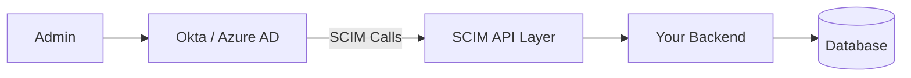
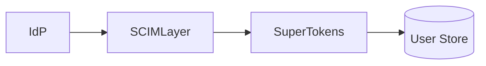

```toc
tight: true
toHeading: 3
```


## What is SCIM Provisioning?

SCIM (System for Cross-domain Identity Management) is an open standard (defined in RFC 7643 and RFC 7644) that enables automated user provisioning and deprovisioning between identity providers and applications.

> In simple terms:
SCIM provisioning ensures that user accounts are automatically created, updated, and deleted across systems—without manual intervention.

For example:
When a user is added in Okta → SCIM creates the user in your app
When a user’s role changes → SCIM updates permissions
When a user leaves the company → SCIM deactivates their account

------------------------------------------------------------------------

## SCIM Architecture



------------------------------------------------------------------------

## Real-World Edge Cases

-   Okta retries requests → ensure idempotency\
-   Azure AD sends partial PATCH payloads\
-   Group mapping can break RBAC

------------------------------------------------------------------------

## Implementation Example

``` ts
app.post("/scim/v2/Users", async (req, res) => {
  const { userName } = req.body;

  const user = await createUser({
    email: userName,
    password: generateRandomPassword(),
  });

  res.status(201).json(user);
});
```

------------------------------------------------------------------------

## Cost of Not Having SCIM

-   Lost enterprise deals\
-   Slower onboarding\
-   Security risks

------------------------------------------------------------------------

## SCIM with SuperTokens



------------------------------------------------------------------------

## Comparison Table

  Feature   Auth0        Clerk     WorkOS   SuperTokens
  --------- ------------ --------- -------- -------------
  SCIM      Enterprise   Limited   Yes      Custom
  Lock-in   High         Medium    Medium   None

------------------------------------------------------------------------

## Final Thoughts

SCIM is a **revenue enabler**, not just a feature.

------------------------------------------------------------------------

## FAQ

**What is SCIM?**\
User provisioning standard.

**Is it required?**\
Yes for enterprise SaaS.
