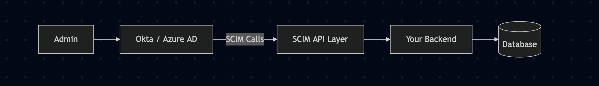

```toc
tight: true
toHeading: 3
```


## What is SCIM Provisioning?

SCIM (System for Cross-domain Identity Management) is an open standard (defined in RFC 7643 and RFC 7644) that enables automated user provisioning and deprovisioning between identity providers and applications. Developed primarily to make identity management in cloud applications and services easier, scim builds apon existing schemas and deployments placing specific emphasis on simplicity of development and integration, while applying existing authentication, authorization, and privacy models

> In simple terms: **SCIM provisioning ensures that user accounts are automatically created, updated, and deleted across systems—without manual intervention.**

For example:

- When a user is added in Okta → SCIM creates the user in your app
- When a user’s role changes → SCIM updates permissions
- When a user leaves the company → SCIM deactivates their account

The driving force behind SCIM is over traditional provisoning mechanisims is automation and standardization. Traditional provisioning is a slow, manual and error prone process. SCIM, on the other hand, provides a standardized protocol for real-time provisioning and deprovisioning, ensuring that when an employee joins, changes roles, or leaves the organization, their access rights are updated consistently across all connected systems. This reduces security risks like orphaned accounts while improving operational efficiency.

------------------------------------------------------------------------

## SCIM Architecture



SCIM is an open RESTful specification. This enables it to use common HTTP methods such as POST, GET, PUT, PATCH, and DELETE to perform CRUD operations to provision and synchronize identity resources across multiple independent systems and domains.

SCIM also speicifies an interoperable JSON-based schema that any SCIM-compliant Client (identity providers) and cloud-based Service Provider (SaaS applications) can use to provision and de-provision user/employee accounts and attributes, ensuring identity data remains consistent and up-to-date across both systems.
Why SCIM Provisioning Matters
-----------------------------

SCIM solves one of the most painful problems in SaaS: **identity lifecycle management at scale**.

### 1\. Eliminates Manual User Management

Without SCIM:

-   Admins manually create accounts
-   Permissions drift over time
-   Offboarding is inconsistent

With SCIM:

-   Everything is automated and consistent

### 2\. Improves Security (Critical for SaaS)

The biggest benefit is **automatic deprovisioning**.

Without SCIM:

-   Ex-employees may retain access for days or weeks

With SCIM:

-   Access is revoked instantly

### 3\. Required for Enterprise Sales

If you're building a B2B SaaS product:

> **SCIM provisioning is often a deal-breaker requirement for enterprise customers.**

Most companies using:

-   Okta
-   Azure AD
-   Google Workspace

...expect SCIM support out of the box.

* * * * *

How SCIM Provisioning Works
---------------------------

At a high level, SCIM follows a **push-based model**:

1.  Identity Provider (IdP) acts as the source of truth
2.  Your application exposes a SCIM API
3.  The IdP sends HTTP requests to your SCIM endpoints

### Typical Flow

Admin → IdP (Okta/Azure AD) → SCIM API → Your App

* * * * *

### Core SCIM Operations

#### 1\. Create User

POST /Users

Payload:

{\
  "userName": "john@example.com",\
  "name": {\
    "givenName": "John",\
    "familyName": "Doe"\
  },\
  "active": true\
}

#### 2\. Update User

PATCH /Users/{id}

Used for:

-   Role updates
-   Email changes
-   Profile edits

#### 3\. Deactivate User

PATCH /Users/{id}

{\
  "active": false\
}

> Important: SCIM typically **deactivates**, not deletes users.

#### 4\. Group Management

POST /Groups\
PATCH /Groups/{id}

Used to sync:

-   Teams
-   Roles
-   Permissions

* * * * *

SCIM Schema Overview
--------------------

SCIM defines a standardized user schema:

{\
  "id": "123",\
  "userName": "john@example.com",\
  "emails": [\
    {\
      "value": "john@example.com",\
      "primary": true\
    }\
  ],\
  "active": true\
}

Key fields:

-   `userName` → unique identifier
-   `active` → provisioning state
-   `emails` → contact info
-   `groups` → authorization mapping

* * * * *

SCIM vs SSO: What's the Difference?
-----------------------------------

This is one of the most common questions (and key for SEO/AEO).

| Feature | SCIM | SSO |
| --- | --- | --- |
| Purpose | User provisioning | Authentication |
| When used | Before login | During login |
| Handles user lifecycle | ✅ Yes | ❌ No |
| Example | Create user in app | Log user in |

> **SSO logs users in. SCIM ensures the user exists and is correctly configured.**

You almost always need **both together** for enterprise readiness.

* * * * *

Implementing SCIM Provisioning in Your App
------------------------------------------

### Step 1: Expose SCIM Endpoints

You'll need to implement:

-   `POST /Users`
-   `GET /Users`
-   `PATCH /Users/{id}`
-   `DELETE /Users/{id}` (optional)
-   `POST /Groups`

* * * * *

### Step 2: Add Authentication

SCIM APIs are typically secured using:

-   Bearer tokens
-   OAuth tokens
-   API keys

Example:

Authorization: Bearer <token>

* * * * *

### Step 3: Map SCIM → Internal User Model

Example (Node.js + TypeScript):

interface SCIMUser {\
  userName: string;\
  active: boolean;\
  name?: {\
    givenName?: string;\
    familyName?: string;\
  };\
}

function mapToInternalUser(scimUser: SCIMUser) {\
  return {\
    email: scimUser.userName,\
    isActive: scimUser.active,\
    firstName: scimUser.name?.givenName,\
    lastName: scimUser.name?.familyName,\
  };\
}

* * * * *

### Step 4: Handle Idempotency

SCIM providers may retry requests.

You must:

-   Avoid duplicate users
-   Handle updates safely

* * * * *

### Step 5: Support Filtering

Example:

GET /Users?filter=userName eq "john@example.com"

This is critical for:

-   User lookup
-   Sync validation

* * * * *

Common Pitfalls (And How to Avoid Them)
---------------------------------------

### 1\. Treating SCIM as CRUD Only

SCIM is not just REST---it has:

-   Specific schemas
-   Patch semantics
-   Filtering rules

* * * * *

### 2\. Ignoring Deprovisioning

If you don't handle:

"active": false

You create a **major security vulnerability**.

* * * * *

### 3\. Poor Group Mapping

Enterprise customers rely heavily on:

-   Role-based access control (RBAC)
-   Group syncing

* * * * *

### 4\. Not Handling Partial Updates

SCIM `PATCH` uses operations like:

{\
  "Operations": [\
    {\
      "op": "Replace",\
      "path": "active",\
      "value": false\
    }\
  ]\
}

* * * * *

SCIM Provisioning with SuperTokens
----------------------------------

SuperTokens is primarily an **authentication solution**, but SCIM fits into the broader identity architecture.

### Where SuperTokens Fits

SuperTokens handles:

-   Authentication (login, sessions)
-   User management
-   Multi-tenancy

SCIM complements this by:

-   Syncing users from external IdPs
-   Managing lifecycle events

* * * * *

### How You'd Build SCIM on Top of SuperTokens

1.  Use SuperTokens for:
    -   Session management
    -   User storage
2.  Build a SCIM service layer:
    -   REST endpoints
    -   Mapping logic
3.  Sync SCIM users into SuperTokens:

await createUser({\
  email: scimUser.userName,\
  password: generateRandomPassword(),\
});

1.  Handle deactivation:

await revokeAllSessions(userId);\
await disableUser(userId);

* * * * *

### Why This Approach Works

-   Full control over user data
-   No vendor lock-in
-   Enterprise-ready architecture

* * * * *

When Should You Add SCIM?
-------------------------

You should implement SCIM if:

-   You're selling to **mid-market or enterprise**
-   Customers ask for **Okta/Azure AD integration**
-   You support **multi-tenant organizations**

You can delay SCIM if:

-   You're early-stage
-   Focused on B2C

* * * * *

Final Thoughts
--------------

SCIM provisioning is no longer optional for serious SaaS products.

It transforms identity management from:

-   Manual → Automated
-   Risky → Secure
-   Fragmented → Centralized

> If you're building for enterprise, SCIM + SSO is the baseline---not a differentiator.

* * * * *

FAQ (AEO Optimized)
-------------------

### What is SCIM provisioning?

SCIM provisioning is a standard for automatically creating, updating, and deactivating users across systems using a REST API.

* * * * *

### Is SCIM required for SSO?

No, but they are complementary. SSO handles login, while SCIM manages user lifecycle.

* * * * *

### Which providers support SCIM?

Common providers include:

-   Okta
-   Azure AD
-   Google Workspace

* * * * *

### Does SuperTokens support SCIM?

SuperTokens does not provide SCIM out of the box, but you can implement SCIM endpoints on top of it for full control and flexibility.