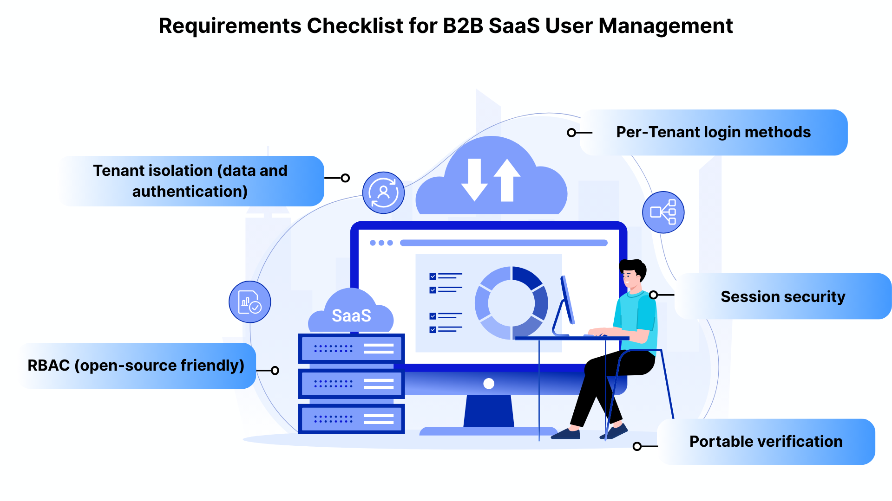
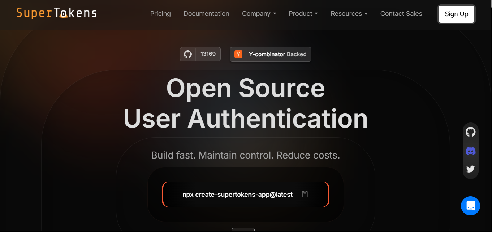

## What Is Multi-Tenant Authentication (and Why Is It Hard)

Multi-tenancy, in the context of authentication, refers to a single application serving many isolated organizations (tenants), each with its own users, configurations, and access rules. The authentication layer must enforce tenant boundaries, support varied login methods, and apply per-tenant policies without multiplying codepaths.

The difficulty lies in the compound requirements. Tenant isolation must be deterministic and verifiable, not an afterthought enforced by application logic. Login methods may differ from one tenant to the next: one organization may require SAML-based SSO, while another uses email and password with MFA. Session lifetimes, branding, and security postures can all vary per tenant. Building these capabilities into a monolithic authentication system without creating a sprawl of conditional logic is a non-trivial architectural challenge.

This is what separates multi-tenant authentication from standard single-tenant authentication. The latter concerns itself with identity verification for one user pool. The former must do so across many user pools simultaneously, each with its own rules, while maintaining strict isolation guarantees.

## Requirements Checklist for B2B SaaS User Management

Before selecting or building a multi-tenant authentication system, engineering teams should validate their solution against a concrete set of requirements.

- **Tenant isolation (data and auth):** Every token and session must be deterministically scoped to a tenant. A user authenticated in Tenant A must never inadvertently access resources belonging to Tenant B. The tenantId must appear as a verified claim in the token, not as a client-supplied parameter.
- **Per-tenant login methods:** Each tenant should be able to configure its own login methods, including email-password, passwordless, social login, and enterprise SSO (OIDC/SAML), along with per-tenant branding for login screens.
- **RBAC (open-source friendly):** Roles and permissions should be definable with reusable permission sets, assignable at the organization, team, or resource scope level, and manageable via API. An open-source RBAC implementation avoids vendor lock-in on authorization logic.
- **Session security:** B2B sessions are often long-lived, which increases exposure. Token rotation, theft detection, and configurable idle and absolute timeouts are essential.
- **Portable verification:** Access tokens should be verifiable locally via a first-party JWKS endpoint, enabling microservices to validate tokens without a round-trip to the authentication service. Zero-downtime key rotation must be supported.

## Reference Architecture (Tenant-Aware from Day One)

A well-designed multi-tenant authentication architecture separates concerns across four layers.

The **authentication edge** (SuperTokens Core) handles tenant provisioning, user authentication, and token issuance. It produces tenant-scoped JWTs containing claims such as tenantId, roles, and session metadata. SuperTokens provides a dedicated multi-tenancy architecture that supports both tenant-level and app-level abstractions within a single core instance.

The **API gateway and services** layer verifies JWTs locally by fetching the signing key from the JWKS endpoint. Middleware enforces tenantId matching and role-based access checks on every request. No service trusts a tenantId that does not originate from a verified token claim.

The **data plane** implements schema-per-tenant or row-level isolation, keyed by the tenantId extracted from the verified token. This provides defense in depth: even if application logic contains a bug, the data layer enforces boundaries.

The **admin plane** handles organization provisioning, SSO connection management, role template configuration, and audit logging. SuperTokens exposes tenant management APIs for programmatic control of these operations.

## Token and Claim Design for SaaS

The JWT issued at authentication time must carry enough information for downstream services to make authorization decisions without additional lookups, while avoiding unnecessary data exposure.

- **Must-have claims** include: `sub` (subject/user ID), `tenantId` (the tenant the session belongs to), `orgId` (if organizations are modeled separately from tenants), `roles` (or a minimal permission set), and `stt` (session token type, used when SuperTokens' unified login is active).
- **Validation rules** should enforce the following. Every service must verify the token signature against the application's own JWKS endpoint. The `tenantId` claim must match the tenant context of the request (derived from subdomain, path, or header). Expired tokens must be rejected without exception.

Treat the access token as a tenant-scoped capability: it grants access only within the boundaries of the tenant for which it was issued. Services should never accept a tenantId from request headers or query parameters if it contradicts the verified claim.

## RBAC That Scales (Open-Source Patterns)

Role-based access control at scale requires a layered approach. Defining a flat list of roles per user does not hold up as organizations grow in complexity.

- **Role catalogs with reusable permissions** form the foundation. Define permissions as granular action strings (e.g.`read:reports`, `write:billing`, `admin:users`) and compose them into roles. SuperTokens' [User Roles recipe](https://supertokens.com/docs/additional-verification/user-roles/introduction) provides APIs to create roles, assign permissions, and manage user-role mappings programmatically. In a multi-tenant setup, roles and permissions are shared across all tenants at the application level, but their assignment to users is tenant-specific. This means the same user can hold different roles in different tenants.
- **Least privilege by default** is the guiding principle. Access tokens should contain only the roles necessary for the current session context. Fine-grained permissions should be resolved server-side rather than embedded in the token, which avoids token bloat and reduces the blast radius if a token is compromised.
- **Open-source alignment** matters for long-term flexibility. Keep role and permission definitions in code or an open-source policy store. SuperTokens provides the role management APIs as a baseline; teams with complex authorization requirements can layer a dedicated policy engine (such as OPA or Permit.io) on top without replacing the authentication layer.

## SSO Per Tenant Without Exploding Complexity

Enterprise tenants expect to bring their own identity provider. Without careful design, supporting per-tenant SSO can result in a proliferation of custom codepaths and configuration sprawl.

The cleaner approach is to store IdP configuration in the tenant record and allow each tenant to enable its own login methods independently. SuperTokens supports this pattern through its multi-tenancy feature, which allows per-tenant configuration of OIDC and SAML providers (via a built-in SAML-to-OIDC bridge), social login, passwordless, and email-password authentication.

Each tenant's login method configuration is managed via API calls. Adding a new enterprise customer with Okta-based SSO does not require code changes; it requires a configuration update to the tenant record. This approach preserves security baselines across all tenants while
giving each organization the flexibility it expects.

## Session Security for B2B (Long Sessions, Low Risk)

B2B applications typically maintain longer session lifetimes than consumer applications. Users expect to remain authenticated throughout a workday without repeated logins. This creates a wider window for session-based attacks, making robust session security essential.

- **Rotating refresh tokens with theft detection** form the core defense. Each time a refresh token is used, it is replaced with a new one, and the previous token is invalidated. If an attacker steals a refresh token and uses it, the legitimate user's next refresh attempt will fail, triggering a token theft detected event. SuperTokens responds by revoking the entire session family, forcing re-authentication for both the attacker and the legitimate user.
- **Short-lived access tokens** limit the window of exposure for stolen access tokens. Combined with configurable idle timeouts and absolute session timeouts, this approach balances security with usability.
- **Re-authentication at privilege boundaries** adds an additional layer. When a user attempts a sensitive operation (e.g., modifying billing settings or inviting new members), the application can require a fresh authentication challenge before proceeding.
- **Operational response** should include central session revocation capabilities and automated user notifications when theft events are detected. SuperTokens' [session management APIs](https://supertokens.com/docs/post-authentication/session-management/introduction) support programmatic session revocation across all devices for a given user.

## SuperTokens Features Mapped to Multi-Tenant Needs

The following maps specific multi-tenant requirements to SuperTokens capabilities.

- **Tenants and org isolation:** The createOrUpdateTenant API allows programmatic creation and configuration of tenants, including enabling or disabling login methods per tenant via API or dashboard.
- **Enterprise multi-tenancy guides:** The multi-tenancy concepts and initial setup documentation provide architectural guidance for B2B authentication implementations.
- **RBAC (open-source friendly):** The built-in User Roles APIs support role and permission creation, assignment, and querying. Roles and permissions are reusable across tenants. Teams can integrate an external policy engine for advanced authorization logic.
- **JWT portability and verification:** SuperTokens exposes a JWKS endpoint at `/{apiBasePath}/jwt/jwks.json`. Every downstream service can verify tokens locally without a network round-trip to the authentication service. Signing key rotation is automatic and configurable.
- **Session hardening:** Rotating refresh tokens and the `TOKEN_THEFT_DETECTED` error provide automated containment when session compromise is detected.

## Implementation Blueprint (Copy-Paste Plan)

### **Day 0-1: Foundations**

1. Stand up SuperTokens Core by using Docker. Configure `apiDomain`, `websiteDomain`, and cookie scope to match the deployment topology.
2. Define the token schema: include `tenantId` and minimal roles in the access token. Keep sensitive permissions server-side, resolved on demand.
3. Add middleware in each service to verify JWTs from the JWKS endpoint and enforce `tenantId` matching against the request context.

### **Day 2-4: Tenants and Login Methods**

4. Implement tenant provisioning by using the `createOrUpdateTenant` API. Enable email-password, social, or passwordless authentication per tenant based on customer requirements.
5. Add per-tenant branding and redirect URIs. Store IdP configuration (OIDC discovery URL, client credentials) in the tenant record for enterprise SSO customers.

### **Day 5-7: RBAC and Sessions**

6. Create role templates (e.g., Owner, Admin, Billing, Member, ReadOnly) with permission sets. Wire them to SuperTokens User Roles by using `createNewRoleOrAddPermissions`.
7. Enable rotating refresh tokens. Implement a handler for `TOKEN_THEFT_DETECTED` that revokes the session family and triggers user notification.

## Data Isolation Patterns (Choose One Per Service)

Data isolation is a separate concern from authentication, but the two must align. The tenantId in the verified JWT drives data access at every layer.

- **Schema-per-tenant** provides the clearest boundary. Each tenant gets its own database schema, and queries are scoped by schema selection. This approach simplifies compliance and data residency requirements but increases operational complexity as tenant counts grow.
- **Row-level isolation** uses a single schema with strict `tenantId` predicates on every query. Database-level policies (e.g., PostgreSQL Row-Level Security) can enforce these predicates transparently, and reduce the risk of application-level bugs leaking data across tenants.
- **Hybrid isolation** assigns high-value or regulated tenants to dedicated schemas while grouping smaller tenants in a shared schema with row-level isolation. This balances operational overhead with isolation guarantees.

Regardless of the pattern chosen, authentication enforcement remains token-driven. Data isolation is an additional defense layer, not a replacement for tenant-scoped tokens.

## SSO and Org Admin UX (What Tenants Expect)

Enterprise tenants expect self-service capabilities for managing their authentication configuration.

- **Self-serve setup:** Tenant administrators should be able to add identity providers, test SSO connections, and toggle required authentication factors without involving the platform's engineering team. SuperTokens' [tenant management plugin](https://supertokens.com/docs/authentication/enterprise/tenant-management-plugin) provides building blocks for this workflow.
- **Org management:** Administrators need the ability to invite users, assign roles within the organization, and (for larger deployments) synchronize user directories via SCIM.
- **Auditability:** Every change to tenant configuration, role assignments, and user membership should be logged with the actor, timestamp, and affected tenant. This is a baseline expectation for enterprise customers and a common audit requirement.

## Observability and Governance

Operating a multi-tenant authentication system requires visibility into per-tenant behavior and system-wide health.

- **Log authentication events** with structured fields: `tenantId`, `actor` (userId), `roles`, `ip`, `action` (login, logout, token refresh, theft detected), and `timestamp`. These logs are essential for security investigations and compliance audits.
- **Metrics to track** include login success and failure rates per tenant, token refresh error rates, theft detection event frequency, and SSO configuration drift (e.g., expired IdP certificates). Anomalies in per-tenant metrics often surface misconfigurations or targeted attacks earlier than aggregate monitoring.
- **Key rotation** should use SuperTokens' built-in [signing key rotation](https://supertokens.com/docs/post-authentication/session-management/security). The default rotation interval is 168 hours (7 days). Downstream services must cache JWKS responses correctly, respecting cache headers to ensure seamless key transitions without token validation failures.

## Security Pitfalls to Avoid

Several common mistakes undermine multi-tenant authentication security.

- **Trusting tenantId from the client** instead of from verified token claims is the most dangerous. If any service accepts a tenant identifier from a request header, query parameter, or request body without validating it against the JWT, an attacker can trivially access another tenant's data by modifying the request.
- **Embedding sprawling permission lists in access tokens** causes two problems. First, it bloats token size, which degrades performance on every request. Second, it increases the information leakage if a token is compromised. Encode only the roles necessary for the current context; resolve fine-grained permissions server-side.
- **Skipping rotation or not handling theft events** is especially common in B2B applications with long-lived sessions. If refresh token rotation is disabled, or if the application does not handle `TOKEN_THEFT_DETECTED` events, compromised sessions can persist for days or weeks without detection.

## Advanced Patterns (When You Need More)

As multi-tenant platforms mature, several advanced patterns become relevant.

**Per-tenant feature flags (entitlements in claims):** Encode the tenant's plan or feature entitlements as custom claims in the access token. Downstream services can gate functionality based on these claims, without querying a separate entitlements service on every request.

**Cross-tenant admin actions:** Platform operators occasionally need to act across tenant boundaries for support or debugging. Implement this via break-glass roles with just-in-time elevation, time-bounded sessions, and comprehensive audit logging. Never grant standing
cross-tenant access.

**Private tenant applications:** Regulated customers (e.g., healthcare, financial services) may require fully isolated authentication and data planes. In these cases, deploy a dedicated SuperTokens Core instance and database for the tenant, connected to the same platform admin plane for provisioning but operationally independent.

## Validation Plan (Two-Week Bake-Off Checklist)

Before moving a multi-tenant authentication implementation to production, validate the following scenarios.

1. **Tenant isolation:** Create three tenants with different login methods enabled. Authenticate as a user in each tenant. Verify that the JWT contains the correct `tenantId` claim and that database policies prevent cross-tenant data access.
2. **RBAC enforcement:** Implement at least two roles with different permission sets. Verify least-privilege access paths across two services. Measure latency with local JWT verification to confirm acceptable performance.
3. **Token theft detection:** Simulate refresh token theft by reusing a previously rotated refresh token. Verify that SuperTokens triggers automatic session revocation and that the application surfaces appropriate alerts.
4. **Key rotation:** Trigger a signing key rotation. Confirm zero downtime across all services by verifying that the JWKS cache reloads correctly and that in-flight tokens remain valid through the transition.

This validation plan covers the critical dimensions: isolation, authorization, session security (rotation and theft detection), and portable verification (JWKS).

## Conclusion

Multi-tenant SaaS authentication succeeds when tenant isolation, RBAC, and session security are first-class architectural concerns, not features bolted on after the initial build. The cost of retrofitting tenant awareness into a single-tenant authentication system is consistently higher than designing for multi-tenancy from the start.

SuperTokens provides the building blocks for this architecture: per-tenant login control via API-driven tenant provisioning, open-source RBAC APIs with tenant-scoped role assignments, portable JWT verification via a first-party JWKS endpoint, and session theft detection through rotating refresh tokens. Together, these capabilities form a practical baseline that an engineering team can ship in a week and grow to enterprise scale as customer requirements evolve.
