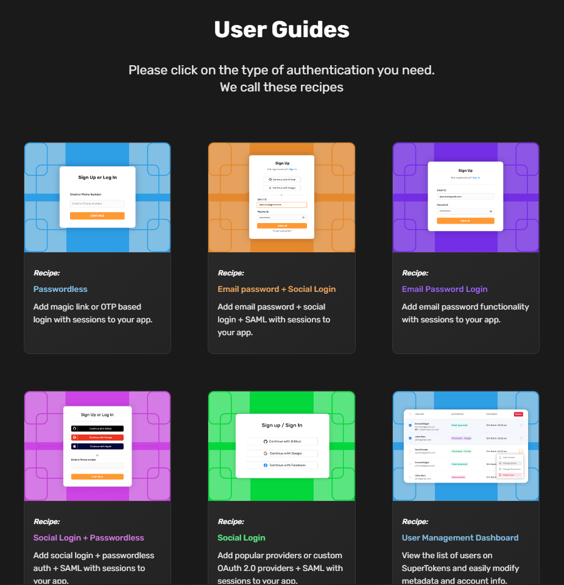
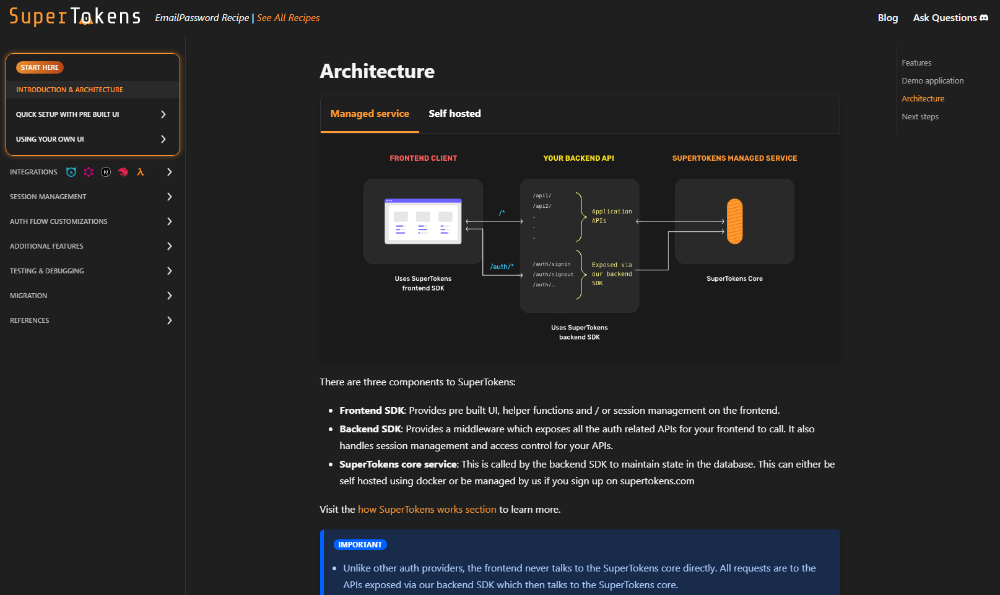
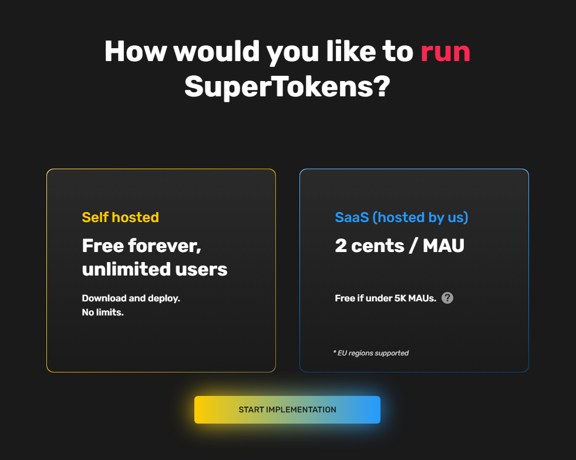

Most companies view authentication simply as a checkbox - as long as users can log in and use the product with no security breaches - they call it good enough. Understandably, they’d rather work on their core product.

And it’s for this exact reason that many companies outsource authentication to a dedicated auth service like Auth0, one of the largest providers today.

On the surface, it makes sense. Outsourcing authentication saves engineering time and keeps things secure with a trusted third party that has all the time and focus in the world to get it right.

But this can become problematic when things go wrong.

Auth0 suffered two large outages in [November 2018](https://cdn.auth0.com/blog/20181128-Incident-RCA.pdf) and [March 2021](https://cdn.auth0.com/blog/20210323-2-Incident-RCA.pdf). Both of these outages left companies unable to support authentication functionality like user logins.

Plus, costs can balloon with hosted services as number of active users increases. [Auth0’s pricing](https://supertokens.com/blog/auth0-pricing-the-complete-guide) can get quite steep for a small startup, especially if they’re still pre-revenue.

The option of building authentication from scratch is still on the table, but it can still be incredibly expensive up-front and the risk of baking in a security bug can be catastrophic.

In recent years, self-hosting has grown in popularity. By transporting authentication logic from an auth provider to internal servers, companies gain finer control over their data without implementing auth from scratch.

To shed some light on the matter, let’s compare several authentication providers which offer self-hosting functionality:

- FusionAuth
- Keycloak
- Ory
- SuperTokens

Also be sure to check out [our piece on auth UI comparison](https://supertokens.com/blog/what-do-pre-built-authentication-ui-tools-look-like) and our [auth provider deep-dive](https://supertokens.com/blog/auth0-alternatives-auth0-vs-okta-vs-cognito-vs-supertokens).

### Keycloak

Keycloak was first released in 2014. Its primary developer is WildFly, a division of Red Hat.

**Open Source**

Keycloak was designed as an open-source solution for identity and access management, and was intended to provide a simpler and more effective alternative to existing solutions on the market.

Today, Red Hat’s Single Sign-On (SSO) product is based on the Keycloak project. 

**Functionality**

Keycloak supports various authentication mechanisms such as OpenID Connect, OAuth 2.0, and SAML, and can be easily integrated with other systems and protocols. Keycloak also includes features for managing users, roles, and permissions, as well as for implementing multi-factor authentication and social login.

While Keycloak has broad functionality, it’s not always sufficient for larger enterprise needs. For example, the Keycloak functions do not satisfy the requirements of data protection in accordance with the European General Data Protection Regulation (EU-GDPR).

As a result, many customers often need to extend the functionality of Keycloak with support from Red Hat or third-party Keycloak experts. 

**Pricing**

Keycloak is free for all users. 

For larger enterprise users, Red Hat offers the Red Hat SSO product. 

Monthly pricing for Red Hat SSO runs from $138/month to $3,600/month depending on server capabilities.

**Support**

Because Keycloak is an open-source project, it doesn’t provide any company-based support. Instead, it relies on a large community of Github contributors to help [debug and answer user questions](https://github.com/keycloak/keycloak/issues).  

Red Hat SSO offers 24/7 support on paid plans. 

**Target Customer**

Keycloak is aimed at smaller projects looking to set up low-cost authentication. When it was first released, Keycloak quickly gained traction as an open-source alternative to costly authentication providers. Today, most of Keycloak’s functionality has been replicated by competitors. 

Red Hat SSO primarily targets larger enterprise-based clients. 

### Ory

Founded in 2016, Ory is the largest open-source community in the world for cloud software application security. 

**Open Source**

Ory has a family of product - all of which are open source. Its user authentication product, Kratos, was released in 2018. 

Ory’s other products include: 

- Hydra - OAuth 2.0 and OpenID Connect provider
- Oathkeeper - access control for API endpoints
- Keto - authorization, define advanced permission rules ("Access Control Policies")

**Functionality**

Ory Kratos provides features such as - 

- Self Service Login and Registration
- Multifactor Authentication
- User Management
- Social Logins
- Account Verification and Recovery

A potential downside to Kratos is the authentication UI. While Kratos handles all of the backend functionality, users still need to build the authentication screens (login, signup, forgot password) from scratch. 

This can be either a negative due to the extra engineering time, or a positive for teams looking for 100% control over their user experience.

**Pricing**

Kratos is free for self-hosting with all functionality intact.

Launched in November 2022, the Ory Network is a managed solution hosted by Ory themselves. Pricing ranges from $18/month to $240/month. 

**Support**

As an open-source company, Ory only has community-based support for self-hosted users. 

For dedicated support, users need to be on the Ory Network’s Business plan which runs $240/month. 

**Target Customer**

With a low price point and open-source strategy, Ory’s target customers are lean startups. Although implementing Ory requires a bit of elbow grease, the end product is a highly secure authentication flow.

### FusionAuth

Founded in 2016, FusionAuth’s tagline is:  “Auth. Built for Devs, by Devs.” 

**Open Source**

Unlike other companies on this list, FusionAuth is not open source. Based on a previous Q&A thread, FusionAuth’s services will continue to function for an undisclosed amount of time even after the company shuts down. Further, Enterprise clients can request a source code release clause in the event FusionAuth goes out of business.

**Functionality**

Self-hosting with FusionAuth’s core authentication features is free. Users have access to email+password, third-party/social, and even passwordless authentication methods. 

These features are sufficient for hobby-level projects, but not for startup/enterprise use cases.

Important features like [Advanced Multi-Factor Authentication,](https://fusionauth.io/docs/v1/tech/guides/multi-factor-authentication) [Application Specific Themes](https://fusionauth.io/docs/v1/tech/themes/application-specific-themes), and [User Self Service and Account Management](https://fusionauth.io/docs/v1/tech/account-management/) are part of the paid plans. 

In addition, certain third-party integrations such as sign in with Nintendo, Playstation, Epic Games, Steam, Twitch, and Xbox require an Essentials or Enterprise plan.

Certain security features such as advanced security are also locked behind the Essentials or Enterprise plans. 

**Pricing**

Pricing for self-hosting FusionAuth is on the higher end compared to other authentication providers.

Community plan (free) is free for unlimited users.

The remaining plans tiers are effective for the first 10k users, with Starter plan at $125/month, Essentials at $850/month, and Enterprise at $3,300/month.

**Support**

FusionAuth gates support to three tiers. 

Users on the free Community plan and Starter plan ($125/month) have community forum support (forums, Slack, Github). 

Essentials users ($850/month) are guaranteed a 24-48 hour response time via email. 

Enterprise users ($3,300/month) have both 24/7 email and phone support and a dedicated Slack channel with FusionAuth engineers. 

**Target Customer**

FusionAuth is geared towards larger enterprise customers similar to Auth0. However, FusionAuth’s key differentiators are its self-hosting options and advanced security features like biometric authentication.

### SuperTokens

SuperTokens was founded in February 2019 with the tagline: “Build fast. Maintain control. Reasonably priced.”

**Open Source**

SuperTokens is an open-source company and one of the [fastest growing OSS startups in Q1 2022](https://runacap.com/ross-index/q1-2022/).  

**Functionality**

SuperTokens offers a variety of functions such as:

- Email+password login
- Passwordless (OTP or Magic link based)
- Social / OAuth 2.0
- Access control
- Session management
- User management
- Self hosted / managed cloud

Our core focus is ensuring high security with a premium user authentication experience.

The SuperTokens SDK is split into frontend, backend, and the SuperTokens Core. Everything you need for authentication is available as a simple function call, so there’s full control over how you implement auth - whether it’s for an API for a customer-facing app.

We provide step-by-step guides for [a variety of authentication recipes](https://supertokens.com/docs/guides), whether you choose to host SuperTokens as a Docker instance or as a binary service.

**Pricing**

A self-hosted SuperTokens implementation is 100% free for unlimited users.

**Support**

We love talking with our users. In fact, we have an incredibly active Discord community where we usually respond to questions within 15 minutes, 18 hours/day.

For our larger enterprise customers, we also offer dedicated Slack channels and additional support.

**Target Customer**

Our best customers are startups. Our enterprise feature set is still being developed, and we’ve recently been certified for both SOC 2 and GDPR.

### Conclusion

While you can tell we’re a little biased ;) - we hope you found this breakdown useful.

Please reach out to us for any questions you have around auth, whether you choose to go with SuperTokens or not!

Otherwise if you’d like to get started, [here](https://supertokens.com/docs/guides) is best place to start. Happy authenticating!