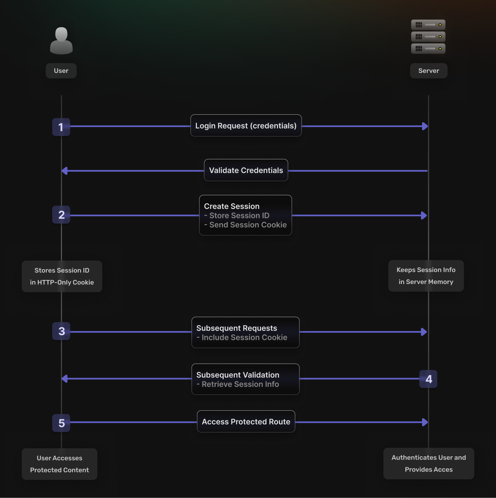
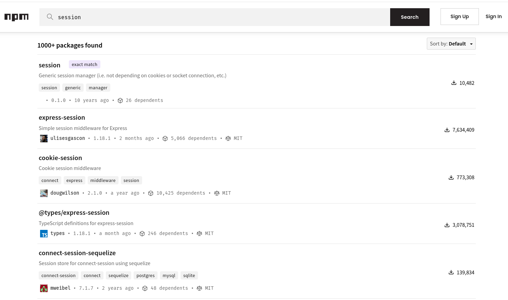

## Table of Contents

```toc
tight: true
toHeading: 3
```

The moment you open your browser, you're likely to already have at least a few open. Sessions - one of the most fundamental building blocks of auth, is considered simple, yet that's only surface level. Today, we're taking that complexity apart, with the goal of understanding what makes it tick better.

---

## What is Session-Based Authentication?

You've probably heard that the web is stateless. That's an obvious problem when you're trying to build software that needs to remember who's logged-in. Put in layman's terms, session-based authentication is a way of saying "I know who you are" between requests. To sprinkle a bit of tech speak on top of that definition, sessions introduce statefulness by keeping session data on the server. Every piece of session data is isolated to the user it belongs to.

Looking under the proverbial hood, key aspects of session-based authentication include:

- **Session Storage**: Information about the user session is stored on the server in memory, a file system, or a database.
- **Session Cookie**: The client holds a session identifier in the form of a cookie, which is sent with each subsequent request to the server. Pick a random tab from the ones you have open - you're likely to see a few of these in your devtools.
- **User Authentication**: By validating the session ID against server-side session data, the server verifies the user's identity.

But, we need to go deeper.

---

## How Does Session-Based Authentication Work?

The process involves the following steps:



1. **User logs-in**: The user sends their credentials (e.g., username and password) via a login request.
2. **Server creates a session**: The server validates the credentials. If valid, a session is initiated and associated with a unique session ID. That session is remembered by the server and stored in the client for reference inside a cookie (an HTTP-only cookie).
4. **On every followup request**: The client includes the session cookie (with the session ID), allowing the server to retrieve session information.
5. **Session Validation**: The server goes "Ah I remember you", and allows you to access a protected route.

---

## Advantages of Session-Based Authentication

Okay, so the general idea isn't that complex. But let's take a short detour and see what makes session-based auth a good choice, especially in a world where token-based auth is also a thing.

### Security on easy mode

Session data is stored on the server, making it less susceptible to tampering compared to client-side storage methods like local storage. The only data the client holds related to the session lives inside the HTTP-only cookie the server sets as reference (and that one can't be tampered with).

Additionally, the method you use to store the session data is largely up to you, the software author. Depending on what you're trying to build, you might go for a database, and in-memory store or even the filesystem.

### Easy implementation

We have plenty of choice when it comes to integrating a session mechanism in our apps - frameworks and libraries, such as `express-session` for Node.js, for one. Just searching for [session]() on NPM, yields 1000+ packages:



Statistically speaking, there's a high change that there's one for your specific stack that's ready to be used out of the box. Or, you know, check out [supertokens](https://supertokens.com) 😉

---

## Implementing Session-Based Authentication in Practice

Let's have a look at a basic example, in node (using express), on how we can implement session auth from scratch. If "by scratch", we mean with well-tested building blocks available on NPM. Otherwise, we might just end up having to resort to write an entire framework ourselves, which we can probably agree is out of the scope of this article.

### Setting Up the Environment

1. **Initialize the Project**
    
    ```bash
    mkdir session-auth
    cd session-auth
    npm init -y
    ```
    
2. **Install Dependencies**
    
    ```bash
    npm install express express-session
    ```
    

### Server Configuration

Create an `index.js` (or .ts) file and set up your server with session support, via the express-session package:

```javascript
const express = require('express');
const sessions = require('express-session');

const app = express();

app.use(
  sessions({
    secret: 'super-secret-key', // but, really, REALLY, keep this in one in ENV
    saveUninitialized: false, // don't create session until something stored
    resave: false, // don't save session if unmodified
  })
);

app.use(express.json());
app.use(express.urlencoded({ extended: true }));

app.listen(3000, () => console.log('Server is running on port 3000'));
```

---

### Creating Routes and Handlers

1. **Home Route** Redirect logged-out users to the login page or display a personalized message for logged-in users:
   
```ts
module.exports = function homeHandler(req, res) {
  if (!req.session.userId) {
    return res.redirect('/login'); // Redirect to login if not authenticated
  }

  res.setHeader('Content-Type', 'text/html');
  res.write(`
    <h1>Welcome back, ${req.session.userId}!</h1>
    <a href="/logout">Logout</a>
  `);
  res.end();
};

```

   
2. **Login Route** Serve the login form and process authentication using hardcoded credentials for simplicity.
   
```ts
// handlers/login.js
module.exports = function loginHandler(req, res) {
  if (req.session.userId) {
    return res.redirect('/'); // If already logged in, redirect to home
  }

  res.setHeader('Content-Type', 'text/html');
  res.write(`
    <h1>Login</h1>
    <form method="post" action="/login">
      <input type="text" name="username" placeholder="Username" required /> <br>
      <input type="password" name="password" placeholder="Password" required /> <br>
      <button type="submit">Login</button>
    </form>
  `);
  res.end();
};

```
   
3. **Login route handler** Destroy the session and redirect users to the homepage.
   
```ts
// handlers/process-login.js
module.exports = function processLoginHandler(req, res) {
  const { username, password } = req.body;

  // Simple authentication logic
  if (username === 'example-user' && password === 'password123') {
    req.session.userId = username; // Store userId in session, or any other info, for that matter
    return res.redirect('/'); // Redirect to home on successful login
  }

  res.status(401).send('Invalid username or password');
};

```
   
4. **Logout route handler** logs the user out, deleting the session and the cookie.
   
```ts
// handlers/logout.js
module.exports = function logoutHandler(req, res) {
  req.session.destroy((err) => {
    if (err) {
      return res.status(500).send('Failed to logout');
    }
    res.redirect('/login'); // Redirect to login after logout
  });
};

```

5. **Routes** finally, we need the routes in the index file.
   
```ts
...
app.get('/', homeHandler);
app.get('/login', loginHandler);
app.post('/login', processLoginHandler);
app.get('/logout', logoutHandler);
...
```

---


```

### Running the Application

Add a `start` script to `package.json` and launch your server:

```bash
npm start
```

This example isn't going to do much by itself. Also, hardcoding usernames and passwords isn't exactly the best practice ever, but it illustrates how sessions work.

Now, we also have this via the [SuperTokens SDK](https://supertokens.com/docs/thirdpartyemailpassword/quickstart/frontend-setup) too - and you can set it up in less than 5 minutes :) 

---

## Risks, Challenges, and Considerations

Of course, anyone claiming they have a silver bullet for something is probably selling silver bullets. Around here, we're more of the "right tool for the right job" mentality. So, sessions are not a silver bullet, and let's have a look at some of their tradeoffs.
### Potential Security Vulnerabilities

- **CSRF Attacks**: These are still a thing. Protect session cookies using the `SameSite` and `HttpOnly` attributes.
- **Session Hijacking**: While not as common anymore, make sure to use `https`. Which you probably should be doing anyway.
- **Session Expiration**: Sessions should expire, not last until the next holiday season. 
### Scalability Concerns

Here's the thing - storing stuff in memory (as in the example above), runs the risk of overwhelming said memory. Having a lot of users is a good problem to have, but make sure to use something like Redis (or similar) to make sure that their sessions actually remain accessible.

---

## When to Choose Session-Based Authentication?

The bottom line is, there's a place and time to use session-based auth. Going the session way is probably a good idea if your app:

- Has frequent interaction between the client and server.
- Requires centralized control over user sessions.
- Doesn't have to heavily rely on client-side security mechanisms.
  
Cool. Now let's have a look at the alternatives.

---

## Alternatives to Session-Based Authentication

If what your building:

1. Is purely an API-based service
2. Needs to scale statelessly
3. Has mobile (or desktop) apps as primary clients

it's probably time to look elsewhere:

1. **Token-Based Authentication**
	- Stateless and suitable for APIs.
    - Relies on JSON Web Tokens (JWTs) for transmitting user identity.
2. **OAuth**
    - Delegated access control mechanism for third-party applications (think Google, Facebook, etc.)

---

### Where SuperTokens fits

We believe in giving you the tools to build the auth solution you need. We support both session-based auth and token-based auth. You can mix and match according to the requirements of your app.

Check it out [here](https://supertokens.com/product).

---

## Conclusion

Session-based authentication remains an important tool in web application security. It wins on simplicity simplicity and control, where token-based approached win on distribution and scalability. Luckily, it doesn't have to be either/or.  Try [SuperTokens](https://supertokens.com/product) today!

And remember: security is a journey, not a destination. Keep learning, keep updating your knowledge, and never trust user inputs. 😉


