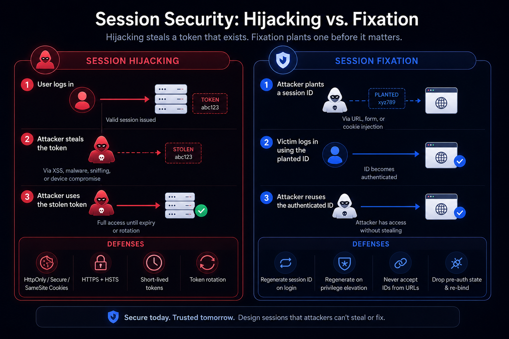
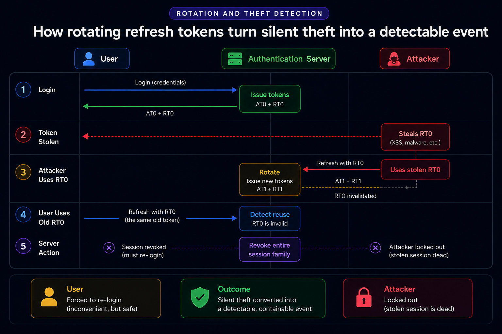

A password protects the front door. A session protects everything behind it. Once a user logs in, the session token becomes the credential for every request that follows, which is exactly why attackers target it. Steal or fix a session and the password, the MFA prompt, and the login form all become irrelevant. This guide lays out a layered defense against the two most common session attacks, session hijacking and session fixation, with concrete controls and notes on where SuperTokens handles the work by default.

## What Makes Authentication Sessions a Top Target in 2025?

Sessions carry post-login trust. After authentication succeeds, the server issues a token that represents "this request comes from an authenticated user," and every subsequent request rides on that token instead of re-checking the password. If an attacker steals or fixes a session ID, they inherit that trust and bypass passwords and MFA entirely.

This is not a theoretical concern. Token theft has become a primary attack vector precisely because a stolen token is a valid token: it sails past SSO, MFA, and conditional access policies that only fire at login time. OWASP has long flagged strict session timeouts and robust session management as core defenses, because the session layer is where authentication actually lives once the login flow is over.

The rest of this guide treats session security as a layered problem: no single control is sufficient, and even if one layer fails, the others contain the damage.

## Threat Model 101: Hijacking vs. Fixation



The two attacks sound similar but work in opposite directions, and they need different defenses.

- **Session hijacking** is theft of a valid session token from a legitimate user. The attacker obtains a token that was correctly issued to someone else, through cross-site scripting (XSS) that reads the token, malware on the device, network sniffing over unencrypted HTTP, or direct device compromise. The defenses limit both the chance of a leak and its usefulness if one happens: HTTPS with HSTS, `HttpOnly / Secure / SameSite` cookies, idle and absolute timeouts, and token rotation.
- **Session fixation** runs the other way. The attacker sets a known session ID *before* the victim logs in, then waits. If the application reuses that same session ID after authentication instead of generating a fresh one, the attacker already knows the now-authenticated session ID and can reuse it. The single most important defense is to regenerate the session ID on login and at any privilege change, so any pre-login identifier becomes worthless the moment the user authenticates.

## Baseline Controls (Apply Everywhere)

These are the non-negotiables. Every application handling sessions should have all of them in place regardless of framework or platform.

- **HTTPS everywhere plus HSTS.** Encrypt every request so tokens cannot be sniffed in transit, and use HSTS to prevent downgrade to plain HTTP.
- **Cookie flags.** Set `HttpOnly` so JavaScript cannot read the token, `Secure` so it only travels over HTTPS, and `SameSite` to cut off cross-site request paths.
- **Rotate the session ID on login.** This is the fixation defense. Regenerate on authentication and again on any privilege elevation.
- **Timeouts.** Enforce both an idle timeout and an absolute lifetime, and keep access tokens short-lived.
- **No session IDs in URLs.** Never place a token in a query string, and never accept a session ID supplied through `GET` or `POST` parameters. A session ID in a URL leaks through browser history, server logs, referer headers, and shared links.

## Implementation Steps: Secure Cookies and CSRF Posture

Start by mapping every cookie the application sets: its name, purpose, and scope (domain and path). An inventory is the only way to know what needs protecting.

Then set the flags. For authentication cookies, `HttpOnly` and `Secure` are mandatory. For `SameSite`, prefer `Lax` or `Strict` wherever the application's flows allow it. Some legitimate cross-site flows require `SameSite=None`, and when they do, that cookie must also carry `Secure`. Document every place a cross-site flow forces `SameSite=None` so the exception is deliberate rather than accidental.

CSRF strategy follows from the cookie posture. Two approaches work and combine well: anti-CSRF tokens the server verifies on state-changing requests so a cross-site request cannot forge them, and `SameSite`cookies backed by server-side `Origin` or `Referer` verification on any request that changes state. The important rule is that state-changing requests (anything that writes, deletes, or transfers) must be verified server-side. Read-only requests carry less risk, but any mutation needs an explicit CSRF defense.

## Rotation and Revocation: Stop Replay and Long-Lived Risk



Short-lived access tokens limit the blast radius of a leak. An access token valid for minutes rather than days expires before a stolen one can do much damage. Pair short access tokens with rotating refresh tokens so the long-lived credential is never static.

Rotation is where theft becomes detectable. Every time a refresh token is used, it is replaced and the old one is invalidated. If a rotated (already-used) refresh token shows up again, that is strong evidence of theft: either the attacker or the legitimate user is presenting a token that was already spent. The correct response is to assume compromise and revoke the entire session family, forcing both parties to re-authenticate. Rotation converts silent compromise into a detectable event: without it, a stolen refresh token is a permanent key; with it, the theft announces itself the moment both parties try to refresh.

Beyond the automatic case, revocation should be wired to risk signals. Force re-authentication and revoke sessions on password reset, on role or privilege changes, and on device-risk signals. A password reset that leaves old sessions alive is a common and dangerous gap, since it leaves an attacker with continued access even after the user thinks they have locked things down.

## Detection Signals: When a Session Might Be Stolen

Some signals are strong enough to act on automatically, others are worth surfacing for review.

- **Refresh token reuse or mismatch.** With rotation in place, a reused refresh token is the strongest available theft indicator, and it justifies automatic revocation.
- **Improbable travel or device change.** A session that jumps continents in minutes, or moves to an unrecognized device, deserves a step-up challenge. Treat IP change as an anomaly signal rather than a hard block, since VPNs and mobile networks change IPs legitimately.
- **Anomalous API usage.** Sudden shifts in request rate, or access to scopes the user never touches, can indicate a hijacked session.

SuperTokens surfaces token theft directly. When rotation detects a refresh token mismatch, it raises a theft-detected condition that application code can act on: revoke the session, notify the user, or trigger a risk challenge. The detection is built into the session layer rather than something teams assemble themselves.

## Fixation-Specific Hardening (at Login and Privilege Jumps)

Fixation has a narrow, reliable fix, and the whole battle is making sure it happens at the right moments.

Always regenerate the session identifier on successful authentication and on any privilege elevation, such as a user stepping into an admin context. Any session ID that existed before the login boundary must not survive it.

Pre-authentication session state needs care. Data like a shopping cart or CSRF state attached to the pre-login session should be dropped and re-bound to the freshly issued session, rather than carried over on the old identifier, since carrying state across on the old ID is exactly what fixation exploits.

Finally, block attacker-controlled identifiers at the door. Never accept a session token or ID from a URL, a form field, or a JSON body. The server issues session identifiers; it does not accept them from the client.

## Monitoring and Timeouts That Actually Work

Timeouts are a blunt but effective containment tool, and they work best in combination.

- **Idle timeout.** Expire a session after a period of inactivity, tuned to the sensitivity of the application. A banking app warrants a tighter idle window than a note-taking app.
- **Absolute timeout.** Cap the total lifespan of a session regardless of activity, so no session lives forever even if the user stays active.
- **Shorter lifetimes on sensitive paths.** Admin and other high-privilege areas should carry shorter session lifetimes and force step-up authentication before granting access.

The idle timeout catches abandoned sessions like an unlocked laptop, while the absolute timeout caps the reward for a token that was stolen and kept active. Both are needed.

## How SuperTokens Hardens Session Security


[SuperTokens](https://supertokens.com/) builds most of these controls into the session layer by default. The features map to the defenses above as follows.

- **Cookie security and CSRF.** The web SDKs default to secure cookie settings for browser apps, storing tokens in `HttpOnly` cookies so JavaScript cannot read them. Anti-CSRF handling is integrated into the session layer alongside `SameSite` configuration.
- **Rotating refresh tokens with theft detection.** This is the core differentiator. The server issues rotating refresh tokens and detects reuse or mismatch. When a rotated token is presented again, SuperTokens raises a theft-detected condition, and the session family can be revoked so both the attacker and the legitimate user are forced to re-authenticate.
- **Fixation defense by design.** New session tokens are issued on sign-in, and the guidance is to rotate tokens after authentication, which neutralizes fixation because any pre-authentication identifier is discarded at login.
- **Short-lived access tokens with automatic refresh.** Access tokens are short-lived and refreshed transparently by the SDK, limiting the blast radius if one leaks while keeping the user logged in without friction.
- **Portable verification via JWKS.** SuperTokens exposes a first-party JWKS endpoint at `<YOUR_API_DOMAIN>/auth/jwt/jwks.json`, so any service can verify access tokens locally using the public keys, with automatic key rotation handled centrally.

## Copy/Paste Playbooks (by Platform)

The right controls shift slightly depending on where the session lives.

- **Web SPA plus API.** Store the session in `HttpOnly`, `Secure`, `SameSite` cookies, never in `localStorage`, which is readable by any script and therefore exposed to XSS. Enable anti-CSRF plus origin checks on state-changing routes. Configure the SuperTokens web and backend SDKs, and confirm the cookie domain and path match the application's topology.
- **Mobile plus API.** Use the platform's secure storage for tokens, pin TLS in sensitive contexts, and prefer short access tokens paired with rotating refresh tokens. Mobile networks change IPs constantly, so lean on device binding rather than IP as the primary signal.
- **Multi-service backends.** Verify JWTs locally from the JWKS endpoint rather than calling a central authentication service on every request. Set absolute lifetimes and wire centralized revocation to risk signals so a compromised session can be killed across every service at once.

A minimal Express route using the SuperTokens `verifySession` middleware:

```js
import express from "express";
import { verifySession } from "supertokens-node/recipe/session/framework/express";

const app = express();

app.post("/transfer", verifySession(), async (req, res) => {
  const userId = req.session.getUserId();
  // Session is verified. Proceed with the state-changing action.
  res.json({ status: "ok", userId });
});
```

For services that verify tokens without the backend SDK, point a standard JWKS client at the SuperTokens endpoint:

```js
import jwksClient from "jwks-rsa";

const client = jwksClient({
  jwksUri: "<YOUR_API_DOMAIN>/auth/jwt/jwks.json",
});
// Use the fetched signing key with any standard JWT library to verify the token.
```

## Red-Team Tests to Add to CI

Session defenses rot quietly. A refactor can drop a cookie flag or skip the rotation step, and nothing visibly breaks until an attacker finds it. Encode the defenses as tests so a regression fails the build.

- **Fixation test.** Capture the session ID before login and after login, and assert they differ. If the ID survives authentication, fixation is possible.
- **Cookie flags test.** Assert that authentication cookies carry `HttpOnly`, `Secure`, and the intended `SameSite` value.
- **Rotation test.** Simulate refresh token reuse by presenting an already-used refresh token, and expect theft detection to fire and the session to be revoked.
- **Timeout test.** Confirm that both idle and absolute expiry behave as configured, including that an expired token is actually rejected.

These four cover the highest-value failure modes and run fast enough to sit in CI on every commit.

## Executive Checklist (Fast Review)

Four questions cover the essentials:

- Are HTTPS plus HSTS, cookie flags, and CSRF controls enforced across the application?
- Does the session ID rotate on login and on any role or privilege change?
- Are access tokens short-lived, with refresh rotation and theft detection in place?
- Are both idle and absolute timeouts defined, enforced, and monitored?

Any "no" is the place to start.

## SuperTokens Configuration Checklist (Fast Reference)

For teams using SuperTokens, the concrete configuration points are:

- **Session recipe.** Enable rotating refresh tokens with theft detection, and handle the theft-detected path by revoking the session and prompting re-authentication.
- **Cookies.** Set `HttpOnly`, `Secure`, and the appropriate `SameSite` value for the domain topology.
- **Post-login rotation.** Confirm tokens are re-issued on sign-in and at step-up events.
- **JWKS verification.** Point services at `<YOUR_API_DOMAIN>/auth/jwt/jwks.json` for local JWT verification.

## Conclusion

Secure authentication sessions are not the product of a single setting. They come from layered controls: rotate on login to stop session fixation, guard cookies with `HttpOnly / Secure / SameSite` and close the CSRF paths, enforce idle and absolute timeouts, and pair short-lived access tokens with rotating refresh tokens and theft detection. Each layer covers a different failure, and together they contain the damage when one slips.

SuperTokens operationalizes these practices with built-in rotation, token theft detection, secure cookie defaults, and a first-party JWKS endpoint for scalable verification, so a team can ship a hardened session layer without hand-building each control or trading away security to move quickly.
