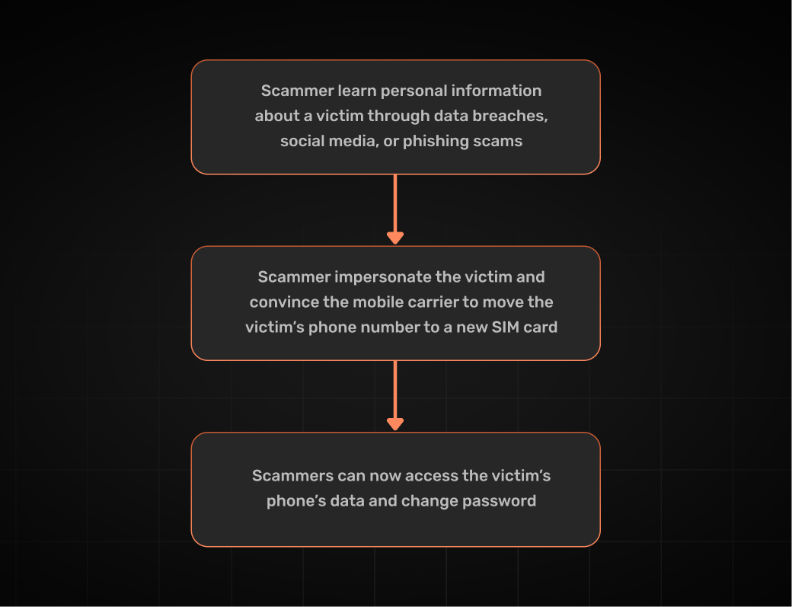

Let's play a game. 🎯

What do Twitter founder Jack Dorsey and actress Chloe Moretz have in common? 

...

Yep. Both were victims of a cyber attack called a SIM swap attack. 😬

From spamming to phishing scams and identity theft, cybercriminals sure know how to keep themselves busy. But the one scam they just can't seem to get enough of right now is in fact **SIM swapping** — a sneaky trick where they hijack your SIM card and take over your phone number. So any calls or texts you receive go to them, not to you. 

**Understanding how SIM swapping works — and how to prevent it — is essential to keeping your user accounts and personal data safe.**

After all, scammers don’t just hack your phone — they pose as you to fool your mobile provider and gain access to your most important accounts. Incredibly rude if you ask me. 😑

Time to spot the faker and kick them to the curb.

```toc
tight: true
toHeading: 3
```

## What Is a SIM Card? 
A **SIM (Subscriber Identity Module)** is a small card that **connects your phone to your mobile network**. 📶📲

It holds important details such as your phone number, contacts, and other data. This information allows you to make calls, send texts, and use mobile data. It's removable and transferable to other phones.

Alternatively, **eSIM cards are embedded Subscriber Identity Modules** -- SIM cards that are built into a user's phone. 🔒📲

**Because the SIM is tied to your account, moving it to another phone will transfer your mobile services to that device.**

In a SIM-swapping attack, cybercriminals exploit this by tricking your carrier into switching your phone number to a SIM they control, giving them access to your accounts and personal data. 

## What Is SIM Swapping and Why Should You Care? 

**SIM Swapping** (SIM hijacking or port-out fraud) is a fraud technique where scammers transfer a victim's phone number to a new SIM card under their control. It's a type of account takeover. 
 
**This allows scammers -- our cybervillains -- to receive communications associated with your phone number, including those that let them to access your social media profiles, banking and other accounts.**

Cybervillains may target people who have valuable social media or financial accounts. This is how Jack Dorsey, the founder of Twitter, got his account hacked in 2019. 

## How It Works 

SIM swapping attacks can be summed up in three main steps:

1. **Typically, a SIM attack begins with the attacker gathering personal information about users.** This information is used in verifying a person's identity and an attacker can use it to impersonate you. They could find details about you from: 
- your social media accounts
- private information that has been leaked 
- any information about you that is freely online

2. **The attacker will then reach out to your phone company pretending to be you.** They can use any information they have on you to answer security questions -- which is why some people also question the safety of personal questions as a security measure. Then they will ask to have your phone number transferred to a SIM card they control. 

3. **After all this, attackers will now have access to your text messages and contacts.** This could also lead to even more attacks because once they have this information, attackers can get even more information on users, including passwords and emails. 



### Consequences of SIM Swap Attacks
If someone takes control of your phone number, they could steal money from your bank account, make unauthorized payments, or apply for loans in your name. They might also access your personal information through email or social media, leading to identity theft or even legal trouble if your identity is misused. By changing passwords, the attacker could lock you out of important accounts, potentially causing permanent data loss. On top of that, they could invade your privacy by reading your messages, listening to voicemails, or impersonating you in calls and texts.

## 3 Signs That You Are The Victim of a SIM Swap Attack
Keeping in mind some of these signs can help you catch a SIM swap attack early so the damage either doesn't happen or at least isn't extensive:

1. **You can't make calls or send texts** -- This can be a sign of a cellular provider outage but it can also be a SIM swap attack in the process. It's always better to check for outages if this happens and then act accordingly.

2. **You're unable to access accounts** -- Attackers most likely know they have limited time to do some damage so they will try to buy more time by changing your accounts' passwords. Changing back your passwords to various accounts will take some time. So this may be a sign that a SIM swap attack has unfortunately happened.

3. **You find unauthorized transactions** -- It can either be a mistake or a SIM swap attack. But either way, it's good to get that taken care of and notify your bank and stop the attack from continuing. 

As you probably noticed all of those signs are just that -- signs. They could be something else, but it's always beneficial for you and your users to keep them in mind so they don't fall victims to SIM swapping. Or if they do, to minimize the damage. 
 

## Are eSIM Cards More Secure Than Physical SIM Cards? 🤔
Many people question whether eSIMs are more secure than physical SIM cards, but it's not a straightforward answer. That being said, eSIMs do offer an advantage in case you lose your phone, as they can be quickly disabled -- [**especially if you are traveling**](https://support.apple.com/en-us/118227#:~:text=eSIM%20is%20more%20secure%20than,models%20at%20the%20same%20time.).

In a **traditional SIM attack**, an attacker would need physical access to your phone to steal your SIM card and insert it into their own device.

With **eSIMs**, there’s no physical card to steal, which adds some security. However, scammers can still perform a **SIM swapping attack** by convincing your mobile carrier to transfer your number to their device — and with the rise of social engineering (especially enhanced by AI), impersonating you has become easier than ever.

At the end of the day, neither eSIMs nor physical SIMs are automatically more secure. The key to protecting yourself lies in the security measures you take — like enabling **two-factor authentication**, using **strong passwords**, and being cautious with what information you share.

## Are SIM Swapping Attacks on the Rise? 
Yes, experts claim that these attacks are not only on the rise, but are also becoming more sophisticated. Which is not surprising -- especially with the growth of AI. 

[**The Federal Bureau of Investigation issues an announcement**](https://www.ic3.gov/PSA/2022/PSA220208) in 2022 to inform the public and mobile carriers of the rise of these attacks. They said they received 320 complains related to SIM swapping attacks between January 2018 and December 2020 , and that jumper jumped to 1,611 in just 2021 -- although many believe these numbers are underestimated because a lot of identity thefts are not reported. 

##  Why SMS 2FA Is No Longer Enough

##  The Right Authentication Strategy: Moving Beyond SMS 2FA

Implement these three pillars to make sure you and your users are safe.

#### Pillar 1 -- Implement Stronger Two-Factor Authentication (2FA) Alternatives
- **FIDO2/WebAuthn Authentication**: Device-based authentication eliminates reliance on SMS.
- **TOTP (Time-Based One-Time Passwords) with an Authenticator App**:
- Apps like **Google Authenticator** and **Authy** remove carrier dependence.
- Attackers need physical access to the user’s device to generate 2FA codes.

#### Pillar 2 -- Require Multi-Factor Authentication (MFA) for High-Risk Actions
- Enforce **MFA for sensitive transactions** (password changes, fund transfers, adding new devices).
- Use **risk-based authentication** to prompt extra verification only when login behavior seems suspicious.

#### Pillar 3 -- Implement Robust Session Management
- **Limit session lifetimes**: Prevent long-lived sessions from being exploited.
- **Auto-log out users when a phone number or device change is detected**.
- **Use SuperTokens to handle secure, scalable session management.**

## How SuperTokens Helps Secure Authentication Against SIM Swaps

Prevention is the best form of protection against SIM swapping attacks. 

## Final Thoughts: Secure Your Authentication System Before It’s Too Late
Unfortunately, businesses can no longer rely on SMS-based authentication to protect user accounts. SWIM swapping is an industry-wide problem, but SuperTokens provides the authentication tools to stop account takeover before they happen. 

Next step is to migrate your authentication system to a modern and secure CIAM solution that keeps customer accounts safe at scale.

Stay safe!