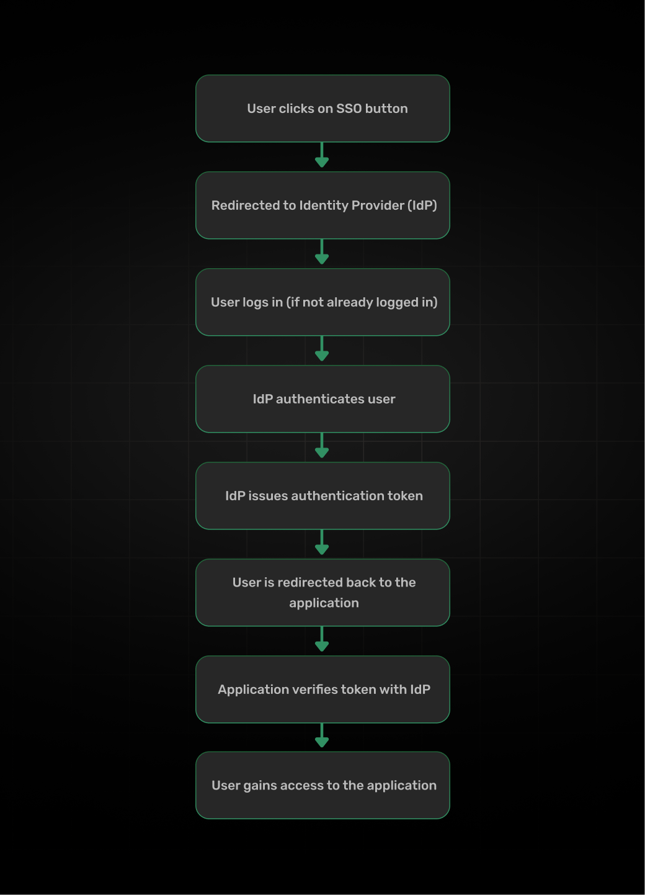

As boring as auth conversations can be, few would argue against the usefulness of SSO. You know that feeling when you’re trying to get something done, but you keep hitting login prompts asking for different usernames and passwords? Yeah, that’s the problem SSO solves. Instead of juggling 37 different passwords (and inevitably reusing them because who can remember that many?), SSO lets you authenticate once and access everything you need.

Think of it like having a single key that opens all the doors you’re supposed to have access to, instead of carrying around a comically oversized keyring. Once you prove you’re you, you’re good to go. 

## What is Single Sign-On (SSO)?

But analogies aside, let's define SSO. Deferring to [Wikipedia's wisdom](https://en.wikipedia.org/wiki/Single_sign-on):

> Single sign-on (SSO) is an authentication scheme that allows a user to log in with a single SSO ID to any of several related, yet independent, software systems.

Put another way, SSO is a mechanism that allows a user to authenticate once, using a single set of credentials and access multiple applications or websites. Neat, right?

Some of the benefits of SSO are:

1. Less Password Headaches: One set of credentials for everything. That’s it. Meaning, less login friction, less password reset requests to your IT team, and less password re-use. Not to mention the fact the superior UX that comes with it. Need to log in to 12 different apps? No problem - those are literally a click away.
2. Better Security: Stronger authentication in one place beats weak passwords everywhere. So again, as mentioned above, less password resets and less password reuse keeps your users' data safe and your IT team happy. Plus, if something goes wrong in the apps that integrate with the SSO provider - those passwords are safe and sound in the SSO provider.
3. Faster Access: No more time wasted remembering passwords or resetting accounts
4. Reduced IT Support: Fewer password resets = happier IT team.

## How Does SSO Work?

SSO ins't magic - it's just a smart way to handle authentication. Instead of every app checking your password itself (and hopefully storing it securely, fingers crossed), there’s one central system that handles all the “are you really you?” stuff.

Here's how it works under the hood:

1. **You Try to Access Something**

- You click on Slack, Jira, or whatever other work app
- Instead of asking for a password, it goes “hold up, let me check with the boss”

2. **The Identity Check**

- You get bounced to your company’s identity provider (IdP) - think Okta, Google Workspace, etc.
- If you’re already logged in somewhere else? Great, you’re in
- If not? One login and you’re good to go everywhere

3. **The Secret Handshake**

- Once the IdP confirms you’re legit, it hands out a special token
- This token is like a VIP backstage pass - flash it, and you’re in
- Every app checks with the IdP: “Hey, is this pass real?” IdP goes: “Yep, they’re cool”

Put in a chart, that looks something like this:

There are a few ways this secret handshake can happen:

**SAML**

SAML is a protocol that allows two parties to exchange authentication and authorization data between them - like a handshake between the user and the IdP. In a sense, it's kind-of the old reliable: it still works, but it's not the most modern option. More on SAML in our [Demystifying SAML: A Comprehensive Guide]([/demystifying-saml](https://supertokens.com/blog/demystifying-saml)) article.

**OAuth/OpenID Connect**

OAuth/OpenID Connect is the new kid on the block (by auth standards, anyway). It's a more modern and secure way to handle authentication. If SAML is the old reliable, OAuth/OpenID Connect is the new hotness. Certainly better for modern apps, especially mobile.

Once you've got the token, you can use it to access the application. More on OAuth and OIDC and the differences between them in our [OIDC vs OAuth](https://supertokens.com/blog/oauth-vs-oidc) article.

## Popular Real-World SSO Examples

Let’s cut it down on the tech and protocol speak and look at how SSO actually works in the real world. 

### Google Sign-In

Probably the most "household name" SSO example. If you have a Google account, you're probably already using it log-in to a bunch of other apps. Here's how it works:

1. You click on the "Sign in with Google" button.
2. You're redirected to the Google Sign-In page.
3. You log in to your Google account.
   1. Google handles the heavy lifting of user auth - whether you're already logged in, need to log in, etc.
   2. Google sends a token to the application, essentially guaranteeing that you're who you say you are.
4. You're redirected back to the application.

The developer experience in integrating with [Google Sign-In is pretty straightforward](https://cloud.google.com/identity-platform/docs/sign-in-user-email) too (if we ignore the application registration dance on Google Cloud Console 😏).

### Facebook Login

Facebook, being in the business of ~~data~~ social networks, has a similar SSO offering to Google. Many apps and websites out there also offer the option to log in with Facebook. It works in a similar way to Google Sign-In. However, one if its primary purposes is interaction with the Facebook Graph API. In practice, that means that in order for you to use [Facebook Login](https://developers.facebook.com/docs/facebook-login/web/), you need to first register your application with Facebook.

### Enterprise SSO with Okta

When you see "enterprise" in the title, you know things are getting serious. When one thinks of enterprise SSO, Okta is probably among the first name that comes to mind. Okta is a popular identity provider that allows you to manage your users and their access to various applications. here are some higlights of [Okta's enteprise SSO](https://www.okta.com/identity-101/enterprise-sso/):

- It centralizes authentication for all your company apps
- Supports every major protocol, including OAuth/OpenID Connect, SAML, and more
- Gives admins granular control over who can access what

It might not be the most exciting thing around, but it's what large organizations keep running on.

### SuperTokens SSO Integration

If open-source is your jam, you might want to check out [SuperTokens](https://supertokens.com/). We take a somewhat different approach to SSO - while we support integrating with most (any?) identity provider out there, we also give you the [tools to build your own identity provider](https://supertokens.com/docs/authentication/unified-login/introduction). Whether you're looking to solve a B2B or B2C problem, SuperTokens has you covered:

- We support all the major protocols, including OAuth/OpenID Connect, SAML, and more
- You can own your data and stack completely
- We support a wide range of languages and frameworks

If you're looking to get your SSO on without the hassle of dealing with an identity provider, SuperTokens might be the way to go. The best part? No vendor lock-in. You own your authentication stack.

## SSO Use Cases Across Industries

Next up, let's have a look at how SSO is used across different industries.

### E-Commerce

Cart abandonment is a massive pain point - we’re talking about 70% average abandonment rates. Here’s how SSO helps:

- Slashes friction during checkout (18.75% of users abandon carts due to forgotten passwords)
- Enables one-click login with trusted Google/Apple accounts 
- Stores payment info securely across sessions
- Reduces the “do I really need to create ANOTHER account?” syndrome

### Education Platforms

From what we've heard, educational platform could use a bit of a reduction in the amount of tools they need to juggle. SSO is a good way to bring some order to the tooling chaos:

- Connects Learning Management Systems (LMS) with institutional accounts
- Lets students access everything from course materials to library resources with one login
- Reduces IT support tickets (goodbye “I forgot my password” emails)
- Makes life easier for both faculty and students

### Healthcare

This is where SSO gets serious because HIPAA compliance isn’t optional. Smart implementations:

- Centralize authentication for patient portals
- Enable secure access to medical records across different departments
- Maintain detailed audit trails (required by HIPAA)
- Reduce the risk of unauthorized access through password sharing

### SaaS Applications

For SaaS companies, especially in the B2B space, SSO is becoming a staple:

- Speeds up enterprise customer onboarding
- Reduces friction for end users - reasons stated above - you know, the whole "do I really need to create ANOTHER account?" thing
- Enables seamless integration with existing corporate identity providers
- Makes security teams happy (and you want them to be happy, trust me)

The key takeaway? SSO isn’t just about convenience - it’s about removing friction while maintaining (or even improving) security. Each industry has its own specific needs, but the core benefits remain consistent.