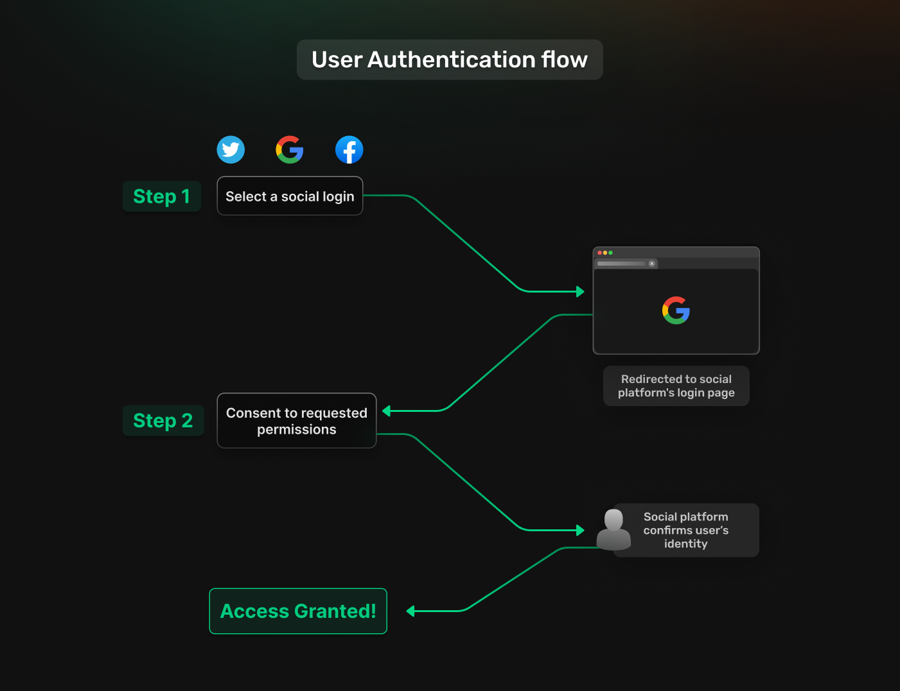
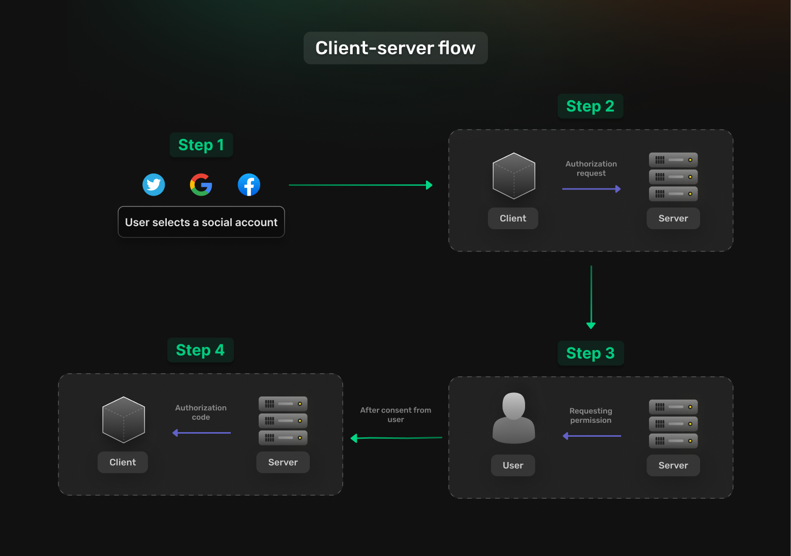
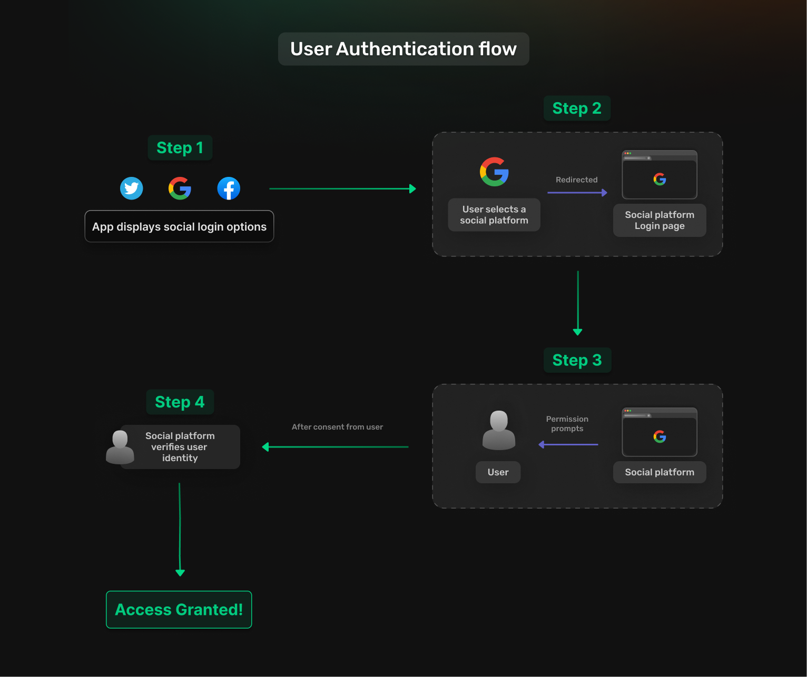
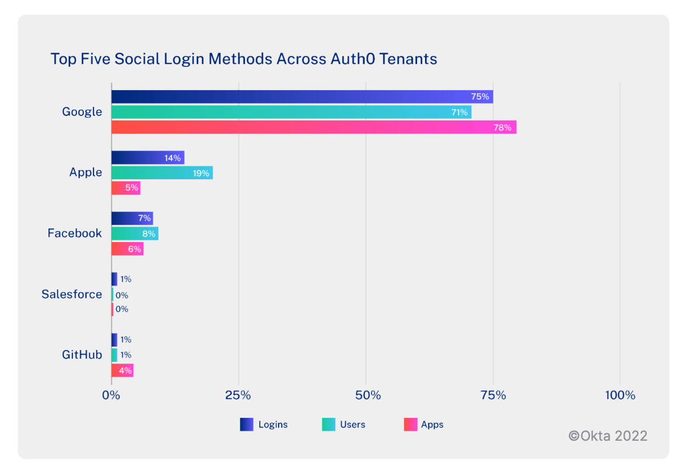

## Table of Content
- [Introduction](#introduction)
- [Social Login in action](#social-login-in-action)
- [User authentication flow](#user-authentication-flow)
- [Popular Social Login Platforms and Their Integration](#popular-social-login-platforms-and-their-integration)
- [User experience and engagement](#user-experience-and-engagement)
- [Technical Implementation of Social Logins](#technical-implementation-of-social-logins)
- [Best Practices](#best-practices)
- [Are There Downsides To Social Login?](#are-there-downsides-to-social-login)
- [Conclusion](#conclusion)

## Introduction

Social login is an authentication method that allows users to log in using their existing login information from social network providers like Google, Facebook, or GitHub, and what that really does is save the user the effort of creating a new account specifically for the app or website and remembering an extra password. So, it offers a password-free way to sign in, which is based on Open Authorization (OAuth 2.0) and OpenID Connect (OIDC) protocols. 

OAuth permits websites and apps to securely and confidentially access data from the user’s social network accounts without revealing the user's credentials. It grants limited permissions through access tokens. OIDC is an identity layer built on top of OAuth 2.0. It enables client applications to verify the identity of a user and obtain basic profile information. It uses an "ID token" in addition to the OAuth access token.

## Social Login in action

Let’s now explain the client-server flow which consists of four main steps and they are:

1. A user chooses to log in with a social account.

2. The client (app) sends an authorization request to the social platform's authorization server. 

3. The social platform presents the user with a consent screen, asking for permission to share specific data with the client app. 

4. After consent, the social platform sends an authorization code to the client through a redirect URI. This code has an expiration time and acts as a key to obtain tokens.

## User authentication flow

For users, the process is easy and involves these four main steps which are:

1. The app’s login page displays options like "Sign in with…" along with a selection of social networks such as Facebook, Twitter, Google, and LinkedIn. 

2. Users then choose a social network and are redirected to its login page. 

3. Then, Users accept permission prompts from the social network. These prompts, known as "scopes," determine the data that the social network will share with the app.
 
4. Finally, The social network verifies the user's identity, granting them access to the app.

When implementing social login in your applications, there are a few crucial things to consider:

1. Collect only the data you genuinely need: So avoid asking for excessive permissions, which can increase the risk of data misuse and compromise user trust.
 
2. Store access tokens securely: Ideally in memory or encrypted storage, to minimize the risk of token theft. 

3. Ensure all communication is over HTTPS: Especially when exchanging tokens, to prevent eavesdropping.

## Popular Social Login Platforms and Their Integration

These statistics from 2022 (probably similar now in 2024) show the top five social login methods within the Auth0 dataset.

### Google

In first place, we have Google which stands on top by a major difference, with almost 4 billion people having Google accounts as of 2024 and that’s due to its widespread adoption across different devices and services. In addition to that, it is often favored by developers as it grants a wide range of access permissions to user profile data. 

### Apple

In second place, we have Apple, which has been gaining traction lately, especially among users of Apple devices, with its focus on privacy and unique security features. It is one of the most secure options as it generally incorporates MFA.

### Facebook

Facebook comes close at third place, which might surprise some given its historical popularity, but its usage has seen fluctuations lately due to privacy concerns. 

However, it remains unique because users can customize permissions to control which information is shared with third-party platforms. Developers often prefer Facebook social login since they can customize default permissions to fit their specific use cases.

### Salesforce

Next, we have Salesforce, which is primarily used in enterprise environments for B2B applications, especially where Salesforce's CRM tools are integrated. 

### Github

Lastly, we have GitHub that is mainly popular in tech-centric applications, where developers or tech professionals are the primary users. Its usage is niche but essential in these circles. While they are not as widely adopted as other social login providers, GitHub and Salesforce still play a significant role in specialized domains.

### LinkedIn

Another social login that needs to be mentioned is LinkedIn, which has been on the rise lately due to being a prominent platform for professionals, making it the preferred choice for apps focusing on career-related services, networking, and recruitment. 

Keep in mind that LinkedIn also has an extremely thorough and careful approval process for data requests. Overall, deciding to use LinkedIn logins works well for platforms geared toward professionals and for services catering to B2B clients.

### Integration Advantages

Integrating major social login platforms such as Google, Facebook, Apple, LinkedIn, GitHub, and Salesforce into your application offers several advantages such as:

- **Enhanced user convenience**: As users can sign in using existing accounts, reducing the need to remember additional credentials.

- **Increased user engagement**: Since users are more likely to engage with your app when they don't have to create a new account and can easily access your platform. 

- **Strong security measures**: Major platforms also have strong security measures in place, including multi-factor authentication and privacy-compliant data management, which can help protect user data.

## User Experience and Engagement

### Statistics that support Social login 

Let’s now talk about some statistics that will give you an idea about the significance of implementing social logins and how much it improves user experience. According to a study made by CXL, **86% of users report being bothered by having to create new accounts on websites as well as 77% of users believe social login is a good registration solution.**

Here's a revelation for all web developers out there, a shocking 92% of users will leave a site instead of resetting or recovering login info, so by removing the need for users to remember separate credentials, social login reduces the likelihood of abandoned accounts and forgotten passwords. This easy access promotes regular use and sustained engagement.

There are also [consumer trends findings](https://drive.google.com/file/d/1CGZyunO2qSTutcq0STcPkzrJ8ypJ8v28/view?pli=1) indicating that around **70% of 18-25 year-olds prefer social login methods** over standard login. While this percentage actually goes down as age increases, the following reasons are surely going to further boost the prevalence of social logins.

### Reasons for implementing Social login  

- **Quick profile setup**: Social login pulls in user information from social media profiles, allowing users to quickly complete their profiles without manually entering their data. This streamlined onboarding helps users get started with your app more quickly. 

- **Personalize the user experience**: Social login allows apps to access a user's social profile data (with their permission), which can be used to personalize the user experience and personalized experiences are often more engaging and can lead to higher user retention.

Overall, social login offers a smooth, secure, and personalized user experience that encourages continued engagement with your platform.

## Technical Implementation of Social Logins
After discussing the importance of social logins, the next step is to dive deep into how to implement them with [SuperTokens](https://supertokens.com/docs/thirdparty/custom-ui/thirdparty-login) while highlighting their unique features. 

First, you need to decide how you want users to log into your website or mobile application. With Supertokens, there are various user recipes available to choose from when implementing social logins. These include email and password with Social Login, [passwordless with Social Login](https://supertokens.com/docs/thirdpartypasswordless/introduction), and social login only.

Next, you should then proceed to know the flows that the third-party login providers support and these are:

**Flow 1: Via authorization code (one-time use code) - for web and mobile apps.**

This flow is typically used for web and mobile apps and is split into two branches:
- **Configured Client Secret**: The client secret is set up on the backend.
- **No Configured Client Secret**: The client secret is not provided on the backend.

**Flow 2: Via OAuth / access tokens and is implemented for mobile apps.**

For their explanation go check out [SuperTokens documentation on social login](https://supertokens.com/docs/thirdparty/custom-ui/thirdparty-login).

## Best practices

Let’s now mention some best practices when implementing social login with SuperTokens and these are:

- **use HTTPS**: To ensure all communication between your application, the user's browser, and the social provider is encrypted.

- **Only request permissions that are absolutely necessary for your app**: This helps to minimize the potential misuse of user data and increases user trust. 

- **Validate access tokens**: After receiving an access token from the social provider, validate it to ensure it hasn't expired and hasn't been tampered with.

- **Store access tokens securely**: Ideally in memory or encrypted storage, to minimize the risk of theft or misuse. SuperTokens' backend functions can help with this process. 

- **Transparency and user consent**: Clearly explain to users why you need specific permissions and how their data will be used. Provide easy ways for users to opt out of data sharing or revoke permissions.

By following these practices, developers can ensure a secure and user-friendly social login implementation with SuperTokens while avoiding common pitfalls like token theft, permission overreach, and insecure data handling.

## Are There Downsides To Social Login?

Social logins like everything else also have their downsides such as:

- **Over-Reliance on Third-Party Services**: When your app relies on a third-party provider like Google or Facebook for authentication, you are subject to their availability, terms of service, and API changes. Any changes or outages can disrupt your app’s login process. 

- **Privacy concerns**: Another downside is that users might be concerned about the amount of data being shared or may mistrust certain social platforms. This can reduce their willingness to use social login.

- **Limited control over user data**: The amount and type of user data you receive are determined by the third-party provider’s API, which may change or be restricted over time.

- **Security risks**: Social login can also introduce security vulnerabilities if not properly implemented, such as insecure token handling or open redirect vulnerabilities. 

- **Access restrictions**: Social networks may be blocked in certain networks, such as those in schools and workplaces. This is a concern if you aim to serve users in countries that may limit access to different social networks.

## Conclusion 

Social login provides significant advantages for both users and businesses, making it an essential feature to consider integrating into your applications. For users, social login offers convenience by allowing them to log in with credentials they already trust, eliminating the need to create and remember new passwords. This streamlined process improves user satisfaction and engagement.
For businesses, the benefits include improved user onboarding, and higher conversion rates, meaning more users successfully sign up or log in, which is beneficial for businesses aiming to grow their user base,  and also better data collection. 

To enhance user experience and boost conversion rates, integrating social login is a powerful step. With SuperTokens, the implementation is straightforward and secure, providing built-in functionalities for various social platforms and offering features tailored to your application's needs.
