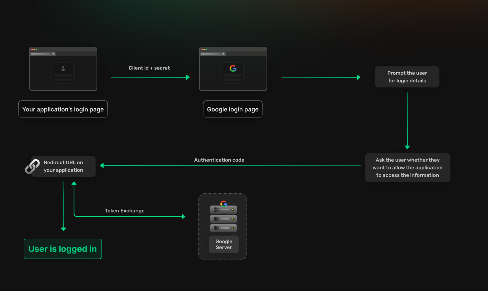

```toc
tight: true
toHeading: 3
```

Social login has become a popular choice for modern apps looking to streamline the user authentication process. It allows users to log into applications using their existing accounts from platforms like Google, Facebook, or Apple, eliminating the need to create yet another username and password. This method not only simplifies login for users but also boosts engagement and reduces friction during onboarding.

In this blog, we’ll explore what social login is, how it works, its benefits and drawbacks, and the challenges of implementing it. We’ll also discuss how tools like SuperTokens can help simplify the process, making it easier for product owners and startup founders to enhance their app’s user experience.

## What is Social Login?

Social login is an authentication method that allows users to log into applications or websites using their existing accounts from platforms like Google, Facebook, or Apple. Instead of creating and managing a separate username and password, users can authenticate with their social accounts, making the process quicker and more convenient.

Most modern web and mobile apps use social login to make the login journey as friction free as possible and enhance user experience as a whole. 


## How Does Social Login Work?

From a user's perspective social login works using the following steps:
- On your app, the user chooses one of the social providers available
- The user is then redirected to the social provider's website where they enter their credentials
- Once the provider verifies the user, they redirect them back to your application
- The user is now logged in and can use the application

From the perspective of the application there are a few things happening behind the scenes:
- When the user is redirected to the provider, your application must provide some sort of client identifier so that the social provider knows which application the user originates from
- When the social provider redirects the user back to your application it usually includes some sort of token that can be used to fetch idenitity information about the user.
- For sensitive applications, the providers token can also be used to fetch if the user's email has been verified

Most social login providers use OAuth 2.0 as the protocol for their login flows, the flow works similarly to the one explained above but there are a few protocol specific nuances. Let us consider Google login as an example:



- **Configuration**: You first configure your client on Google's dashboard, here Google provides you with a client id and secret and let's you configure the URL to which the user should be redirected to after logging in.
- **Redirecting to Google**: The user clicks the Google login button on your application and is redirected to Google's login page. You provide your client id and secret (if required) to Google when redirecting the user. This allows Google to verify the application the user is coming from and also helps them know where to redirect the user to after the log in.
- **Permissions and scopes**: The user enters their credentials and is then prompted to allow your application to access information specific to them. Oauth 2.0 includes a concept known as `scopes`, these scopes allow applications to request access to certain information about the user such as their name or phone number. Google allows user's to review these permissions before allowing your application access to them.
- **Redirection back to your app**: When the user is redirected back to your application, Google provides you some way of identifying if the operation succeeded. If it did it involves an authorization code to your application as part of the query parameters in the URL. 
- **Token exchange**: Your application can use the authorization code to exchange an access and refresh token from Google. This access token can be used to fetch user information. Note that the access token decides what scopes you are allowed to use, if you change the scope of an already logged in user you must refresh their session or ask them to log in again before being able to access that information.
- **Fetch user information**: The access token can be used to fetch any user specific information that you require. At this point you can also check if the user's email is verified and respond to it accordingly.

At this point the user is logged in and can be allowed to use your application.

The [official Oauth documentation](https://oauth.net/2/) covers a much more in depth explanation of key concepts related to Oauth 2.0 and its implementation.

## Popular Providers for Social Login

### Google

Google’s social login is widely used because of its extensive reach and robust security features. It supports OAuth 2.0 and OpenID Connect, making it a reliable option for authentication.

Refer to their [official documentation](https://developers.google.com/identity/sign-in/web/sign-in) to learn more.

### Facebook

Facebook’s login service provides access to a broad user base and allows apps to gather additional data like user interests and social connections (with user permission).

Refer to their [official documentation](https://developers.facebook.com/docs/facebook-login/) to learn more.

### Apple

Apple’s “Sign in with Apple” is focused on privacy and security. It gives users the option to hide their email addresses and creates unique, app-specific IDs.

Refer to their [official documentation](https://developer.apple.com/sign-in-with-apple/get-started/) to learn more.

### Twitter

Twitter’s social login is useful for apps targeting an audience that frequently engages with Twitter. It enables authentication along with access to basic profile information.

Refer to their [official documenation](https://docs.x.com/resources/fundamentals/authentication/guides/log-in-with-x) to learn more.

### LinkedIn

LinkedIn’s social login is ideal for professional or job-related apps, as it allows access to a user’s professional profile data.

Refer to their [official documentation](https://learn.microsoft.com/en-us/linkedin/consumer/integrations/self-serve/sign-in-with-linkedin) to learn more.

## Benefits of Using Social Login

- **Convenience**: Users don’t need to remember another set of credentials. They can log in with one click.
- **Faster Onboarding**: Eliminates the need for lengthy registration forms.
- **Improved Security**: Reduces the risk of weak passwords and reusing credentials across multiple apps.
- **Higher Conversion Rates**: Simplified login processes increase the likelihood of users completing onboarding.

## Downsides of Using Social Login

- **Dependency on Third-Party Services**: If a social provider goes down, your login system might be affected.
- **Data Privacy Concerns**: There have been several incidents with data leaks for major social providers because of lack of security from applications offering social login. As a result users may be hesitant to link their social accounts with your application.
- **Limited Accessibility**: Not all users have accounts with major social providers.
- **Integration Complexity**: Implementing social login requires managing OAuth flows and handling tokens securely. Further as the protocols evolve and new standards are set, there is a maintainance overhead when it comes to building social login.

## Challenges in building social login from scratch

Building social login from scratch involves several steps and nuances:

- **Web Redirection Flow**: When a user initiates social login, they are redirected to the social provider for authentication and then back to your app with an authorization code. Handling these redirections and ensuring session continuity can be complex.
- **Mobile Token Exchange Flow**: On mobile, the process involves obtaining an authorization code and exchanging it for tokens via API calls. This requires secure token storage and error handling.
- **Credential Management**: Developers must handle client IDs, client secrets, and redirect URIs securely.

## How SuperTokens Simplifies Social Login

SuperTokens offers a comprehensive solution to the complexities of implementing social login. Here’s how it helps:

- Pre-Built UI: Ready-to-use components for adding social login options in your app. These include components that handle redirecting to and from social providers, token exchange, verifying emails etc
- Simplified Integration: SuperTokens provides ready to use APIs to allow building social login with custom UI quickly and easily.
- Secure Token Management: Provides tools for secure storage and management of access and refresh tokens.
- Support for popular frameworks: SuperTokens provides SDKs for most popular frameworks such as Node, Golang on the backend and React or Next on the frontend.

For detailed steps on how SuperTokens simplifies social login, visit their [documentation](https://supertokens.com/docs/authentication/social/introduction).

----------------------

Social login is a powerful tool for improving user experience and simplifying authentication. While it offers many benefits, it comes with its own set of challenges. By leveraging solutions like SuperTokens, you can overcome these hurdles and implement social login efficiently, giving your users a seamless and secure experience.