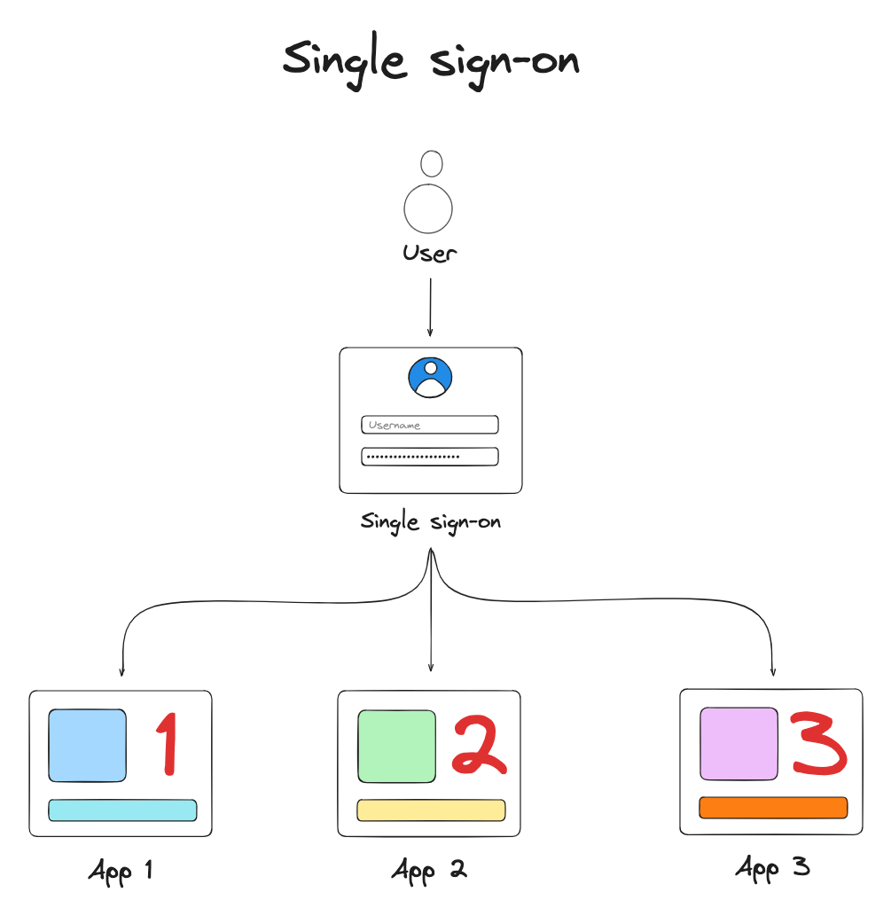
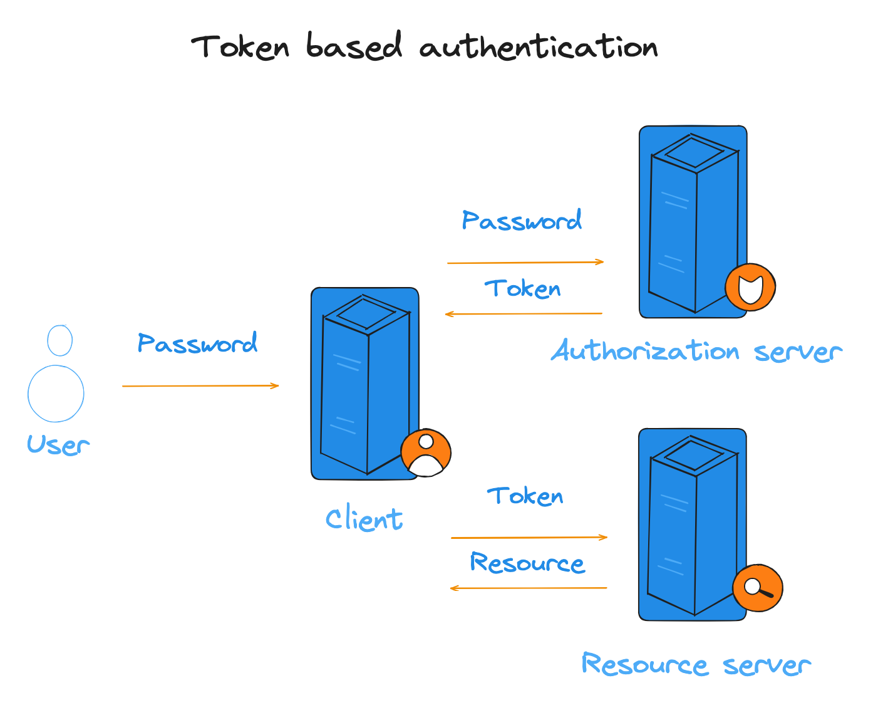
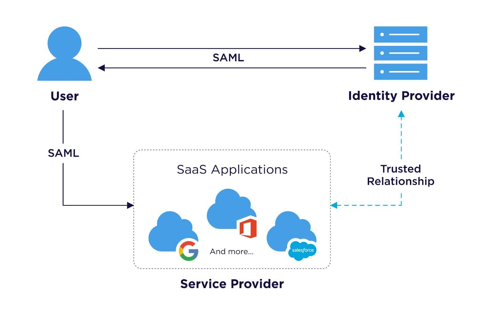
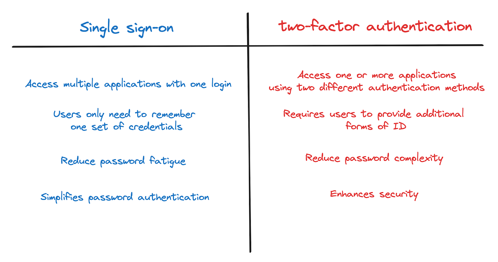

## Table of Contents
1. [What Is SSO Authentication & How Does It Work?](#what-is-sso-authentication--how-does-it-work)
   - [OpenID Connect](#openid-connect)
   - [SAML](#saml)
   - [OAuth](#oauth)
2. [What is token-based authentication?](#what-is-token-based-authentication)
3. [What is an Identity Provider (IdP)?](#what-is-an-identity-provider-idp)
4. [SSO Authentication & User Experience](#sso-authentication--user-experience)
   - [User benefits](#user-benefits)
   - [Organization benefits](#organization-benefits)
5. [2FA vs. SSO Authentication: What's The Difference?](#2fa-vs-sso-authentication-whats-the-difference)
   - [Purpose](#purpose)
   - [Implementation](#implementation)
   - [Key differences](#key-differences)
6. [When To Use SSO Authentication In A Security Flow](#when-to-use-sso-authentication-in-a-security-flow)
   - [Common use cases](#common-use-cases)
   - [Factors influencing the decision to implement Single Sign-On (SSO)](#factors-influencing-the-decision-to-implement-single-sign-on-sso)
7. [Is SSO Secure?](#is-sso-secure)
8. [Conclusion](#conclusion)

## What Is SSO Authentication & How Does It Work?

Single sign-on (SSO) is an authentication service that allows users to access multiple applications with a single set of login credentials, such as a username and password. This service simplifies credential management for both organizations and individuals, making it easier to handle multiple accounts.

There are different protocols employed with SSO, including OpenID, SAML, and OAuth. When integrated with SSO, these protocols help provide a more seamless, secure, and comprehensive authentication solution.

Here’s a brief overview of each protocol:

**OpenID Connect:** is an identity layer built on top of the OAuth 2.0 protocol. It allows clients to verify the identity of a user based on the authentication performed by an authorization server, as well as to obtain basic profile information about the user.

**SAML:** is an XML-based framework for exchanging authentication and authorization data between parties, in particular, between an identity provider (IdP) and a service provider (SP).

**OAuth:** is an authorization framework that enables applications to obtain limited access to user accounts on an HTTP service, such as Facebook, GitHub, or Google. It is often used in conjunction with OpenID Connect for authentication.

### What is token-based authentication?

Token-based authentication is a security protocol that generates encrypted tokens to verify user identity on websites. When a user logs in, the website generates a unique encrypted authentication token. This token allows the user to access protected pages and resources for a set period without needing to re-enter login credentials.

Here’s how token-based authentication works in five steps:

1. **Request:** The user logs in with their credentials, sending an access request to the server or protected resource.
2. **Verification:** The server checks the login information, confirming the username and password match.
3. **Token Generation:** Upon successful verification, the server creates a secure, signed authentication token for a specified duration.
4. **Storage:** The token is sent back to the user's browser, which stores it. When the user navigates to other pages or sites, the token is decoded and verified, granting access if it matches.
5. **Expiration:** The token remains valid until the user logs out or closes the browser, at which point it expires.

The goal of such a process is to provide a secure and efficient way to manage user authentication across multiple web sessions.

### What is an Identity provider (IdP)?

An Identity Provider (IdP) is a system responsible for creating, managing, and verifying digital identities. It authenticates users using their credentials (like usernames and passwords) and provides this authentication information to third-party Service Providers (SPs) such as applications and websites.

The IdP acts as a central hub in Identity and Access Management, ensuring users can securely access various services. By decoupling user authentication from service access, IdPs enable users to log in through a preferred provider, while SPs can manage access levels based on the IdP used for authentication. This process enhances security and simplifies the user experience across multiple platforms.

## SSO Authentication & User Experience

### User benefits

SSO authentication improves user experience as with only a single login, users can seamlessly move between different applications without repeated logins, hence providing a smoother and more efficient experience.

Additionally, users only need to remember one set of credentials to access multiple applications, reducing the hassle of managing different usernames and passwords for each service.

This is particularly beneficial in e-commerce, where studies show that [18.75%](https://www.loginradius.com/blog/identity/benefits-single-sign-on-sso/) of users abandon their shopping carts due to forgotten passwords or password reset issues​.

SSO is also time-saving as it reduces the time spent logging in to multiple services, allowing users to be more productive.

### Organization benefits

In addition to benefiting users, SSO also benefits organizations as well. These benefits include:

1. **Enhanced Security:**
   - **Centralized Authentication:** With centralized authentication, security policies can be enforced consistently across all connected applications.
   - **Reduced password fatigue:** SSO reduces the risk of password reuse across multiple services, enhancing security. By needing only one login, users avoid "password fatigue" and the associated risks of compromised passwords across services.

2. **Simplified User Management:** User accounts can be created or removed from multiple applications simultaneously, simplifying the onboarding and offboarding processes.

3. **Reduced IT Costs:**
   - **Fewer Helpdesk Calls:** SSO reduces password-related helpdesk requests since users manage only one set of credentials, saving time and potentially boosting business productivity.
   - **Streamlined Processes:** Simplified user authentication and authorization processes reduce the administrative burden on IT departments.

According to Ping Identity, it has been estimated by Gartner that 20-50% of IT help desk calls are related to password issues, with each password reset costing around $70.

4. **Scalability:** SSO systems can scale with the organization's growth, accommodating an increasing number of users and applications without compromising security or user experience.

## 2FA vs. SSO Authentication: What's The Difference?

### Purpose

The purpose of both authentication approaches is completely different. SSO’s primary goal is to improve user convenience by allowing access to multiple applications with a single set of credentials. This simplifies the login process, reducing the need to remember multiple passwords.

It is commonly used in enterprises to streamline access to various corporate applications and services, enhancing productivity and user satisfaction.

On the other hand, 2FA (Two-Factor Authentication) has a primary goal of enhancing security by requiring two forms of verification. So, it simply adds an extra layer of security beyond just a username and password. You can read more about 2FA here.

It protects sensitive accounts and data, so it is particularly implemented in financial services, healthcare, and other industries where data breaches can be highly damaging.

### Implementation

**SSO:**

SSO allows users to authenticate once and gain access to multiple applications without logging in again. That is done by using authentication tokens to manage session information across different services.

SSO workflow looks something like this:

1. The user logs in once through the SSO service.
2. The SSO service issues an authentication token.
3. The user accesses multiple applications, and each application verifies the token with the SSO service.

**2FA:**

2FA requires two separate forms of identification from the user and these usually are:

1. Something they know (a password for example)
2. Something they have ( a mobile device to receive an authentication code for example) or Something they are (like a fingerprint).

Some common methods of 2FA include SMS codes, authenticator apps, biometric verification, and hardware tokens.

2FA workflow looks something like this:

1. The user enters a username and password.
2. The system sends a verification code to the user’s phone or requires a fingerprint scan.
3. The user provides the second factor to gain access.

### Key differences

1. **Security vs. Convenience:**
   - **2FA:** Focuses on enhancing security by requiring multiple verification methods.
   - **SSO:** Focuses on user convenience by reducing the number of logins required.

2. **Integration:**
   - **2FA:** Often implemented as an additional security measure for individual services or accounts.
   - **SSO:** Integrated to provide access to a suite of applications through a single login, often managed by an Identity Provider (IdP).

3. **Authentication Mechanism:**
   - **2FA:** Relies on the presence of a second factor of authentication beyond the password.
   - **SSO:** Relies on the use of authentication tokens to manage user sessions across multiple applications.

While both 2FA and SSO are authentication mechanisms, they serve different primary purposes. Combining both can provide a robust and user-friendly security solution, leveraging the strengths of each approach.

## When To Use SSO Authentication In A Security Flow

In this section, we will mention a few common use cases of SSO and the factors that influence the decision to implement it.

### Common use cases

1. **Enterprise and Corporate Environments**: Employees in a large organization need to access multiple internal applications such as email, HR systems, project management tools, and customer relationship management (CRM) systems. 

SSO simplifies the authentication process, reducing the need for multiple passwords and login procedures, thereby improving employee productivity and satisfaction. It also enhances security by reducing password fatigue and minimizing the risk of password-related breaches.

2. **Education Institutions**: Students, faculty, and staff at universities and schools need to access various educational resources, learning management systems (LMS), library databases, and administrative services.

SSO provides seamless access to all educational tools and resources with a single login, improving the user experience and reducing the administrative burden of password resets and account management.

### Factors influencing the decision to implement Single Sign-On (SSO)

- **Size and diversity of user base**: Organizations with a large and diverse user base benefit significantly from SSO. It simplifies user management and enhances security across numerous applications.

- **User Experience**: For users who need to access multiple applications frequently, SSO greatly enhances the user experience by reducing the number of times they need to log in.

- **Type of application**: For applications that are crucial to business operations such as Customer Relationship Management (CRM) or Enterprise Resource Planning (ERP) systems, SSO ensures reliable and secure access, reducing downtime and enhancing productivity.

- **Security standards and compliance**: Industries with stringent regulatory requirements (e.g., finance, healthcare) benefit from SSO as it helps in meeting compliance standards such as HIPAA, GDPR, and PCI-DSS by enforcing strong authentication policies and centralized access control.

- **Cost**: The initial cost of implementing SSO can be high, especially for large organizations with complex IT environments. This includes the cost of software, hardware, and professional services required for deployment. 

Additionally, Continuous maintenance and support are necessary to ensure the SSO system remains secure and functional. This includes updates, monitoring, and management of user accounts.

## Is SSO Secure?

While single sign-on (SSO) offers users the convenience of accessing multiple applications with one set of credentials, it also poses a security risk for enterprises. If an attacker gains control over a user's SSO credentials, they can potentially access all applications and resources that the user is authorized to use, significantly amplifying the potential damage. This risk is referred to as **Single Point of Failure (SPoF).**

Other than the risk of a Single Point of Failure (SPoF), **credential theft** is a primary concern specific to SSO. Vulnerabilities that can lead to credential theft include:

- Phishing Attacks: Attackers may use phishing techniques to steal SSO credentials, whi- ch can then be used to access multiple systems.

- Weak Passwords: If users employ weak or easily guessable passwords for their SSO accounts, it becomes easier for attackers to compromise these accounts.

- Insider Threats: Malicious insiders with access to SSO credentials can pose a significant risk to the organization.

Here are some strategies to mitigate this risk:

- **Multi-Factor Authentication (MFA)**: Implementing MFA adds an extra layer of security, requiring users to provide additional verification (such as a code from a mobile device) beyond just the password.

- **Strong password policies**: Enforcing strong password policies that require complex and unique passwords can help prevent unauthorized access.

- **User education and phishing awareness**: Regular training and awareness programs can help users recognize and avoid phishing attempts.

## Conclusion

Single sign-on (SSO) simplifies user authentication across multiple applications, enhancing both user experience and security. However, implementing robust security measures is essential to mitigate potential risks associated with SSO.

