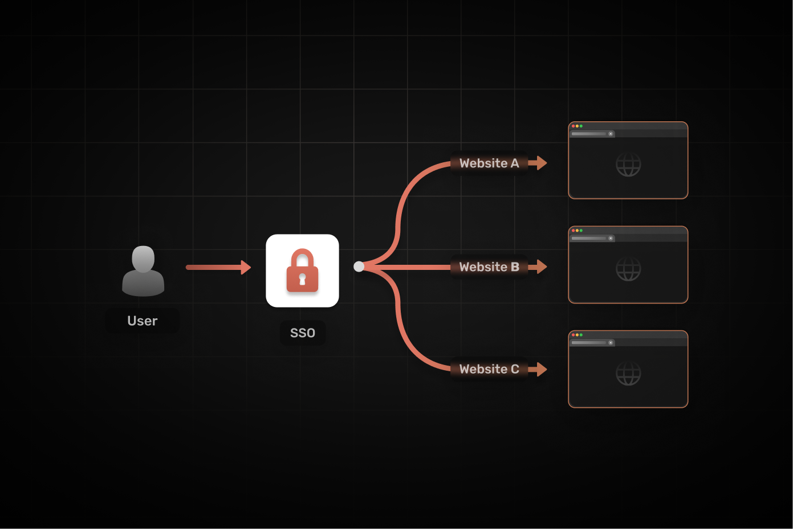

In todays authentication landscape, Single sign-on (SSO) underpins the user management and authentication stratergy for a large number of organizations. In this blog we will break down the SSO, how it works and how you can implement SSO in your organization.

## What is SSO?

Single Sign-On (SSO) allows users to authenticate and access multiple applications with a single set of credentials. This simplifies the user experience by eliminating the need to remember multiple passwords and perform repeated login steps. This in turn, enhances security by reducing the risks associated with weak, reused, or forgotten passwords.

Modern Identity and Access Management (IAM) solutions enable businesses to deploy SSO across a variety of internal applications. Open standards such as OAuth 2.0 and OpenID Connect (OIDC) allow users to authenticate through any identity provider, even those external to the organization. Additionally, contemporary SSO solutions often incorporate social logins, enabling users to sign in using their existing accounts with services like Google, Facebook, or Twitter.

## Key Components of SSO Architecture

Before we jump into the architecture of a modern SSO protocol, we need to understand a few terms.

### Identity Provider (IdP)

The Identity Provider is the system responsible for authenticating users and providing identity information to service providers. Social login providers like Google, Facebook, Github are common identity providers whereas Okta, Google Workspace, and Microsoft Azure AD are commonly used identity providers in the enterprise space. These systems streamline authentication by serving as a centralized hub for managing user credentials.

### Service Providers (SPs)

Service Providers are applications or services that rely on the Identity Provider to authenticate users. Service providers delegate the authentication process to the identity providers, ensuring seamless access for users across multiple systems without requiring them to log in separately for each.

### Authentication Protocols

Authentication protocols facilitate communication between the Identity Provider and Service Providers. The most commonly used protocols include:

- [**SAML 2.0**](https://supertokens.com/blog/demystifying-saml): Best for enterprise-level applications.
- [**OpenID Connect (OIDC)**](https://supertokens.com/blog/openid-connect-vs-oauth2): Lightweight and ideal for modern web and mobile applications.
- [**OAuth 2.0**](https://supertokens.com/blog/oauth): Often used alongside OIDC for authorization purposes.

## How Does SSO Work?

Single Sign-On works by establishing trust between the Identity Provider and Service Providers. Here’s a typical flow:

1. **User Access Request**: A user attempts to access a service provider (e.g., a web application).
2. **Redirect to Identity Provider**: The service provider redirects the user to the Identity Provider for authentication.
3. **User Authentication**: The Identity Provider validates the user’s credentials (e.g., username and password).
4. **Token Generation**: Upon successful authentication, the Identity Provider issues a token (e.g., SAML assertion or JWT).
5. **Token Validation**: The Service Provider validates the token received from the Identity Provider.
6. **Access Granted**: The user is granted access to the Service Provider without needing to log in again.

## 6 Steps to Implement SSO

### Step 1: Define SSO Requirements

Identify your key requirements, such as supported authentication protocols (e.g., SAML or OIDC), user directory integration, and compatibility with existing applications. This will help in selecting the right SSO solution.

### Step 2: Choose an Identity Provider

Select a robust IdP that aligns with your needs. Popular choices include Okta, Auth0, Google Workspace, and Azure AD. Consider factors such as cost, scalability, and ease of integration.

### Step 3: Configure the Identity Provider

Set up your chosen IdP by creating applications or integrations for your service providers. Define user roles, permissions, and mappings to ensure seamless access control.

### Step 4: Integrate Service Providers

Connect your applications to the IdP using authentication protocols like SAML or OIDC. This step involves configuring the service providers to trust the IdP’s token and setting up redirection URLs.

### Step 5: Test the SSO Setup

Conduct extensive testing to ensure the SSO system works as intended. Validate the authentication flow, token generation, and user role assignments for all integrated applications.

### Step 6: Monitor and Optimize

Once implemented, continuously monitor your SSO system for performance and security. Use analytics tools to identify bottlenecks and improve the user experience.

---

## Tools to Implement SSO

**SuperTokens** is A developer-first, open-source solution that simplifies SSO implementation. SuperTokens supports modern authentication protocols like OIDC and provides built-in session management and multi-tenancy support. Unlike traditional solutions, SuperTokens prioritizes flexibility and cost-effectiveness, making it an ideal choice for both startups and enterprises. Its lightweight SDKs and comprehensive documentation allow developers to integrate SSO without the steep learning curve associated with other tools. SuperTokens open-source nature allows you to self-host for free or, you could use the managed serice for a headache free setup and maintenance. 

## Conclusion

In conclusion, Single Sign-On (SSO) offers a seamless and secure solution for managing user authentication across multiple applications. By streamlining the login process and reducing the need for multiple passwords, SSO improves both user convenience and security. Leveraging modern identity and access management systems, along with open standards like OAuth 2.0 and OIDC, businesses can implement a robust authentication framework that integrates internal and external applications. Additionally, the adoption of social logins further enhances the user experience. With the increasing demand for simplicity and security, SSO is becoming an essential tool for organizations looking to optimize access management.
