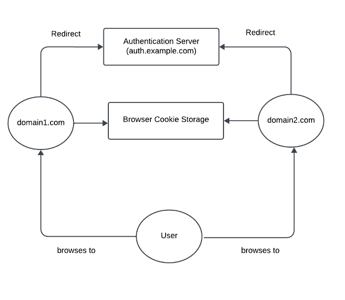

## Table of Contents
1. [Introduction](#introduction)
2. [What is SSO?](#what-is-sso)
3. [Benefits of Implementing SSO in Your Applications](#benefits-of-implementing-sso-in-your-applications)
    - [Simplified User Experience](#simplified-user-experience)
    - [Improved Security for End Users](#improved-security-for-end-users)
    - [Enterprise-Ready](#enterprise-ready)
4. [Common SSO Protocols](#common-sso-protocols)
    - [Open Authorization (OAuth)](#open-authorization-oauth)
    - [Security Assertion Markup Language (SAML)](#security-assertion-markup-language-saml)
    - [OpenID Connect (OIDC)](#openid-connect-oidc)
5. [Key Features to Look for in an SSO Provider](#key-features-to-look-for-in-an-sso-provider)
    - [Integration Capabilities](#integration-capabilities)
    - [Scalability](#scalability)
    - [Customization and Flexibility](#customization-and-flexibility)
    - [Analytics](#analytics)
    - [Open Source](#open-source)
6. [Comparing the Top SSO Providers](#comparing-the-top-sso-providers)
7. [Conclusion](#conclusion)

Single Sign-On (SSO) simplifies the login experience for users while enhancing security. With SSO, users can access multiple applications using a single set of credentials, reducing the need to remember numerous passwords. This not only streamlines the user experience but also mitigates security risks associated with password management.

### What is SSO?

SSO allows users to log into one system and automatically gain access to other related systems without re-entering credentials. When a user logs into an SSO-enabled system (such as Google), their browser stores a token or cookie. When they attempt to access another application that supports the same SSO mechanism, the application verifies the user's identity with the SSO provider, bypassing the need for additional logins.

Implementing SSO can be complex, involving various authentication protocols such as OAuth, SAML, and OpenID Connect. Fortunately, several providers offer ready-made SSO solutions, alleviating the burden of developing and maintaining a custom SSO system.

### Benefits of Implementing SSO in Your Applications

**Simplified User Experience**

SSO greatly enhances user experience by eliminating the need for multiple logins. Users can log into one application and seamlessly access others without re-entering credentials. This not only saves time but also reduces the frustration and fatigue associated with managing numerous passwords.

**Improved Security for End Users**

SSO enhances security by minimizing password proliferation. With fewer passwords to manage, users are less likely to reuse weak passwords across multiple accounts, reducing the risk of breaches. SSO also allows for centralized access control, making it easier to enforce security policies and monitor user activity.

**Enterprise-Ready**

For enterprises, SSO is a crucial feature when evaluating applications. It ensures secure and efficient access management, which is essential for maintaining organizational security and compliance. Offering SSO can make your application more attractive to enterprise customers.

### Common SSO Protocols

**Open Authorization (OAuth)**

OAuth is a widely-used open standard for granting third-party applications limited access to a user's information without exposing passwords. Services like Facebook Login and Google Sign-In utilize OAuth. It allows users to authorize applications to access their data without sharing credentials.

**Security Assertion Markup Language (SAML)**

SAML is an XML-based framework used for exchanging authentication and authorization data between an identity provider and a service provider. It is commonly used in enterprise environments to enable SSO by allowing users to authenticate once and gain access to multiple applications.

**OpenID Connect (OIDC)**

Built on top of OAuth 2.0, OpenID Connect adds an identity layer, enabling applications to verify the identity of users based on authentication performed by an authorization server. It provides additional security by including an ID token and a user info endpoint to validate users and retrieve their information.

### Key Features to Look for in an SSO Provider

Choosing the right SSO provider is crucial for ensuring a smooth and secure authentication process. Here are some key features to consider:

**Integration Capabilities**

A good SSO provider should offer broad integration capabilities, supporting various applications both on-premises and in the cloud. Look for providers that support popular authentication standards like SAML, OAuth, and OpenID Connect. SuperTokens, for example, works with over 25 frameworks, ensuring seamless integration with your existing infrastructure.

**Scalability**

As your organization grows, your SSO solution should scale with it. Ensure that the provider can handle an increasing number of users and applications without compromising performance or security. SuperTokens supports multitenancy, making it ideal for growing businesses.

**Customization and Flexibility**

Different organizations have unique needs, so it's essential to choose an SSO provider that offers customization options. The ability to tailor the authentication process, branding, and user interface to match your organization’s requirements can provide a more cohesive experience. SuperTokens offers extensive customization options, allowing you to modify everything from styling to custom flow logic.

**Analytics**

Comprehensive audit and reporting capabilities are essential for monitoring access and ensuring compliance with regulatory requirements. Look for SSO providers that offer detailed logs, real-time monitoring, and customizable reports. These features help track user activity, identify anomalies, and maintain a clear audit trail.

**Open Source**

Opting for an open-source SSO solution like SuperTokens has several advantages:

- **Transparency**: Open-source solutions allow you to review and audit the code, ensuring there are no vulnerabilities or backdoors.
- **Customizability**: Open-source solutions offer greater flexibility, enabling you to modify the authentication flow and user experience to suit your needs.
- **Community Support**: Open-source projects often have strong community support, providing valuable insights and assistance.

### Comparing the Top SSO Providers

Here's an overview of some leading SSO providers, including SuperTokens, Auth0, AWS Cognito, Keycloak, Clerk, Stytch, FrontEgg, and WorkOS. For each provider, we'll provide a comparative analysis based on features, pricing, support, scalability, and customization.

| Feature                          | SuperTokens               | Auth0                | Firebase Auth              | Cognito                      |
|----------------------------------|---------------------------|----------------------|----------------------------|------------------------------|
| **Open Source**                  | Yes                       | No                   | No                         | No                           |
| **Core Features**                |                           |                      |                            |                              |
| Email/Password Sign-In           | Yes                       | Yes                  | Yes                        | Yes                          |
| Social Login                     | Yes                       | Yes                  | Yes                        | Yes                          |
| Passwordless Login               | Yes                       | Yes                  | Yes                        | Yes                          |
| Multi-Factor Authentication      | Yes                       | Yes                  | Yes                        | Yes                          |
| Session Management               | Yes                       | Yes                  | No                         | No                           |
| **Advanced Features**            |                           |                      |                            |                              |
| Role-Based Access Control (RBAC) | Yes                       | Yes                  | No                         | Yes                          |
| Multi-Tenancy                    | Yes                       | Yes                  | No                         | Yes                          |
| Customizable UI                  | Yes                       | Yes                  | No                         | No                           |
| **Support and Pricing**          |                           |                      |                            |                              |
| Community Support                | Yes                       | Yes                  | Yes                        | Yes                          |
| Paid Support                     | Yes                       | Yes                  | Yes                        | Yes                          |
| Pricing                          | Predictable, flat pricing | Usage-based, complex | Usage-based, simple        | Usage-based, complex         |

### Conclusion

Single Sign-On (SSO) offers numerous benefits, including simplified user experience, enhanced security, and enterprise readiness. When selecting an SSO provider, consider factors such as integration capabilities, scalability, customization, analytics, and the advantages of open-source solutions.

SuperTokens provides an open-source SSO solution with extensive customization capabilities and both paid and free support plans. To learn more about our SSO offering and how to implement it, refer to our official documentation.

By leveraging SSO, you can significantly improve the user experience, bolster security, and position your application as enterprise-ready. Choose a provider that aligns with your organization’s needs and goals to ensure a seamless and secure authentication experience.
