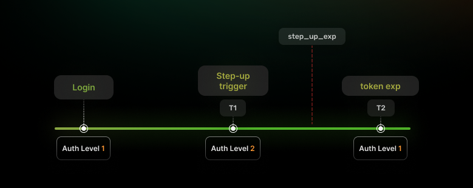
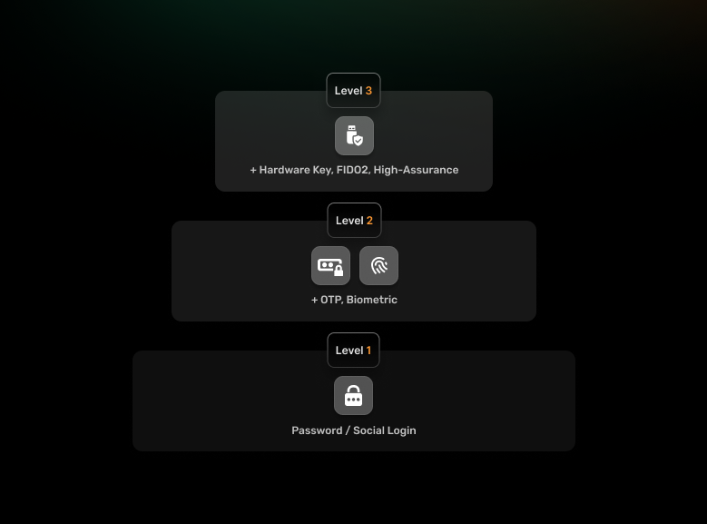

Applying the same level of security to all user actions often creates an imbalance between usability and risk, either overwhelming users with unnecessary authentication steps or exposing sensitive operations to potential threats.

**Step-up authentication** provides a solution by dynamically enforcing stronger verification only when certain risk thresholds are met ensuring that routine tasks remain frictionless while critical actions receive the heightened protection they demand. Solutions such as
[SuperTokens](https://supertokens.com/) streamline this approach by allowing developers to store custom session claims, validate assurance levels via middleware, and orchestrate multiple verification flows in a unified framework.

## **What Is Step-Up Authentication?**

### **Definition**

At its core, step-up authentication is a security mechanism that triggers additional user verification based on the context or risk level of a particular action. It acknowledges that not all activities within an application carry the same level of risk, and therefore shouldn't require the same level of authentication assurance.

### **Purpose**

The primary purpose of step-up authentication is to add stronger verification methods for sensitive operations, while maintaining a smooth user experience for routine activities. This approach is particularly valuable for:

-   Financial applications that process money transfers.

-   Healthcare platforms with protected patient information.

-   Administrative dashboards with system-wide controls.

-   Account management systems where personal data can be changed.

### **Real-World Examples**


Step-up authentication is already part of many digital experiences you encounter daily:

-   Banking apps that require fingerprint verification before completing a wire transfer, even if you're already logged in.

-   E-commerce platforms that ask you to re-enter your password or credit card CVV before finalizing a purchase.

-   Cloud services that send a one-time password (OTP) when you attempt to change account recovery information.

These extra verification steps create a security barrier around your most sensitive actions, so even if someone hijacks your session, they're blocked from sensitive actions unless they can pass the extra security checks.

## **Why Use Step-Up Authentication?**

In a world of increasing cyber threats, implementing step-up authentication offers significant advantages for both security posture and user satisfaction.

### **Reduces Risk for Sensitive Actions**

Not all user sessions require the highest level of identity assurance, but certain actions definitely do. Step-up authentication allows you to implement a tiered security approach where:

-   Regular browsing or viewing activities can proceed with standard login credentials.

-   Medium-risk actions might require password re-entry.

-   High-risk operations demand multi-factor authentication.

This targeted approach means your most vulnerable operations receive appropriate protection, without overburdening the entire user experience.

### **Improves UX Compared to Always High Assurance**

From a user perspective, constantly authenticating with multiple factors creates unnecessary friction. When users encounter security measures that seem disproportionate to the task they're performing, they often:

-   Become frustrated with the application.

-   Look for shortcuts or workarounds.

-   Develop negative attitudes toward security practices in general.

Step-up authentication introduces friction only when justified, thus preserving a smooth experience for most interactions while still protecting what matters most.

### **Compliance and Regulatory Requirements**

Many regulatory frameworks explicitly require elevated authentication for sensitive operations:

- [PCI DSS](https://www.pcisecuritystandards.org/) (Payment Card Industry Data Security Standard) requires additional authentication for accessing cardholder data or making significant changes to payment systems.

- [PSD2](https://www.ecb.europa.eu/press/intro/mip-online/2018/html/1803_revisedpsd.en.html) (Payment Services Directive 2) in Europe mandates strong customer authentication for financial transactions.

- [HIPAA](https://www.cdc.gov/phlp/php/resources/health-insurance-portability-and-accountability-act-of-1996-hipaa.html#:~:text=At%20a%20glance,from%20disclosure%20without%20patient's%20consent.) (Health Insurance Portability and Accountability Act) requires appropriate safeguards for accessing protected health information.

- [GDPR](https://gdpr-info.eu/) (General Data Protection Regulation) mandates appropriate technical measures to protect personal data.

Step-up authentication not only assists organizations in meeting these compliance obligations, but it also addresses real financial risks.
According to a recent [IBM report on data breaches](https://www.ibm.com/reports/data-breach), organizations without elevated authentication controls experienced breach costs up to 42% higher than companies who implement robust security. By implementing step-up authentication, companies can strengthen their security posture effectively, without imposing maximum security measures on every interaction.

## **How Step-Up Authentication Works**



A typical step-up authentication flow follows these key stages:

### **Initial Authentication with Low Assurance**

The user journey begins with standard authentication&mdash;often just a username and password, or perhaps a passwordless method such as magic links via email or social logins. This provides basic identity verification sufficient for general application access.

### **Context Triggers a Risk Check**

As the user navigates the application, certain actions or requests trigger a risk evaluation. This evaluation might consider:

-   The sensitivity of the requested resource.

-   The user's role and permissions.

-   Location and device information.

-   Behavioral patterns or anomalies.

-   Previous authentication methods used.

### **Step-Up Flow Is Initiated**

When the system determines that the current authentication level isn't sufficient for the requested action, it initiates a step-up flow. This typically means:

1.  The user's current action is paused.

2.  A verification prompt appears (modal, redirect, or new screen).

3.  The user is asked to provide additional verification.

4.  The system validates the new authentication factor.

Common step-up methods include:

-   One-time passwords (via SMS, email, or authenticator apps)

-   Biometric verification (fingerprint, face ID)

-   Hardware security keys

-   Knowledge-based answers to security questions

-   [WebAuthn](https://webauthn.io/)/FIDO2 credentials

### **On Success, Sensitive Action Proceeds**

Once the user successfully completes the additional verification, several things happen:

1.  Their session is updated to reflect the higher assurance level.

2.  The originally requested action is allowed to proceed.

3.  The elevated session assurance may persist for a limited time.

4.  The system logs the successful step-up event for audit purposes.

This elevated assurance level might be temporary&mdash;perhaps lasting 15 minutes or until the user closes their browser&mdash;after which any further sensitive actions would require repeating the step-up process.

## **Common Step-Up Triggers**

While each application has unique security requirements, certain actions commonly trigger step-up authentication:

### **High-Privilege Resource Access**

When users attempt to access highly sensitive information such as:

-   Financial statements or transaction histories

-   Personal health records

-   Customer lists or proprietary business data

-   Security settings or private keys

### **Administrative Actions**

System-wide changes that could affect multiple users or core functionality:

-   Adding or removing user accounts

-   Changing system configurations

-   Updating security policies

-   Modifying global settings or preferences

### **Financial Transactions**

Money transfers always warrant extra security:

-   Transferring funds between accounts

-   Making payments to new recipients

-   Changing payment methods or banking information

-   Withdrawing funds above a certain threshold

### **Authentication from New Devices/IPs**

Environmental changes that might indicate account takeover:

-   Login from a previously unused device

-   Access attempts from unusual geographic locations

-   Connection through unfamiliar networks or proxies

### **Elevated API Scopes**

For developer-focused applications or when automating sensitive operations:

-   Transitioning from read-only to write permissions

-   Accessing admin-level API endpoints

-   Performing batch operations affecting multiple accounts

-   Requesting extended token lifetimes or permissions

## **Implementing Step-Up Authentication--Best Practices**

Implementing effective step-up authentication requires thoughtful planning and a systematic approach:

### **Define Risky Actions and Routes**

First, analyze your application to identify operations that warrant additional security. Consider both:

-   **Business risk**: Operations with financial implications, data exposure potential, or compliance requirements.

-   **Technical risk**: Actions that could compromise system integrity or security.

Create a comprehensive inventory of these sensitive routes, endpoints, or actions, and then categorize them by risk level. This mapping will form the foundation of your step-up strategy.

### **Design Authentication Assurance Levels**



Next, establish a clear framework of authentication assurance levels that align with your application's risk profile. A simple approach
might include:

-   **Level 1**: Basic authentication (password, social login).

-   **Level 2**: Level 1 + additional factor (OTP, biometric).

-   **Level 3**: Level 2 + hardware key or advanced verification.

Each level should clearly define what authentication methods satisfy its requirements, and which application areas or actions require that level.

### **Store Authentication Context in Session**

Your authentication system needs to track which assurance level a user has achieved during their current session. This typically involves:

-   Including assurance-level claims in [JWT access tokens](https://jwt.io/introduction/).

-   Storing authentication context in server-side session data.

-   Maintaining cryptographically signed records of completed verifications.

This session context should be tamper-proof and designed to expire appropriately, based on security requirements.

### **Add Conditional Checks to Critical Routes**

Protect your sensitive routes by implementing middleware or guards that verify sufficient authentication before allowing access:

``` js
// Example Express.js middleware checking auth level*

function requireAuthLevel(requiredLevel) {

return function(req, res, next) {

const currentAuthLevel = req.session.authLevel || 1;

if (currentAuthLevel >= requiredLevel) {

// User has sufficient authentication*

next();

} else {

// Redirect to step-up flow*

res.redirect(`/auth/step-up?required=${requiredLevel}&returnTo=${req.originalUrl}`);

}

}

}

// Apply to sensitive routes*

app.post('/admin/users', requireAuthLevel(3),
adminController.createUser);

app.put('/api/payment-methods', requireAuthLevel(2),
paymentController.update);
```

This approach ensures that users can't bypass authentication requirements, even through direct API calls.

### **Implement Step-Up Prompt Flow**

Create a seamless experience for when users need to elevate their authentication level:

1.  Design clear, informative prompts explaining why additional verification is needed.

2.  Offer appropriate authentication methods based on the user's available options.

3.  Handle errors gracefully with specific feedback.

4.  Provide fallback options if the preferred method fails.

5.  Consider accessibility needs for all authentication methods.

The step-up process should feel like a natural extension of the user flow rather than an abrupt interruption.

### **Update Session or Token on Success**

After successful step-up authentication, securely update the user's session to reflect their new assurance level:

```js
// Example session update after successful step-up
function completeStepUp(req, res, authLevel) {

// Update session with new auth level

req.session.authLevel = authLevel;

req.session.stepUpTimestamp = Date.now();

// For JWT-based auth, you might issue a new token

const newToken = generateTokenWithClaims({

...userClaims,

auth_level: authLevel,

step_up_time: Date.now()

});

// Redirect back to original requested route

res.redirect(req.query.returnTo || '/dashboard');

}
```

Consider implementing appropriate timeouts for elevated privileges&mdash;perhaps allowing the higher assurance level to persist for
15-30 minutes before requiring re-verification.

## **How SuperTokens Supports Step-Up Authentication**


Supertokens provides a flexible authentication framework that makes implementing step-up authentication straightforward.

### **Session Context Control**

SuperTokens' session management allows custom session claims to be stored, making it easy to track authentication assurance levels:

```js
// Store auth level in session after step-up

await Session.updateSessionData(sessionHandle, {

authLevel: 2,

stepUpCompletedAt: Date.now()

});

```

These session claims can then be accessed during subsequent requests to determine if the user has sufficient privileges.

### **Custom Claims Validation**

SuperTokens middleware can be extended to check authentication levels before allowing access to protected routes:

``` js // Middleware to verify sufficient auth level

function verifyAuthLevel(requiredLevel) {

return async (req, res, next) => {

let session = req.session;

let currentLevel = session.getSessionData()?.authLevel || 1;

if (currentLevel >= requiredLevel) {

next();

} else {

res.redirect(`/step-up?level=${requiredLevel}&redirect=${req.originalUrl}`);

}

};

}

// Apply to routes needing elevated auth

app.post("/api/payment/transfer", verifyAuthLevel(2), transferFunds);
```

### **Multiple Authentication Flows**

SuperTokens supports various authentication methods, which can be combined to create flexible step-up flows:

-   Password authentication

-   One-time passwords via SMS or email

-   Magic links

-   OAuth/social logins

-   Custom authentication providers

This variety allows implementing the right authentication factor for each security context.

### **Granular Session Control**

SuperTokens provides fine-grained control over session management, enabling implementations to:

-   Create new sessions with elevated privileges.

-   Update existing sessions with additional claims.

-   Set appropriate timeouts for elevated access.

-   Revoke sessions when suspicious activity is detected.

For full implementation details, refer to the [SuperTokens Step-Up Authentication Example](https://supertokens.com/docs/additional-verification/mfa/step-up-auth) in their documentation.

## **Technical Design Patterns for Step-Up Authentication**

When architecting a step-up authentication system, several design patterns have proven effective:

### **Token-Based Sessions**

JSON Web Tokens (JWT) or similar token-based authentication mechanisms work well for step-up authentication because:

-   They can include claims about authentication level and methods.

-   They're cryptographically signed to prevent tampering.

-   They can be verified without database lookups.

-   They can include expiration times for elevated privileges.

A typical implementation might include claims such as:

```json
{

"sub": "user123",

"iat": 1617293982,

"exp": 1617297582,

"auth_level": 2,

"auth_methods": ["password", "otp"],

"step_up_exp": 1617295782

}
```

Note how the step_up_exp (step-up expiration) is earlier than the overall token expiration, allowing the elevated privileges to time out
before the entire session.

### **Session Cookie Updates**

For traditional cookie-based sessions, implement step-up by:

1.  Storing authentication levels in server-side session data.

2.  Updating this data after successful additional verification.

3.  Setting appropriate timeouts for elevated privileges.

4.  Optionally rotating session IDs after significant privilege changes.

Ensure the session data is protected against tampering and that cookies have appropriate security flags (HttpOnly, SameSite, Secure).

### **Frontend UX Strategy**

The user experience of step-up authentication is crucial for adoption:

1.  **Anticipate needs**: If possible, prompt for step-up authentication before the user reaches a protected action.

2.  **Clear communication**: Explain why additional verification is needed.

3.  **Seamless flows**: Use modal dialogs rather than full page redirects, when possible.

4.  **Remember choices**: Offer appropriate "remember this device" options for trusted environments.

5.  **Progressive disclosure**: Only show authentication options the user has previously configured.

### **Granular API Protection**

For applications with extensive APIs, protect sensitive endpoints
through:

1.  **API gateways** that verify authentication levels before routing requests.

2.  **Middleware layers** that check session claims against required assurance levels.

3.  **Scope-based authorization** where elevated scopes require step-up authentication.

4.  **Audit logging** of all sensitive operations and authentication events.

## **Step-Up Authentication vs MFA**

There's often confusion between step-up authentication and multi-factor authentication (MFA). While related, they serve different purposes:

### **MFA = Authentication at Login**

Multi-factor authentication occurs during the initial login process:

-   Typically enforced for all users when they first authenticate.

-   Usually combines something you know (password) with something you have (device, token), or something you are (biometric).

-   Applied universally, regardless of what actions the user intends to perform.

-   Establishes a baseline level of identity assurance for the entire session.

### **Step-Up = Conditional Second Authentication**

Step-up authentication is contextual and triggered by specific actions:

-   Only enforced when attempting sensitive operations.

-   May use additional factors beyond those used during initial log in.

-   Applied selectively, based on risk assessment.

-   Can establish different levels of assurance for different operations.

### **Can Be Used Together**

These approaches complement each other in a comprehensive security strategy:

1.  **Base MFA at login** establishes initial identity assurance.

2.  **Step-up for sensitive actions** adds contextual security.

3.  **Risk-based authentication** can determine when to enforce each.

This layered approach creates defense-in-depth while minimizing unnecessary friction.

## **Challenges and Mitigations**

Implementing step-up authentication introduces certain challenges that require careful consideration:

### **UX Friction**

**Challenge**: Additional authentication steps interrupt user flow and can cause frustration.

**Solution**:

-   Only trigger step-up authentication when genuinely necessary.

-   Clearly explain why additional verification is needed.

-   Remember step-up status for a reasonable period (e.g., 15-30 minutes).

-   Offer biometric options when available, for faster verification.

-   Use contextual triggers that anticipate user needs.

### **Token Misuse or Replay**

**Challenge**: Elevated session tokens might be vulnerable to theft or replay attacks.

**Solution**:

-   Use short-lived tokens for elevated sessions.

-   Implement one-time-use authentication challenges.

-   Bind tokens to device fingerprints when possible.

-   Apply appropriate cookie security controls (HttpOnly, SameSite, Secure).

-   Consider using secure enclaves or TPM for key storage.

### **Session Hijacking**

**Challenge**: Even with step-up authentication, compromised sessions remain a risk.

**Solution**:

-   Pair with device fingerprinting to detect anomalies.

-   Implement location-based verification checks.

-   Apply continuous authentication through behavioral biometrics.

-   Set appropriate session timeouts.

-   Log authentication events for anomaly detection.

## **Conclusion**

Step-up authentication represents an optimal balance between security and usability in modern application design. By applying  additional authentication measures only when justified by risk, applications can maintain strong security postures without creating unnecessary friction.

Key takeaways include:

1.  **Contextual security** adapts to the sensitivity of actions being performed.

2.  **Improved user experience** by removing universal high-friction authentication.

3.  **Regulatory compliance** with frameworks requiring strong authentication for sensitive operations.

4.  **Defense-in-depth** through layered authentication approaches.

As digital threats continue to evolve, step-up authentication provides a flexible framework that can incorporate new verification methods, while maintaining a focus on user experience.

Tools such as SuperTokens make implementation straightforward with session claims, customizable flows, and multi-factor support, allowing
developers to focus on creating secure applications that users actually enjoy using.

By thoughtfully implementing step-up authentication, organizations can protect what matters most while still delivering the seamless experiences users expect in today's digital landscape.
