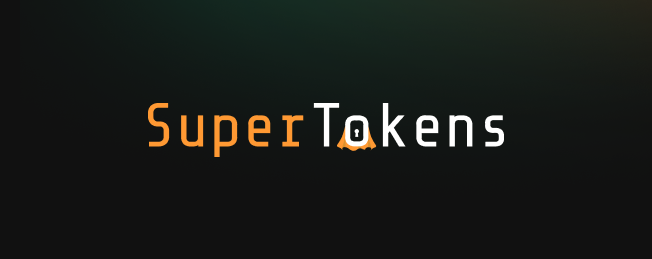
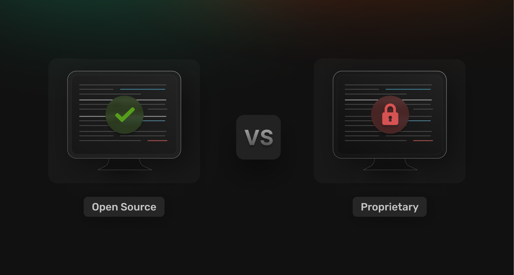

## Table of Contents

1. [Introduction](#introduction)
2. [When To Start Considering Stytch Alternatives](#when-to-start-considering-stytch-alternatives)
3. [3 Stytch Alternatives For More Control Over User Access](#3-stytch-alternatives-for-more-control-over-user-access)
4. [Comparing Flexibility, Features & Pricing: Stytch Alternatives](#comparing-flexibility-features--pricing-stytch-alternatives)
5. [Pros & Cons of Each Alternative](#pros--cons-of-each-alternative)
6. [Open Source vs. Proprietary Authentication Systems](#open-source-vs-proprietary-authentication-systems)
7. [When To Build Your Own Security Flow Or Utilize Ready-Made Software](#when-to-build-your-own-security-flow-or-utilize-ready-made-software)
8. [Take Charge of Your User Access Flow with SuperTokens](#take-charge-of-your-user-access-flow-with-supertokens)

## Introduction

Why is user access management (UAM) important? Well, by implementing effective UAM, organizations ensure that only authorized individuals have access to the appropriate resources, maintaining security and organization. Additionally, effective UAM can protect organizations from cyber attacks, safeguarding their resources and sensitive information.

One of the popular choices for implementing robust UAM is Stytch. However, it may not be the best fit for every organization’s unique needs. In this article, we will explore various alternatives to Stytch, highlighting solutions that provide the features that certain organizations require such as customization and flexibility.

## When To Start Considering Stytch Alternatives

If your current authentication framework lacks in aspects such as sufficient customization, robust security, ease of integration, or has pricing that doesn't fit your budget, it may be time to consider alternative solutions.

According to some Stytch reviews, there are a few issues that users face with the platform, which might push them to seek other alternatives, such as:

### Lack of branding customization

Although Stytch offers a white label feature, some users are disappointed with the limited branding options available. Specifically, the "Powered by Stytch" note that appears in the SSO (Single Sign-On) email can diminish a fully branded user experience. Organizations that prioritize complete control over their branding may find this feature insufficient. They often seek more customizable options to ensure their branding is consistently presented to their users without any third-party mentions.

### Dependency on the Stytch team for problem-solving

While the Stytch support team is known for being highly responsive and helpful, the dependency on them for resolving certain issues can be inconvenient for users. Some problems require intervention from the Stytch team, preventing users from independently troubleshooting and resolving these issues. This reliance can lead to delays and frustration, particularly when an immediate fix is needed. Enhancing user autonomy through a self hosted solution would help alleviate some of these issues while being open source would be the gold standard.

### Limited compatibility

Despite Stytch’s compatibility with most platforms, there are instances where it does not support certain systems. This limitation can restrict its usability for some users who rely on those specific platforms. Organizations with diverse technological ecosystems may find this lack of universal compatibility a significant drawback, as it could necessitate additional integrations or alternative solutions to bridge the gap, adding complexity and potential costs to their setup.

### Limited functionality of the planning board

The planning board feature in Stytch is often criticized for not fully addressing the needs of management. Users find that it lacks the comprehensive capabilities required for effective planning and project management. As a result, they often need to supplement it with additional tools or employ various workarounds to achieve their desired outcomes. This gap can hinder efficiency and complicate workflow integration, leading to frustration among management teams who expect a more robust planning solution from the platform.

### Lengthy grouping process

The software’s process for grouping items or users can be quite burdensome and time-consuming. This inefficiency can significantly slow down workflow, especially in dynamic environments where quick organization and reorganization are crucial. Users often find themselves spending more time than anticipated on this task, which lowers overall productivity and can lead to delays in project timelines. Streamlining this process would greatly enhance user experience and operational efficiency.

## 3 Stytch Alternatives For More Control Over User Access

### SuperTokens

SuperTokens is an open-source, developer-friendly authentication solution known for its exceptional customizability. Its flexibility makes it ideal for developers who need to extensively customize authentication flows, user interfaces, and workflows. Its open-source framework and developer-friendly design would appeal to organizations looking for transparency and control over their authentication systems.

Additionally, SuperTokens' customizability provides a unique approach to access management, allowing developers to tailor access controls precisely to their needs, seamlessly integrating with features like session management and [multi-factor authentication](https://supertokens.com/blog/mfa-best-practices).

### Auth0

Auth0 is a comprehensive identity management platform known for its extensive integrations, robust security, and extensibility. It supports various authentication methods, including [social logins](https://supertokens.com/blog/adding-social-login-to-your-website-with-supertokens) and MFA, and offers advanced user management and analytics. Auth0 excels in providing a highly customizable and flexible user access control system.

 Its extensive integrations simplify implementation and scaling, while its robust security features ensure the protection of user data. Additionally, Auth0’s extensibility enables developers to create tailored authentication solutions, making it an excellent choice for complex enterprise environments.

### Firebase Authentication

Firebase Authentication is one of the comprehensive tools in the Firebase suite offered by Google. Its key features include seamless integration with [Google’s ecosystem](https://medium.com/@rajputmuhammadali096/google-ecosystem-over-for-apple-ecosystem-a-comprehensive-guide-f4374adaec4f), cross-platform support, and developer-friendly user management. It offers moderate customization options, allowing developers to tailor the [authentication UI](https://supertokens.com/blog/creating-great-authentication-experiences-with-custom-ui) and flows. Firebase Authentication is a suitable alternative for startups and small to medium-sized applications that need quick, reliable, and scalable authentication solutions, especially when integrated with other Firebase services.

## Comparing Flexibility, Features & Pricing: Stytch Alternatives

In this section, we will compare the key features, flexibility, and pricing of Stytch with its alternatives, along with a detailed discussion of the pros and cons of each alternative.

### Key Aspects

| Key Aspects                    | Stytch                            | SuperTokens                              | Auth0                                          | Firebase Authentication          |
|--------------------------------|-----------------------------------|------------------------------------------|------------------------------------------------|-----------------------------------|
| Top Authentication Methods     | Passwordless, Multi-factor authentication (MFA) | Email/password, social logins, passwordless | Social logins, MFA, Passwordless                | Email/password, social logins, phone number |
| Security                       | High security                     | Very high security                        | Very high security                              | High security                     |
| Session Management             | Secure session management         | Advanced session management               | Advanced session management                     | Standard session management       |
| Advanced Features              | Advanced security features        | Flexible RBAC, Multi-Tenancy, MFA              | Extensive security features, adaptive MFA, RBAC | Integration with other Firebase services |
| Developer Support              | Developer-friendly API and documentation |Extensive Community support with the option paid dedicated support             | Extensive support and documentation             | Integrated with Google services   |

### Flexibility

| Flexibility                    | Stytch                            | SuperTokens                              | Auth0                                          | Firebase Authentication          |
|--------------------------------|-----------------------------------|------------------------------------------|------------------------------------------------|-----------------------------------|
| Customizability                | High customizability              | Highest customizability                      | Very high customizability                       | Moderate customizability          |
| Integration Options            | Good integration options          | Extensive integration options             | Very extensive integration options              | Seamless integration with Firebase ecosystem |
| Scalability                    | Scales well with usage            | Excellent scalability                | Excellent scalability                           | Excellent scalability             |

### Pricing

| Pricing                        | Stytch                            | SuperTokens                              | Auth0                                          | Firebase Authentication          |
|--------------------------------|-----------------------------------|------------------------------------------|------------------------------------------------|-----------------------------------|
| Free Tier                      | Free tier available with basic features | Self-hosted version free for an unlimited number of users/ managed service is free upto 7,000                  | Free tier with basic features                    | Free tier with generous usage limits |
| Scalability Costs              | Scales with active users and additional features | Managed service pricing, additional enterprise features | Costs scale with active users and enterprise features | Costs increase with higher usage of Firebase services |

## Pros & Cons of each alternative

### SuperTokens

**Pros:**
- **Open Source:** Being open-source, SuperTokens offers transparency, community contributions, and no vendor lock-in.
- **High Customizability:** Allows extensive customization of authentication flows, user interfaces, and workflows.
- **Modular Architecture:** Developers can choose only the components they need, reducing complexity and improving performance.
- **Native Integration:** SuperTokens architecture is unique in that it integrates directly into your application. Login forms are hosted on your frontend and all auth requests are routed through your server. This gives you complete control over all authentication flows.
- **Developer-Friendly:** Comprehensive documentation and community support make it easy to implement and troubleshoot.

**Cons:**
- **Ecosystem:**: SuperTokens currently supports the [following SDKs](https://supertokens.com/docs/community/sdks).
- **Enterprise Features:** Some advanced features like an SuperTokens being an OAuth Service and anomaly detection are currently not available but are being worked on.

### Auth0

**Pros:**
- **Extensive Integrations:** Supports a wide range of authentication methods and integrates easily with many third-party applications and services.
- **Robust Security:** Offers advanced security features, including anomaly detection, breach detection, and comprehensive threat protection.
- **High Customizability and Extensibility:** Allows deep customization of authentication and authorization flows using Rules, Hooks, and Actions.
- **Enterprise-Ready:** Designed to handle large-scale, complex enterprise environments with high security and compliance requirements.
- **User Management and Analytics:** Provides advanced tools for user management, role assignment, and detailed analytics.

**Cons:**
- **Cost:** Can be expensive, especially for large-scale implementations with many users.
- **Complexity:** The wide range of features and customization options can make the initial setup and management complex.
- **Vendor Lock-In:** Heavy reliance on Auth0’s infrastructure can lead to challenges if you decide to switch providers.

### Firebase Authentication

**Pros:**
- **Integration with Google Ecosystem:** Seamlessly integrates with other Firebase and Google Cloud services, providing a comprehensive backend solution.
- **Ease of Use:** Developer-friendly with well-maintained SDKs for web, Android, and iOS.
- **Variety of Authentication Methods:** Supports email/password, social logins, phone number authentication, and anonymous authentication.
- **Scalable:** Designed to scale easily with usage, benefiting from Google’s infrastructure.
- **Generous Free Tier:** Offers a free tier with generous usage limits, making it cost-effective for startups and small projects.

**Cons:**
- **Moderate Customizability:** While it offers customization, it’s not as flexible as SuperTokens or Auth0 in terms of deep customization of authentication flows and user interfaces.
- **Dependency on Google Ecosystem:** Best suited for applications already leveraging Firebase and Google Cloud services; less ideal for those using other ecosystems.
- **Limited Enterprise Features:** May lack some advanced enterprise features and integrations that are available in platforms like Auth0.

## Open Source vs. Proprietary Authentication Systems

Let's start by explaining the difference. Open source refers to software and technology that are freely available for anyone to use, modify, and often distribute. Proprietary technology, on the other hand, is protected by copyright and requires a license for use.

Let’s now discuss the advantages of each:

### Advantages of Open Source

- **Flexibility:** Open-source software allows for extensive customization. You can modify the code to meet specific needs and tailor the system exactly how you want without restrictions.
- **Control:** You have total control over the system. This includes the ability to change the code, control access, and manage data without being bound by external licensing restrictions.
- **Cost:** Open-source software is typically free. You only pay for technical infrastructure like hosting and the personnel needed to manage and customize the system.
- **Community Support:** Open source projects often have strong community support, with active forums, documentation, and shared resources that can help solve problems and improve the software.

### Advantages of Proprietary Systems

- **Ease of Use:** Proprietary systems are usually more turnkey, offering a simpler setup process and user-friendly interfaces, which can be more convenient for quick deployment.
- **Dedicated Support:** Proprietary software often comes with dedicated customer support, ensuring that you have access to help when needed, rather than relying solely on community forums and online resources.
- **All-in-One Subscription:** Many proprietary SaaS platforms include everything needed for operation, such as hosting, maintenance, and updates, often simplifying the overall management.
- **Integration and Reliability:** Proprietary systems are designed to work seamlessly with other products and services from the same vendor, ensuring reliable performance and compatibility.

### When to Choose One Over the Other

Choose open source if you need high flexibility and control over your software and have the technical expertise to manage and customize it. It is also ideal for projects with specific, unique requirements that cannot be met by off-the-shelf solutions. Furthermore, an open-source framework is suitable for organizations with limited budgets, as it is typically free.

Choose proprietary systems if you prioritize ease of use and need a quick, hassle-free setup. They are best for those who require reliable, dedicated customer support and are suitable for projects that benefit from integrated solutions and do not need extensive customization. Proprietary systems are also ideal for businesses that prefer a predictable, all-in-one subscription model, including hosting and maintenance.

By assessing the specific needs and constraints of your project, you can decide whether the flexibility and control of open source or the convenience and support of proprietary systems are the better fit.

## When To Build Your Own Security Flow Or Utilize Ready-Made Software

In this section, we will discuss the benefits and drawbacks of building your own security flow, as well as the advantages of using ready-made software, to help you decide which option is best for you.

### Benefits of Building a Custom Authentication System:

- **Full Control:** Tailor solutions to specific needs with complete control over authentication flow, security measures, and data management.
- **Customization:** Implement unique features and integrations not available in off-the-shelf solutions.
- **Scalability:** Build a system that scales according to your specific requirements.
- **Security:** Apply the latest security standards and practices.

### Challenges of Building a Custom Authentication System:

- **Development Time:** Requires significant time and resources.
- **Maintenance:** Ongoing maintenance and updates are resource-intensive.
- **Cost:** Initial development and continuous maintenance can be costly.
- **Complexity:** Requires deep expertise in security and software development.

### Advantages of Using Solutions Like Stytch or Its Alternatives:

- **Ease of Implementation:** Quickly integrate reliable authentication services.
- **Security:** Includes up-to-date security features and compliance with industry standards.
- **Support and Maintenance:** Providers offer dedicated support and regular updates.
- **Scalability:** Efficiently handle varying user loads.
- **Cost-Effective:** More cost-effective than custom development for small to medium-sized businesses.

### Key Factors to Consider When Deciding Between Custom and Ready-Made Solutions

When deciding between a custom solution and a ready-made solution, consider the following: Custom solutions offer complete control and tailor-made features but come with higher costs, longer development times, and require skilled developers. Ready-made solutions are quicker to implement, cost-effective, and come with built-in security and compliance, making them ideal for standard needs and smaller organizations. They are scalable, flexible, and supported by providers, ensuring reliability and ease of use.

## Take charge of your user access flow with Supertokens

SuperTokens stands out among the alternatives due to its high customizability, open-source nature, and modular architecture. It allows developers to extensively tailor authentication flows and user interfaces while providing robust security features and seamless integration with various tech stacks. For flexible and secure user access management, we encourage readers to explore SuperTokens and discover its powerful capabilities.
