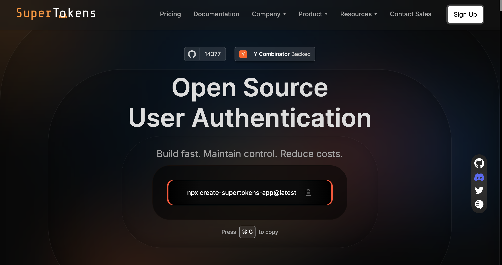

Today’s developers don’t just want authentication to work&mdash;they expect it to be fast, secure, and frictionless out of the box. Stytch understands that. As a modern identity platform built with developers in mind, it strips away the clutter and delivers essential building blocks for authentication and access&mdash;OAuth, SSO, RBAC, device fingerprinting, fraud protection, and more&mdash;without locking core functionality behind enterprise gates.

One of Stytch’s strongest selling points is its generous free tier. Teams can onboard up to 10,000 monthly active users (MAUs), create unlimited organizations, and run up to five SSO or SCIM connections&mdash;all without paying a cent. That includes built-in multi-tenancy, JIT provisioning, M2M tokens, and admin UI components, giving you a full-featured identity layer from day one.

But what happens as your usage grows? Unlike traditional pricing models that hide costs in tiers or sales calls, Stytch keeps it straightforward: usage-based billing with predictable, transparent pricing. Whether you’re experimenting in development or scaling in production, you know exactly what you’re paying for&mdash;and when.

In this guide, we’ll break down Stytch’s pricing structure, explore real-world scenarios, uncover hidden costs, and compare it to other major players like Auth0 and Okta&mdash;so you can make an informed decision with no surprises.

## What Is Stytch and How Does It Price?

Stytch is an identity platform purpose-built for developers who want authentication to feel modern, flexible, and secure&mdash;without the overhead of managing it all from scratch. Instead of traditional login flows that rely on passwords and brittle session logic, Stytch offers a suite of tools that prioritize user experience and security side by side.

At its core, Stytch provides a robust API and SDK layer for:

- Passwordless login (magic links, OTPs, biometrics)
- Social and Web3 wallet-based sign-ons
- Secure session management
- Built-in fraud prevention and multi-factor authentication (MFA)
- Enterprise features like SSO, SCIM, and RBAC

From a developer’s perspective, it’s like plugging in a ready-made identity layer that:

- Scales from MVP to enterprise
- Supports complex B2B use cases
- Enables multi-tenancy and granular access policies

### A Developer-Friendly Pricing Model

What makes Stytch stand out isn’t just the feature set — it’s how those features are priced. The platform offers a genuinely useful free tier, covering up to:

- 10,000 monthly active users (MAUs)
- Unlimited organizations
- 5 SSO or SCIM connections
- 1,000 machine-to-machine (M2M) tokens

This baseline includes full access to authentication and authorization features like OAuth, RBAC, and session control — so teams can build and ship real products without hitting arbitrary paywalls.

Beyond the free tier, pricing is **usage-based and predictable**:

- $0.10 per additional MAU
- $125 per additional SSO or SCIM connection
- $0.005 per device fingerprint
- $99/month to remove email branding

There are no artificial tier cliffs&mdash;just linear [pricing](https://stytch.com/pricing?vertical=b2b) that scales with your usage.

### Annual Contracts for Scaling Teams

For larger or production-scale projects, Stytch offers pre-negotiated contracts through [AWS Marketplace](https://aws.amazon.com/marketplace/pp/prodview-mk7ac2kpntwec) and other channels. One example: **$25,000/year for 10,000 MAUs and 5 SSO/SCIM connections**, with overage pricing kicking in beyond those thresholds. This model lets teams lock in predictable costs while maintaining flexibility to scale as needed.

It’s also worth noting that Stytch’s pricing doesn’t include infrastructure costs — if you’re deploying via AWS, those will be billed separately based on your stack and usage patterns.

In short, whether you’re testing an early prototype or rolling out authentication for enterprise tenants, Stytch’s pricing model is designed to stay transparent, flexible, and aligned with actual usage — no sales calls required.

## A Breakdown of Stytch Pricing Tiers

Stytch keeps pricing simple: a generous free tier to start, then transparent pay-as-you-go rates as you scale. Here’s how it breaks down:

|Feature / Limit|Free Tier|Pay-As-You-Go|Enterprise (via AWS Contract)|
|---|---|---|---|
|**Monthly Active Users**|Up to 10,000|$0.10 per additional MAU|10,000 MAUs included in $25K/year base|
|**SSO / SCIM Connections**|5 included|$125 per additional connection|5 included in contract, overages apply|
|**Machine-to-Machine Tokens**|1,000 included|$0.005 per additional token|Custom volume included based on agreement|
|**Device Fingerprints**|10,000 included|$0.005 per fingerprint|Volume-based pricing available|
|**Email Branding**|Stytch-branded|$99/month to remove|Included|
|**Organizations / Tenants**|Unlimited|Unlimited|Unlimited|
|**RBAC / SCIM / SSO Support**|Included|Included|Included|
|**Support**|Community, docs, email, forum, unlimited dashboard seats|Community, docs, email, forum, unlimited dashboard seats|Dedicated support (Slack), enterprise SLA, migration help|
|**Custom Infrastructure / SLA**|❌|❌|✅|

## What Does Stytch Actually Cost? (Real-World Examples)

Stytch’s pricing model is designed to scale with usage — but how does that translate to actual monthly or annual spend? Let’s walk through a few practical scenarios.

### Example: 20,000 MAUs per month

For a team handling 20,000 monthly active users (MAUs), the first 10,000 are always free. The remaining 10,000 are billed at $0.10 each, bringing the monthly total to:

- 10,000 extra MAUs × $0.10 = $1,000/month

This makes the pay-as-you-go model predictable and easy to forecast as your user base grows.

### AWS Self-Serve Contract

For teams that prefer upfront billing with negotiated terms, Stytch offers a self-serve annual contract through AWS Marketplace. One of the most common bundles includes:

- 10,000 MAUs/month
- 5 SSO or SCIM connections
- $25,000/year flat rate

This covers most scaling SaaS projects and still offers flexibility for overages, which are billed at standard usage-based rates once you exceed the included units.

### Scale plan breakdown

For teams that want predictable pricing without entering an enterprise agreement, Stytch offers a mid-tier option called the [**Scale plan**](https://www.withorb.com/blog/stytch-pricing), priced at **$799/month**. It includes:

- Eight enterprise SSO connections
- Organization-level MFA enforcement
- Increased quotas across users, organizations, and M2M tokens

This is ideal for B2B platforms that are growing steadily and need more control without committing to a full enterprise deployment. It sits above the **Pro plan** ($249/month), which includes 3 SSO connections and allows branding removal.

## Hidden Costs to Watch Out For

Stytch’s pricing is refreshingly transparent, but as with any usage-based model, there are a few cost considerations worth keeping in mind — especially as your app scales or expands into new regions.

### Costs Can Accumulate as Usage Grows

While there’s no required annual minimum or tiered lock-in, it’s still important to understand how costs scale beyond the free tier. For example, removing Stytch branding costs $99/month, and additional usage — such as MAUs beyond 10,000 or extra SSO connections — is billed separately. Many teams will remain well below enterprise pricing, but depending on your scale and authentication needs, monthly costs can rise into the **$500–$1,000 range** without warning if you’re not monitoring usage.

### SMS/WhatsApp Passthrough Fees

If you rely on SMS or WhatsApp for OTP delivery, especially outside the U.S. or Canada, keep an eye on passthrough charges. These are billed at **carrier rates**, and in some regions, they can exceed **$1 per message**. Stytch doesn’t add a markup, but the costs are real and can become significant at scale.

### Separately Billed Add-Ons

Certain features that go beyond the free tier are charged based on volume. These include:

- **Device fingerprints** (first 10,000 free, then $0.005 each)
- **Extra SSO or SCIM connections** ($125 each)
- **Fraud prevention tools** (like CAPTCHA, bot detection, and risk signals)

These aren’t hidden in a misleading sense — they’re clearly listed on [Stytch’s pricing page](https://stytch.com/pricing) — but they’re often overlooked during initial setup. Tracking usage and anticipating these add-ons will help avoid surprise line items later on.

## How Stytch Pricing Compares to Auth0 and Okta

Authentication pricing often looks simple on the surface — until you try to scale. Many teams start with a free tier, only to discover that critical features like MFA or SSO are locked behind costly upgrades. That’s where Stytch sets itself apart.

### More Value in the Free Tier

Stytch’s free tier is designed for real-world production — not just sandbox use. It includes:

- 10,000 MAUs
- 5 SSO and SCIM connections
- Unlimited organizations
- Full access to MFA, RBAC, social login, and SCIM

By contrast, Auth0’s free plan advertises 25,000 MAUs, but:

- MFA, SCIM, and RBAC are locked behind higher-priced tiers
- Even basic production use can trigger a paid upgrade early in your journey

### Linear Pricing vs Steep Usage Cliffs

With Auth0 and Okta, pricing cliffs are a common source of frustration. You might:

- Hit a hard limit (like eight SSO connections) and need a new contract to go further
- Exceed a user threshold by a handful — and suddenly double your bill
- Be forced into “talk to sales” conversations just to scale smoothly

Stytch avoids these pain points with a fully linear, usage-based model:

- No hard caps, no rigid tiers
- Bill scales exactly with usage — 17,001 MAUs = pay for 17,001
- Add just one more SSO connection? You’re only billed for that one

### Full Features at Every Tier

Many enterprise-grade features — like SAML SSO, SCIM, RBAC, and fraud prevention — are hidden behind paywalls in Auth0 and Okta. With Stytch, they’re available from day one, even on the free tier.

This unlocks teams to:

- Prototype faster
- Launch scalable SaaS products
- Build secure internal tools

All without hitting feature walls halfway through implementation.

## Why Teams Choose SuperTokens Over Stytch

While Stytch appeals to teams that want a plug-and-play managed authentication platform with predictable usage-based pricing, some developers prefer an entirely different approach — one that gives them full control over their authentication stack. That’s where [**SuperTokens**](https://supertokens.com/) comes in.

### Self-Hosted and Open Source By Default

SuperTokens takes a different approach to authentication: it’s open source and self-hostable from the start.

This matters for teams that want to:

- **Keep user data within their infrastructure** for privacy, compliance, or security reasons.
- **Customize authentication flows deeply** from backend logic to low-level extensibility.
- **Debug and control the stack** without relying on a black-box hosted provider.

Stytch, on the other hand, is a hosted SaaS platform. They offer:

- High scalability and built-in support
- **No option for self-hosting**
- **No access to source code** for customization

For teams with strict deployment policies or in-house security experience, this difference can be a dealbreaker — and SuperTokens becomes the clear choice.

### Transparent Pricing with Open-Source Flexibility

Both SuperTokens and Stytch offer usage-based pricing with clear per-user costs. The key difference? SuperTokens allows you to self-host. That means:

- You can eliminate hosting fees entirely.
- You only pay if you need enterprise support or choose the hosted cloud version.

Stytch, on the other hand, is hosted by default. Its pricing is predictable and usage-based — but self-hosting isn’t an option, even if you want it.

### Designed for Custom Flows and Control

SuperTokens is often the go-to for teams that want more than just “plug and play.” It’s designed for developers who:

- Need fine-grained control over login flows
- Want to integrate authentication directly into backend logic
- Prefer avoiding lock-in to a managed platform

Stytch, in contrast, focuses on speed and simplicity. It’s optimized for teams that want to move fast with minimal overhead, leaning on proven defaults and seamless scaling.

## Real User Feedback

If there’s one consistent theme across user reviews of Stytch, it’s that the platform just works — and it works well for developers. Teams consistently praise its ease of integration, responsive support, and clear documentation. Whether migrating from a legacy provider or starting from scratch, developers report that Stytch delivers a fast, frictionless experience from prototype to production.

In reviews listed on [AWS Marketplace](https://aws.amazon.com/marketplace/reviews/reviews-list/prodview-mk7ac2kpntwec), users consistently highlight how Stytch balances powerful features with a developer-first interface. Below are the quotes that support this:

> “One of the most successful and easy implementations I have worked on” — *Staff Engineer*

> “Super intuitive auth integration with future-proof features” — *Verified User*

Reviews also frequently mention:

- **Real-world flexibility**: B2B and B2C use cases, session management, role control.
- **Seamless setup**: SSO, MFA, and session management — even in complex, multi-cloud environments.
- **Debug-friendly tooling**: Event logs and visibility during development.
- **Developer-friendly support**: Direct access to the team (including Slack), strong development and admin experience.
- **Cost-effectiveness at scale**: Fewer hours maintaining auth, more time building product.

From these reviews, it’s clear that Stytch gives developers the tools they need to ship faster, scale confidently, and stay focused on what matters.

## Conclusion and Final Comparison

When it comes to authentication, pricing shouldn’t be a guessing game. Stytch sets itself apart from legacy providers like Auth0 and Okta by offering **transparent, usage-based billing** with **no feature gating and no pricing cliffs**. Every team — from early-stage startups to scaling SaaS platforms — gets access to the same powerful toolkit: SSO, MFA, SCIM, RBAC, fraud tools, and more, all available from day one.

For developer-led teams that want a fast path to production and a pricing model that grows with them, Stytch is a strong choice. But for teams that want even more control — including **self-hosting, open-source flexibility**, and **fine-grained custom flows — SuperTokens** offers a compelling alternative.

With SuperTokens, you can build authentication your way, on your stack, with predictable pricing and full access to the source code. Whether you're optimizing for compliance, cost control, or customization, SuperTokens gives your team the building blocks to own your identity layer without compromise.

Ready to take control of your auth? Start with [SuperTokens](https://supertokens.com/) today — explore the [cost estimator](https://supertokens.com/pricing), check out the [migration guide](https://supertokens.com/docs/migration/account-migration), and see how easy it is to build secure, scalable authentication your way.