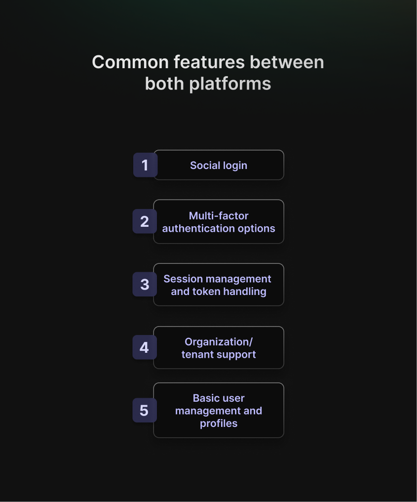
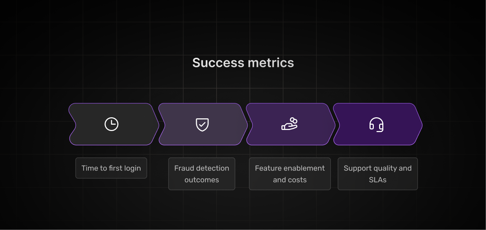

Selecting an authentication provider requires careful consideration of how each platform aligns with your application\'s architecture and business requirements. The [Stytch](https://stytch.com/) vs [Auth0](https://auth0.com/) debate has become one of the most common comparisons in the authentication space, and for good reason &mdash; both platforms serve different needs exceptionally well.

Both approaches have clear value: Auth0 accelerates time-to-market with minimal setup, while Stytch prioritizes customization and control. The right choice depends on whether you need speed and convenience, or long-term flexibility and scalability.

This guide examines what actually matters when evaluating Stytch vs Auth0 for your authentication needs.

## **Stytch vs Auth0: Where Each Fits**

**Stytch** excels when you need authentication that blends seamlessly into your product. Its developer-first approach, modern APIs, and generous free tier (up to 5,000 MAUs) make it especially appealing for teams focused on speed and user experience. Its strongest areas are passwordless authentication and fraud prevention &mdash; powerful features delivered with simplicity.

**Auth0** (now part of **Okta**) is built for scale and complexity. Its enterprise-ready SSO, MFA, and extensive integration ecosystem have been proven across highly regulated industries and global organizations. If your roadmap includes supporting every major identity provider or navigating compliance-heavy authentication flows, Auth0 is hard to beat.

Put simply, **Stytch is the agile innovator optimized for modern apps, while Auth0 is the enterprise** **powerhouse equipped to handle complex identity needs.**

## **Pricing and Packaging Cues to Check**

Pricing structures significantly impact the total cost of ownership as your user base grows.

**Stytch** takes a developer-friendly approach with transparent, usage-based pricing. Its free tier supports up to 5,000 MAUs, and rates actually improve as you scale &mdash; aligning costs with unit economics. In other words, growth is rewarded rather than penalized.

**Auth0**, by contrast, follows a more traditional enterprise model. [Plans often start around \$30,000 per year (\$2,500 per month)](https://dev.to/supertokens/auth0-pricing-the-complete-guide-2022-3oij?), and features you might expect to be standard &mdash; like advanced MFA or custom domains &mdash; are locked in higher tiers. For example, MFA can cost an additional \$100 per month, and exceeding the 100-organization limit adds \$1 per active organization.

Pricing transparency varies between platforms. Organizations scaling from [2,000 to 3,000 MAUs could push monthly costs from $400 to $560 &mdash; a **40% jump for just 50% more users**](https://ssojet.com/white-papers/auth0-pricing-alternatives-comparison/). That's the kind of growth tax that creates unwelcome budget conversations.

**Before committing, run the numbers:**

-   How many MAUs will you realistically have in 6, 12, and 24 months?
-   Which features are absolute must-haves versus nice-to-haves?
-   What happens financially when you outgrow your current tier?

**Pricing Comparison Takeaway**

-   **Stytch:** More predictable, transparent, and startup-friendly.
-   **Auth0:** Broader enterprise coverage, but requires careful contract negotiation.
-   **Best practice:** Before committing, run 3-tier cost simulations (10k, 100k, 1M MAUs) with both vendors.

## **Developer Experience and Integration**

Implementation approach affects both the initial development velocity and the long-term maintenance burden.

**Stytch pushes embedded authentication** by using SDKs and APIs that live inside your application. You get full control over the user experience, which means your login flow can match your brand perfectly. Stytch provides an SDK and components to embed an admin portal directly into your application, avoiding the need to build everything from scratch.

**Auth0\'s Universal Login** defaults to hosted authentication pages. Initial integration proceeds quickly &mdash; configure the SDK, redirect to hosted login pages, and authentication works. However, extensive customization requires working within Auth0\'s hosted page editor, which some development teams find constraining.

The trade-off is real:

-   **Embedded (Stytch style)**: More work upfront, total control over UX.
-   **Hosted (Auth0 Universal Login)**: Faster initial setup, less customization flexibility.

Documentation quality matters too. Auth0\'s customer support has often left developers feeling frustrated and unsupported, with reports of unresponsiveness; while Stytch\'s smaller team tends to be more responsive &mdash; at least for now.

## **Security, Fraud, and Bot Detection**

Both platforms handle the basics well &mdash; encryption, secure tokens, and industry-standard protocols. Where they differ is in the details.

**Stytch emphasizes device fingerprinting and risk telemetry** as alternatives to CAPTCHA challenges. Stytch provides native support for biometric authentication and Web3 login &mdash; features that often require add-ons elsewhere. The fraud detection system operates transparently, identifying suspicious activity without requiring users to complete friction-inducing verification steps.

**Auth0\'s security features** leverage enterprise heritage &mdash; comprehensive MFA options, extensive compliance certifications, and integration with enterprise security infrastructure. Organizations requiring specific compliance attestations for [SOC2](https://secureframe.com/hub/soc-2/what-is-soc-2), [HIPAA](https://www.hhs.gov/hipaa/index.html), or industry regulations will benefit from Auth0\'s documentation and audit capabilities.

The relevant question: What threat model does your application face? Consumer applications concerned with credential stuffing require different tools than B2B platforms managing enterprise SSO integrations.

## **Features You\'ll Actually Use**

Moving beyond marketing materials to examine practical functionality reveals where platforms truly differ.

**Core capabilities** shared by both platforms include:

-   Social authentication (Google, GitHub, and other providers)
-   Multi-factor authentication options
-   Session management and secure token handling
-   Organization and tenant support (with tier-specific variations)
-   User profile management and basic administration

**Platform-specific strengths:**

Stytch focuses on passwordless authentication &mdash; magic links, SMS verification codes, and biometric options. Stytch\'s API-first architecture provides greater developer control, though this sometimes means implementing features that Auth0 includes by default.

Auth0 offers deeper integration breadth &mdash; rules engines, custom actions, database connectors, and enterprise SSO patterns refined over years of production use. Auth0 supports push notifications, voice call verification, Duo integration, and recovery codes for multi-factor authentication on enterprise plans; whereas Stytch requires custom implementation for some of these features.

## **Migration, Lock-In, and Roadmap Checks**

Planning for potential platform changes reduces future complications, even if migration seems unlikely.

**Token and key management strategy** affects migration feasibility. Both platforms use standard JWT tokens, but implementation details &mdash; custom claims structure, token expiration policies, and refresh token handling &mdash; can complicate transitions between providers.

**User data export capabilities** vary between platforms. Verify that you can extract user data in usable formats before committing. Some platforms provide comprehensive export tools, while others require custom scripting or support intervention.

**Branding and user experience control** becomes a lock-in factor when authentication experiences depend on platform-specific features.
Embedded authentication (Stytch\'s approach) generally enables easier migration than heavily customized hosted implementations (Auth0\'s
default).

Consider tracking pricing and feature changes quarterly. Both platforms adjust offerings periodically, and features included in your current tier may migrate to higher tiers or become add-ons. Build renegotiation windows into contracts to maintain flexibility.

## **Quick Scenarios (Choose Your Fit)**

**You\'re a product-led startup with strong design opinions** → Try Stytch first. The embedded authentication approach lets you build
exactly the experience you want, and the free tier supports up to 5,000 MAUs, which covers most early-stage companies.

**You\'re selling to enterprises and need every SSO option** → Auth0\'s proof-of-concept makes sense. Their ecosystem depth and integration library will save you time explaining why you can\'t support some obscure enterprise identity provider.

**You\'re genuinely not sure** → Pilot both platforms with identical success metrics. Measure developer experience, authentication latency, fraud detection effectiveness, and total cost at your projected MAU scale. Real data beats guessing.

## **Open-Source Alternative: SuperTokens**

Here\'s where things get interesting for a specific type of team.

**[SuperTokens](https://supertokens.com/) shows up in these conversations** because it offers something different: open-source authentication that you can self-host or use as a managed service. You get deep customization capabilities, predictable control over your data, and the ability to run everything in your own VPC if regulations or policies demand it.

**When SuperTokens makes sense:**

-   You need custom authentication flows that don\'t fit standard patterns.
-   Data residency requirements mean keeping authentication in-house.
-   You want to avoid SaaS lock-in, but still need modern SDKs, sessions, and MFA.
-   You have the technical capability to manage authentication infrastructure.

SuperTokens won\'t be the right fit for everyone &mdash; managing authentication infrastructure requires expertise and resources. But for teams that value control and transparency, it\'s worth evaluating alongside commercial alternatives.

## **What to Verify in a 2-Week Bake-Off**

Run both platforms through real-world scenarios with actual success metrics:

**1. Time to First Login**

-   How long until you have working authentication in your app?
-   Does embedded versus hosted authentication match your UX requirements?
-   Can non-technical team members customize the experience?

**2. Fraud Detection Outcomes**

-   Test with realistic attack patterns (credential stuffing, bot traffic).
-   Compare device fingerprinting versus CAPTCHA user experience.
-   Measure false positive rates that annoy legitimate users.

**3. Feature Enablement and Costs**

-   Map SSO, MFA, and organization support to pricing tiers.
-   Calculate total cost at 6-month and 12-month projected MAUs.
-   Identify which features require add-on purchases or tier upgrades.

**4. Support Quality and SLAs**

-   Test response times during your trial period.
-   Check recent reviews on G2, Capterra, and similar platforms.
-   Verify documentation accuracy by actually building something.

Move beyond documentation review to build functional login flows, test with real users, and determine which platform better fits your development workflow.

## **Conclusion**

The Stytch vs Auth0 choice comes down to what you\'re optimizing for, and there\'s no universal winner &mdash; just the right fit for your specific needs.

**Choose Stytch if:**

-   You want embedded authentication with full UX control.
-   Passwordless authentication and fraud detection are priorities.
-   Predictable, growth-friendly pricing matters.
-   You\'re building a product-led startup or modern SaaS.

**Choose Auth0 if:**

-   Enterprise SSO breadth is non-negotiable.
-   You need battle-tested compliance and security certifications.
-   Quick drop-in integration beats customization needs.
-   Your customers expect integration with every identity provider.

**Consider SuperTokens if:**

-   Data control and self-hosting are requirements.
-   You need deep customization beyond what SaaS platforms offer.
-   Avoiding vendor lock-in is worth the operational complexity.
-   You have the technical capability to manage authentication infrastructure.

Whatever you choose, run a time-boxed trial with identical KPIs. The Stytch vs Auth0 comparison looks different for every company, depending on your specific requirements, user base size, and technical capabilities. Authentication is too critical to pick based on marketing materials alone. Build something real, test it thoroughly, and let actual results guide your decision.

And remember: ***the best authentication provider is the one that lets you focus on building your actual product instead of debugging login flows at 2 AM.***
