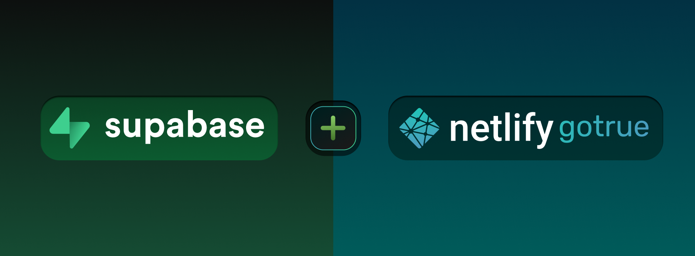

So you're creating a web app and have decided to use Supabase to manage your data. You now face the decision of how you want to implement authentication.

Supabase comes with its own authentication solution, based on a fork of [Netlify's goTrue](https://supabase.com/docs/learn/auth-deep-dive/auth-gotrue) it provides authentication flows like email-password, social login, and phone number based OTP.

It is ideal for quickly building out authentication with vanilla auth flows, but, say you have custom requirements.
 
Maybe you are building a streaming service and would like to limit the number of active devices a user can sign into. Or you want to customize the sign-up authentication flow so that users have to verify their email before they enter their password.

Supabase auth does not have a way to retrieve active sessions for a user and the API extensibility is limited by goTrues webhooks, so you would run into a wall if you wanted to implement either use case.

So what third-party options are available that offer the flexibility you need and, are easy to use? 
We have a [blog](https://supertokens.com/blog/auth-provider-comparison) that compares some of the most popular solutions out there, but today we are looking at SuperTokens, how it can adapt to accommodate your custom requirements and why it pairs so well with Supabase.

## What is SuperTokens?

SuperTokens is an Open Source Authentication solution. They have a managed service, but if you prefer to manage your own data, you can use their self-hosted solution.

> Note: SuperTokens requires you to have a backend server. If your app does not need a backend server, Supabase auth is a more viable option.

### Customizing SuperTokens with Overrides:

Before we talk about how to use customize SuperTokens, we first need take a look at it's architecture.

SuperTokens has 3 parts:
- A Frontend SDK you integrate into your frontend framework (ReactJs, Angular, Vue…)
- A Backend SDK you integrate into your backend layer (NodeJs, Python, Go).
- The SuperTokens Core which can be deployed using the SuperTokens managed service or self-hosted.

Once setup, auth requests from your frontend will call APIs exposed by your backend which will communicate with the SuperTokens core to persist data. The Backend SDK also allows you to `Override` the APIs and functions to extend functionality or even completely replace the logic. 

Since these modifications happen in your backend layer, it means all customizations will be in localized to your backend code base in a stack you are comfortable with. This is very different when compared to other solutions like Auth0 which have limited "[Actions](https://auth0.com/docs/customize/actions)" and you have to upload your code to their dashboard which makes managing you code difficult. It also differs from solutions like Keycloak where if you need a custom flow, you will need to deal with a language you are not comfortable with, in Keycloaks case its Java. 

## Examples of custom flows:

Here is a list of possible use cases and how SuperTokens can help you achieve them.

- Do you need to migrate users from another auth solution but have data associated with their userIds? With SuperTokens you can use the UserId Mapping feature to continue to use these userIds by mapping the SuperTokens userId to the pre-existing userId during migration. Now when passing the pre-existing Id to any SuperTokens APIs, it will internally resolve the mapping and make sure that the pre-existing id is also returned in the response.

- If your app requires users to sign up with their work-related emails or Google workspace-associated domains, you can use the SuperTokens email validator functions to enforce the check.

- Add additional form fields to the Sign Up or Sign In pages to retrieve more information like the user's name and age.

- Streaming services need to limit the number of active devices associated with an account. If you are building a streaming service, you will use the SuperTokens Session recipe to enable this feature set.

- Don't like the default email and SMS templates? Create your own email and SMS content! You can also choose your own delivery method if you don't want to use the default service.

## Example apps with custom flows
Here are some examples of custom flows we've already built:

### Verify a users email before they enter their password during Sign Up.
Say you have a custom requirement where you want to verify a user's ownership of an email before they type in a password during sign-up.

- The overall approach can be achieved in the following manner:
    - On first sign up via email, we set a fake, random password against the user's info. This is some unguessable string but is common for all users.
    - The above step allows us to create a new session for the user and go through the email verification flow as usual.
    - Post email verification, we show a UI for the user to set their own password and then call an API that updates their fake password with the new one. 
- Example app with [email verification before entering the password during sign up](https://github.com/supertokens/supertokens-auth-react/tree/master/examples/with-emailverification-then-password-thirdpartyemailpassword).

### Email Verification with OTP
Instead of having the user click a link during email verification, maybe you would like them to enter an OTP.
- This can be achieved in the following manner:
    - Override the Email Verification screen on the frontend to display a custom component that has an input to enter the OTP.
    - On the backend, override the Email Verification function which sends the email verification emails to the user to now generate an OTP, map it to the user and send it to the user's email. You will also need to override the API which validates the email verification link to now check if the OTP sent is valid.
- Example app with [email verification with OTP](https://github.com/supertokens/supertokens-auth-react/tree/master/examples/with-emailverification-with-otp).

### Login with Phone Password:
In this flow, users create an account using their phone number and password.
- You can find a full guide on how to implement this authentication strategy in our [example app](https://github.com/supertokens/supertokens-auth-react/tree/master/examples/with-phone-password).

These are just some of the use cases that SuperTokens supports. If you have a custom requirement, feel free to join our [discord](https://supertokens.com/discord). We are passionate about Auth and would love to discuss your use case.

## Integrating SuperTokens into Supabase:

So why does SuperTokens pair so well with Supabase? Well, one of Supabase's key features is authorization Row Level Security. RLS allows you to create powerful authorization policies to suit your business requirements. We provide a [guide](https://supabase.com/docs/guides/integrations/supertokens) on how to integrate SuperTokens with Supabase and leverage RLS to allow authorized users to access their data.

## Conclusion

In the end, the authentication solution you choose depends on your use case. For example, if you don't have a backend, you cant use SuperTokens(since SuperTokens architecture requires you to have a backend) and you will be better served using Supabase's auth solution, but if you fit SuperTokens requirements and need the customization and extensibility, you should look into SuperTokens.