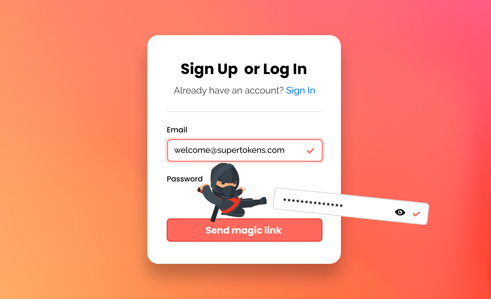
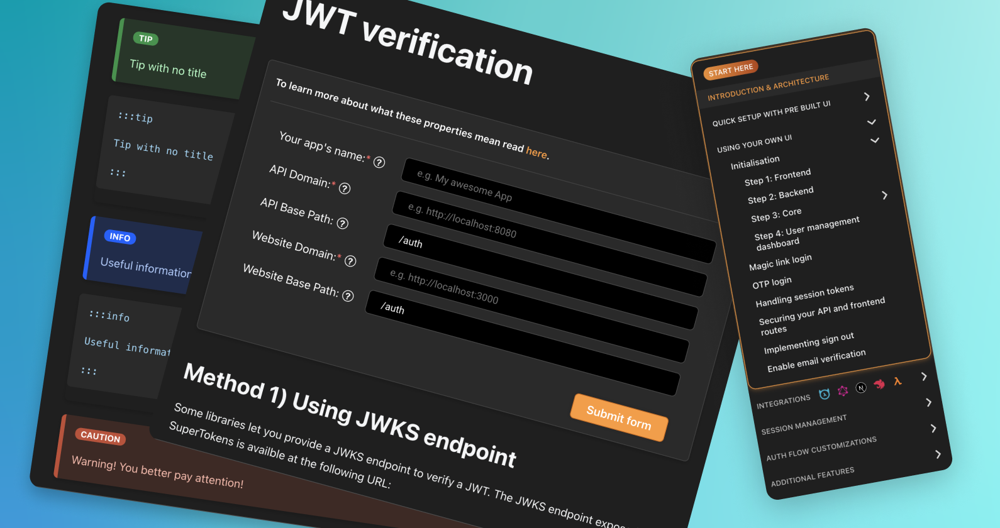
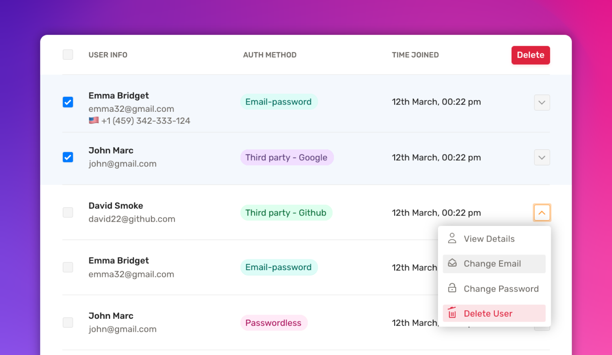

## Table of Contents

- [Introduction](#introduction)
- [Passwordless Authentication](#passwordless-authentication)
- [SuperTokens CLI](#supertokens-cli)
- [Documentation Revamp](#documentation-revamp)
- [User Management Dashboard](#user-management-dashboard)
- [User roles and permissions](#user-roles-and-permissions)
- [Support for mobile frameworks](#support-for-mobile-frameworks)
- [Conclusion](#conclusion)

## Introduction

2022 has been the biggest year to date at SuperTokens.

- Website traffic and NPM downloads increased by **600%**
- Listed in the Ross Index’s fastest-growing startups, with **7800** GitHub stars, a **260%** increase since the start of the year. 
- The discord community grew by almost **1600** members.
- SuperTokens is now SOC2 compliant

We also released some incredible updates - based on all the feedback we received from our users:

## Passwordless Authentication

Passwordless had been the number one requested feature for a while, so we wanted to ensure we got it right. With the SuperTokens passwordless recipe, you can add passwordless based authentication with magic links and OTP sent through either phone number or email.

## SuperTokens CLI  

Improving the developer experience has always been at the core SuperTokens.
With the SuperTokens CLI, we want to make setting up an app with SuperTokens as simple as possible. By running “npx create-supertokens-app@latest” you can generate a complete web app protected by SuperTokens in less than 60 seconds.

## Documentation Revamp

We also wanted to support the growing part of the community who wanted to use their own UI with SuperTokens, so we revamped our documentation to add guides to setup SuperTokens with custom UI.

## User Management Dashboard

With the user management dashboard, you can view the list of users on SuperTokens and be able to easily modify or delete sessions, update metadata, and account info.

## User Roles and Permissions

Authorization has also been another highly requested feature. The user roles and permissions recipe allows you to create roles and permissions and assign them to users. You can then guard frontend routes and backend APIs to only allow access if the user has a certain role or permission.

## Support for mobile frameworks

Mobile SDKs for iOS, Android and React Native were also released this year.

We also issued hundreds of bug fixes, under-the-hood improvements, and security updates and also committed to growing our team, almost doubling its size.

## Conclusion

And that's a wrap!

2022 was a year of growth and progress for the SuperTokens team. We released some amazing features, hit several growth milestones, and nearly doubled our team size. We are thankful to our community for placing their trust in us, and we hope to make 2023 an even better year!
