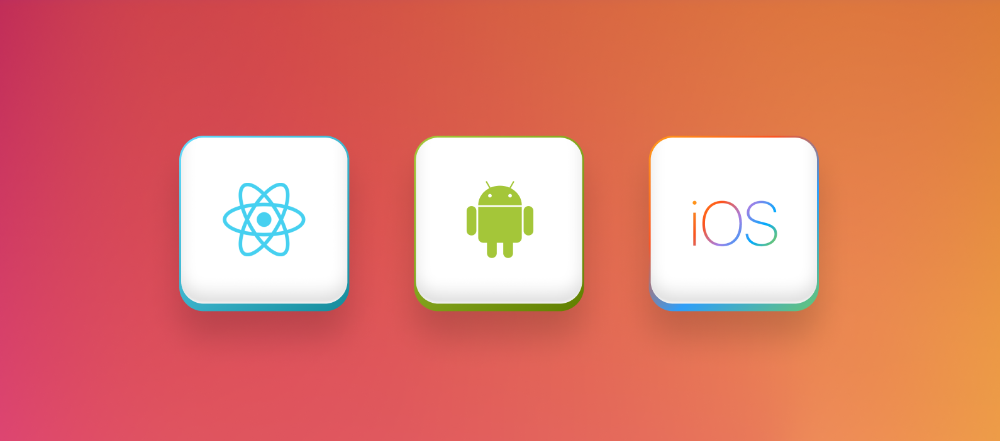

## Table of Contents

- [Introduction](#introduction)
- [Passwordless Authentication](#passwordless-authentication)
- [SuperTokens CLI](#supertokens-cli)
- [Documentation Revamp](#documentation-revamp)
- [User Management Dashboard](#user-management-dashboard)
- [User roles and permissions](#user-roles-and-permissions)
- [Support for mobile frameworks](#support-for-mobile-frameworks)
- [Conclusion](#conclusion)

## Introduction

2022 has been the biggest year to date at SuperTokens.
- **1x**: We held our first-ever company offsite! 
- **2x**: Our team size doubled 
- **3x**: Our Github Stars grew 3x to ~7,800 
- **4th**: We were the 4th fastest growing OSS startups in the world in [Q1 '22](https://runacap.com/ross-index/q1-2022/) 
- **5x**: Growth in our Discord community 
- **6x**: Growth in our Website traffic and NPM downloads
- There are 1000's of apps globally being powered by SuperTokens.

We also released some incredible updates - based on all the feedback we received from our users:

## Passwordless Authentication

Passwordless authentication has been the number one requested feature for a while, so we 
wanted to get it right. With the SuperTokens [passwordless recipe](https://supertokens.com/docs/passwordless/introduction), you can add passwordless based authentication with magic links and OTP sent through either phone number or email.

## SuperTokens CLI  

Improving the developer experience has always been at the core of SuperTokens.
With our CLI, we wanted to simplify the process of setting up an app with SuperTokens. By running “npx create-supertokens-app@latest” you can generate a complete web app protected by SuperTokens in less than 60 seconds.

## Documentation Revamp

We also wanted to support the growing part of the community who wanted to use their own UI with SuperTokens, so we revamped our [documentation](https://supertokens.com/docs/guides) to add guides to set up SuperTokens with custom UI.

## User Management Dashboard

With the [user management dashboard](https://supertokens.com/docs/emailpassword/pre-built-ui/setup/dashboard), you can view the list of users on SuperTokens and easily modify or delete sessions, update metadata, and account info.

## User Roles and Permissions

Authorization has been another highly requested feature. The [user roles and permissions recipe](https://supertokens.com/docs/userroles/introduction) allows you to create roles and permissions and assign them to users. You can then guard frontend routes and backend APIs to only allow access if the user has a certain role or permission.

## Support for mobile frameworks

Mobile SDKs for iOS, Android and React Native was also released this year. You can get started [here](https://supertokens.com/docs/thirdpartyemailpassword/custom-ui/init/frontend)

These are just some of the features we worked on...

We also issued hundreds of bug fixes, under-the-hood improvements, security updates and also committed to growing our team, doubling its size.

## Conclusion

And that's a wrap!

2022 was a year of growth and progress for the SuperTokens team. We released some amazing features, hit several growth milestones, and nearly doubled our team size. We are thankful to our community for placing their trust in us, and we hope to make 2023 an even better year!
