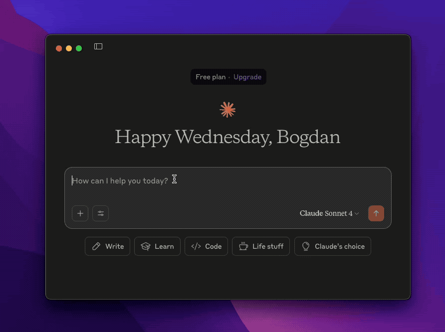
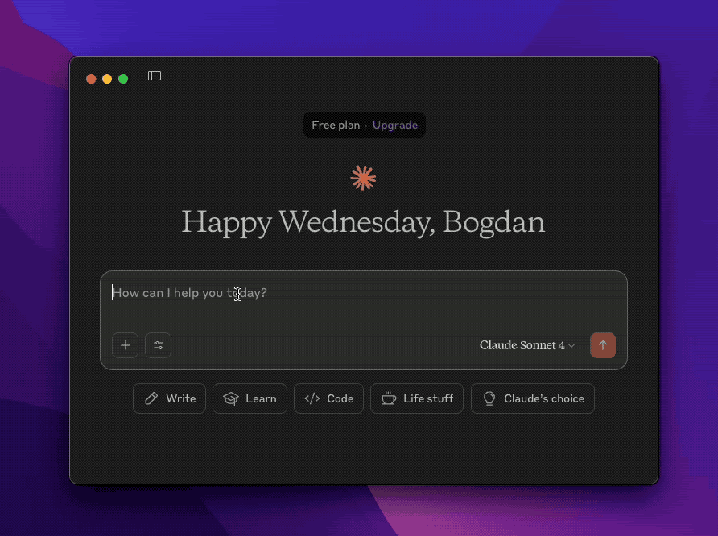

```toc
tight: true
toHeading: 3
```

## Introduction

We’ve been closely tracking the evolution of standards emerging around the AI ecosystem over the past year. Among the most promising developments is the Model Context Protocol (MCP), which aims to bring consistency to how large language models (LLMs) interact with external tools and systems. Today, we’re excited to announce that we’re working on a set of tools designed to make it easier to administer and integrate your authentication logic with different LLM clients.

## What’s MCP? 

First, let’s get a refresher on what MCP is. The Model Context Protocol, originally introduced by Anthropic, is a communication standard that defines how LLMs can securely access and interact with external sources. Think of it as an API contract tailored for AI — one that enables context sharing, action execution, and secure communication between AI models and other tools.
At its core, MCP adapts the traditional client-server model for the AI-first era. With this protocol, LLMs can execute complex actions and extend their context — all while preserving a clean, secure abstraction layer. This unlocks a whole new level of utility for AI integrations and makes it easier to design agentic systems that work with your existing backend infrastructure.

## The SuperTokens MCP Toolkit

We have been actively using AI tools in our day-to-day workflow at SuperTokens. It’s now part of the way we prototype features, debug issues, and even how we manage parts of our authentication infrastructure. Through this hands-on experience, we saw the need for a more native, flexible way to integrate authentication systems with AI workflows. That’s where our **MCP Toolkit** comes in.

We’ve built lightweight tools that follow the MCP standard, allowing AI tools to perform secure authentication tasks — like creating users, managing roles, and querying tenants — using natural language commands or contextual automation. Below are a few use cases where this really shines:

### Manage Authentication from within your LLM Client

Imagine managing your entire authentication flow directly from tools like Claude or Cursor, without switching tabs or running scripts manually. With the SuperTokens MCP server integrated into your workflow, this becomes possible. Developers can create users, assign roles, revoke tokens, or even add new tenants — all through simple, natural language prompts to their LLM of choice. The AI communicates with your MCP server in the background, following secure, scoped authentication protocols. This makes day-to-day operations smoother and faster, especially in environments where rapid iteration is key.



### Integrate using Up-to-Date Documentation

One common limitation with LLMs is that their training data can lag behind the latest product releases. This creates friction when you’re trying to "vibe code" your way into a new SuperTokens integration, only to discover the model is referencing outdated APIs, missing features entirely or it’s hallucinating with confidence. With the MCP toolkit, you can inject live documentation directly into the LLM’s context window, ensuring it has access to the most accurate and current information. This dramatically reduces the chance of wrong responses and enables smoother, more reliable coding assistance — especially when working with cutting-edge features.



### Expose your own MCP Server

If you're building your own MCP-compatible tools or endpoints, one common challenge is ensuring secure authentication and authorization across AI-driven workflows. To make this easy, we plan to provide a drop-in middleware that verifies incoming MCP requests and exposes the authentication context directly into your tool or agent.

By plugging in our middleware, you inherit SuperTokens' session and identity handling — including user verification, tenant scoping, role-based access control, and more. Once authenticated, your tools can operate with full knowledge of the calling user's identity, permissions, and session context, allowing you to build secure and personalized AI integrations. Whether you're building a custom agent toolchain or just exposing internal APIs to an LLM, this is the easiest and safest way to get started.

## What’s next?

The toolkit is currently in private beta as we polish the APIs and finalize the developer experience. We’re targeting a public release by the end of this month.

Looking ahead, we’re planning to expand support for more AI-powered use cases. If you’re interested in early access or have a unique scenario you’d like to explore, we’d love to hear from you — just reach out to our team!
