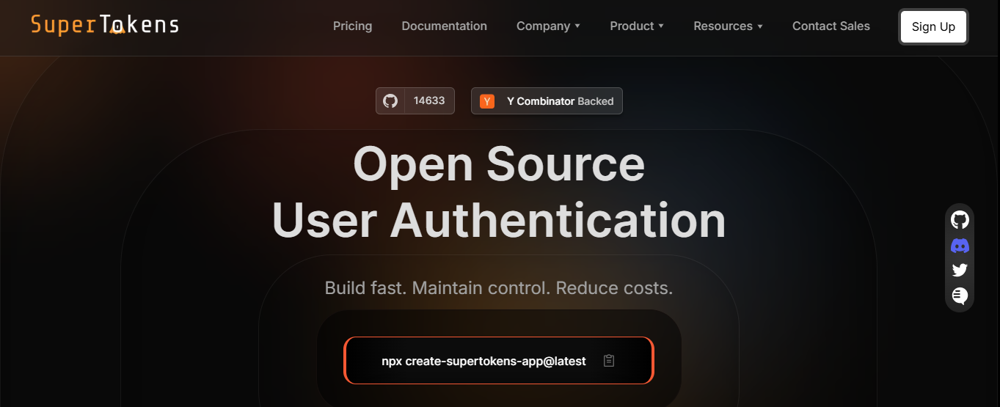
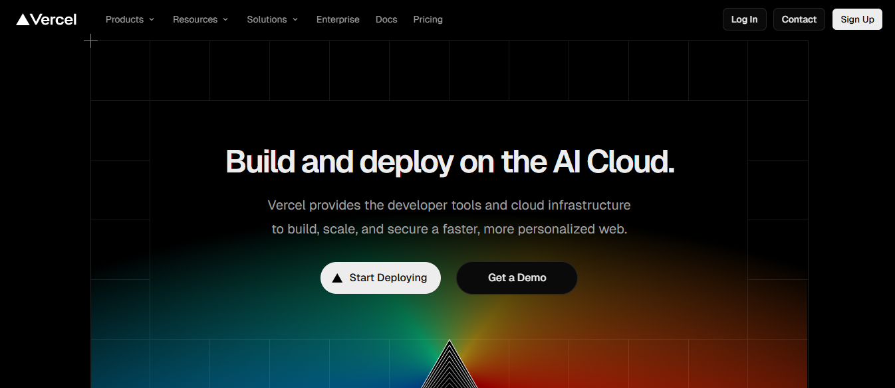
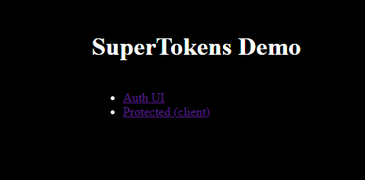
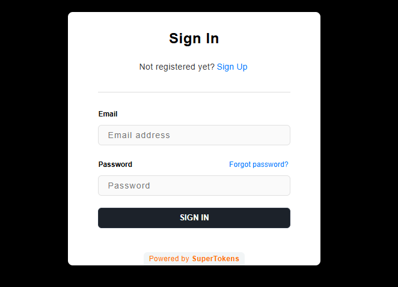

This comprehensive walkthrough covers integrating SuperTokens authentication into a Next.js project hosted on Vercel, including local
setup, API route configuration, serverless deployment considerations, and complete authentication flow implementation.

## **Why Use SuperTokens on Vercel?**



SuperTokens paired with Vercel creates a powerful authentication solution that balances developer experience with production-grade
security.

-   **Free-tier friendly and open-source** makes SuperTokens accessible for projects at any scale. Vercel provides one production URL per app and one unique inspect URL per deployment, and SuperTokens works seamlessly with this dynamic URL structure. The open-source nature ensures transparency and eliminates vendor lock-in concerns while providing enterprise-grade authentication capabilities.
-   **Native Next.js API route integration** means SuperTokens functions as a standard Next.js serverless API without requiring separate backend infrastructure. The authentication logic runs within Next.js API routes, simplifying deployment and reducing operational complexity compared to managing separate authentication services.
-   **Comprehensive authentication features** include multi-tenancy support, passwordless authentication, social login integration, email/password authentication, and custom authentication flows. Organizations can start with basic authentication and progressively add capabilities as requirements evolve.
-   **Built-in security features** provide protection against common attack vectors, including token theft detection, CSRF protection, session hijacking prevention, and secure cookie handling. These security mechanisms work automatically without requiring manual security implementation or maintenance.

## **Prerequisites**

Before beginning implementation, ensure the following tools and accounts are available:

**Development environment requirements:**

-   Node.js (version 14 or later recommended)
-   Code editor (Visual Studio Code recommended)
-   Basic familiarity with React and Next.js concepts

**Deployment requirements:**

-   GitHub account for code repository hosting
-   Vercel account (free tier sufficient for getting started)
-   SuperTokens Core instance (self-hosted or managed service)

**Configuration preparation:**

-   Environment variable management for development and production
-   Understanding of API routes in Next.js
-   Basic knowledge of authentication concepts

## **Step 1 -- Bootstrap a Next.js Project**

Create a new Next.js project or use an existing application as the foundation for SuperTokens integration:
```js
 npx create-next-app@latest supertokens-vercel-demo                                                                                      
 cd supertokens-vercel-demo                                            
```

The Next.js CLI prompts for configuration options. For SuperTokens
compatibility, select the following:

-   TypeScript: Yes (recommended for type safety)
-   ESLint: Yes
-   Tailwind CSS: Optional (based on styling preferences)
-   App Router: Yes (modern Next.js routing approach)

**Install SuperTokens SDKs** for both backend and frontend integration:
```js
  npm install supertokens-node supertokens-auth-react
```

These packages provide the core authentication functionality:

-   `supertokens-node`: Backend SDK for API routes and session management
-   `supertokens-auth-react`: Frontend components and React integration

## **Step 2 -- Set Up SuperTokens Backend**

Create the authentication API route handler that processes all SuperTokens backend operations.

**For App Router (Next.js 13+)**, create `src/app/api/auth/[[...path]]/route.ts`:
```js
// src/app/api/auth/[[...path]]/route.ts
import { getAppDirRequestHandler } from "supertokens-node/nextjs";
import { NextRequest } from "next/server";
import { ensureSuperTokensInit } from "@/app/config/backend";


ensureSuperTokensInit();


const handleCall = getAppDirRequestHandler();


export async function GET(req: NextRequest) {
  const res = await handleCall(req);
  if (!res.headers.has("Cache-Control")) {
    res.headers.set(
      "Cache-Control",
      "no-cache, no-store, max-age=0, must-revalidate"
    );
  }
  return res;
}
export const POST = handleCall;
export const PUT = handleCall;
export const DELETE = handleCall;
export const PATCH = handleCall;
export const HEAD = handleCall;

```
This file acts as a proxy route &mdash; it passes all authentication requests to the SuperTokens backend handler.

By mapping all HTTP methods (GET, POST, etc.) to `handleCall`, we ensure every auth-related request is handled correctly.

**Create backend configuration** at `src/app/config/backend.ts`:
```js
// src/app/config/backend.ts


import SuperTokens from "supertokens-node";
import EmailPassword from "supertokens-node/recipe/emailpassword";
import Session from "supertokens-node/recipe/session";
import { TypeInput } from "supertokens-node/types";


export const backendConfig = (): TypeInput => {
  const apiDomain = process.env.VERCEL_URL
    ? `https://${process.env.VERCEL_URL}`
    : process.env.NEXT_PUBLIC_API_DOMAIN || "http://localhost:3000";


  const websiteDomain = process.env.VERCEL_URL
    ? `https://${process.env.VERCEL_URL}`
    : process.env.NEXT_PUBLIC_WEBSITE_DOMAIN || "http://localhost:3000";


  return {
    appInfo: {
      appName: "SuperTokens Vercel Demo",
      apiDomain,
      websiteDomain,
      apiBasePath: "/api/auth",
      websiteBasePath: "/auth",
    },
    supertokens: {
      connectionURI:
        process.env.SUPERTOKENS_CONNECTION_URI || "https://try.supertokens.io",
      apiKey: process.env.SUPERTOKENS_API_KEY,
    },
    recipeList: [
      EmailPassword.init(),
      Session.init({
        cookieSameSite: "lax",
        cookieSecure: process.env.NODE_ENV === "production",
      }),
    ],
  };
};


export function ensureSuperTokensInit() {
  try {
    SuperTokens.init(backendConfig());
  } catch (err: unknown) {
    const msg = String((err as Error).message || "");
    if (!/already initiali/i.test(msg)) {
      throw err;
    }
  }
}
```

This configuration initializes SuperTokens with email/password authentication and session management. The `appInfo` object uses environment variables for dynamic URL configuration essential for Vercel deployments.

## **Step 3 -- Create SuperTokens Frontend Wrapper**

Frontend integration connects React components with SuperTokens authentication backend.

**Configure frontend** at `src/app/config/frontend.ts`:
```js
// src/app/config/frontend.ts
import EmailPasswordReact from "supertokens-auth-react/recipe/emailpassword";
import SessionReact from "supertokens-auth-react/recipe/session";


export const frontendConfig = () => {
  return {
    appInfo: {
      appName: "SuperTokens Vercel Demo",
      apiDomain: process.env.NEXT_PUBLIC_API_DOMAIN || "http://localhost:3000",
      websiteDomain: process.env.NEXT_PUBLIC_WEBSITE_DOMAIN || "http://localhost:3000",
      apiBasePath: "/api/auth",
      websiteBasePath: "/auth",
    },
    recipeList: [
      EmailPasswordReact.init(),
      SessionReact.init(),
    ],
  };
};
```

**Wrap application** in `src/app/layout.tsx`:

```js
// src/app/layout.tsx
"use client";
import React from "react";
import SuperTokensReact from "supertokens-auth-react";
import { SuperTokensWrapper } from "supertokens-auth-react";
import { frontendConfig } from "./config/frontend";


if (
  typeof window !== "undefined" &&
  !(globalThis as unknown as { __supertokens_initialized: boolean })
    .__supertokens_initialized
) {
  SuperTokensReact.init(frontendConfig());
  (
    globalThis as unknown as { __supertokens_initialized: boolean }
  ).__supertokens_initialized = true;
}


export default function RootLayout({
  children,
}: {
  children: React.ReactNode;
}) {
  return (
    <html lang="en">
      <body>
        <SuperTokensWrapper>{children}</SuperTokensWrapper>
      </body>
    </html>
  );
}
```

**Add authentication routing component** at `src/app/auth/page.tsx`:

```js
"use client";


import React, { useEffect, useState } from "react";
import "@/app/config/supertokens-init";
import { AuthPage } from "supertokens-auth-react/ui";
import { EmailPasswordPreBuiltUI } from "supertokens-auth-react/recipe/emailpassword/prebuiltui";


export const dynamic = "force-dynamic";


export default function AuthPageWrapper() {
  const [ready, setReady] = useState(false);


  useEffect(() => {
    setReady(true);
  }, []);


  if (!ready) return null;


  return <AuthPage preBuiltUIList={[EmailPasswordPreBuiltUI]} />;
}
```

This component renders SuperTokens pre-built authentication UI, including login, signup, password reset, and email verification flows.

**Protected Route Example**

**File: `src/app/protected/page.tsx`**

```js
//src/app/protected/page.tsx
"use client";
import { useEffect, useState } from "react";
import Session from "supertokens-auth-react/recipe/session";


export default function ProtectedPage() {
  const [userId, setUserId] = useState<string | null>(null);


  useEffect(() => {
    const check = async () => {
      try {
        const s = await Session.getAccessTokenPayloadSecurely();
        // If session exists, getUserId from accessToken payload or call protected API.
        setUserId(s?.sub || "signed-in");
      } catch {
        setUserId(null);
      }
    };
    check();
  }, []);


  if (userId === null)
    return (
      <div>
        Not signed in. Go to <a href="/auth">/auth</a>
      </div>
    );
  return <div>Signed in. userId: {String(userId)}</div>;
}
```

This page checks if a valid session exists. If not signed in → redirects user to `/auth`.

If signed in → displays their `userId` or token payload.

**Initialize SuperTokens (Client Side)**

**File: `src/app/config/supertokens-init.ts`**

```js
//src/app/config/supertokens-init.ts
"use client";


import SuperTokensReact from "supertokens-auth-react";
import { frontendConfig } from "./frontend";


if (typeof window !== "undefined") {
  if (!SuperTokensReact.isRecipeInitialized("emailpassword")) {
    SuperTokensReact.init(frontendConfig());
  }
}
```
This lightweight script ensures SuperTokens is properly initialized when the app runs in the browser.

**Home Page Links**

**File: `src/app/page.tsx`**

```js
// src/app/page.tsx
import Link from "next/link";


export default function Home() {
  return (
    <main style={{ padding: 24 }}>
      <h1>SuperTokens Demo</h1>
      <ul>
        <li><Link href="/auth">Auth UI</Link></li>
        <li><Link href="/protected">Protected (client)</Link></li>
      </ul>
    </main>
  );
}
```

## **Step 4 -- Configure Environment Variables**

Vercel provides the VERCEL_URL environment variable to the backend, which points to the current URL that the app is deployed on. This enables SuperTokens to work across development, preview, and production environments.

**Local development** configuration in `.env.local`:
```js
SUPERTOKENS_CONNECTION_URI=https://try.supertokens.io
SUPERTOKENS_API_KEY=
NEXT_PUBLIC_API_DOMAIN=http://localhost:3000
NEXT_PUBLIC_WEBSITE_DOMAIN=http://localhost:3000
```

**Production environment** variables in the Vercel dashboard:
```js
SUPERTOKENS_CONNECTION_URI=PRODUCTION_CONNECTION_URI
SUPERTOKENS_API_KEY=your_production_api_key
NEXT_PUBLIC_API_DOMAIN=https://your-app.vercel.app
NEXT_PUBLIC_WEBSITE_DOMAIN=https://your-app.vercel.app
```

For managed SuperTokens hosting, replace the `SUPERTOKENS_CONNECTION_URI` with your dedicated instance URL. Self-hosted deployments require ensuring the SuperTokens Core service is publicly accessible via HTTPS.

**Dynamic URL configuration** for Vercel preview deployments requires using `process.env.VERCEL_URL` in backend configuration:

```js
appInfo: {
  apiDomain: process.env.VERCEL_URL
    ? `https://${process.env.VERCEL_URL}`
    : process.env.NEXT_PUBLIC_API_DOMAIN,
  websiteDomain: process.env.VERCEL_URL
    ? `https://${process.env.VERCEL_URL}`
    : process.env.NEXT_PUBLIC_WEBSITE_DOMAIN,
}
```

## **Step 5 -- Deploy to Vercel**

Vercel deployment follows a straightforward process for Next.js applications with SuperTokens.



**Prepare for deployment:**

1.  Commit all changes to your Git repository:
```js
git add .
git commit -m "Add SuperTokens authentication"
git push origin main
```
2.  Navigate to the Vercel dashboard and import your repository
3.  Configure environment variables in Vercel project settings
4.  Deploy the application

**Vercel automatically:**

-   Detects the Next.js framework
-   Installs dependencies
-   Builds the application
-   Deploys to serverless infrastructure
-   Generates preview URLs for pull requests

**Important deployment considerations:**

-   This only works if the frontend and backend of your application have the same domain. If your backend is hosted separately, configure `apiDomain` to point to your backend server.
-   Ensure CORS configuration allows requests from Vercel preview URLs
-   Verify environment variables are set correctly in the Vercel dashboard
-   Test authentication flows on the preview deployment before promoting to production

## **Step 6 -- Test Auth Flow**

Verify authentication implementation works correctly across all flows.

**Registration flow testing:**

1.  Navigate to the `/auth` route in your deployed application
2.  Click \"Sign Up\" and create a new account
3.  Verify email verification flow (if enabled)
4.  Confirm successful redirect after registration






**Session verification:**

Protect API routes by verifying session tokens:

```js
import { withSession } from "supertokens-node/nextjs";
import { SessionContainer } from "supertokens-node/recipe/session";
import { NextRequest, NextResponse } from "next/server";


export async function GET(request: NextRequest) {
  return withSession(
    request,
    async (session: SessionContainer | undefined) => {
      if (!session) {
        return NextResponse.json(
          { error: "Unauthorized" },
          { status: 401 }
        );
      }


      const userId = session.getUserId();
     
      return NextResponse.json({
        message: "Protected data",
        userId: userId,
      });
    }
  );
}
```

**Cookie and session persistence:**

-   Verify session cookies are set with the correct security flags
-   Test session persistence across page navigation
-   Confirm that the logout functionality clears the session properly
-   Validate that session refresh works without user interaction

## **Optional: Enable Social or Passwordless Login**

SuperTokens supports multiple authentication methods that can be added or combined according to specific requirements.

**Social login integration** with ThirdPartyEmailPassword:

```js
import ThirdPartyEmailPassword from "supertokens-node/recipe/thirdpartyemailpassword";
import Google from "supertokens-node/recipe/thirdpartyemailpassword/providers/google";
import Github from "supertokens-node/recipe/thirdpartyemailpassword/providers/github";


ThirdPartyEmailPassword.init({
  providers: [
    Google({
      clientId: process.env.GOOGLE_CLIENT_ID!,
      clientSecret: process.env.GOOGLE_CLIENT_SECRET!,
    }),
    Github({
      clientId: process.env.GITHUB_CLIENT_ID!,
      clientSecret: process.env.GITHUB_CLIENT_SECRET!,
    }),
  ],
});
```

**Passwordless authentication** with magic links or OTP:

```js
import Passwordless from "supertokens-node/recipe/passwordless";


Passwordless.init({
  contactMethod: "EMAIL_OR_PHONE",
  flowType: "MAGIC_LINK",
});
```

Frontend configuration requires updating recipe initialization to match backend configuration. SuperTokens automatically renders appropriate UI components based on enabled recipes.

## **SuperTokens Features That Work Seamlessly on Vercel**

SuperTokens architecture aligns well with Vercel\'s serverless platform, providing several advantages:

-   **Serverless session verification** operates efficiently within Vercel\'s serverless functions, with minimal cold start overhead. Session validation requires only JWT verification or database lookup, completing within milliseconds even on cold starts.
-   **Flexible session management** supports both stateless JWT tokens and stateful database sessions. Stateless tokens eliminate database dependency for session verification, while stateful sessions provide immediate revocation capabilities essential for security-sensitive applications.
-   **Multi-tenant authentication** enables serving multiple customers from a single deployment with tenant-specific authentication configurations, branding, and user bases. This architecture works particularly well with Vercel\'s edge network for global distribution.
-   **Frontend UI theming** provides complete customization of authentication interfaces without requiring custom component development. CSS variables and component overrides enable matching authentication UI to application design systems.
-   **Type-safe claims and user roles** integrate with TypeScript for compile-time type checking of user permissions and session claims, reducing runtime errors and improving developer experience.

## **Limitations & Workarounds**

Understanding platform constraints helps avoid common implementation pitfalls.

-   **Cold start latency** affects serverless functions on Vercel\'s free and hobby tiers. SuperTokens API routes experience slight latency during cold starts as the Node.js runtime initializes. Vercel Pro plans reduce cold start frequency through reserved capacity. For critical authentication endpoints, consider keeping functions warm through periodic health check requests.
-   **Edge runtime compatibility** remains limited. SuperTokens relies on Node.js APIs unsupported in Vercel\'s edge runtime, requiring standard serverless API routes rather than edge functions. This limitation affects global latency for authentication operations but typically remains acceptable for most applications.
-   **Self-hosted SuperTokens Core requirements** mandate public HTTPS accessibility. Organizations self-hosting SuperTokens Core must expose the service to the internet or configure VPN connectivity between Vercel deployments and private networks. Managed SuperTokens hosting eliminates these networking concerns.
-   **Preview deployment considerations** require dynamic URL configuration to support Vercel\'s unique preview URLs for each pull request. The `VERCEL_URL` environment variable enables this functionality but requires proper configuration in `appInfo`.

## **Frequently Asked Questions**

-   **Can I use the SuperTokens managed service on Vercel?**
Yes, managed SuperTokens hosting works seamlessly with Vercel deployments. Point `SUPERTOKENS_CONNECTION_URI` to your managed instance URL and configure the API key. Managed hosting eliminates operational overhead while providing production-grade reliability and security.
-   **Can I deploy to Vercel edge functions?**
Not currently. SuperTokens requires Node.js APIs unavailable in Vercel\'s edge runtime. Use standard serverless API routes, which provide sufficient performance for most authentication workloads while supporting SuperTokens functionality.
-   **How do I handle custom domains?**
Configure custom domains through Vercel dashboard, then update environment variables to reflect custom domain URLs. Ensure `apiDomain` and `websiteDomain` match your custom domain configuration.
-   **What about database requirements?**
SuperTokens Core handles user data storage internally. Applications using self-hosted Core need to configure database connectivity (PostgreSQL, MySQL, or MongoDB supported). Managed SuperTokens hosting includes database infrastructure.

## **Conclusion**

SuperTokens integrates naturally with Vercel\'s developer-friendly environment, providing production-ready authentication that scales from prototype to enterprise deployment. The combination delivers secure, customizable authentication in minutes rather than weeks of custom development.

Whether prototyping new features, launching minimum viable products, or scaling to millions of users, SuperTokens on Vercel provides authentication infrastructure that grows with application requirements. The open-source foundation ensures transparency and flexibility, while managed hosting options eliminate operational complexity for teams preferring convenience over infrastructure control.

Start by deploying the example application, test authentication flows thoroughly, and progressively add features as requirements evolve. The modular architecture enables incremental adoption without requiring comprehensive upfront planning or migration efforts.
