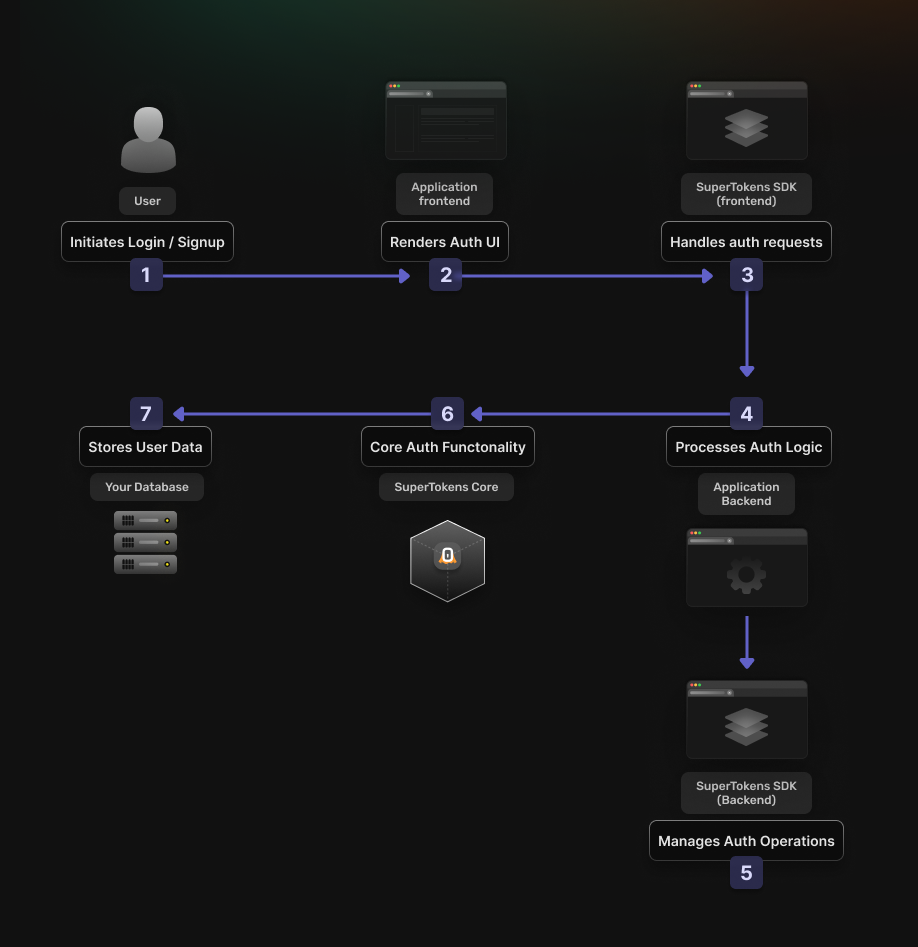
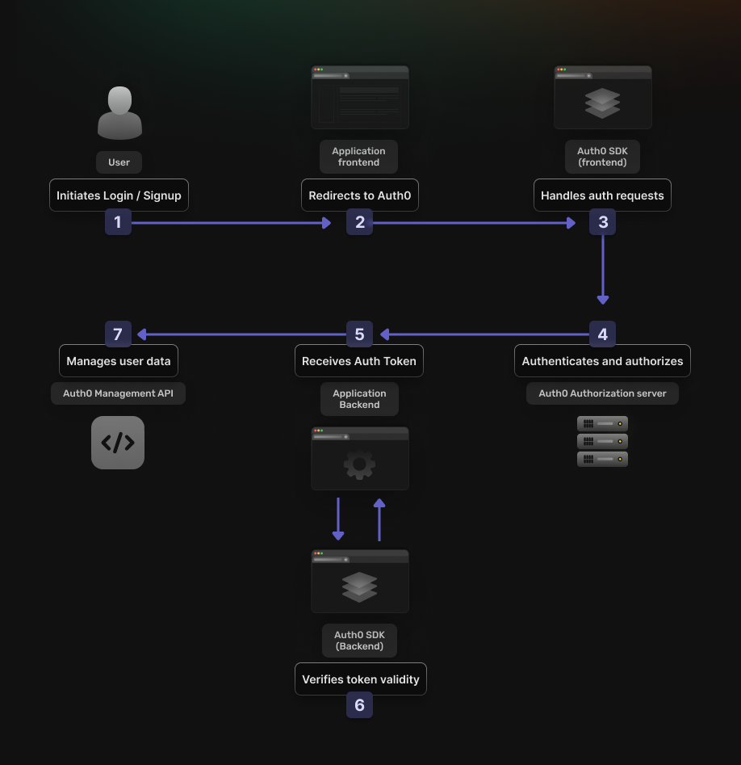

1. [Introduction](#introduction)
2. [Do SuperTokens and Auth0 Work Differently?](#do-supertokens-and-auth0-work-differently)
3. [SuperTokens vs. Auth0 Key Feature Differences](#supertokens-vs-auth0-key-feature-differences)
4. [SuperTokens vs. Auth0 Pros & Cons](#supertokens-vs-auth0-pros--cons)
5. [Summary Table](#summary-table)
6. [Workflow Differences: Using Each Tool to Design a User Access Flow](#workflow-differences-using-each-tool-to-design-a-user-access-flow)
7. [Understanding Self-Hosted vs. Managed User Management](#understanding-self-hosted-vs-managed-user-management)
8. [Who Should Use SuperTokens vs. Auth0](#who-should-use-supertokens-vs-auth0)
9. [SuperTokens vs. Auth0: Pricing Comparison](#supertokens-vs-auth0-pricing-comparison)
10. [Conclusion](#conclusion)

## Introduction

Hey there, fellow developers! Are you scratching your head trying to choose between SuperTokens and Auth0 for your authentication needs? Well, you're in the right place! In this deep dive, we'll compare these two popular authentication solutions, exploring their features, setup processes, and use cases. By the end, you'll have a clearer picture of which option might be the best fit for your project. So, let's jump right in!

## Do SuperTokens and Auth0 Work Differently?

At their core, SuperTokens and Auth0 share the same goal: to provide secure authentication and authorization for web applications. However, they differ in their approach and underlying architecture.

SuperTokens is an open-source, self-hosted solution that gives you full control over your authentication infrastructure. It's designed with a modular architecture, allowing you to pick and choose the components you need. This flexibility is great if you have specific requirements or want to customize your auth flow.

On the other hand, Auth0 is a cloud-based, managed service that handles authentication and authorization for you. It offers a comprehensive suite of features out of the box, making it easier to get started quickly without worrying about the nitty-gritty details of implementation.

## SuperTokens vs. Auth0 Key Feature Differences

Both SuperTokens and Auth0 offer a wide range of features to streamline authentication and authorization processes. Here's a high-level comparison of some key features:

- **Authentication Methods:** Both SuperTokens and Auth0 support a variety of authentication methods, including passwordless, social login, and multi-factor authentication (MFA).
  - **Social Login:** Auth0 provides an easy way to add popular social providers through their dashboard. They also allow you to add custom OAuth providers by entering the necessary details. SuperTokens supports any OAuth 2.0 provider, offering a simple callback function in your backend SDK to integrate custom providers.
  - **Passwordless:** Both solutions offer passwordless authentication options, such as magic links or one-time passwords (OTP).
  - **Multi-Factor Authentication (MFA):** Auth0 has built-in support for an extensive number of MFA methods, while SuperTokens allows you to setup MFA with email/sms based OTP and TOTP. SuperTokens does provide extensibility, allowing you to build your own custom MFA flows, though that requires additional effort
- **Customization and Flexibility:** SuperTokens shines in terms of customization, allowing you to tailor almost every aspect of the authentication process. You can easily override backend APIs, customize UI components, and implement custom logic at various stages of the auth flow.

  Auth0, while less flexible, offers a range of customization options through its dashboard. You can modify email templates, add custom fields to sign-up forms, and use Auth0 Rules, Hooks, or Actions to add custom logic to the authentication process.
- **Open-Source vs. Managed Service:** SuperTokens is an open-source solution that you host and manage yourself, while Auth0 is a managed service. This fundamental difference impacts many aspects of how you'll work with each solution, but we'll delve deeper into this in a later section.
- **Scalability and Performance:** Both solutions are designed to handle high loads, but their approaches differ:
  - **SuperTokens:** Being self-hosted, you have control over the infrastructure, allowing you to optimize performance based on your specific needs. You can scale horizontally by adding more instances of the SuperTokens core.
  - **Auth0:** As a managed service, Auth0 handles scalability for you. They use a globally distributed infrastructure to ensure low latency and high availability. However, you have less control over performance optimizations.

In terms of ease of use, Auth0 generally offers a quicker setup process with its managed service approach. SuperTokens requires more initial configuration but provides greater flexibility for developers who want or need more control over their authentication infrastructure.

## SuperTokens vs. Auth0 Pros & Cons

To help you weigh the options, let's explore the key pros and cons of each solution:

### SuperTokens Pros:
- Open-source and self-hosted, giving you full control and customization
- Modular design allows you to pick and choose the components you need
- Highly scalable and performant, with the ability to optimize based on your requirements
- No vendor lock-in or recurring costs (beyond hosting and maintenance)

### SuperTokens Cons:
- Requires more technical expertise and resources for setup, deployment, and maintenance
- Potentially higher upfront costs for infrastructure and staffing
- Ongoing responsibility for security updates and patches

### Auth0 Pros:
- Managed service, simplifying setup and maintenance
- Comprehensive feature set out of the box, with support for various authentication methods
- Seamless integration with popular identity providers and third-party services
- Automatic updates and security patches

### Auth0 Cons:

- Pricing can be extremely expensive
- Limited customization options compared to self-hosted solutions
- Vendor lock-in and recurring costs based on usage
- Potential performance and latency issues depending on your application's location

### Summary Table:

| Aspect                          | SuperTokens        | Auth0                |
|---------------------------------|--------------------|----------------------|
| Hosting Model                   | Self-hosted ✅      | Managed service ✅    |
| Customization                   | High flexibility ✅ | Limited options ❌    |
| Setup Complexity                | More complex ❌     | Simpler ✅            |
| Technical Expertise Required    | Higher ❌           | Lower ✅              |
| Control over Infrastructure     | Full control ✅     | Limited control ❌    |
| Scalability                     | Highly scalable ✅  | Scalable, but less control ⚠️ |
| Performance Optimization        | Customizable ✅     | Limited options ❌    |
| Feature Set                     | Modular, pick what you need ✅ | Comprehensive out-of-the-box ✅ |
| Integration with Third-party Services | Requires custom implementation ⚠️ | Seamless integration ✅ |
| Ongoing Maintenance             | Self-managed ❌     | Handled by Auth0 ✅   |
| Security Updates                | Self-managed ❌     | Automatic ✅          |
| Vendor Lock-in                  | No lock-in ✅       | Potential lock-in ❌  |
| Pricing Model                   | Infrastructure costs only ✅ | Usage-based recurring costs ❌ |
| Learning Curve                  | Steeper ❌          | Gentler ✅            |

## Workflow Differences: Using Each Tool to Design a User Access Flow

To better understand the practical differences between SuperTokens and Auth0, let's walk through the process of designing a user access flow with each solution.

### Designing a User Access Flow with SuperTokens



#### 1. Set up the SuperTokens core and select the required modules

- Choose between self-hosting or using SuperTokens' managed service.
- If self-hosting, download and run the SuperTokens core:

```bash
docker run -p 3567:3567 -d registry.supertokens.io/supertokens/supertokens-mysql
```

#### 2. Install and configure frontend and backend SDKs:

- **Backend (Node.js/Express example)**

 ```javascript
 import supertokens from "supertokens-node";
 import Session from "supertokens-node/recipe/session";
 import EmailPassword from "supertokens-node/recipe/emailpassword";
 supertokens.init({
     framework: "express",
     supertokens: {
         connectionURI: "http://localhost:3567",
     },
     appInfo: {
         appName: "MyApp",
         apiDomain: "http://localhost:3000",
         websiteDomain: "http://localhost:3000"
     },
     recipeList: [
         EmailPassword.init(),
         Session.init()
     ]
 });
 ```

- **Frontend (js example)**

```javascript
import SuperTokens from "supertokens-auth-react";
import Session from "supertokens-auth-react/recipe/session";
import EmailPassword from "supertokens-auth-react/recipe/emailpassword"
SuperTokens.init({
    appInfo: {
        appName: "MyApp",
        apiDomain: "http://localhost:3000",
        websiteDomain: "http://localhost:3000"
    },
    recipeList: [
        EmailPassword.init(),
        Session.init()
    ]
});
```

#### 4. Implement custom UI components or use pre-built ones

- Use SuperTokens' pre-built UI:

```javascript
import { getSuperTokensRoutesForReactRouterDom } from "supertokens-auth-react/ui";
<Routes>
    {getSuperTokensRoutesForReactRouterDom(require("react-router-dom"))}
    <Route path="/" element={<Home />} />
</Routes>
```

- Or create custom components using SuperTokens' hooks.

#### 5. **Add session verification middleware to protected routes:**

```javascript
import { verifySession } from "supertokens-node/recipe/session/framework/express";
app.get("/api/user", verifySession(), async (req, res) => {
    let userId = req.session.getUserId();
    // Handle user data
});
```

#### 6. Handle authentication events and user data management

- Use SuperTokens' APIs to manage users, sessions, and authentication events.

### Designing a User Access Flow with Auth0



#### 1. Create an application in the Auth0 dashboard

- Log in to Auth0, go to "Applications" > "Create Application"
- Choose your application type (e.g., Single Page Application)

#### 2. Configure authentication providers and settings

- In the Auth0 dashboard, set up social connections, database connections, etc.
- Configure settings like callback URLs and allowed origins.

#### 3. Install and configure the Auth0 SDK

- Install the Auth0 SDK

```typescript
npm install @auth0/auth0-react
```

- Set up the Auth0Provider in your React app:


```typescript
import { Auth0Provider } from "@auth0/auth0-react";


ReactDOM.render(
    <Auth0Provider
        domain="YOUR_AUTH0_DOMAIN"
        clientId="YOUR_CLIENT_ID"
        redirectUri={window.location.origin}
    >
        <App />
    </Auth0Provider>,
    document.getElementById("root")
);

```

####  4. Set up API routes and add Auth0 middleware for protection:

- Install necessary packages

```typescript
npm install express-jwt jwks-rsa
```

- Setup middlware

```typescript
const jwt = require('express-jwt');
const jwksRsa = require('jwks-rsa');


const checkJwt = jwt({
    secret: jwksRsa.expressJwtSecret({
        cache: true,
        rateLimit: true,
        jwksRequestsPerMinute: 5,
        jwksUri: `https://YOUR_DOMAIN/.well-known/jwks.json`
    }),
    audience: 'YOUR_API_IDENTIFIER',
    issuer: `https://YOUR_DOMAIN/`,
    algorithms: ['RS256']
});


app.get('/api/private', checkJwt, function(req, res) {
    res.json({message: 'This is a private endpoint!'});
});
```

#### 5. Use Auth0 hooks or rules for custom logic during the authentication flow:

- In the Auth0 dashboard, go to "Actions" > "Flows"
- Choose a flow (e.g., Login) and add custom actions
- Example action to add user roles:

```typescript
exports.onExecutePostLogin = async (event, api) => {
    const namespace = 'https://myapp.com';
    if (event.authorization) {
        api.idToken.setCustomClaim(`${namespace}/roles`, event.authorization.roles);
        api.accessToken.setCustomClaim(`${namespace}/roles`, event.authorization.roles);
    }
};
```

Both SuperTokens and Auth0 offer flexible ways to implement user authentication, but they differ in their approach. SuperTokens gives you more control over the entire process, allowing for deep customization at every step. Auth0, on the other hand, abstracts away much of the complexity, offering a more streamlined setup process with powerful customization options through its dashboard and extensibility points.

> Disclaimer: The following examples are simplified illustrations of implementation for SuperTokens and Auth0. They are intended to provide a general idea of the setup process and may require modifications based on:

1. The specific versions of SDKs and libraries you're using
2. Your chosen programming language and framework
3. Your project's unique requirements and configuration

Always refer to the official, up-to-date documentation for SuperTokens and Auth0 for the most accurate and complete implementation guidelines. The code snippets below may not be production-ready and should be adapted to your specific use case with proper error handling and security considerations.


## Understanding Self-Hosted vs. Managed User Management

One of the fundamental differences between SuperTokens and Auth0 is the self-hosted vs. managed service approach.

### Self-Hosted Solutions (SuperTokens):

Self-hosted solutions, like SuperTokens, require you to set up and manage the authentication infrastructure within your own environment. This means you have full control over the codebase, deployment, and customization options. However, it also comes with the responsibility of maintaining and securing the system, as well as handling any updates or patches.

### Managed Solutions (Auth0):

Managed solutions, such as Auth0, abstract away the complexities of hosting and maintaining the authentication infrastructure. The vendor handles the setup, updates, and security patches, allowing you to focus on your application's core functionality. However, this convenience comes with a trade-off in terms of customization options and potential vendor lock-in.

Pros and Cons of Self-Hosted vs. Managed Solutions:

| Comparison | Pros                                            | Cons                                           |
|------------|-------------------------------------------------|------------------------------------------------|
| Self-Hosted (SuperTokens) | Full control, customization, no vendor lock-in | Higher upfront costs, maintenance responsibilities |
| Managed (Auth0)           | Simplified setup and maintenance, automatic updates | Limited customization, vendor lock-in, recurring costs |


## Who Should Use SuperTokens vs. Auth0

Based on the analysis so far, here are some scenarios where SuperTokens or Auth0 might be the preferred choice:

### Use SuperTokens if

- You require a high degree of customization and control over the authentication flow
- You have the technical expertise and resources to manage a self-hosted solution
- You want to avoid vendor lock-in and recurring costs (beyond hosting and maintenance)
- Your project has specific compliance or regulatory requirements

### Use Auth0 if

- You prioritize ease of setup and maintenance over customization
- You have limited technical resources or prefer to offload infrastructure management
- You're looking for a comprehensive, out-of-the-box authentication solution
- Your project has straightforward authentication requirements

## SuperTokens vs. Auth0: Pricing Comparison

When evaluating authentication solutions, it's essential to consider the associated costs and pricing models.

### SuperTokens Pricing:

SuperTokens is an open-source solution, which means there are no direct licensing or subscription costs. However, you'll need to account for the infrastructure costs of hosting and managing the solution, as well as potential staffing costs for setup, maintenance, and customization.

The infrastructure costs can vary depending on your specific requirements, such as the number of users, traffic volume, and desired performance levels. 

| SuperTokens Plans | Cloud (we host)                                              | Self-Hosted (you host)                       |
|-------------------|--------------------------------------------------------------|----------------------------------------------|
| Pricing           | $0.02 per MAU (free under 5K monthly active users)           | Free and Open Source (No free MAUs Count limit) |


[Paid features / Add-on (Pay additionally as per feature use)](https://supertokens.com/pricing)

### Auth0 Pricing:

Auth0 follows a usage-based pricing model, with different tiers based on the number of monthly active users (MAUs) and additional features required. Auth0 offers a free tier for up to 7,500 active users, followed by various paid tiers based on the number of active users and additional features required. The pricing can become quite expensive for larger organizations or projects with a high number of users.

| Auth0 Plans    | Pricing       |
|----------------|---------------|
| Free           | $0            |
| Essentials     | $35/month     |
| Professional   | $240/month    |
| Enterprise     | Contact       |

It's important to note that [Auth0's pricing](https://auth0.com/pricing) may also include additional costs for features like social login providers, custom domains, and compliance certifications.

When comparing the costs of SuperTokens and Auth0, it's essential to consider your specific requirements and projected usage. While SuperTokens may have lower ongoing costs, the upfront investment in infrastructure and resources can be higher, especially for smaller projects or teams with limited technical expertise.

On the other hand, Auth0's managed service approach can be more cost-effective for organizations with straightforward authentication needs and limited resources for infrastructure management. However, the recurring costs based on usage and additional features can quickly add up, making it more expensive for larger-scale projects or those with complex authentication requirements.

## Conclusion

Choosing between SuperTokens and Auth0 ultimately depends on your project's specific needs, priorities, and resources. If you value customization, control, and avoiding vendor lock-in, SuperTokens may be the better choice. However, if you prioritize ease of setup, maintenance, and a comprehensive out-of-the-box solution, Auth0 could be a more suitable option.

Before making a decision, we recommend evaluating your project requirements, technical expertise, and budget carefully. Both SuperTokens and Auth0 offer robust authentication solutions, but the best fit will depend on your unique circumstances.

