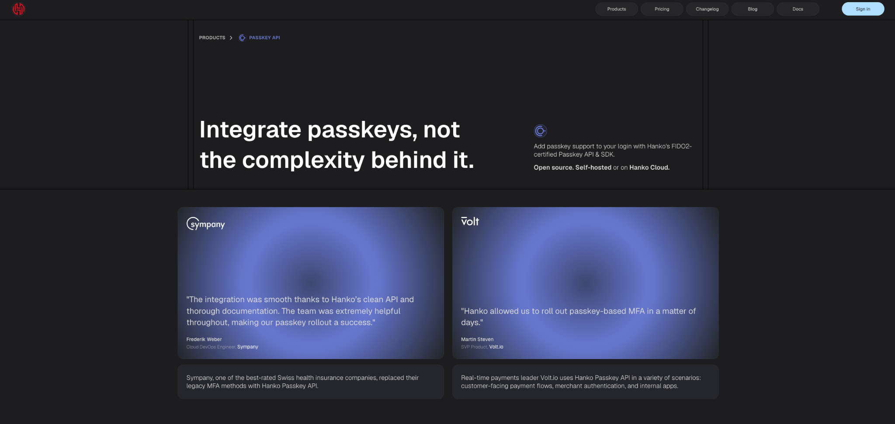

Teams that rule out Keycloak still have open-source authentication options worth a serious look, and two names come up repeatedly: SuperTokens and Hanko. Both are open source, both can be self-hosted, and both offer a managed cloud for teams that would rather not run the backend themselves. The similarity mostly stops there. [**Hanko**](https://www.hanko.io/) is passkey-first, designed from the ground up around WebAuthn and FIDO2. [**SuperTokens**](https://supertokens.com/) is a full-stack authentication platform where passkeys are one capability among many, sitting alongside multi-tenancy, session security, and enterprise SSO.

This comparison covers where each one fits, what the licensing actually obligates, and roughly what the bill looks like at scale.

## At a Glance

||**SuperTokens**|**Hanko**|
|---|---|---|
|License|Apache 2.0|Backend API AGPL v3; Elements + SDKs MIT|
|Self-hosting|Free, unlimited users|Free, unlimited users (AGPL v3 applies to backend)|
|Free tier (cloud)|5,000 MAU|10,000 MAU|
|Paid tier (cloud)|~$0.02/MAU above free tier|~$0.01/MAU above free tier|
|Passkeys / WebAuthn|Supported|Primary focus, FIDO2-certified|
|Multi-tenancy|First-class, API-driven|Basic, developing|
|SAML SSO|Via SAML Jackson (BoxyHQ)|Native|
|SCIM|Via SAML Jackson (BoxyHQ), not native|No|
|Session security|Rotating refresh tokens, theft detection|Standard sessions|

## Passkeys: Hanko's Edge

Hanko treats passkeys as the default enrollment path, not an add-on. Its WebAuthn implementation covers platform authenticators (Touch ID, Windows Hello) and roaming authenticators (hardware security keys), supports cross-device flows, and falls back to email one-time codes when a passkey is not available. The underlying passkey infrastructure is FIDO2-certified, which is the credential that matters most when a security review asks who actually built the WebAuthn layer.

The sharper differentiator is the **Hanko Passkey API**, a standalone product. It exposes a lightweight HTTP API and an SDK for adding passkeys to an authentication stack that already exists, whether that stack is Firebase, Auth0, or something custom. It handles both first-factor passkeys and second-factor WebAuthn, including hardware keys, without forcing a full migration off the current provider. SuperTokens has no equivalent bolt-on passkey product.

SuperTokens does support passkeys through standard WebAuthn, and for a team already on SuperTokens that is usually enough. The distinction is one of focus rather than capability: passwordless UX is Hanko's core product, whereas for SuperTokens it is one recipe inside a broader platform. Full docs for the standalone product live on the [Hanko Passkey API page](https://www.hanko.io/passkey-api).

## Licensing: Apache 2.0 vs. AGPL v3

Licensing is where the two projects diverge most, and it deserves more than a one-line table entry.

SuperTokens ships under **Apache 2.0**, a permissive license. Building on top of it, modifying it, and deploying it as a closed-source service carries no obligation to release source code.

Hanko splits its licensing, and the split is the important part. The **backend API is AGPL v3**, while **Hanko Elements and the JavaScript SDKs are MIT-licensed**. The MIT components are the pieces that get embedded in the frontend, so those carry no copyleft at all. The AGPL v3 obligation attaches only to the self-hosted backend: modifying that backend and running it as a network service triggers the network copyleft clause, which requires publishing the modifications. A team that self-hosts Hanko unmodified is unaffected. A team that forks and alters the backend for a networked service takes on the AGPL obligation. Hanko Cloud sidesteps the question entirely, at the cost of the infrastructure dependency that self-hosting was meant to avoid.

For organizations with a strict policy against copyleft anywhere in the stack, Apache 2.0 is the safer default and removes the analysis entirely. For everyone else, the practical exposure comes down to a single question: does the backend get modified or not.

## B2B Features Gap

For B2B SaaS, the balance tips toward SuperTokens.

**Multi-tenancy** is first-class in SuperTokens: isolated user pools per tenant, per-tenant login methods and SSO, data isolation between tenants, all driven through the API. Role-based access control is built in through its user-roles recipe. Session security is the standout feature, with rotating refresh tokens and token theft detection modeled on the OAuth 2.0 specification, an area where most authentication providers stop at basic session handling.

Hanko's multi-tenancy is still developing and is not yet comparable for a platform that needs to onboard many isolated business customers. SAML SSO is a bright spot for Hanko, which supports it natively, whereas SuperTokens reaches SAML through a documented SAML Jackson (BoxyHQ) integration rather than a first-party feature. Neither product ships native SCIM. SuperTokens documents a SCIM path through that same SAML Jackson integration, so provisioning is achievable with extra wiring; Hanko has no SCIM story at present.

The takeaway is clean: SuperTokens is the stronger fit for multi-tenant B2B SaaS, and Hanko is aimed squarely at B2C passwordless-first consumer apps.

## Pricing

The figures below are estimates for illustration, not vendor quotes. Both providers price the managed cloud per monthly active user above a free tier, and both may layer add-ons or a base subscription fee on top, so treat these as directional.

|**MAU scale**|**SuperTokens Cloud**|**Hanko Cloud**|
|---|---|---|
|5,000|Free|Free|
|10,000|~$100/mo|Free|
|50,000|~$900/mo|~$400/mo|
|100,000|~$1,900/mo|~$900/mo|
|500,000|~$9,900/mo|~$4,900/mo|

SuperTokens cloud is free under 5,000 MAU, then roughly $0.02 per MAU beyond that. Hanko cloud is free under 10,000 MAU, then roughly $0.01 per MAU, half the per-user rate at every paid tier. SuperTokens prices some capabilities, notably MFA and account linking, as paid add-ons, so a realistic invoice can sit above the raw per-MAU line. Hanko's Pro plan may carry a base subscription fee on top of the per-MAU rate, which matters most at low volumes where the fixed cost dominates.

The number that reshapes the comparison for early-stage teams is Hanko's **Startup Program**: up to 1 million MAU free for qualifying startups, in place until the company reaches roughly $500k in ARR or raises more than $1 million in funding. For a pre-revenue consumer app, that keeps the authentication cost line at zero well past the point where most providers begin charging. It is worth putting on the table early rather than treating it as fine print, because it changes the total cost picture materially for the exact stage of company Hanko targets. Details sit on the [Hanko Startup Program page](https://www.hanko.io/startup-plan).

Self-hosting is free on both sides. There, cost is not the differentiator at all; licensing is.

## Pre-Built UI

SuperTokens ships pre-built UI components that are React-first and tightly coupled to its backend SDK, which handles the full authentication flow with minimal wiring. SDKs exist for other frontends, but the drop-in component experience is strongest in React and Next.js, where a working login flow comes together in minutes.

Hanko takes a framework-agnostic route. **Hanko Elements** are native custom elements (Web Components), so they drop into Vue, Svelte, plain HTML, or React without a framework-specific adapter. For any frontend that is not React, that difference removes a genuine integration hurdle rather than a cosmetic one.

## When to Choose SuperTokens

SuperTokens is the better choice for a B2B SaaS that needs multi-tenancy, SSO, and role-based access control under one platform. It fits teams that want a full authentication stack rather than passkeys alone, teams that need rotating refresh tokens and token theft detection, and organizations where Apache 2.0 licensing is a hard requirement.

## When to Choose Hanko

Hanko is the better choice when passkey-first is the core product experience, when the goal is adding passkeys to an existing authentication stack through the standalone Passkey API, and when the frontend is not React. It also fits B2C consumer apps that are cost-sensitive or early-stage, particularly any team that can qualify for the Startup Program.

## Bottom Line

The decision tracks the product, not a feature checklist. B2B with full-platform needs points to SuperTokens. A consumer app built around passwordless UX points to Hanko.

The two are also not strictly either-or. A team can run SuperTokens as its core authentication platform and layer the Hanko Passkey API on top, gaining leading passkey infrastructure without leaving SuperTokens for sessions, tenants, and everything else. That combination pairs SuperTokens' session security and B2B depth with Hanko's passkey specialization.

For teams leaning toward SuperTokens, the fastest way to evaluate it is to stand up the quickstart and wire in a session. Start with the [SuperTokens docs](https://supertokens.com/docs).
