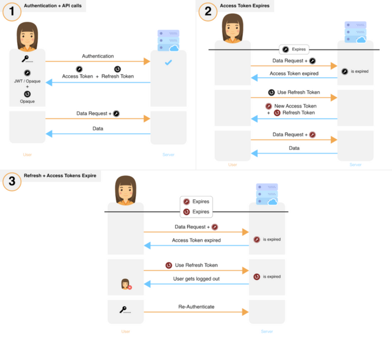

This is part 2 in a two-part series on session management. If the reader understands the general concepts of JWT (JSON web token) and user sessions, then Part 2 can be read without reading Part 1.

[*Part 1: Introduction to session management, analysis of most commonly used session flows, and best practices*](/blog/all-you-need-to-know-about-user-session-security)

*Part 2: Analysis of a new open source session flow that is secure and easy to integrate*

Part 1 provided an educational guide into session management (how auth tokens are handled, stored and changed during an active session) and we discussed several commonly employed session flows. However, we believe that the flows mentioned in Part 1 are sub-optimum in terms of security for most use cases. We came across a flow conceptualized by the IETF (Internet Engineering Task Force) in [RFC 6819](https://datatracker.ietf.org/doc/html/rfc6819). We’ve taken the proposed flow, built it and upon request of others, have open sourced our code for the wider community.

In this post, we’ll explore and analyze the session flow, talk through some implementation details and provide you with a customizable library. The library is production ready and can be integrated with your system in under a day. It’s called SuperTokens.

In this post, we’ll explore and analyze the session flow, talk through some implementation details and provide you with a [customizable library](https://github.com/supertokens/supertokens-core). The library is production ready and can be integrated with your system in under a day. It’s called [SuperTokens](https://supertokens.com).

## Suggested Flow

**Rotating refresh tokens with short-lived access tokens**

- Access tokens are short-lived and refresh tokens are long-lived.
- When a new refresh token is obtained, the old refresh and access tokens are invalidated on the backend and removed from the frontend. Doing this properly is not straightforward. Please see “Notes for Implementation”, discussed later.
- If the user voluntarily logs out, the access and refresh tokens are revoked and cleared from the frontend.

The table below compares the different storage mechanisms across all the various relevant properties. Note that ‘browser storage’ can actually be either local or session storage, IndexedDB or Web SQL.

**Damage Analysis**

The critical auth token is perpetually exposed over two attack surfaces, the frontend, and the backend and occasionally exposed over transit.

*Effect of stolen auth tokens:*  
Access token stolen: The attacker will have unauthorised access for a short period of time (until token expiry)

Refresh token stolen: Detection of theft will enable the stolen refresh token to be invalidated, limiting the damage to a short period of time

*Detection of theft:*  
‍Access token stolen: This theft may only be detected through the use of [heuristic algorithms](/blog/all-you-need-to-know-about-user-session-security#eee3) or if the user notifies the provider / developer of the service.

Refresh token stolen: Detection of theft will be possible as long as both the attacker and victim use the refresh token at least once post the attack. This is illustrated through an example below.

- An attacker has managed to acquire the victim’s refresh token — RT0. Upon expiry of the access token (AT0), both the victim and the attacker would be required to use RT0 to acquire a new set of tokens.

- If the attacker uses RT0 first, then they will receive a new RT1 and AT1, which when used, will invalidate RT0. When the victim uses the invalidated RT0, the server would receive a clear indication that theft has occurred since the client should have used RT1. A similar argument works if the victim uses RT0 first.

- If both, the victim and the attacker, use RT0 at the same time, then one would get (RT1, AT1), and the other (RT2, AT2). The next request by either of them with the new access token would either invalidate RT1 or RT2, resulting in either the victim or the attacker to be eventually[[1]](#footnotes) logged out. Again, here the backend would get a clear indication of theft.

*Once detected:*  
Access tokens need not be revoked since they are short lived. However, if needed, Opaque access tokens can be revoked by removing them from the database.

Refresh tokens can be revoked easily by removing it from the database.

That summarizes the discussion of the conceptual flow. Below, are some additional pointers to keep in mind for readers that would like to implement this flow on their own. Alternatively, we have an open source implementation of this flow available on [Github](https://github.com/supertokens/supertokens-core).

## Notes for implementation

1. The backend invalidates previous tokens when it generates a new pair. In the situation where the frontend does not receive the new tokens (for whatever reason), it will continue to use the previous invalidated ones — resulting in the user being logged out. To prevent this, the backend should invalidate the previous tokens only when the frontend uses the new tokens — confirming its successful receipt.
2. The system generates a new, different refresh token (RT) each time a valid RT is used. To prevent false positives (an indication of theft) and user logouts, one must factor in race conditions that can occur on the frontend[[2]](#footnotes).
3. If a refresh token is revoked, then ideally its access token should also be revoked.
4. Detection of refresh token theft does not require the database to explicitly store invalidated tokens. This can be achieved through structuring the refresh tokens using parent-child hierarchies (see Github implementation).
5. Implementations with JWT access tokens can be as scalable, in terms of space and time complexity, as session flow 5 in part 1. We only need to store one refresh token per logged in user per device in the database.

That concludes the bulk of the matter we have on session management. Below you will find a GitHub repository with the source code that deals with all of the implementation issues. It is highly customizable to your requirements and can be quickly integrated into your system. It is also very secure in terms of prevention and detection of token theft. We’d love to know what you think of it — please do leave a comment or [email](mailto:support@supertokens.com) us.

## SuperTokens Library

We promise to support our library (fix bugs, address issues, add features and update documentation) and be responsive (via SO, email etc).

To show some additional love to our early readers, we’re offering the following dedicated support:

- Free consultations on your current session management system including identifying vulnerabilities and suggesting improvements for your particular use case.
- Free support for the SuperToken library. If you have any issues with implementation, bugs, and customisations — we’ll be available on demand.

Please visit [our documentation](https://supertokens.com/docs/guides) page to find the correct library for your technical stack.

## Final conclusions and recommendations

Building a production-ready session management solution is nontrivial. It requires deep knowledge and is expensive in terms of time and money. Many developers do not prioritize session management — leading to suboptimal, unsecured systems in production.

We’ve discussed various session flows in these two posts. Depending on the requirements, one flow might be better suited than the others. In general, our recommendation would be the following:

For services that deal with **very sensitive data** (eg: a stock trading platform or something like Ashley Madison), security may take precedence over user experience. The ideal flow here would be to use our flow with **short lived refresh tokens and shorter lived Opaque access tokens**. The expiry time of a refresh token would depend on the amount of time you in which you would log out a user due to inactivity (Let’s call this time T). Each time a refresh token is used, the new token will be alive for time T. You may also want to have a hard limit on the lifetime of an entire session. That is, regardless of user activity, the session would expire in this amount of time. This would be estimated, for example, based on how long you expect users to be on your service in a given day.

For all other services, use our flow with **JWT access tokens** (for easier scalability) and **long lived refresh tokens**. You can also use blacklisting to instantly revoke access tokens (this would increase the time per API, but you would save on space in comparison to using Opaque access tokens). However, if you do not want to rely on one shared key for all your authentication (even if that key keeps changing), or if saving network bandwidth is of priority, then use Opaque access tokens. Additionally, security can be improved through the use of 2-factor authentication or passwordless login methods. The latter has the benefit of not requiring users to remember yet another password.

And that’s it! Please do let us know what you thought while reading this through the comments or by emailing us [here](mailto:support@supertokens.com). We hope this was useful.

## Footnotes

*[1] If using opaque token, then immediate logout, else they would be logged out after the expiry time of their new JWT.*

*[2] This is a race condition problem: Let’s say a user has opened your app in Tab1 and Tab2 in their browser. Both these tabs share the same set of cookies. The following illustration demonstrates how a race condition can lead to user logouts.*

