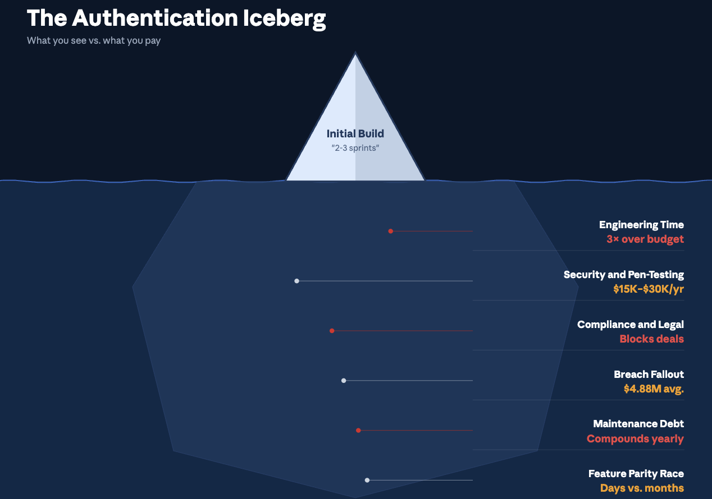
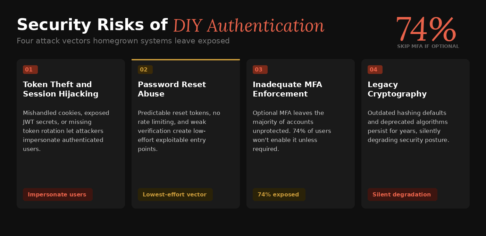

## Why "Roll-Your-Own" Authentication Often Costs More Than You Think

A login form appears deceptively simple. Two text fields, a button, maybe a "Forgot Password?" link. In isolation, it feels like a weekend project. Yet the moment an engineering team begins wiring up password hashing, session management, multi-factor authentication (MFA), and token rotation, a weekend project quietly metastasizes into a long-term commitment that siphons budget, headcount, and strategic focus away from the product that actually generates revenue.

The real expense of homegrown authentication is rarely captured in the initial sprint estimate. Security audits, compliance certifications, on-call rotations, and the opportunity cost of features that never ship all compound over time. What begins as a seemingly prudent investment in "full control" often evolves into a sprawling maintenance obligation that outlasts the engineers who originally built it.

This post unpacks the unseen expenses most teams encounter when they choose to build and maintain their own authentication stack, and examines how purpose-built solutions such as [SuperTokens](https://supertokens.com/) can dramatically reduce that burden.

## What Counts as an "Authentication Stack"?

Before tallying costs, it helps to define the scope of work. An authentication stack is not just the login page. It comprises several interdependent layers.

- **Core components** include sign-up and registration flows, login with credential validation, password reset mechanisms, session management, and multi-factor authentication. These are the features users interact with directly.
- **Supporting layers** sit behind the scenes: a dedicated database or schema for credentials and sessions, email and SMS delivery infrastructure for verification codes and magic links, risk analytics to flag suspicious logins, and breach monitoring to detect compromised credentials in the wild.
- **The lifecycle** extends well beyond the initial build. Teams must secure the stack against emerging threats, maintain it through dependency upgrades and CVE patches, submit it to periodic audits, and scale it as the user base grows. Each phase introduces its own cost profile, and most organizations underestimate every phase after the first.

## Six Hidden Cost Buckets Most Teams Miss

### **1. Engineering Time and Opportunity Cost**

Every sprint devoted to authentication plumbing is a sprint not spent on product differentiation. Authentication work rarely appears on a product roadmap as a revenue driver, yet it routinely absorbs senior engineering time for implementation, code review, and debugging. The trade-off is real: features that drive acquisition and retention are delayed while the team debates session expiration policies.

Consider the typical trajectory. An initial build estimate of "two to three sprints" expands as edge cases emerge: account lockout logic, brute-force throttling, email verification race conditions, concurrent session handling across devices. Each edge case pulls engineers away from the features customers are actually requesting. Over the first year, authentication-related engineering effort frequently exceeds initial estimates by a factor of three or more.

### **2. Security Expertise and Pen-Testing**

Secure authentication demands specialized knowledge in cryptography, token management, and attack surface analysis. Few product-focused engineering teams possess this expertise in-house. Hiring or contracting security specialists is not optional when personally identifiable information (PII) is at stake. Annual penetration tests targeting authentication flows alone can cost between USD 15,000 and USD 30,000, and the remediation cycle that follows each test consumes additional engineering hours.

### **3. Compliance and Legal Exposure**

Regulatory frameworks such as [GDPR](https://www.cloudflare.com/learning/privacy/what-is-the-gdpr/),
[SOC 2](https://www.imperva.com/learn/data-security/soc-2-compliance/#:~:text=SOC%202%20is%20an%20auditing%20procedure%20that,is%20complete%2C%20valid%2C%20accurate%2C%20timely%2C%20and%20authorized), HIPAA, and PCI DSS each impose specific requirements on how authentication data is stored, transmitted, and audited. Meeting these requirements means recurring auditor fees, evidence collection time, data processing agreements, and legal review. Non-compliance does not merely risk fines; it can block enterprise sales and partnership opportunities.

### **4. Incident Response and Breach Fallout**

According to [IBM's 2024](https://www.ibm.com/think/insights/cost-of-a-data-breach-2024-financial-industry) Cost of a Data Breach Report, the global average cost of a data breach reached USD 4.88 million, reflecting a 10 percent increase over the prior year and the largest annual spike since the pandemic. Authentication systems are a primary attack vector. Stolen or compromised credentials accounted for the most common initial breach vector in the same study, and these breaches took the longest to identify and contain, averaging nearly 10 months from intrusion to resolution.

The financial exposure from a single authentication-related breach can dwarf years of development costs. Beyond the direct financial impact, breaches erode customer trust, trigger regulatory scrutiny, and consume executive attention for months. Recovery timelines often exceed 100 days, during which normal product development grinds to a halt. For organizations without dedicated incident response teams and tested response plans, the cost escalation is even more severe.

### **5. Maintenance and Upgrade Debt**

The authentication code does not age gracefully. Cryptographic best practices evolve, dependencies accumulate vulnerabilities, and key rotation policies require ongoing attention. Patching CVEs, updating hashing algorithms, and rotating secrets are recurring obligations that demand dedicated engineering time. Left unattended, maintenance debt introduces security gaps that compound over months and years.

The challenge is compounded by the fact that the authentication code is deeply coupled to nearly every other system in an application. A change to session handling can cascade into API authorization, frontend state management, and third-party integrations. Testing these changes requires comprehensive regression suites that most teams never build for their authentication layer, creating a vicious cycle where maintenance is simultaneously urgent and risky.

### **6. Feature Parity Race**

User expectations for authentication have shifted significantly. Passkeys, single sign-on (SSO), adaptive MFA, social login, and passwordless flows are no longer premium features; they are baseline expectations. Building each of these from scratch requires substantial design, engineering, and testing effort. Meanwhile, competitors leveraging dedicated authentication platforms can ship these capabilities in days rather than months.

## Real-World Examples of DIY Authentication Costs

The following table illustrates how direct and indirect expenses accumulate across common authentication-related activities.
| Scenario                         | Direct Expense                              | Indirect Expense                          |
|----------------------------------|---------------------------------------------|-------------------------------------------|
| Penetration test for authentication flows | USD 15,000 - 30,000 per year           | Internal remediation time                 |
| 24/7 on-call for authentication incidents | 1 - 2 engineering FTEs                 | Burnout, attrition                        |
| Data breach cleanup              | USD 4.88 million average                   | Reputational damage, customer churn       |
| Adding MFA support               | 6 - 8 weeks of development                 | Delays to product roadmap                 |

Each row represents a cost category that is frequently omitted from initial build estimates. Taken together, these expenses can exceed the total annual salary of a small engineering team.

## Opportunity Cost - Features You Are Not Shipping

The most insidious cost of DIY authentication is invisible: the features that never get built. Every hour an engineer spends debugging a session token bug or responding to a password reset vulnerability is an hour not spent on the product capabilities that attract and retain customers.

Engineering teams report losing roughly 10 to 15 percent of their development cycles to authentication-related maintenance and support. For a team of ten engineers, that translates to the equivalent of one to one-and-a-half full-time engineers perpetually diverted from product work. Over the course of a year, the compounding effect on roadmap velocity is substantial. Features slip by quarters, not weeks.

The question worth asking is straightforward: how many customer-facing features have slipped because authentication bugs consumed sprint capacity? For startups competing on speed-to-market, this diversion can mean the difference between capturing a market window and arriving too late. For established companies, it translates into slower iteration on the product capabilities that drive renewal and expansion revenue.

## Security Risks Unique to DIY Authentication

Homegrown authentication systems carry a distinct set of security risks that purpose-built solutions are specifically designed to mitigate.

- **Token theft and session hijacking:** Mishandled cookies, improperly stored JWT secrets, or missing token rotation can allow attackers to impersonate authenticated users. Secure token management requires careful attention to storage, transmission, expiration, and revocation.
- **Password reset abuse:** Predictable reset tokens, missing rate limiting, or inadequate verification steps create exploitable entry points. Attackers routinely probe password reset flows as a low-effort attack vector.
- **Inadequate MFA enforcement:** When MFA is implemented as optional rather than default, the majority of users remain unprotected. Studies suggest that approximately 74 percent of users will not enable MFA unless required, leaving a significant portion of accounts vulnerable to credential-based attacks.
- **Legacy cryptography:** Outdated hashing defaults, such as older bcrypt configurations or deprecated algorithms, may persist in codebases that were built years ago and never revisited. Upgrading hashing in production without disrupting active sessions is a non-trivial engineering challenge.

## Compliance and Audit Headaches

Each regulatory framework imposes its own set of requirements on authentication systems, and compliance is not a one-time event.

- **SOC 2:** Requires yearly auditor engagements, continuous evidence collection, and documented access control policies. The authentication stack is a central focus of any SOC 2 audit.
- **GDPR:** Demands data processing agreements, documented breach notification procedures with strict SLAs, and demonstrable data minimization practices for authentication-related data.
- **HIPAA:** Requires Business Associate Agreements (BAAs), encryption at rest and in transit for all protected health information, and access logging for authentication events.
- **PCI DSS:** Mandates quarterly vulnerability scans, network segmentation tests, and strict password policies for systems handling payment card data.

For organizations subject to multiple frameworks, the cumulative burden of maintaining compliance across an in-house authentication stack can consume significant legal, engineering, and operational resources. Each framework requires its own documentation, its own audit cycles, and its own remediation workflows. The authentication stack sits at the intersection of all of them, making it one of the most
compliance-intensive components in any application architecture. A single misconfiguration in session handling or credential storage can
trigger findings across multiple audits simultaneously.

## How SuperTokens Eliminates (or Shrinks) These Costs

SuperTokens approaches the authentication cost problem from a different angle. Rather than requiring teams to build and maintain every component from scratch, it provides a modular, open-source authentication platform designed to eliminate or substantially reduce the cost categories outlined above.

- **Open-source core with zero license fees:** The core library is freely available, with a fully managed cloud option for teams that prefer to offload operational overhead.
- **Drop-in recipes for common flows:** Email-password authentication, social login, MFA, and passkey support are available as pre-built, tested modules. Integration typically takes days rather than months.
- **Built-in token rotation and theft detection:** Automatic session token rotation and anomaly detection reduce the blast radius of credential compromise without requiring custom implementation.
- **SOC 2 and GDPR-ready architecture:** Audit documentation, encryption defaults, and data handling practices are designed to align with common compliance requirements out of the box.
- **Pluggable storage and self-hosting:** Teams can host the authentication core on their own infrastructure to satisfy data residency requirements, or use the managed cloud service for operational simplicity.

### **Quick Cost Comparison**
| Expense Category      | DIY Authentication (Year 1) | SuperTokens Self-Host | SuperTokens Cloud |
|----------------------|-----------------------------|----------------------|-------------------|
| Engineering build time | 3 - 6 FTE-months           | 1 - 2 days           | 1 day             |
| Pen-testing and fixes  | ~USD 20,000                | Included templates   | Covered by vendor |
| Maintenance patches    | 0.5 FTE ongoing            | OSS community releases | Handled by vendor |
| Breach liability       | High                       | Reduced via token rotation | Vendor SLAs   |

The comparison is not intended to suggest that third-party solutions eliminate all risk, but rather that they shift a substantial portion of the engineering, security, and compliance burden to a platform purpose-built for the task.

## Implementation Roadmap - Migrating Off DIY Authentication

For teams currently running a homegrown authentication stack, migrating
to SuperTokens can follow a phased approach that minimizes disruption.

1. **Audit current authentication features and debt.** Catalog existing flows, identify known vulnerabilities, and document compliance gaps.
2. **Spin up SuperTokens Core in a development environment.** A Docker-based deployment provides a low-risk environment for evaluation and integration testing.
3. **Integrate session management and the primary authentication factor.** Start with email-password or SSO, depending on the existing user base.
4. **Add the MFA recipe and enable token theft detection.** Layer in additional security features once the primary flow is stable.
5. **Gradual cut-over using feature flags or dual-write.** Route a percentage of traffic to the new system while maintaining the legacy stack as a fallback.
6. **Sunset legacy authentication code.** Once sessions are stable and monitoring confirms correct behavior, decommission the old stack.

This phased approach reduces migration risk and allows teams to validate each step before proceeding to the next.

## Objections and Counterpoints

| Objection                                   | Rebuttal                                                                 |
|--------------------------------------------|-------------------------------------------------------------------------|
| "We need full control over our authentication system." | SuperTokens is open source. Every function can be overridden, and the source code is available for inspection and modification. |
| "We are concerned about vendor lock-in."   | The core can be self-hosted. There are no proprietary token formats, and migrating away does not require re-engineering session management from scratch. |
| "Our use case is unique and will not fit a standard platform." | Custom recipes and lifecycle hooks allow teams to extend authentication flows without forking the codebase. |

## Future Trends - Why DIY Will Get Even Harder

Several trends suggest that the cost of maintaining a DIY authentication stack will continue to rise.

- **Passkeys and FIDO2 adoption:** Hardware-bound credentials introduce new user experience requirements and cryptographic complexity. Supporting passkeys alongside traditional authentication methods requires careful design and ongoing maintenance.
- **Expanding privacy regulations:** State-level privacy laws in the United States are increasingly mirroring GDPR requirements. Each new regulation adds compliance obligations that directly affect authentication data handling.
- **AI-powered credential stuffing:** Attackers are leveraging machine learning to execute faster, more targeted credential stuffing attacks. Defending against these attacks requires continuously updated detection mechanisms that go beyond static rate limiting.

These trends collectively raise the floor on what constitutes an adequate authentication implementation, making the build-versus-buy calculus increasingly unfavorable for in-house solutions.

## Conclusion - Skip the Hidden Costs, Focus on Your Product

Building authentication in-house appears cost-effective at the outset. The initial implementation may require only a few engineering sprints. However, the cumulative costs of security hardening, compliance maintenance, incident response, and feature parity rapidly compound beyond initial estimates. For most engineering teams, the ongoing burden of a DIY authentication stack represents a significant and avoidable drag on product velocity.

The calculus becomes even less favorable as the threat landscape intensifies and regulatory requirements expand. What was adequate two years ago may already be non-compliant today, and the gap between "good enough" and "production-grade secure" continues to widen.

SuperTokens offers a path to offload that burden. With an open-source core, pre-built authentication recipes, built-in security mechanisms, and compliance-ready architecture, it allows engineering teams to redirect their time and expertise toward the features that differentiate their product. The hidden costs of authentication are real, but they are also optional. The engineering hours, the compliance overhead, and the security exposure that come with a DIY stack can be reduced to a fraction of their current footprint by adopting a platform built specifically for the problem.