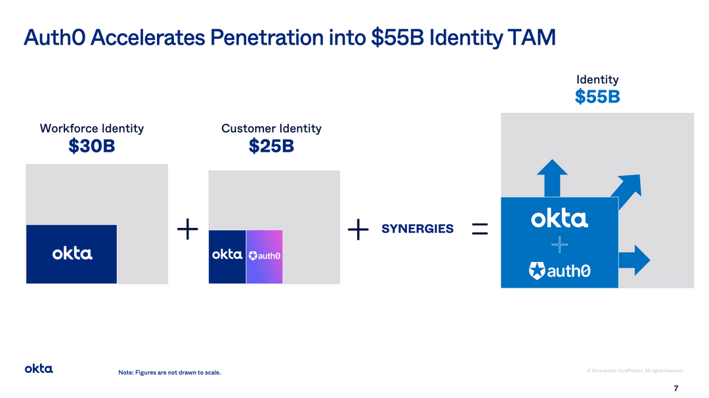
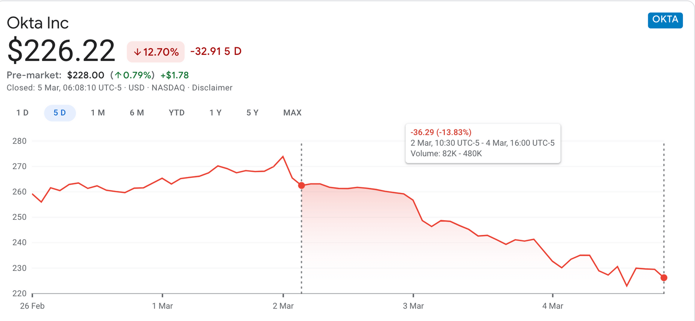

Okta acquired [Auth0 for $6.5B](https://www.okta.com/press-room/press-releases/okta-signs-agreement-to-acquire-auth0/) in an all stock deal (Okta was valued at ~$35B in the few days preceding the announcement).

In July last year, Auth0 [raised $120M](https://auth0.com/blog/auth0-announces-120m-seriesf-funding/) in private financing at a valuation of $1.9B. The round was led by Salesforce Ventures with participation from DTCP and other existing investors.

**The acquisition is a ~3.5X jump in Auth0’s valuation from last year.**

## Why acquire Auth0 for $6.5B?
1. **Complementary product and revenue stream**  Okta’s core strength is workforce identity and it used to be almost all of their revenue. In the last few years, revenues from their customer identity product has grown to 25% of total revenues from almost nothing. Auth0 core strength is customer identity. With Auth0, Okta has the best product for both use cases.
2. **Increasing addressable market**  According to Todd, the founder of Okta, workforce identity is a $30B market and customer identity is $25B. The customer identity space effectively doubles Okta’s addressable market. In return, Okta is paying 20% of its market cap for that opportunity. 
3. **Competition and pricing power**  Auth0 is the most prominent alternative that customers consider when evaluating Okta. The acquisition of Auth0 eliminates that threat and grants Okta pricing power as a result.
4. **Go To Market (GTM) strategy**  Okta is built as a top down sales organisation whereas Auth0 is built with a developer first bottoms up acquisition strategy. This allows Okta to get the best of both worlds.  In the words of the Founder and CEO of Auth0, “We have a large thriving developer community, which provides powerful grassroot support for Auth0 within SMB and enterprise that we leverage in our sales motion. Our developer-led adoption fosters rapid customer growth”
5. **Strategic acquisition**  There were rumours that Salesforce was interested in acquiring Auth0. Given that Salesforce has made several key acquisitions (Slack, Mulesoft, and others) and led Auth0’s last round, this is a well founded theory. It is possible that Okta had to make a preemptive move. We’ve heard anecdotally that Salesforce’s and Oracle’s identity solution were both performing badly and they were looking to do something about it. Auth0 was the perfect candidate for and was also supposedly being shopped around.

Finally, there was a Hackernews comment along the lines of: “$6,500,000,000.00 for a company providing authentication APIs?” and the sentiment has been echoed by others too.

The thing to note is that Okta isn't just acquiring an API or a product. It’s acquiring $200M in recurring revenue that’s probably growing at 50%. As soon as Okta acquires its largest competitor, it can also refactor Auth0’s (and it’s own) pricing to increase revenue even further. So it's paying a lot upfront for what it hopes will be even more in the future. 

Now that we have some clarity on the acquisition, we’ll be looking at how the (stock) market, users and employees reacted to the news (largely drawn from Reddit, Hackernews and some personal conversations).

## Reactions (and what this means)
**Market**  
Okta’s will acquire Auth0 in an all stock deal and dilute existing shareholders by 20%. The 10% fall in the stock price (equivalent to a decrease in $3-4B) immediately post the announcement means that investors are valuing Auth0 at half the price what Okta paid for it.

Okta will issue shares to Auth0 shareholders at share price of $276.21, close to 20% less than the current share price (at the time of writing).

**Users**  
In general, the developer community has had an unpleasant experience with Okta. This is perhaps expected given that it is not a “developer first” company. Below are some excerpts taken from Hackernews.

“We moved from Okta a few years ago after we basically received almost no actual real support for a bunch of issues, even though we were paying a premium cost. Nobody cares about issues on their Github”. “We ended up switching to Auth0”, “shaved a decent amount off our costs”. “In the end we were much happier.”

“Okta requires you to "contact support" to turn on basic features like email customization, and even though I'm a paying customer, I was given a multi-week estimate (after waiting a week or two) for how long it would take to enable this feature”

“We use Okta for multiple AWS accounts and they "ran a bad migration" that deleted half our permissions and took a month to resolve. On top of that, nothing appeared in the audit logs.”

“Okta as a business are a pain to deal with, and unless you meet their minimum spend requirements (which are not told to you up-front) you're screwed.”

**Employees**  
‍Similarly, employees were worried about Auth0, given their experience with Okta’s culture and hiring process.

“I interviewed with both, and the process at Auth0 had me walk away with respect, while contrasted with Okta that left me reminded that tech hiring is broken.”

“The two companies couldn't be more different, with Auth0 embracing a remote-first-class culture with creative interview processes, and Okta (pre-covid) being very much the opposite.”

I used to work on the Okta team.. As far as I could tell, Okta is a sales company. The salespeople got the fancy events, the high floors with nice views, all the budget… Enterprise customers are the only ones that mattered.. I got to know some people who came into Okta via acquisitions and let’s just say it’s not a fun ride.”

## What next for Auth0?

Officially the statement is that the “Company will operate as an independent unit inside of Okta as they look for paths to integration in the coming months”.

## What is the opportunity for SuperTokens?

1. The incumbents in the space are Okta, Auth0, Firebase and AWS Cognito. However, they are all closed source, proprietary companies. We have a strong belief in our open source approach as it benefits all stakeholders - customers, the community and us as a company. There are a few others who are taking this approach and there is a strong possibility for a project like SuperTokens to reach the scale that matches the incumbents.
2. Consolidation typically creates small vacuums. It is our job, as the project creators, to understand which vacuum (niche) is the strongest.
3. We claim to be truly developer friendly. **But what does that really mean?** How do we demonstrate that?
    - First is **our open source approach** - we place developers and the community above all else.
    - Second is the **modular architecture of SuperTokens**. This enables developers to pick features they need for their use case and forget about the complexity associated with everything else (for example, if you do not need SSO, no need worry about OAuth flows). It allows you to add authentication functionality as your product and company scale. **We even have different docs based on your feature set and use case.**
    - Finally, our frontend UI is the most customizable we’ve seen of any of the alternatives. While Auth0 provides a ready made frontend or exposes the backend APIs to build your own frontend, we provide ready made frontends and make it far easier to build your own theme or customize existing ones.

Hope this added some insight into this massive development. We’re excited about the space and are here to serve developers everyday.