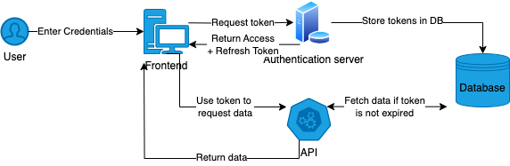
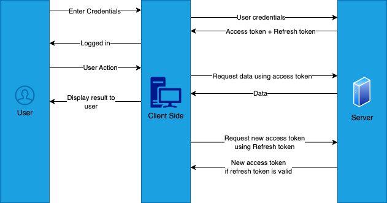

```toc
tight: true
toHeading: 3
```

Authentication has become the backbone of almost every modern day web/mobile application today, with preventing unauthorised access to your systems being more important than ever. As a result protecting your API layer from potential threats is extremely important. Token based authentication has become a really popular choice when it comes to protecting both your frontend and API layers. In this article we will cover what token based authentication is, how it works and what are some benefits of using it.

## What is token based authentication

Token based authentication has become the go to choice for adding protection to your API layer, it involves exchanging the user's credentials with a token that contains information about the user's identitify and has an expiration. This token is then used to communicate with your APIs instead of having to use user credentials directly. The token can also contain additional information such as the user's role, access level etc that is more unique to your application. Eventually when the user's token expires it can be exchanged for another token or the user can be prompted to login again.

Let us consider an example of any streaming platform, when you sign up and subscribe you gain access to the platform foe a limited amount of time. Think of this subscription as your token. As long as your subscription doesn't expire you can access the platform and once it does expire you can choose to renew (or "refresh") it or stop using the platform. This is similar to how token based authentication works.

Here are some key properties of a token:

- **Compact**: Tokens must be small so that they can be sent via HTTP headers or URL parameters
- **Self Contained**: Tokens should have all the information necessary to identify the user and their access levels.
- **Short Lived**: Tokens must have an expiry, it is recommended for tokens to have a relatively short lifetime to avoid token theft

The following flow diagram provides a brief overview of how token based authentication works:



Our [token based authentication blog](/blog/token-based-authentication) covers more in depth information about tokens and how they work.

## Token based authentication in APIs

Token based authentication in APIs functions around the concept of access tokens and refresh tokens, when a user logs in to your application your backend issues them an access token and refresh token. The access token is a short lived token that provides information about the user, the refresh token can be used to generate new access tokens when they expire. Both tokens have an expiry but the refresh token typically has a longer lifetime, allowing the users "session" to be refreshed without requiring them to log in again.



A common addition to token based authentication for web APIs is passkeys which is a relatively new form of authentication. You can learn more about this in our [Passkey authentication blog](/blog/passkey-authentication).

Access tokens are typically JWTs in most modern day application, JWTs allows us to store user specific information (such as role) in the access token in a human readable format. These are often referred to as session claims. These JWTs are thenu sed in your APIs to make sure users have the correct access among other things. Our [What is JWT](/blog/what-is-jwt) blog cpvers more information about JWTs.

## Implementing token based authentication in web APIs

- **1. User Submits Credentials**: The user sends login credentials to the API's authentication endpoint.
- **2. Server Validates Credentials**: The server checks the provided credentials against the database to verify the user's identity.
- **3. Generate a Token**: The server creates a token (e.g., JWT) containing user information, an expiration time, and a cryptographic signature.
- **4. Send the Token to the User**: The token is sent back to the user in the login response, serving as a digital key for future API requests.
- **5. Store the Token Securely**: The client securely stores the token in HTTP-only cookies, secure local storage, or device-specific secure storage.
- **6. Attach the Token to API Requests**: The client includes the token in the Authorization header (e.g., Bearer <token>) for every request to protected endpoints.
- **7. Validate the Token on the Server**: The server verifies the token's signature, expiration, and claims to ensure it is valid and authorized.
- **8. Process the Request**: Upon successful validation, the server processes the request and returns the response to the client.
- **9. Token Expiration and Refresh**: Tokens expire and can be refreshed using a refresh token or by requiring the user to log in again.
- **10. Revoke Tokens (Optional)**: Tokens can be invalidated if a user logs out or a token is compromised, enhancing security.

## Common challenges for authentication in web APIs

- **Scalability Issues**: In high-traffic applications, validating tokens at scale can become a bottleneck, particularly if tokens need to be checked against a central database or service.

- **Compatibility Across Platforms**: Ensuring seamless authentication across diverse platforms (e.g., web, mobile, IoT) can require significant effort in standardizing and implementing token handling mechanisms.

- **Revocation Mechanism**: Implementing a reliable way to revoke tokens is complex, especially in stateless systems where the server doesn't store session data.

- **Token Expiration and Refresh**: Managing token lifetimes effectively is challenging. Expired tokens must be renewed without impacting the user experience while ensuring compromised tokens cannot be reused.

- **Compliance and Privacy**: Ensuring token-based authentication complies with regulatory requirements like GDPR or HIPAA, especially when tokens store user information.

## Why do we need token based authentication in APIs?

- **Securing user data**: APIs often handle sensitive data, such as personal information, financial transactions, or healthcare records. Token-based authentication ensures that only authenticated and authorized users can access this information, reducing the risk of data breaches.
- **Stateless Communication**: Unlike traditional session-based authentication, which requires the server to maintain user session data, token-based authentication is stateless. This means that the server does not store any session-related information, relying entirely on the token provided by the client. This approach is more efficient and scalable, especially for APIs that serve a large number of users.
- **Cross-Platform Compatibility**: Token-based authentication works well across different platforms, including web browsers, mobile apps, and IoT devices. Once a user is authenticated, the same token can be used on any platform, providing a consistent user experience.
- **Enabling Modern Authentication Standards**: Token-based authentication forms the foundation of widely used authentication standards like OAuth 2.0 and OpenID Connect. These standards provide advanced features like [Single SignOon (SSO)](/blog/sso-authentication) and [Multi-Factor Authentication (MFA)](/blog/mfa-best-practices) making them ideal for modern applications.
- **Simplifying API Access for Developers**: For API consumers, token-based authentication simplifies the process of accessing secured endpoints. Developers only need to include the token in their API requests, streamlining integration without exposing sensitive credentials.

## Best practices when building token based authentication

- **Secure transmission of tokens**: Always transmit tokens oevr https only to prevent them from being intercepted
- **Short lived access tokens**: Set short expiration times for access tokens to minimize the impact of a compromised token. Use refresh tokens for extending sessions securely.
- **Secure Token Storage**: For web apps, store tokens in HTTP-only cookies to prevent JavaScript access. For mobile apps, use secure storage mechanisms like iOS Keychain or Android Keystore.
- **Token signing**: Use strong algorithms like RSA and HMAC when signing your tokens
- **Token verification**: Verify the signature, expiration, and claims in the token for each API request. Reject invalid or expired tokens immediately.
- **Key rotation**: Regularly rotate cryptographic keys used to sign tokens, and ensure old tokens signed with previous keys can still be validated if necessary.
- **Test for Vulnerabilities**: Regularly audit and test your implementation for security issues, such as token forgery, tampering, or leakage.

## Common issues and troubleshooting when building token based authentication

- **Token expiration**: Improper handling of token expiration results in a high number of API failures. Make sure to inspect the `exp` claim of the access token when verifying it and remember to account for clock skew when validating expiry. Also make sure the client handles access token expiry gracefully by refreshing already expired access tokens before makign API requests or prompting the user to log in when the access token is expired.
- **Token transmission errors**: Often times not sending the token in an expected way results in failures in the API. Make sure the client and server agree on a mechanism for token delivery, for exmaple Bearer tokens using the `Authorization` header in HTTP requests. It is recommended to not send tokens as query params to prevent token theft.
- **Cross Origin (CORS)**: A very common source of errors in APIs, especially in Web applications, is CORS. If you are using `Authorization` headers to trasmit your token make sure your servers `Access-Control-Allow-Headers` header includes the authprization header.
- **Bottlenecks for token verification**: If your token needs to be verified using the database every time it can often lead to bottlenecks as your application scales. Make sure to use stateless tokens such as JWTs to avoid this.

--------------

Token-based authentication has become a cornerstone of modern API security, offering a flexible and scalable solution for managing user access. By understanding how tokens work, their benefits, and the challenges they address, developers and product owners can implement robust authentication mechanisms to protect sensitive data and resources.