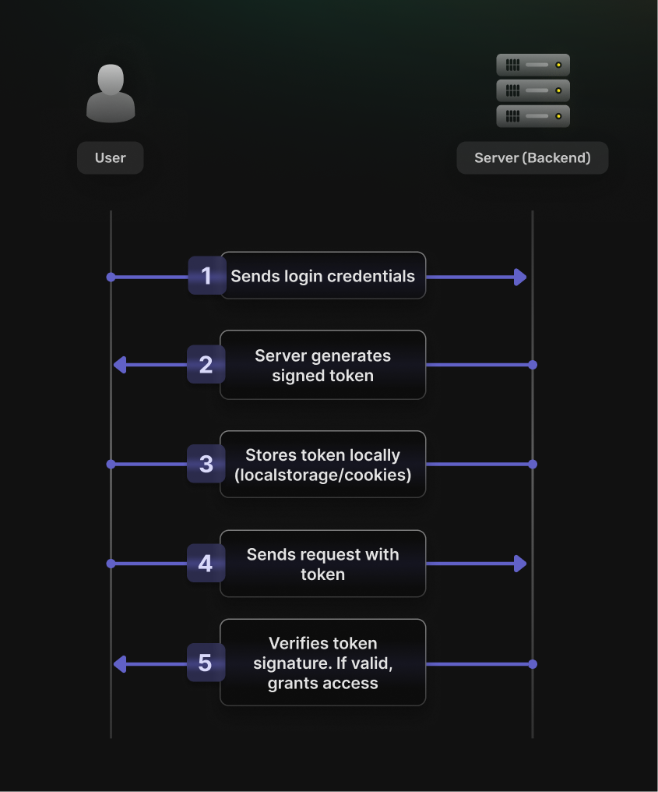

Dealing with a question such as "Should I use tokens or sessions for my auth needs?" may seem like a tough choice make. And like many things in tech, the answer is... it depends! 😅 

Let's break this down together and see what makes each approach tick. No mystical ["auth is hard"](https://supertokens.com/blog/but-auth-is-hard) nonsense - just practical insights from someone who's had to make the choice more than once. 

## Understanding Token-Based Authentication 

Remember the last time you went to an event and got a wristband? That's basically what token-based auth is! When you log in, instead of the bouncer (server) remembering your face, they give you a special wristband (token) that you show every time you want to get back in. 

### What is token-based authentication

Put in more encyclopedic terms, token-based authentication is a protocol where a client receives a token upon successful authentication, which it uses to access protected resources without requiring the server to retain session state for each client. Personally, I still enjoy the "bouncer" analogy above, though.

### How it works: The process of token generation, use, and validation

Here's how it actually works under the hood:

1. You login with your credentials
2. The server generates a signed token (usually a JWT) 
3. You store that token (usually in localStorage or cookies) 
4. Every request you make includes this token 
5. The server verifies the token's signature and lets you in 
   
   

### Advantages: Security, scalability, and statelessness.

The beauty of this approach? The server doesn't need to remember anything! Each token contains all the info needed to verify who you are. It's like a self-contained VIP pass 🎫.

- **Statelessness:** The server doesn’t maintain session data, allowing for efficient scaling.
- **Flexibility:** Tokens can be used across different domains, ideal for microservices.
- **Security:** Tokens are signed and can be encrypted, with expiration times to enhance security.
- **Decoupled Authentication:** Supports third-party services and Single Sign-On (SSO).
- **Ease of Implementation:** Natural fit for RESTful APIs and modern web apps.

### Use Cases: Where Token-Based Authentication Shines

Tokens shine brightest in these scenarios: 

- **Distributed Systems:** Got microservices? Tokens are your friend. Each service can verify requests independently.
- **Mobile Apps:** Perfect for that banking app that needs secure access even when offline.
- **Cross-Domain Auth:** Running a suite of apps? Tokens make Single Sign-On (SSO) a breeze.
- **APIs:** Building a platform for third-party devs? Token-based auth is practically the standard.
- **Serverless:** When your functions are stateless, your auth probably should be too.

## Understanding Session-Based Authentication 

Now imagine instead of a wristband, the bouncer actually remembers your face (and probably your name and favorite drink too). That's session-based auth! When you log in, the server creates a session and stores some info about you. 

### What is session-based authentication?

Once again to put it into more encyclopedic terms, session-based authentication is a protocol where the server creates and maintains a session upon a user's successful login. This session contains information about the user, such as their identity and authentication state, which is stored server-side. The client receives a session identifier (often stored as a cookie) to include with each request, allowing the server to associate the request with the corresponding session data.

### How it works: The process of session creation, management, and expiration

The workflow looks like this: 

1. You login with your credentials 
2. Server creates a session and stores your info 
3. You get a session ID (usually in a cookie) 
4. Every request includes this session ID 
5. Server looks up your session and knows who you are It's more like having a tab at your local bar - they know you, and everything about your visit is stored on their end. 

### Advantages: Simplicity, state management.

Session-based authentication offers several advantages, particularly in scenarios where maintaining state and immediate control over user sessions is important.

- **Immediate Invalidation:** Sessions can be invalidated instantly, allowing administrators to revoke access as soon as it’s necessary.
    
- **Simplicity:** Ideal for monolithic applications and web browsers, session-based authentication offers a straightforward approach to managing user logins. 
    
- **Stateful Management:** The server maintains user state, which simplifies certain implementations by allowing direct access to user-specific data. In other words, simpler personalization.

### Use cases: Where session-based authentication is most effective.

Sessions are particularly great for: 

- **Monolithic Apps:** When you're not dealing with distributed systems 
- **Browser-Heavy Apps:** Sessions + cookies = match made in heaven 
- **High-Security Needs:** When you need that instant kill-switch for user sessions
- **Heavily Personalized Apps:** Think e-commerce with complex shopping carts

## Comparative Analysis: Comparative Analysis: Token Based Authentication vs Session Based Authentication 

Now let's put these two head-to-head, to find out which one may be the right one for your next project!

### Security

- **Tokens:** Self-contained and signed, but can’t be invalidated until expiration.
- **Sessions:** Can be immediately invalidated, but require secure session storage.

### Performance

- **Tokens:** Fewer database lookups, but larger request payloads.
- **Sessions:** Quick lookups, but require session storage on every request.

### Scalability

- **Tokens:** Excellent for distributed systems due to statelessness.
- **Sessions:** Requires sticky sessions or shared session storage.

## Choosing the Right Method

So how do you choose? Here's one way.
### Factors to consider when choosing between token and session-based authentication.

Based on the pros and cons of each above, we have to take into consideration the following:

1. Distribution - whether our app is distributed or monolithic
2. Cross-domain - whether we're using multiple domains or not
3. Environment - are we building primarily for browser, phones or something else entirely?
4. Session Termination - do we need it immediately or not?
5. Are we building for scale from the start or not?

### Decision framework based on application needs and user scale.

Let's ask some question based on the above, so that we can arrive at a decision:

1. **Are you building distributed systems?**
   - Yes → Tokens
   - No → Either works

2. **Need cross-domain auth?**
   - Yes → Tokens
   - No → Either works

3. **Building primarily for browsers?**
   - Yes → Sessions might be simpler
   - No → Consider tokens

4. **Need instant session termination?**
   - Yes → Sessions
   - No → Either works

5. **Building for scale?**
   - Yes → Tokens
   - No → Either works

## How SuperTokens Fits In

Of course, at SuperTokens we're more into offering you the tools to roll whatever solution you need. We support both sessions and tokens.
### SuperTokens solutions for token-based authentication.

If you chose tokens, check this out: https://supertokens.com/docs/thirdpartyemailpassword/common-customizations/sessions/with-jwt/read-jwt#1-enable-exposeaccesstokentofrontendincookiebasedauth

Basically, token-based auth with SuperTokens is a boolean flag switch away from being enabled.
### Support for session-based authentication with SuperTokens.

If you'd rather go for sessions, check this out instead: https://supertokens.com/docs/thirdpartyemailpassword/quickstart/frontend-setup - which, is the default way of how SuperTokens works, so no need to do much of anything there.
### Integrating SuperTokens with various application architectures.

In other words, SuperTokens offers you the tools to roll whatever setup makes sense for your project - you can even mix and match approaches. Here are some examples and ideas on how to do that:

1. **Microservices Architecture:** In a microservices setup, where services are distributed across different domains, SuperTokens can be configured to use token-based authentication. This allows each service to independently verify tokens. For instance, an e-commerce platform with separate services for inventory, payments, and user management can use tokens secure the interactions between the user and these services.
2. **Single Page Applications (SPAs):** You can integrate SuperTokens in an SPA with session-based authentication, maintaining user state across the application. The users remain logged in as they navigate through different sections of the app.
3. **Mobile Applications:** For mobile apps, where offline access and efficient data usage are important, SuperTokens can implement token-based authentication. Tokens can be stored securely on the device, allowing the app to authenticate requests even when offline. This is particularly useful for apps that need to function in environments with intermittent connectivity, such as travel or field service applications.
4. **Hybrid Applications:** Some applications might benefit from a hybrid approach, using session-based authentication for web interactions and token-based authentication for API calls. SuperTokens supports this flexibility, enabling developers to mix and match methods based on specific use cases. 
5. **Serverless Architectures:** In serverless environments, where functions are stateless and triggered by events, SuperTokens can be configured with token-based authentication to verify requests. This approach is a natural fit the statelessness of serverless computing, allowing functions to authenticate users without maintaining session data.

## Conclusion

The "token vs. session" debate might make for great Twitter drama, but in practice, with modern auth solutions like SuperTokens, it's becoming less and less relevant. Both approaches work well, and you can even use both if that makes sense for your use case. My advice? Pick whatever makes sense for your current architecture and know that you can change or mix approaches later if needed. The heavy lifting is handled for you - focus on building your app instead of sweating the auth details. Remember - auth shouldn't be the interesting part of your application. It should just work™️. Now go build something cool! 🚀

