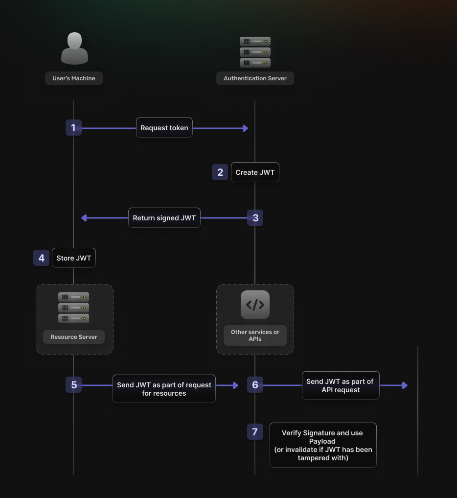
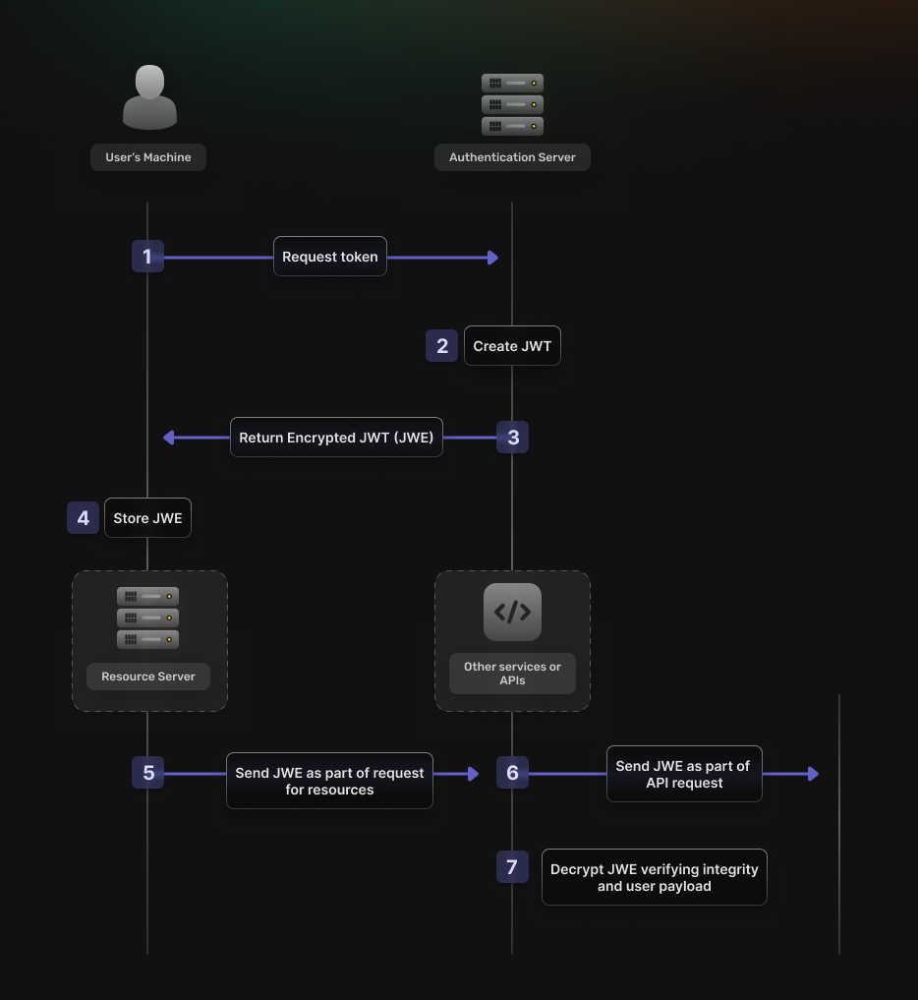

## Table of Content
- [Introduction](#introduction)
- [What is Token Based Authentication](#what-is-token-based-authentication)
- [How do Tokens work?](#how-do-tokens-work)
- [Token-Based Authentication & UX](#token-based-authentication--ux)
- [Is Token-Based Authentication Secure](#is-token-based-authentication-secure)
- [How to implement Token-Based Authentication]
- [Conclusion](#conclusion-embracing-an-easier-more-secure-authentication-method)

## Introduction
In token-based authentication, once users verify their identity through a login process, they are granted a digital "token." Imagine you're attending a festival with multiple stages and events happening simultaneously. Instead of having to show your ID and buy a ticket at the entrance of each event, you are given a special pass when you first enter the festival. This token acts much like that festival pass, granting them access to various services and resources without the need to re-authenticate. It streamlines their experience, making navigation seamless and hassle-free while maintaining security across all access points. In this article, we'll dive into some of the UX aspects of token-based authentication.

## What is Token Based Authentication

Token-based authentication is a sophisticated method of managing user sessions that has become crucial in modern software development. It leverages digital proofs of identity (tokens) to verify and maintain user identity across sessions, enhancing both security and user experience. 

Tokens are created upon successful login and used to validate future requests without sending actual credentials. This minimizes the risk of credential theft and allows for additional security measures, such as setting expiration times on tokens and revoking them when they are suspected of being compromised. 

From a user experience perspective, tokens streamline interactions with applications by eliminating the need to authenticate with credentials on every transaction. Once a token is issued, it can be used for subsequent requests, allowing for seamless interaction with the application. 

Compared to traditional credential verification, token-based authentication offers a more efficient solution. Tokens like JWTs contain all necessary data to verify the user's identity and permissions, encrypted and compacted into a single string. This verification is purely computational, making it significantly faster and less resource-intensive for the server. 

Overall, token-based authentication is a powerful tool for enhancing both security and user experience. By reducing the frequency of transmitting sensitive information and streamlining user interactions, it makes life easier for everyone involved.
We can probably agree that the less we have to do, the better—or at least, the fewer steps we have to take to authenticate ourselves, the more desirable the process becomes. Token-based authentication simplifies these interactions by minimizing the need for repetitive logins, allowing users to get on with the more important tasks without compromising security. This approach respects user time and convenience and maintains integrity and confidentiality. So, in a way, being a bit lazy about re-entering credentials might just be the smartest move we can make.

## How do tokens work?
The workflow of token-based authentication involves several steps:
1. **User Authentication**: The user logs in with their credentials.
2. **Token Generation**: The server generates a token, typically a JSON Web Token (JWT), containing encoded user details and session metadata. During the token based authentication process, the server generates an access token after user authentication. This expired access token must be carefully managed, as it controls the session's lifespan and ensures that the user's browser doesn't retain access indefinitely.
3. **Token Transmission**: This token is securely sent to the client, typically via HTTPS.
4. **Storage and Management**: The client stores the token and includes it in the HTTP header of subsequent requests.
5. **Token Verification**: The server verifies the token with each request to ensure validity.

A comprehensive guide to JWT, including its benefits and technical specifics, can be found in this detailed piece on our blog: [What is JWT](https://supertokens.com/blog/what-is-jwt)?

## Token-Based Authentication & UX

Imagine you're back at our proverbial festival, equipped with your all-access pass. This pass allows you to move freely between different stages and events—no queuing or need to validate your entry whenever you switch locations. Like this pass, token-based authentication enhances the user experience in digital environments. Once users complete their initial login, they receive a "digital pass" in the form of a token. This token then facilitates smooth and seamless interactions across multiple platforms, services, or applications.

Additionally, the flexibility of token-based authentication supports UX-enhancing features such as Single Sign-On (SSO). SSO allows users to access multiple applications with one set of credentials, similar to a festival pass that admits you to every show and offers perks at associated venues outside the festival. For more insights on proper JWT usage, check this article out on our blog: [Are You Using JWTs for User Sessions in the Correct Way?](https://supertokens.com/blog/are-you-using-jwts-for-user-sessions-in-the-correct-way)

## Is Token-Based Authentication Secure?

By now, I hope I've made a compelling case for tokens enhancing user experience, but what about the security aspects? Can token-based authentication, mainly JSON Web Tokens (JWTs), be considered reliable from a security standpoint? Let's explore some of the technical details.

### Signing and Encryption of JWTs

JWTs can be secured in several ways, enhancing their integrity and confidentiality:

- **Signing (JWS)**: JWTs are typically signed using a cryptographic algorithm to ensure that the contents have not been altered after issuance. This signature guarantees the token's authenticity, verifying that it's been issued by a legitimate source and that its data hasn't been tampered with.
- **Encryption (JWE)**: Encryption conceals the contents of the JWT from unauthorized parties. While signing does not hide the payload, encryption ensures that the token's contents are only visible to entities that have the appropriate decryption key. This is particularly important when the token contains sensitive information.

Encryption of a JWT is advisable if you need to protect sensitive information from the client (bearer) or third parties.

That said, encrypting the entire JWT might not always be necessary. JWTs are signed, as described above, which prevents the token from being tampered with. This signature ensures that any modification to the token’s data by unauthorized parties can be detected, as the cryptographic signature will no longer match the header and payload. Therefore, the integrity of the JWT is maintained from the point it is issued until it expires or is verified.

That said, encrypting the entire JWT might not always be necessary. JWTs are signed, as described above, which prevents the token from being tampered with. This signature ensures that any modification to the token’s data by unauthorized parties can be detected, as the cryptographic signature will no longer match the header and payload. Therefore, the integrity of the JWT is maintained from the point it is issued until it expires or is verified.

However, while signing protects against tampering, it does not conceal the data. The contents of the JWT are still accessible to anyone who possesses the token. So, the real question is: does the data in the JWT need encryption? The answer depends on the nature of the data you store in the JWT. Any sensitive data—such as personal identification information, credentials, or any other data that should remain confidential—stored directly in the token would warrant encryption. This is especially important if unauthorized parties could intercept or access the token during its lifecycle.

In conclusion, the security of JWTs through signing is appropriate for ensuring data integrity. Still, it should be complemented with encryption when the confidentiality of the data is also a concern. Combining these two aspects makes for comprehensive security, making JWTs a secure and effective method for token-based authentication.

## How To Implement Token-Based Authentication

From a big-picture point of view, implementing token-based authentication involves several key steps:

1. **Choose the Right Token Type:** Based on your security needs and usability requirements, decide whether you'll use simple tokens, JWTs, or another format.
2. **Set Up a Secure Authentication Server:** This server will handle the login requests, generate tokens, and validate them in each session.
3. **Secure Token Storage:** On the client side, ensure that tokens are stored securely using appropriate security measures like HTTPS-only cookies.
4. **Token Lifecycle Management:** Implement token expiration and renewal policies to manage the lifecycle of each token effectively.
5. **Monitoring and Revocation:** Set up mechanisms to monitor token use and allow tokens to be revoked if misuse is detected.

...and, while there are plenty of options out there for each of these, here's a protip - use [SuperTokens](https://supertokens.com/). We cover all of the above and [much more](https://supertokens.com/product).

## Conclusion: Embracing An Easier, More Secure Authentication Method

Token-based authentication offers a perfect blend of security and simplicity, enhancing the user experience without compromising on safety. It’s like having a VIP pass to your favorite festival—easy access to all the fun without the hassle of constant checks. By integrating cryptographic techniques such as signing and, when necessary, encryption, this method ensures that sensitive data remains secure yet easily accessible to authorized users.

So, if you're aiming to streamline user access while tightening security measures, token-based authentication is indeed your ticket to a more connected and protected digital experience. Dive in, and you might just find it to be the smart, secure choice you were looking for.
