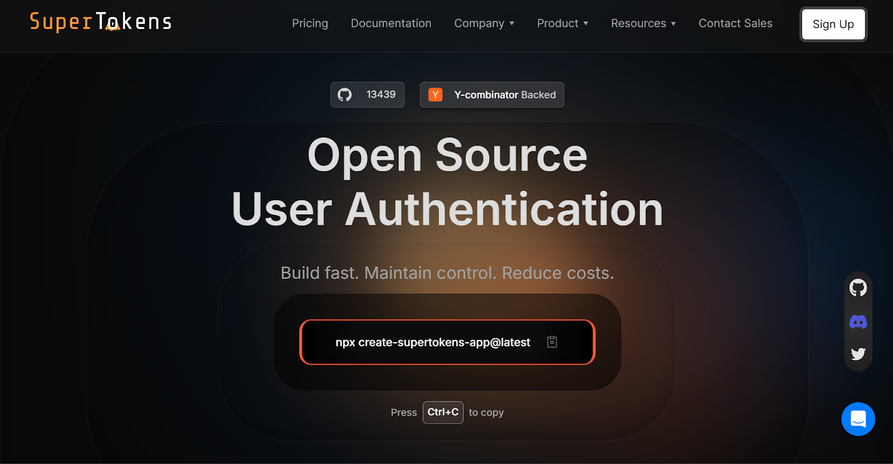
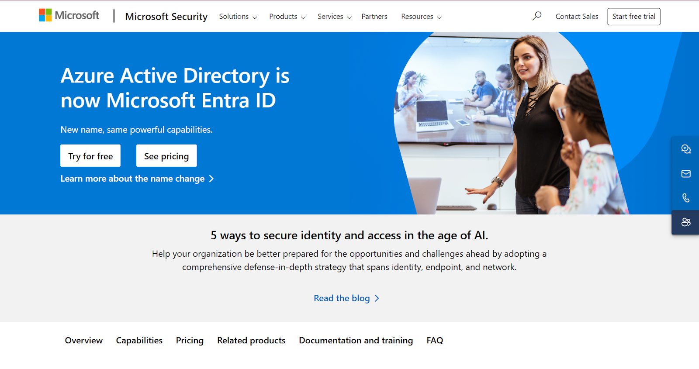
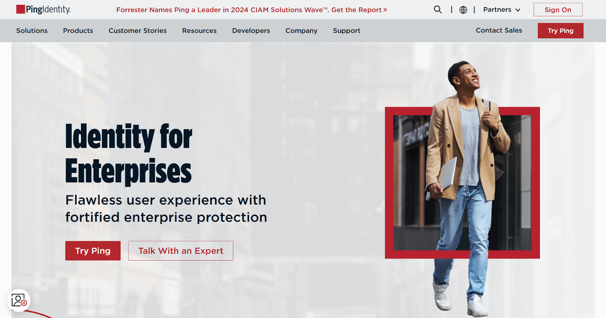
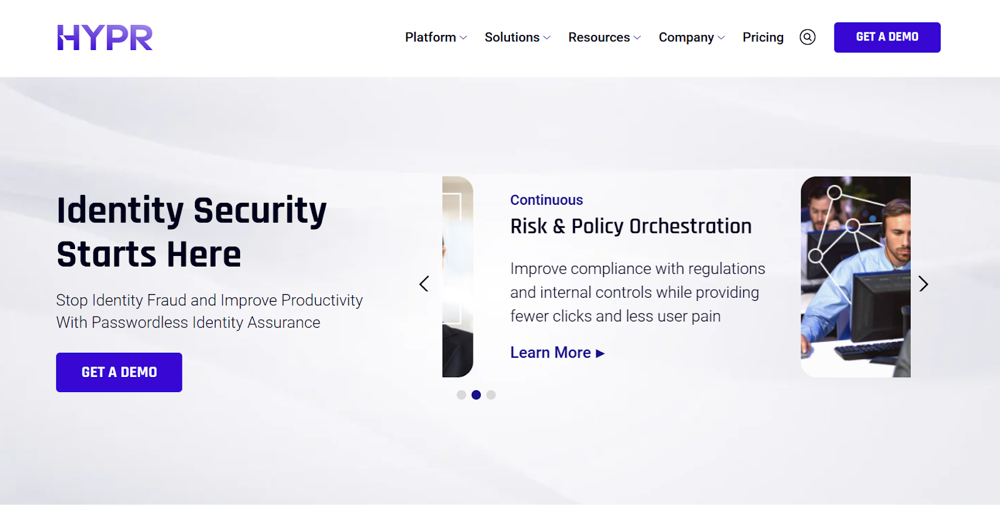
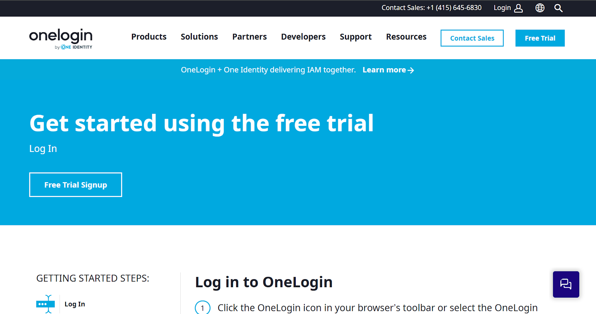
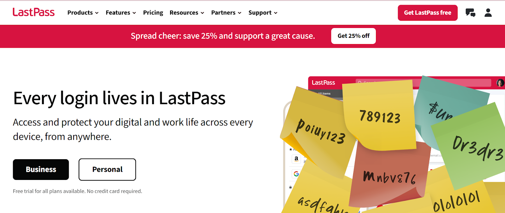
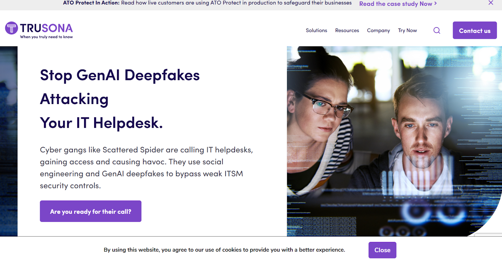
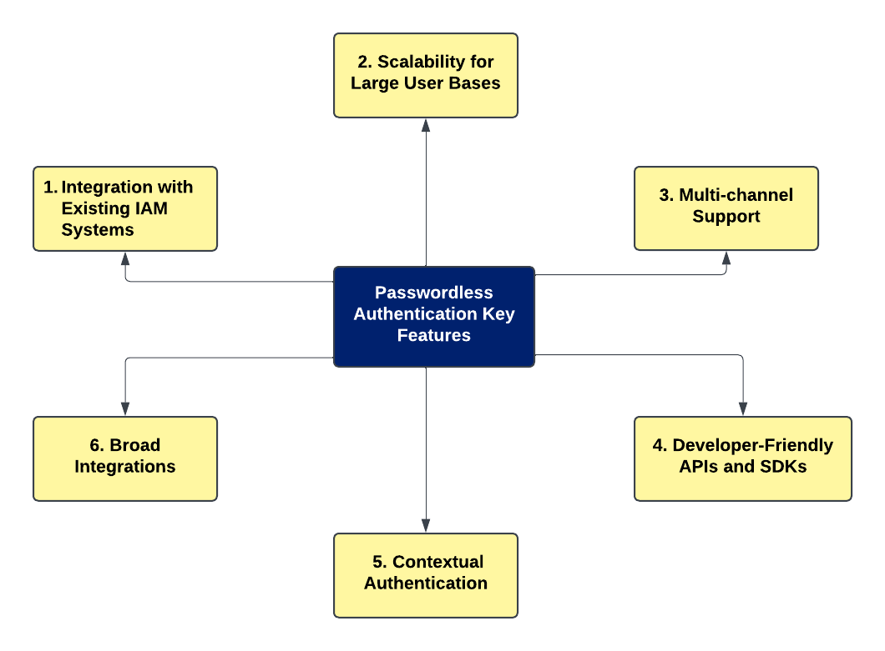

## **Introduction**

As digital transformation accelerates, organizations increasingly
recognize the need for [passwordless authentication solutions](https://supertokens.com/blog/passwordless-authentication)
to enhance security and improve user experience.

The market for passwordless authentication solutions is showing
significant growth potential. According to [Alliedmarketsearch's report](https://www.alliedmarketresearch.com/passwordless-authentication-market-A47286),
the market is expected to grow significantly, from \$12.8 billion in
2021 to \$40.2 billion by 2031, reflecting a compound annual growth rate
(CAGR) of 12.2%.

Similarly, [The Business Research Company's analysis](https://www.thebusinessresearchcompany.com/report/passwordless-authentication-global-market-report)
highlights impressive growth projections, with the market rising from
\$17.13 billion in 2023 to \$20.07 billion in 2024 at a CAGR of 17.2%.
These statistics underscore the accelerating adoption of passwordless
authentication solutions as organizations prioritize security and user
experience in an increasingly digital landscape.

Traditional password systems are vulnerable to various threats,
including phishing attacks, data breaches, and password fatigue among
users. Passwordless authentication addresses these challenges by
eliminating the need for passwords, thus reducing the risk of
unauthorized access while streamlining the login process.

By the end of this guide, you will be well-equipped to make an informed
decision about which solution best fits your organization's needs.

## **1.** **SuperTokens**

### **Features**

SuperTokens is an open-source solution that offers a customizable
approach to passwordless authentication. Key features include:

-   **Multiple Authentication Methods:** SuperTokens enables seamless
    authentication with [passwordless login via email or SMS magic links](https://supertokens.com/blog/types-of-authentication)
    and social platform integration, allowing for customized
    experiences and strong security.

-   **Session Management:** Robust session management capabilities that
    allow developers to control user sessions effectively.

-   **Security:** Utilizes JWT (JSON Web Tokens) for secure session
    handling.

-   **Open-Source Flexibility:** Developers can modify and extend
    functionality as needed.

### **Use Cases**

SuperTokens is ideal for:

-   **E-commerce Platforms:** Enhances user experience by allowing
    customers to log in without remembering passwords.

-   **SaaS Applications:** Provides secure access while minimizing
    friction during user onboarding.

-   **Educational Institutions:** Simplifies login processes for
    students and staff while maintaining high-security standards.

### **Customer Rating**

SuperTokens boasts a customer rating of 4.7/5, reflecting its
effectiveness and user satisfaction.

### **Pricing**

-   **Free for Self-hosted:** Organizations can self-host SuperTokens at
    no cost.

-   **Managed Hosting:** Free for up to 5,000 Monthly Active Users
    (MAUs).

-   **Beyond 5,000 MAUs:** Starts at \$0.02 per user per month.

-   **Additional Paid Add-ons:** Available for enhanced features.

For more information on SuperTokens, visit their [passwordless login features](https://supertokens.com/features/passwordless-login).

## **2.** **Okta**

### **Features**

Okta is a leading identity management platform that provides adaptive
multi-factor authentication (MFA), biometric login support, extensive
prebuilt integrations, and advanced compliance tools. Key features
include:

-   **Adaptive MFA:** Adjusts security requirements based on user
    behavior and risk factors.

-   **Biometric Support:** Users can authenticate using facial
    recognition or fingerprint scanning.

-   **Integration Capabilities:** Offers prebuilt integrations with
    thousands of applications.

### **Use Cases**

Okta is particularly suited for:

-   **Enterprises Managing Remote Teams:** Ensures secure access for
    remote employees while maintaining compliance.

-   **Financial Services:** Protects sensitive customer data through
    robust authentication methods.

-   **Healthcare Providers:** Complies with regulations such as HIPAA
    while securing patient information.

### **Customer Rating**

Okta has received a customer rating of 4.8/5, indicating strong
performance and reliability.

### **Pricing**

Pricing is premium and tailored to enterprise needs, typically requiring
consultation for specific quotes.

## **3. Auth0**

### **Features**

Auth0 is a flexible identity management platform that provides
easy-to-integrate SDKs and APIs, extensive app integrations, and
passwordless options such as SMS and email magic links. Key features
include:

-   **Scalability:** Designed to scale with businesses as they grow.

-   **Extensive App Integrations:** Supports integration with various
    applications across different industries.

-   **Passwordless Options:** Offers multiple passwordless
    authentication methods like magic links sent via email or SMS.

### **Use Cases**

Auth0 is best suited for:

-   **Startups and Medium-Sized** **Businesses:** Providing a
    cost-effective solution that grows with them.

-   **Apps with Global Audiences:** Supporting multiple languages and
    regional compliance requirements.

### **Customer Rating**

Auth0 holds a customer rating of 4.7/5, showcasing its popularity among
users.

### **Pricing**

-   **Free Tier:** Available with limits on active users.

-   **Paid Plans:** Offer additional features based on usage.

## **4. Microsoft Entra ID**

### **Features**

Microsoft Entra ID (formerly Azure Active Directory) offers biometric
authentication, single sign-on (SSO), and seamless integration with
Microsoft 365 and Azure services. Key features include:

-   **Biometric Authentication:** Supports Windows Hello and other
    biometric methods.

-   **Single Sign-On** **(SSO):** Allows users to access multiple
    applications with one set of credentials.

-   **Integration with Microsoft Ecosystem:** Works seamlessly with
    other Microsoft products.

### **Use Cases**

Microsoft Entra ID is ideal for:

-   **Enterprises Heavily Using Microsoft's Ecosystem:** Organizations
    already using Microsoft products can benefit from tight
    integration.

-   **Government Institutions:** Meeting compliance requirements while
    ensuring secure access.

### **Customer Rating**

Microsoft Entra ID has a customer rating of 4.5/5, indicating room for
improvement in user satisfaction.

### **Pricing**

Pricing starts at \$6/month per user, with a free tier available for
basic features.

## **5. Ping Identity**

### **Features**

Ping Identity provides passwordless authentication, secure identity
federation, and risk-based access controls. Key features include:

-   **Passwordless Authentication Options:** Allows users to log in
    without passwords using biometrics or one-time codes.

-   **Identity Federation:** Supports single sign-on across different
    domains and applications.

-   **Risk-Based** **Access Control:** Adjusts security measures based
    on real-time risk assessments.

### **Use Cases**

Ping Identity is well-suited for:

-   **Large Organizations with Hybrid IT Environments:** Managing
    complex identity needs across various systems.

### **Customer Rating**

Ping Identity enjoys a customer rating of 4.7/5, reflecting its
effectiveness in enterprise environments.

### **Pricing**

Paid plans start at \$3/user/month.

## **6. HYPR**

### **Features**

HYPR offers a true passwordless experience through FIDO-certified
architecture, biometric authentication, and decentralized authentication
methods. Key features include:

-   **FIDO Compliance:** Adheres to FIDO standards for enhanced
    security.

-   **Decentralized Authentication:** Reduces reliance on centralized
    servers, minimizing risks associated with data breaches.

### **Use Cases**

HYPR is particularly effective in:

-   **Banking and Fintech Sectors:** These are where stringent security
    measures are paramount.

### **Customer Rating**

HYPR boasts a customer rating of 4.8/5, highlighting its strong
reputation among users.

### **Pricing**

Paid plans start at \$3/user/month.

## **7. ForgeRock**

### **Features**

ForgeRock provides AI-driven access control solutions along with
passwordless and device-based authentication capabilities. Key features
include:

-   **AI-Powered Access Control:** Leverages machine learning to enhance
    security protocols.

-   **Zero Trust Readiness:** Designed to support zero trust
    architectures that require continuous verification of users and
    devices.

### **Use Cases**

ForgeRock is best suited for:

-   **Large Organizations in Retail and Telecommunications Sectors:**
    Where complex identity requirements exist.

### **Customer Rating**

ForgeRock has a customer rating of 4.7/5, indicating high levels of user
satisfaction.

### **Pricing**

Custom pricing based on deployment size and specific feature
requirements.

## **8. OneLogin**

### **Features**

OneLogin offers biometric authentication, robust integrations, and
strong policy management tools. Key features include:

-   **Biometric Support:** Allows users to log in using biometric data
    such as fingerprints or facial recognition.

-   **User Provisioning:** Automates the process of creating, managing,
    and deactivating user accounts across various applications,
    ensuring that access is consistent and secure throughout the user
    lifecycle.

-   **Directory Integration:** Seamlessly integrates with existing
    directory services like Active Directory, allowing for streamlined
    user management and authentication across platforms.

### **Use Cases**

OneLogin serves well in:

-   **Small to Medium Enterprises and Educational Institutions:**
    Providing an easy-to-use interface that simplifies identity
    management.

### **Customer Rating**

OneLogin enjoys a customer rating of 4.7/5, reflecting its reliability
in the market.

### **Pricing**

Paid plans start at \$4/user/month with additional features available at
varying prices.

## **9. LastPass**

### **Features**

LastPass provides passwordless login options for end-users along with
centralized administration capabilities. Key features include:

-   **Centralized Administration Tools:** Allow organizations to manage
    user access efficiently.

-   **Passwordless Authentication:** Provides users with the ability to
    log in without a master password, utilizing methods such as
    biometrics or hardware keys, which enhances security by reducing
    the risk of password-related breaches.

-   **Multi-Factor Authentication (MFA):** Adds an additional layer of
    security by requiring users to verify their identity through
    multiple methods, such as a one-time passcode or biometric
    verification, ensuring that only authorized users gain access.

### **Use Cases**

LastPass is suitable for:

-   **Individuals and Teams Needing Simple Solutions:** Offering
    effective password management without complexity.

-   Enterprises Seeking Robust Security Solutions.

### **Customer Rating**

LastPass holds a customer rating of 4.7/5, indicating strong user
approval.

### **Pricing**

Pricing starts at \$7/user/month for businesses.

## **10. Trusona**

### **Features**

Trusona focuses on frictionless passwordless login experiences through
QR code authentication and device binding techniques. Key features
include:

-   **QR Code Authentication:** Provides a seamless way for users to log
    in without entering passwords.

-   **Device Binding:** Ensures that authentication is tied to specific
    devices, which helps prevent unauthorized access by verifying that
    the user is using a recognized device during the login process.

-   **Anti-Replay Technology:** Implements patented technology that
    prevents replay attacks by ensuring that each login attempt is
    unique and cannot be duplicated, significantly enhancing security
    against credential theft.

### **Use Cases**

Trusona is ideal for:

-   **Customer-Facing Applications Requiring Fast Login Processes:**
    These include retail apps or online services where speed is
    crucial.

### **Customer Rating**

Trusona boasts a customer rating of 4.8/5, underscoring its
effectiveness in delivering secure access quickly.

### **Pricing**

Paid plans start at \$4/user/month.

## **Key Features to Look For in Passwordless Authentication Solutions**

When choosing a passwordless authentication solution, it's essential to
consider these features:

1.  **Integration with Existing IAM Systems**
    Compatibility with Identity and Access Management (IAM) tools
    like Active Directory or cloud-based solutions is crucial. It
    ensures a smooth transition from traditional systems while
    leveraging existing infrastructure to enhance security. For
    example, understanding the distinction between [authentication and authorization](https://supertokens.com/blog/authentication-vs-authorization)
    can help organizations optimize these integrations effectively.

2.  **Scalability for Large User Bases**
    The right solution should scale seamlessly, supporting millions
    of users without performance issues, even during peak times.
    Organizations expecting growth or seasonal traffic spikes need a
    system capable of handling increased demand without sacrificing
    speed or security.

3.  **Multi-channel Support**
    Solutions that offer authentication through email, SMS,
    biometrics, or dedicated apps provide users with the flexibility
    to choose their preferred method. This enhances convenience and
    boosts adoption rates. For example, biometric authentication like
    facial recognition combines ease of use with strong security. To
    see how multi-factor options contribute to user satisfaction,
    check out the [benefits of multi-factor authentication](https://supertokens.com/blog/benefits-of-multi-factor-authentication).

4.  **Developer-Friendly APIs and SDKs**
    Developer-friendly tools are vital for integrating solutions
    into existing platforms. Comprehensive documentation and
    customizable APIs make it easier to tailor the experience to
    specific organizational needs. For those exploring implementation,
    resources like a [guide on passwordless login](https://supertokens.com/blog/a-guide-to-implementing-passwordless-login)
    can simplify the process significantly.

5.  **Contextual Authentication**
    Modern security measures like contextual authentication analyze
    device behavior, location, and other real-time data to detect
    suspicious logins. This adds a layer of verification that helps
    prevent unauthorized access without inconveniencing legitimate
    users.

6.  **Broad Integrations**
    Seamless compatibility with third-party tools and platforms is a
    must. Solutions that integrate with systems like CRMs, payment
    gateways, and enterprise applications ensure a cohesive user
    experience while improving operational efficiency.

## **Implement Passwordless Authentication with SuperTokens**

SuperTokens simplifies the implementation of passwordless authentication
by providing an open-source framework that offers flexibility while
ensuring compliance with security standards. Its customizable nature
allows developers to tailor the solution to their specific needs while
maintaining robust security protocols.

**To get started quickly with SuperTokens:**

1.  Visit the [MFA Best Practices](https://supertokens.com/blog/mfa-best-practices/)
    blog to explore setup guides and best practices.

2.  Leverage its cost-effective model by utilizing the free tier or
    scaling as your user base grows.

By adopting SuperTokens or other leading passwordless solutions,
organizations can significantly enhance their security posture while
improving user experience in a rapidly evolving digital environment.
SuperTokens is your ultimate solution for secure passwordless
authentication in 2024!
