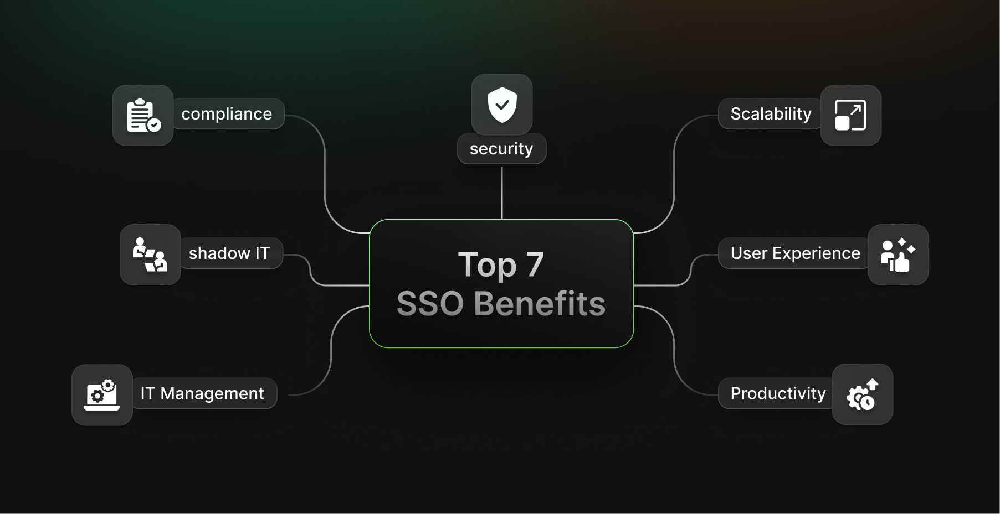
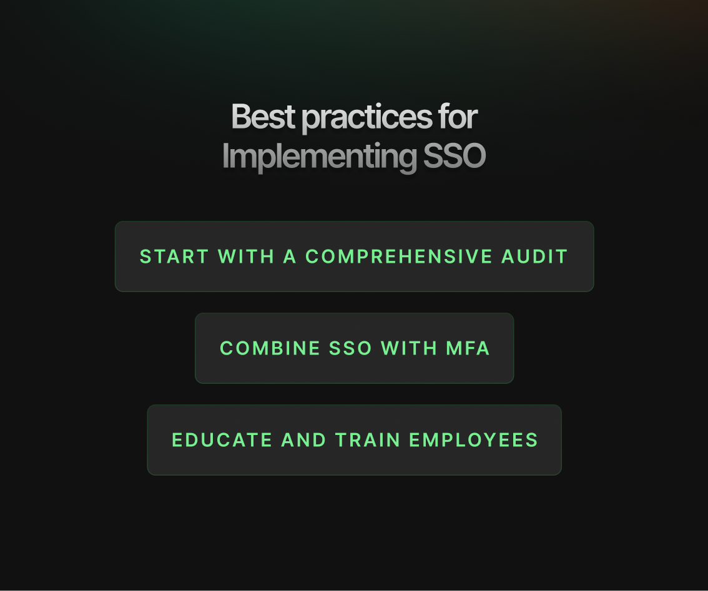

As organizations deal with the challenges of today’s fast-moving digital world, effectively using technology has become crucial for making things run smoothly and keeping everything secure. One solution that’s getting a lot of attention is Single Sign-On (SSO). This innovative technology lets users log into different applications with just one set of login details, making things easier for everyone and boosting security.

In this article, we’ll explore the top 7 benefits of SSO, look at some challenges that might come up when rolling it out, and share some best practices to ensure it works well.

# What is SSO and How Does it Work?

## Definition of SSO

Single Sign-On (SSO) is a centralized authentication process that enables users to log in once and gain access to various applications without needing to re-enter their credentials. This mechanism is particularly beneficial for organizations with multiple applications, as it reduces the complexity of managing numerous passwords and enhances security.

## How It Works

The SSO process typically involves several key steps:

1.  **User Authentication**: The user logs in once through an identity provider (IdP), which verifies their credentials against a secure database.
    
2.  **Access Tokens**: Upon successful authentication, the IdP issues an access token or a session cookie that grants the user access to interconnected applications. This token is used to authenticate the user without requiring them to log in again for each application.
    
3.  **Session Management**: The token allows users to navigate between applications seamlessly without logging in again. This session management ensures that users remain authenticated until they log out or their session expires.
    

Isn’t that seamless? You can also layer SSO with MFA (Multi-Factor Authentication) for extra protection. Are you interested in exploring SSO? Discover how it enables seamless access across systems [here](https://supertokens.com/blog/sso-authentication/).

# Why is SSO Important?

## Enhancing Security and Productivity

The importance of SSO extends beyond mere convenience; it plays a critical role in enhancing both security and productivity within organizations.

*   **Reduces Password Fatigue**: With employees needing to remember fewer passwords, the likelihood of weak or reused passwords decreases significantly. This reduction in password fatigue helps mitigate security risks associated with password management.
    
*   **Simplifies User Experience**: A seamless login process improves employee satisfaction and operational efficiency. Users can focus on their tasks without being hindered by repetitive login procedures.
    
*   **Adaptation to Modern Environments**: As businesses increasingly operate in multi-cloud and hybrid environments, the need for effective SSO solutions has become paramount. Organizations can manage diverse applications while maintaining a consistent user experience.
    

**Combine SSO benefits with multi-layered security strategies.** The [Testing SSO Implementation](https://supertokens.com/blog/testing-sso-implementation) blog explores methods to make testing and deployment effective

## Main Types of Single Sign-On Authentication

Understanding the different types of SSO authentication can help organizations choose the right solution for their needs:

*   **Web SSO**: This type is designed for browser-based applications and is commonly used for Software as a Service (SaaS) platforms. Web SSO facilitates easy access across various web applications without requiring multiple logins.
    
*   **Enterprise SSO**: Aimed at managing access across a corporate environment, enterprise SSO typically integrates with on-premises systems (like LDAP or Active Directory) and cloud services. This type of SSO is crucial for organizations that must maintain secure access across diverse environments.
    

# Key Benefits of Single Sign-On (SSO)

## 1\. Boosts the Security of the Organization

One of the most significant advantages of implementing SSO is its ability to enhance organizational security:

*   **One Secure Login Point**: By reducing the number of entry points hackers can exploit, organizations can minimize their attack surface. Fewer login interfaces mean fewer opportunities for unauthorized access.
    
*   **Less Chance of Phishing**: Users are less likely to fall victim to phishing attacks when they do not have to remember multiple passwords. With only one password to manage, employees are likelier to choose a strong password and be vigilant about its security.
    
*   **Extra Security with MFA**: Combining SSO with Multi-Factor Authentication (MFA) adds a layer of security. Even if a password is compromised, unauthorized users would still need a second form of verification (like a text message code or biometric scan) to gain access.
    

**Want a deep dive into Multi-Factor Authentication (MFA) and its benefits?** Check out the [Benefits of Multi-Factor Authentication](https://supertokens.com/blog/benefits-of-multi-factor-authentication).

## 2\. Enhances User Experience

SSO significantly improves the user experience by streamlining access:

*   **Streamlined Login Process**: Employees can log in once and access all necessary applications without repeated authentication attempts. This convenience enhances the overall user experience by allowing users to focus on their tasks rather than the login process.
    
*   **Reduced Frustration**: By minimizing the number of credentials users must remember, SSO alleviates the frustration associated with forgotten passwords and multiple login attempts. This simplification fosters a more positive interaction with technology, leading to greater satisfaction among users.
    

## 3\. Saves Time and Increases Productivity

Implementing SSO can lead to substantial time savings for both employees and IT teams:

*   **Less Time Recovering Passwords**: Employees spend less time recovering forgotten passwords or logging into multiple systems. This efficiency translates into increased productivity across the organization.
    
*   **Fewer IT Support Tickets**: IT teams face fewer support tickets related to password resets, allowing them to focus on more strategic initiatives rather than routine troubleshooting.
    

  

## 4\. Simplifies IT Management

From an IT perspective, SSO simplifies management processes:

*   **Centralized Control**: IT administrators can manage user access and permissions from a single platform, making it easier to enforce security policies and monitor user activity.
    
*   **Easy Integration**: Many modern SSO solutions integrate seamlessly with existing identity management systems, reducing the complexity associated with implementation.
    

## 5\. Reduces the Risk of Shadow IT

Shadow IT refers to unauthorized applications used within an organization without IT's knowledge or approval:

*   **Encourages Use of Approved Tools**: With easy access provided by SSO, employees are more likely to use IT-approved tools rather than resorting to unauthorized applications that may pose security risks.
    
*   **Minimizes Security Risks**: By limiting shadow IT, organizations can better control their data environment and reduce vulnerabilities associated with unapproved software.
    

## 6\. Facilitates Compliance with Security Standards

Compliance with data protection regulations is increasingly critical for organizations:

*   **Traceability and Auditability**: SSO solutions often include features that ensure traceability and auditability for access logs, making it easier for organizations to demonstrate compliance during audits.
    
*   **Meeting Regulatory Requirements**: By implementing robust authentication processes like SSO, organizations can better meet data protection regulations such as GDPR and HIPAA.
    

## 7\. Scales Seamlessly with Business Growth

As organizations grow or downsize, their needs change:

*   **Supports Onboarding and Offboarding**: SSO facilitates quick onboarding for new employees by providing immediate access to necessary applications while ensuring that offboarding processes are just as efficient.
    
*   **Integrates New Applications Easily**: As businesses adopt new technologies or services, SSO solutions can typically integrate these new apps without overwhelming IT resources or complicating user experiences.
    

Explore foundational concepts of SSO. The [Types of Authentication](https://supertokens.com/blog/types-of-authentication) guide breaks down all the methods your organization might use for stronger security.

# Best Practices for Implementing SSO

To maximize the benefits of SSO while mitigating potential risks, consider these best practices:

## Start with a Comprehensive Audit

Before implementing an SSO solution, conduct a thorough audit of existing systems and applications that will integrate with it. Identify which platforms require access control and choose an SSO solution that meets both current needs and future growth potential.

## Combine SSO with MFA

Enhance security by combining your SSO implementation with Multi-Factor Authentication (MFA). This extra layer ensures that even if a password is compromised, unauthorized individuals cannot easily gain access without additional verification methods.

## Educate and Train Employees

Provide training on how to use SSO effectively and safely. Emphasize the importance of maintaining strong primary passwords and recognizing phishing attempts that could compromise their accounts. Regular training sessions can help keep security top-of-mind for employees.

**Learn how standards like SAML streamline SSO integrations**. The [Demystifying SAML](https://supertokens.com/blog/demystifying-saml) blog offers guidance for organizations.

# Challenges of Implementing SSO

While there are numerous benefits associated with Single Sign-On implementation, organizations must also consider several challenges:

## Single Point of Failure

One significant risk is that if the SSO provider experiences downtime or is compromised, access to all connected applications may be lost. This situation can halt productivity across the organization until services are restored. Organizations must have contingency plans in place to address potential outages effectively.

## Complex Implementations

Integrating SSO with existing systems can be complicated and resource-intensive. Organizations may need specialized expertise or additional resources during implementation phases, which could lead to increased costs or delays in deployment. A phased approach may help mitigate these challenges by allowing teams to gradually integrate systems while minimizing disruptions.

## Limited Application Support

Not all applications support SSO natively—particularly legacy systems—which can create friction in user experience as employees may still need additional login credentials for certain platforms. Organizations must assess their application landscape before committing fully to an SSO solution. In some cases, custom development may be required to bridge gaps between legacy systems and modern authentication methods.

# SSO Isn't a Luxury Anymore

Single Sign-On has transitioned from being merely a convenience into an essential component of organizational infrastructure. The increasing threats posed by cybercriminals underscore the critical role that robust authentication mechanisms like SSO play in safeguarding sensitive information while enhancing operational efficiency.

  

**Strengthen your SSO knowledge foundation.** The [SSO Provider](https://supertokens.com/blog/sso-provider/) blog is an excellent starting point for further learning.

  

Organizations of all sizes stand to benefit from adopting SSO solutions as they enhance security measures while improving overall efficiency in accessing critical applications.

SuperTokens provides a developer-first approach tailored specifically for modern organizational needs while maintaining robust security protocols throughout every step of integration—from initial setup through ongoing maintenance—ensuring seamless experiences across all platforms involved in day-to-day operations.

Streamline your business operations and enhance security with Single Sign-On (SSO). Start simplifying your login process today—[schedule a free demo](https://supertokens.com/features/single-sign-on)!

  

For external insights on the benefits and challenges associated with Single Sign-On implementation:

*   [Keeper Security on Pros and Cons of SSO](https://www.keepersecurity.com/blog/2024/03/26/benefits-of-single-sign-on/)
    
*   [Planergy Software's Overview of SSO Benefits](https://planergy.com/blog/single-sign-on-benefits/)
    

By addressing both the benefits and challenges associated with Single Sign-On implementation comprehensively, organizations can make informed decisions that enhance their security posture while improving user experience across all levels within their operations. As businesses continue adapting to technological advancements, embracing solutions like Single Sign-On will be crucial for maintaining competitive advantages in efficiency, security compliance, and overall operational effectiveness in an ever-evolving digital landscape.