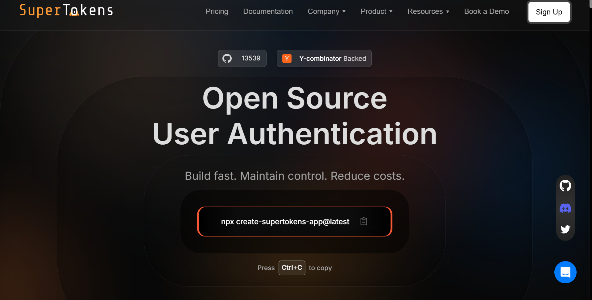

## Table of Contents

- [Challenges Developers Face with Identity Management](#challenges-developers-face-with-identity-management)
- [1. SuperTokens: Open-Source and Developer-Friendly](#1-supertokens-open-source-and-developer-friendly)
- [2. Okta](#2-okta)
- [3. Auth0](#3-auth0)
- [4. Ping Identity](#4-ping-identity)
- [5. Microsoft Azure Active Directory](#5-microsoft-azure-active-directory)
- [6. Google Identity Platform](#6-google-identity-platform)
- [7. IBM Security Verify](#7-ibm-security-verify)
- [8. ForgeRock](#8-forgerock)
- [Key Features to Look for in Identity Management Solutions](#key-features-to-look-for-in-identity-management-solutions)
- [Why SuperTokens Is Ideal for Developers](#why-supertokens-is-ideal-for-developers)
- [How to Choose the Right Identity Management Solution](#how-to-choose-the-right-identity-management-solution)
- [Future Trends in Identity Management](#future-trends-in-identity-management)
- [Conclusion](#conclusion)

Managing identity has become essential for the success of modern
applications. As businesses increasingly turn to digital platforms, the
demand for effective identity management solutions has risen. This
growing need is reflected in market projections, with the [global
Identity and Access Management (IAM)
market](https://www.statista.com/statistics/1445717/global-identity-and-access-management-market-value/)
expected to reach 43.1 billion U.S. dollars by 2029. These solutions
play a crucial role in ensuring secure access to resources, protecting
sensitive information, and improving the overall user experience.

However, developers often face various challenges when implementing
these systems, especially regarding scalability, security, and
usability. In this article, I will explore eight of the top identity
management solutions available today, highlighting their features,
benefits, and the scenarios in which they work best.

## **Challenges Developers Face with Identity Management**

Before diving into the solutions themselves, it's important to
understand the common challenges developers encounter in identity
management:

1.  **Scalability:** As applications grow, they must handle increasing
    numbers of users and traffic spikes without compromising
    performance. A scalable identity management system ensures
    seamless authentication and authorization processes, preventing
    bottlenecks and maintaining security at scale. By efficiently
    managing resources, scalable IAM solutions support business
    growth, enhance user experience, and adapt to evolving security
    requirements.

2.  **Security:** With cyber threats on the rise, ensuring robust
    security measures like multi-factor authentication (MFA) and
    secure session management is crucial. In fact, studies show that
    [MFA can block over 99.9% of account compromise
    attacks.](https://www.zippia.com/advice/mfa-statistics)

3.  **User Experience:** A seamless user experience is essential for
    retaining users. Complicated authentication processes can lead to
    frustration and abandonment. For instance, overly [strict
    password requirements have been observed to cause up to an 18%
    abandonment
    rate](https://baymard.com/blog/password-requirements-and-password-reset)
    during checkout processes.

By addressing these challenges, developers can create secure and
user-friendly applications that meet the demands of today's digital
environment.

## **1. SuperTokens: Open-Source and Developer-Friendly**

### **Overview**

SuperTokens is a lightweight, open-source identity management solution
tailored specifically for developers. It focuses on providing a
developer-friendly experience while ensuring robust security features.

### **Key Features**

-   **Secure Session Management:** Uses rotating tokens to improve
    session security and prevent unauthorized access.

-   **Pre-built Support for MFA and SSO:** Simplifies the implementation
    of multi-factor authentication and single sign-on capabilities.

-   **Role-Based Access Control (RBAC):** Gives detailed control over
    user permissions, ensuring access is based on roles.

-   **Multi-Tenancy:** Ideal for SaaS applications that require
    tenant-specific configurations.

-   **Extensibility:** Provides customizable authentication flows and integrations,
    allowing developers to tailor solutions to their needs.

-   **Flexibility:** Supports self-hosting and cloud deployment options, enabling seamless
    adaptation to different architectures.

### **Why It Stands Out**

**Transparent Pricing:** SuperTokens provides free development licenses,
making it an ideal choice for startups and small teams.

**Quick Integration:** Frontend and backend SDKs enable faster
implementation, significantly reducing time-to-market.

## **2. Okta**

### **Overview**

Okta is an enterprise-grade identity management solution that provides
comprehensive features to manage user identities securely.

### **Key Features**

-   **Single Sign-On (SSO):** Enables users to access multiple
    applications using a single set of credentials, streamlining the
    login process and improving user experience across platforms.

-   **Multi-Factor Authentication (MFA):** Enhances security by
    requiring users to verify their identity through multiple methods,
    offering an additional layer of protection against unauthorized
    access.

-   **Adaptive Access Control:** Dynamically adjusts access permissions
    based on user behavior and contextual factors, ensuring that
    security measures align with real-time risks and usage patterns.

### **Best For**

Okta is best suited for large organizations that manage complex access
scenarios across various platforms.

### **Drawbacks**

While Okta offers powerful features, its pricing can be prohibitive for
smaller teams or startups looking for cost-effective solutions.

## **3. Auth0**

### **Overview**

Auth0 is a flexible identity-as-a-service platform that provides
developers with extensive customization options.

### **Key Features**

-   **Social Logins:** Simplifies the authentication process by allowing
    users to log in through popular social media platforms, enhancing
    user convenience and engagement.

-   **Passwordless Authentication:** Provides a secure and user-friendly
    login experience by enabling access without the need for
    traditional passwords, reducing friction for users.

-   **API Security:** Ensures the protection of APIs from unauthorized
    access with advanced authentication mechanisms, safeguarding
    sensitive data and system integrity.

### **Best For**

Auth0 is ideal for developers who need extensive customization options
to fit unique application requirements.

### **Drawbacks**

One of the main drawbacks of Auth0 is its pricing model; costs can scale
quickly with an increasing user base, which may not be sustainable for
all businesses.

## **4. Ping Identity**

### **Overview**

Ping Identity delivers advanced identity management solutions designed
specifically for hybrid IT environments.

### **Key Features**

-   **Identity Federation:** Allows secure sharing of identities between
    different domains, ensuring seamless and secure access across
    platforms.

-   **Single Sign-On (SSO):** Simplifies the login experience by
    allowing users to access multiple applications with a single set
    of credentials.

-   **Adaptive Authentication:** Uses contextual information to assess
    risk and adjust authentication requirements accordingly.

### **Best For**

This solution is best suited for enterprises with complex on-premise and
cloud setups that require sophisticated identity management
capabilities.

### **Drawbacks**

Developers may encounter a steeper learning curve when working with Ping
Identity due to its advanced features and capabilities.

## **5. Microsoft Azure Active Directory**

### **Overview**

Microsoft Azure Active Directory (Azure AD) is a comprehensive identity
management solution integrated with Microsoft services.

### **Key Features**

-   **Conditional Access:** Provides policies that allow or deny access
    based on specific conditions.

-   **Single Sign-On (SSO):** Facilitates seamless access to Microsoft
    365 and other applications.

-   **Integration with Microsoft 365:** Works effortlessly with other
    Microsoft services, enhancing productivity.

### **Best For**

Organizations already utilizing Microsoft's ecosystem will find Azure AD
particularly beneficial due to its seamless integration capabilities.

### **Drawbacks**

While Azure AD offers robust features, it may have limited flexibility
when it comes to non-Microsoft applications, which could pose challenges
for diverse tech stacks.

## **6. Google Identity Platform**

### **Overview**

The Google Identity Platform provides an identity solution tailored
specifically for Google services and APIs.

### **Key Features**

-   **OAuth 2.0 Support:** Provides secure access to APIs by delegating
    permissions through token-based authentication.

-   **OpenID Connect Support:** Simplifies integration with web
    applications, enabling smooth user authentication and identity
    management.

-   **Strong Integration with Google Ecosystem:** Seamlessly works with
    Google services like Firebase and Google Cloud Platform for
    enhanced functionality and performance.

### **Best For**

This platform is ideal for applications built around Google APIs or
those heavily integrated into the Google ecosystem.

### **Drawbacks**

However, it may not be as robust in meeting complex enterprise needs
compared to other dedicated identity management solutions.

## **7. IBM Security Verify**

### **Overview**

IBM Security Verify offers AI-driven identity management tailored for
large-scale enterprises facing complex security challenges.

### **Key Features**

-   **Passwordless Authentication:** Enhances security by eliminating
    passwords from the authentication process.

-   **Identity Analytics:** Provides insights into user behavior and
    access patterns to improve security postures.

-   **Compliance Support:** Helps organizations meet regulatory
    requirements through built-in compliance features.

### **Best For**

Enterprises needing advanced compliance measures and AI-driven security
will find IBM Security Verify particularly useful.

### **Drawbacks**

The high cost and complexity of implementation may deter smaller
organizations from adopting this solution.

## **8. ForgeRock**

### **Overview**

ForgeRock provides comprehensive identity management solutions designed
specifically for IoT devices and enterprise systems.

### **Key Features**

-   **Identity Governance:** Ensures proper oversight of user identities
    and access rights.

-   **Customer Identity Management:** Focuses on managing customer
    identities securely across multiple channels.

-   **Privacy Tools:** Offers features that help organizations comply
    with privacy regulations like GDPR.

### **Best For**

ForgeRock excels in environments requiring robust identity management
across complex multi-device ecosystems.

### **Drawbacks**

However, its high implementation costs and steep learning curve may make
it less accessible for smaller businesses or those new to identity
management solutions.

## **Key Features to Look for in Identity Management Solutions**

When evaluating different identity management solutions, consider the
following key features:

### **Scalability**

Look for solutions that can handle growing user bases effectively
without sacrificing performance during traffic spikes. Scalability
ensures that your application can grow seamlessly alongside your
business needs.

### **Security**

Ensure the solution supports essential security features such as MFA,
SSO, and robust session management. A strong security framework is vital
in protecting sensitive data from unauthorized access or breaches.

### **Developer Tools**

Pre-built SDKs and APIs are critical for seamless integration into
existing systems. Solutions like SuperTokens provide these tools,
allowing developers to focus on building rather than integrating complex
authentication processes.

### **User Experience**

A good identity management solution should offer easy-to-use interfaces
that enhance the experience for both developers and end-users. A
streamlined login process can significantly improve user retention
rates.

### **Compliance and Privacy**

Verify that the solution meets necessary regulatory standards such as
GDPR or HIPAA. Compliance features are essential in industries where
data protection regulations are stringent.

## **Why SuperTokens Is Ideal for Developers**

SuperTokens stands out as an excellent choice for developers due to
several compelling reasons:

### **Open-Source and Free for Development**

Being open-source means that SuperTokens is cost-effective for startups
and small teams looking to implement robust identity management without
incurring high costs upfront. The availability of free development
licenses allows teams to experiment without financial commitment.

### **Fast Integration**

SuperTokens offers pre-built components designed specifically for
frontend and backend integration. This feature significantly reduces
time-to-market by allowing developers to implement authentication
quickly without extensive setup processes.

### **Multi-Tenancy and Customization**

SuperTokens supports multi-tenancy out-of-the-box, making it perfect for
SaaS applications where different tenants have specific needs. Its
customizable nature allows developers to tailor the solution according
to their application\'s requirements easily.

### **Strong Security Features**

With built-in support for secure session management and token rotation,
SuperTokens enhances application security against common threats like
session hijacking or replay attacks. The focus on security ensures that
users\' data remains protected throughout their interactions with your
application.

## **How to Choose the Right Identity Management Solution**

Choosing the right identity management solution involves careful
consideration of various factors:

### **Assess Your Needs**

Evaluate your user base size, scalability requirements, and application
complexity before selecting a solution. Understanding your specific
needs will help you narrow down your options effectively.

### **Consider Integration Complexity**

Opt for solutions that offer pre-built SDKs or APIs to facilitate ease
of integration into your existing systems. The more straightforward the
integration process, the quicker you can deploy your application into
production.

### **Budget Constraints**

Compare costs between open-source tools like SuperTokens versus
enterprise-grade solutions like Okta or IBM Security Verify.
Understanding your budget constraints will help you make informed
decisions without overspending on unnecessary features or services.

### **Security and Compliance Requirements**

Ensure that any chosen solution meets necessary regulatory standards
relevant to your industry or geographic location. A lack of compliance
can lead to severe penalties or reputational damage if sensitive data is
mishandled or compromised.

## **Future Trends in Identity Management**

As technology continues to evolve, several trends are shaping the future
of identity management:

1.  **Rise of Passwordless Authentication:** More organizations are
    moving towards passwordless authentication methods such as
    biometrics or one-time codes sent via SMS/email. This shift aims
    to enhance security while improving user convenience by
    eliminating passwords.

2.  **Integration of AI in Security Measures:** Artificial intelligence
    will increasingly play a role in adaptive security models that
    analyze user behavior patterns in real-time to identify potential
    threats before they escalate into breaches.

3.  **Growing Adoption of Decentralized Identity Management:**
    Blockchain-based solutions are gaining traction as they offer
    enhanced privacy controls by allowing users greater ownership over
    their data while reducing reliance on centralized authorities
    managing identities online.

## **Conclusion**

Choosing the right identity management solution is crucial in today's
digital landscape where security breaches can have devastating
consequences. Each solution discussed offers unique strengths tailored
towards different organizational needs---from lightweight open-source
options like SuperTokens ideal for startups to comprehensive
enterprise-grade offerings like Okta or IBM Security Verify designed for
large-scale operations facing complex challenges.

SuperTokens emerges as a standout choice due to its developer-friendly
approach combined with strong security features at an affordable price
point---making it perfect for startups and established businesses
looking to enhance their app's security posture efficiently without
breaking budget constraints.

If you\'re ready to take your application\'s security seriously while
maintaining scalability as you grow---consider trying SuperTokens today!
You can start using it free of charge, which empowers you to enhance
both your app\'s security measures while providing a seamless experience
for users across all platforms!
