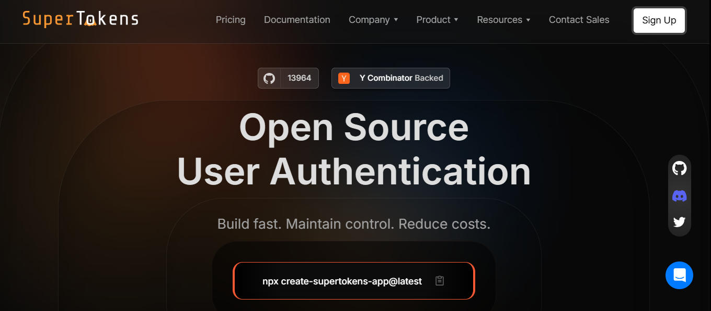
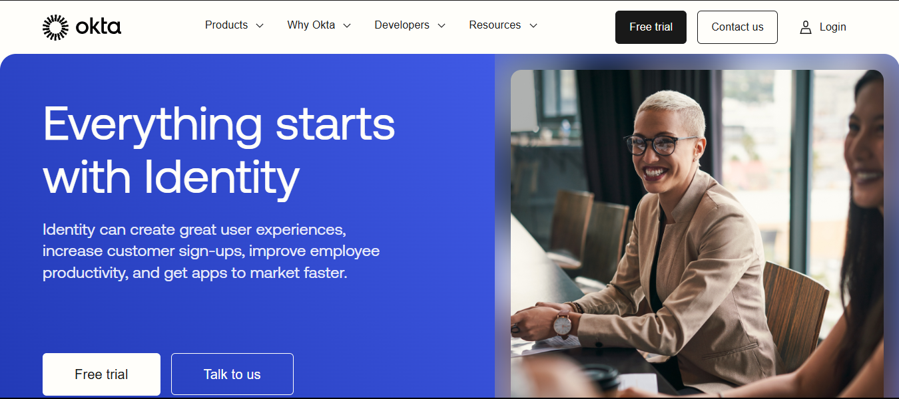
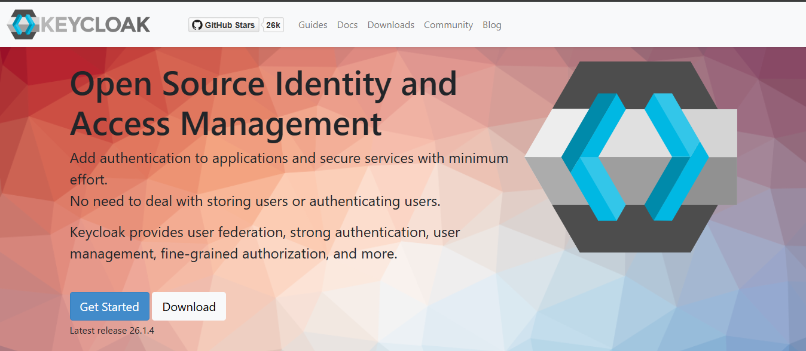
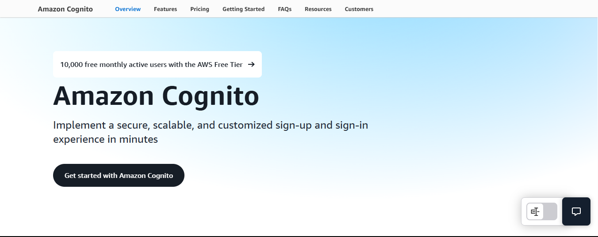
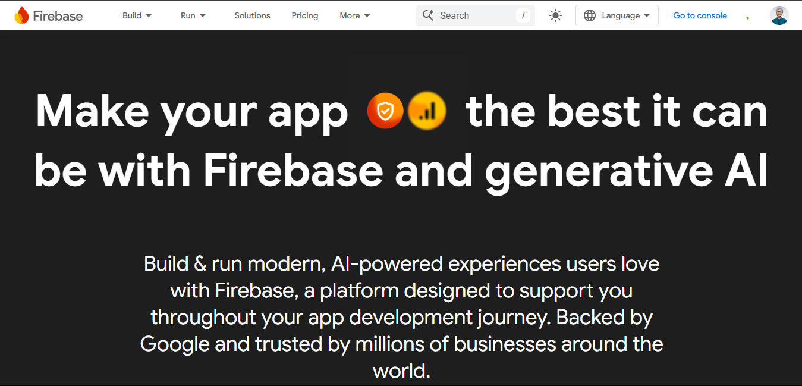
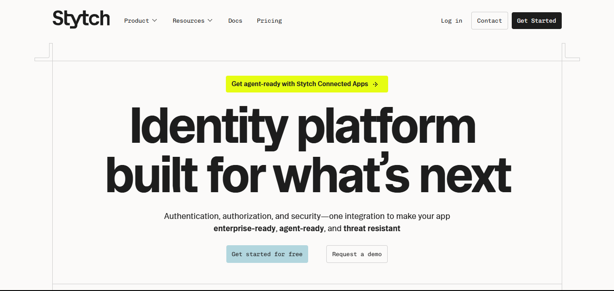
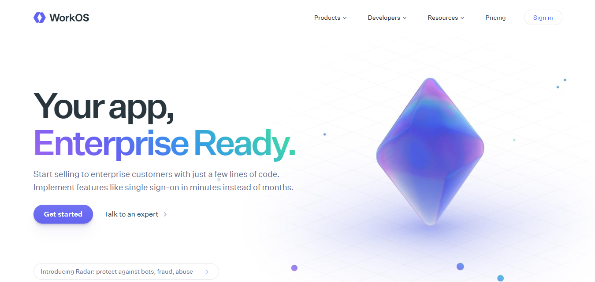
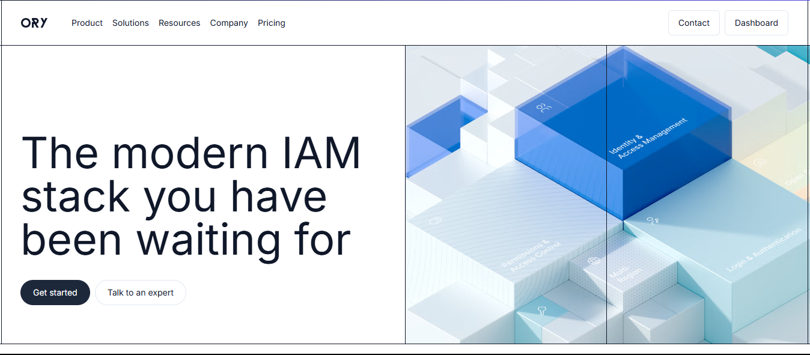

Are you looking for better ways to handle user logins for your app or website? Maybe Auth0 isn\'t the right fit for your needs anymore? You\'re not alone.

In 2025, more companies are searching for authentication solutions that give them more flexibility and better value. Whether you\'re a small startup watching your budget or a growing company needing more control over how users sign in, there are plenty of great alternatives to Auth0. Let\'s break down the top options in simple terms so you can find what works best for you.

## **Why Explore Alternatives to Auth0?**

While Auth0 remains a popular choice for many organizations, several factors are driving businesses to consider alternative solutions:

-   **Pricing considerations**: As user bases expand, Auth0\'s pricing structure can lead to significant cost increases. For a detailed analysis of Auth0\'s pricing model, you can review [this comprehensive guide on Auth0 pricing](https://supertokens.com/blog/auth0-pricing-the-complete-guide).

-   **Flexibility limitations**: Many organizations require greater control over authentication workflows and user interfaces than Auth0 provides.

-   **Vendor dependency concerns**: Organizations increasingly seek to avoid vendor lock-in that can make future migrations challenging and expensive.

From startups to enterprises, companies need authentication solutions that align with their technical requirements while offering sustainable pricing as they scale. Let\'s examine the leading alternatives available in today\'s market.

## **SuperTokens -- Open Source and Developer-Focused Alternative**

[SuperTokens](https://supertokens.com/) is quickly gaining traction as a compelling Auth0 alternative. Designed with developers in mind, SuperTokens offers a blend of flexibility and control that is hard to beat.

**Features:**

-   **Passwordless Login:** Simplifies user experience with modern authentication methods.

-   **Session Management:** Robust session handling to keep your application secure.

-   **Social Login & Token-Based Security:** Easy integration with various social platforms and secure token management.

**Use Case:** SuperTokens is ideal for startups and small-to-medium businesses that need flexible authentication without the high cost. Its open-source architecture means you can choose between self-hosting (which is free) or managed services starting at just \$25/month, ensuring you never get locked into a vendor.

**Why Choose SuperTokens?**

-   **Open-Source Architecture:** Provides complete control and transparency.

-   **Developer-Friendly:** Simplifies customization and integration.

-   **Cost-Effective:** Free for self-hosting, which can be a game changer for budget-conscious startups.

SuperTokens offers the perfect mix of affordability, control, and flexibility&mdash;making it an excellent choice for organizations that want
to avoid vendor lock-in while ensuring high security and performance.

## **Okta -- Enterprise-Grade Identity and Access Management**

[Okta](https://www.okta.com/) is a leader in enterprise identity management, offering a comprehensive suite of features tailored for large organizations.

**Features:**

-   **Single Sign-On (SSO):** Seamless access across a vast array of applications.

-   **API Access Management:** Secure integration for APIs, essential for modern enterprise workflows.

-   **Lifecycle Management:** Automates onboarding, offboarding, and user provisioning.

**Target Audience:** Okta is best suited for large enterprises that require robust, scalable solutions for complex environments. However, its premium pricing might be a barrier for smaller companies or startups.

**Strengths:**

-   **Enterprise Focus:** Designed to meet the rigorous security and compliance standards of large organizations.

-   **Scalability:** Handles millions of users with comprehensive support and integration options.

For organizations that prioritize enterprise-level features and have the budget to match, Okta remains a strong contender in the identity management space.

## **Keycloak -- Self-Hosted and Customizable Solution**

[Keycloak](https://www.keycloak.org/) is a popular open-source identity and access management solution known for its deep customizability.

**Features:**

-   **Self-Hosting:** Complete control over your identity infrastructure.

-   **Single Sign-On (SSO):** Offers seamless authentication across multiple applications.

-   **Customizable Authentication Flows:** Tailor the login process to your specific needs.

-   **Extensive Community Support:** Benefits from active open-source contributions.

**Ideal For:** Keycloak is perfect for businesses with existing infrastructure that need full control over their authentication systems. Its flexibility and rich customization options make it an attractive option for organizations that want to integrate authentication deeply into their systems.

**Pros:**

-   **Deep Customization:** Modify almost every aspect of the authentication process.

-   **No Vendor Lock-In:** Full ownership of your solution when self-hosted.

Keycloak shines in scenarios where control and customization are paramount. However, it requires more technical expertise to set up and manage compared to managed solutions.

## **Amazon Cognito -- Authentication for the AWS Ecosystem**

[Amazon Cognito](https://aws.amazon.com/cognito/) is tailored for companies already immersed in the AWS ecosystem.

**Features:**

-   **Native AWS Integrations:** Seamless connectivity with other AWS services.

-   **User Pools and Identity Pools:** Manage user sign-up, sign-in, and access control.

-   **Scalability:** Designed to handle a large number of users with minimal configuration.

**Best For:** Amazon Cognito is ideal for organizations that rely heavily on AWS. It integrates smoothly with other AWS products, making it an efficient choice for companies already leveraging AWS infrastructure.

**Limitations:**

-   **Limited Customization:** While Cognito provides robust features, it may not offer the same level of flexibility as open-source alternatives.

-   **Vendor Lock-In:** Tied to the AWS ecosystem, which might be a downside if you wish to diversify your cloud strategy.

Amazon Cognito provides a strong option for AWS-centric organizations but may not be the best fit for those looking for extensive customization options.

## **Firebase Authentication -- Lightweight Solution from Google**

[Firebase](https://firebase.google.com/) Authentication is a lightweight solution primarily geared toward app developers.

**Features:**

-   **Easy Integration:** Simple setup and quick integration with mobile and web applications.

-   **Social and Email/Password Logins:** Supports a range of authentication methods out-of-the-box.

-   **Real-Time Database Integration:** Works seamlessly with other Firebase services.

**Ideal For:** Firebase Authentication is best suited for startups and mobile applications where ease of use and rapid development are crucial. However, its scalability might be limited when compared to solutions designed for larger enterprises.

**Strengths:**

-   **Developer-Friendly:** Excellent for rapid prototyping and MVPs.

-   **Seamless with Firebase Ecosystem:** Ideal for teams using Google's suite of tools.

Firebase Authentication works great for smaller projects but might struggle with the complexity and volume of data seen in larger, enterprise-level applications.

## **Other Promising Alternatives**

Beyond the major players, several emerging solutions offer unique features that could be attractive depending on your needs:

### **Stytch**

**Focus & Features:**

Stytch is built around modern, passwordless authentication. It offers methods like magic links, passkeys, and one-time codes, aiming to simplify the sign‑in experience while boosting security. Its API‑first design and well‑documented SDKs allow developers to quickly integrate a frictionless login process into both B2B and B2C apps.

**Pros:**

-   **Easy Integration:** Clean APIs and straightforward documentation speed up development.

-   **Modern Experience:** Users enjoy a smoother login flow by removing passwords from the equation.

-   **Flexible Options:** Supports multiple methods (email, SMS, biometrics) to fit diverse application needs.

**Cons:**

-   **Limited Ecosystem:** While ideal for new projects, its integrations aren't as broad as those offered by larger platforms.

-   **Enterprise Gaps:** Companies with older or more complex systems might need additional workarounds.

### **WorkOS**

WorkOS focuses on enterprise-grade authentication. Its strengths lie in offering robust Single Sign-On (SSO), Directory Sync, and detailed audit logging&mdash;all tailored for multi‑tenant, B2B environments. An intuitive admin portal also helps streamline client onboarding.

**Pros:**

-   **Enterprise Ready:** Supports major SSO protocols (SAML, OIDC) and automated user provisioning via SCIM.

-   **Predictable Pricing:** Charges based on SSO connections rather than user numbers, which can be a budget-friendly model for large organizations.

-   **User Self-Service:** An admin portal minimizes the need for constant IT intervention.

**Cons:**

-   **Overkill for Startups:** For smaller projects, the enterprise features might add unnecessary complexity and cost.

-   **Niche Focus:** Its strengths in enterprise environments may not translate well to consumer‑focused applications.

### **Ory**

Ory is an open‑source identity solution that gives you full control. With modular components like Ory Kratos (user management) and Ory Hydra (OAuth2), it lets developers customize authentication and authorization flows to their exact needs.

**Pros:**

-   **High Customizability:** Tailor every part of the auth process without vendor lock‑in.

-   **Active Community:** Benefit from continuous improvements and extensive documentation.

-   **Cost Control:** With a free‑forever tier available, Ory can be very cost‑effective if you're comfortable with self‑hosting.

**Cons:**

-   **Steep Learning Curve:** Maximizing Ory's potential requires deeper technical expertise.

-   **Maintenance Demands:** Self‑hosting means you're responsible for updates and security patches.

These alternatives provide niche functionalities that can be advantageous for certain projects, especially if you're looking for cutting-edge features or a highly specialized solution.

## **Key Factors to Consider When Choosing an Auth0 Alternative**

When evaluating Auth0 alternatives, it's essential to consider several key factors:

### **Integration and Ecosystem Compatibility**

-   **Seamless Integration:** How well does the solution integrate with your existing tech stack?

-   **Vendor Ecosystem:** Are you already invested in a particular cloud provider (AWS, Google, etc.) that may benefit from native integrations?

### **Customizability and User Control**

-   **Customization Options:** Does the solution allow you to tailor authentication flows and manage user sessions to fit your unique requirements?

-   **Control Over Data:** Consider whether you want an open-source solution that offers full control, or a managed service that simplifies operations at the cost of flexibility.

### **Pricing Scalability**

-   **Cost Over Time:** Evaluate how the pricing model scales as your user base grows. Managed services may be convenient but can become expensive over time.

-   **Budget Constraints:** For startups and small businesses, cost-effective or free self-hosted options (like SuperTokens and Keycloak) might be more appealing.

By carefully considering these factors, you can choose an authentication solution that aligns with both your technical and business needs.

## **Conclusion -- Which Auth0 Alternative is Right for You?**

There\'s no one-size-fits-all answer when it comes to authentication. The right choice depends on your specific situation:

-   **SuperTokens** is perfect if you want an open-source, developer-friendly solution with flexible deployment options and affordable pricing.

-   **Okta** makes sense for large enterprises with complex security needs and the budget to match.

-   **Keycloak** is ideal if you have the technical team to manage a self-hosted solution and need deep customization.

-   **Amazon Cognito** is the natural choice if you\'re already heavily invested in AWS.

-   **Firebase Authentication** works well for simple applications and startups looking for quick implementation.

For many companies, especially those wanting to avoid vendor lock-in while maintaining full control over their authentication, [SuperTokens](https://supertokens.com/) offers the best balance of flexibility, developer-friendliness, and cost efficiency.

***Take some time to evaluate your specific needs, try out a few options, and choose the authentication solution that will grow with your business through 2025 and beyond.***