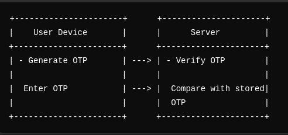
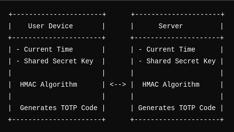
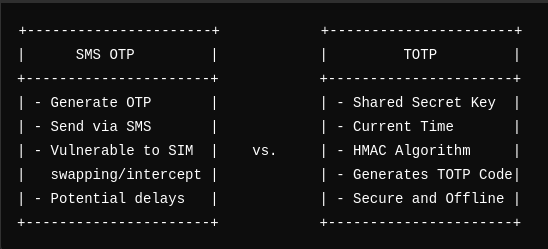

## Table of Contents

- [Introduction](#introduction)
- [What is TOTP?](#what-is-totp)
- [OTP vs HOTP vs TOTP: How Each of These Differ?](#otp-vs-hotp-vs-totp-how-each-of-these-differ)
- [SMS OTP vs. TOTP: Where does TOTP Shine?](#sms-otp-vs-totp-where-does-totp-shine)
- [How Does TOTP Work?](#how-does-totp-work)
- [Benefits & Limitations of TOTP](#benefits--limitations-of-totp)
- [Emerging Technologies in Two-Factor Authentication](#emerging-technologies-in-two-factor-authentication)
- [Conclusion](#conclusion)

## Introduction

We generally understand authentication as a process in which users prove their identity with credentials like email and password or by verifying account/device ownership through methods like OTPs via email or phone. However, these methods can be compromised. Database leaks can expose credentials, posing significant security risks. By combining multiple authentication factors, we make it much harder for malicious actors to gain access, which is where Two-Factor Authentication (2FA) comes in.

Integrating 2FA into your authentication flow offers numerous benefits. It enhances password recovery processes, strengthens account security, and improves user experience while making it harder for attackers to exploit (potentially) compromised credentials.

There are various 2FA methods, including OTPs sent via email, SMS, or biometrics. By integrating Two-Factor Authentication (2FA), we can significantly enhance our software's overall security.

One of the most effective and popular methods is TOTP (Time-Based One-Time Password), which generates unique, time-sensitive codes, adding an extra layer of security to your authentication system.

## What is TOTP?

TOTP (Time-Based One-Time Password) is an algorithm that generates a unique password for each login attempt using time as a counter. Every fixed interval (usually 30 seconds), a new password is generated. This addresses several issues with traditional passwords: they can be forgotten, stolen, or guessed. OTPs solve some of these problems, but their delivery via SMS or email can be unreliable (or even risky, considering it opens new attack vectors).

TOTP, however, generates codes offline, making it both secure and convenient. You just need an authenticator app on your phone, and you're set—no internet required.

## OTP vs HOTP vs TOTP: How Each of These Differ?

### OTP (One-Time Password)

- **Definition**: Valid for one session or transaction.
- **Use Cases**: Sent via email or SMS for single-use verification.

### HOTP (HMAC-Based One-Time Password)

- **Definition**: Uses a counter and a shared secret key.
- **Mechanism**: Counter increments after each use.
- **Use Cases**: Ideal for hardware tokens where clocks are not synchronized.

### TOTP (Time-Based One-Time Password)

- **Definition**: Builds on HOTP by incorporating the current time.
- **Mechanism**: Generates passwords based on fixed time intervals (e.g., 30 seconds).
- **Use Cases**: Commonly used in 2FA apps like Google Authenticator.

For a detailed comparison, see our [guide on OTP vs TOTP vs HOTP](https://supertokens.com/blog/otp-vs-totp-vs-hotp/).

## SMS OTP vs. TOTP: Where does TOTP Shine?

### SMS OTP
- **Advantages**: Easy to implement and use.
- **Disadvantages**: Vulnerable to SIM swapping and interception, potential delays.

### TOTP
- **Advantages**: More secure, doesn’t rely on external communication channels.
- **Disadvantages**: Requires an app or hardware token, and there are potential synchronization issues.

Learn more about [types of authentication](https://supertokens.com/blog/types-of-authentication/) and the [benefits of multi-factor authentication](https://supertokens.com/blog/benefits-of-multi-factor-authentication/).

## How Does TOTP Work?

TOTP (Time-Based One-Time Password) generates unique passwords using the current time as a counter. Every fixed interval (typically 30 seconds), a new password is generated. This method addresses several issues with traditional passwords: they can be forgotten, stolen, or guessed, and OTPs sent via SMS or email can be unreliable due to latency and network issues.

### Technical Breakdown

We can break down TOTP into these "pieces" for easier understanding:

- **Shared Secret**: A unique, random string of characters generated at the time when TOTP is enabled for an account. Typically, the server generates this secret and shares it securely with the client. It's often encoded in a QR code that the user scans with their authenticator app. The secret must be stored securely on both the server and the client device. On the server, it's usually stored in an encrypted format to prevent unauthorized access. The secret should be long and random enough to prevent brute-force attacks. Commonly, secrets are at least 128 bits (16 characters) long.
- **Current Time**: Both the server and client use the current time, divided into intervals (e.g., 30 seconds), to ensure the generated codes are in sync.
- **HMAC Algorithm**: HMAC is a method for generating a message authentication code using a cryptographic hash function paired with a secret key. The shared secret key and the current time are combined and input into the HMAC function, producing a hash value. This process ensures the integrity and authenticity of the message. Even if an attacker intercepts the message, they cannot recreate the hash without the secret key. Common hash functions for HMAC include SHA-1, SHA-256, and SHA-512, with SHA-1 being the standard for TOTP.
- **Password Generation**: The generated hash is then used to create the one-time password. Specifically, a portion of the hash is extracted and converted into a numerical code, which becomes the TOTP. This code is valid only for the current time interval, adding a layer of security since it changes frequently. The length of the TOTP is typically six to eight digits, making it easy for users to enter manually while still being secure.

With TOTP, codes are generated offline, enhancing security and convenience. All you need is an authenticator app on your phone—no internet required. This makes TOTP not only secure but also cost-effective, as it eliminates the need for SMS or email delivery infrastructure.

## Benefits & Limitations of TOTP

### Benefits

- **Security**: TOTP adds an extra layer of security to your online accounts, making it harder for hackers to gain access to your accounts. Since the codes generated are unique and are not sent over a network they are harder to intercept.
- **Convenience**: TOTP codes are generated locally on your mobile device making it extremely convenient. It does not need internet or network access.
- **Cost**: Unlike SMS or email-based OTPs which have infrastructure costs associated with delivering the OTP, TOTP is based on an Open Source algorithm and there are no costs associated with deliverability.

### Limitations

The one major downside of TOTP is that the secret key is stored on both the user’s device and the server. If either of these systems were to be compromised, a malicious actor would now be able to generate codes and have unfettered access to the user’s account.

## Emerging Technologies in Two-Factor Authentication

- **Biometric Authentication**: Uses physical attributes like fingerprints, facial recognition, or voice recognition to verify identity. This method leverages unique personal characteristics, making it difficult for unauthorized users to gain access. Some prominent examples of biometric auth are Apple's Face ID and Touch ID, which use facial recognition and fingerprints, respectively. These systems offer enhanced security by making use of a person's unique physical attributes.
- **Push Notifications**: Sends authentication requests to trusted devices. Users approve login attempts with a single tap, enhancing both security and convenience. An example of a push notification factor is Google's 2-Step Verification, which sends a push notification to your registered device for approval. You'd have to interact with the notification in order to allow access to your data.
- **Hardware Tokens**: Physical devices, such as YubiKeys, that generate or store authentication codes. These tokens provide robust security by requiring physical possession for authentication, significantly reducing the risk of remote attacks.

## Conclusion

As a takeaway, we can consider TOTP a method for enhancing authentication systems. It addresses issues with passwords and OTPs by generating unique, time-sensitive codes, which make for a more secure authentication experience overall.

For further information on securing your application with TOTP, [explore SuperTokens](https://supertokens.com/product).
