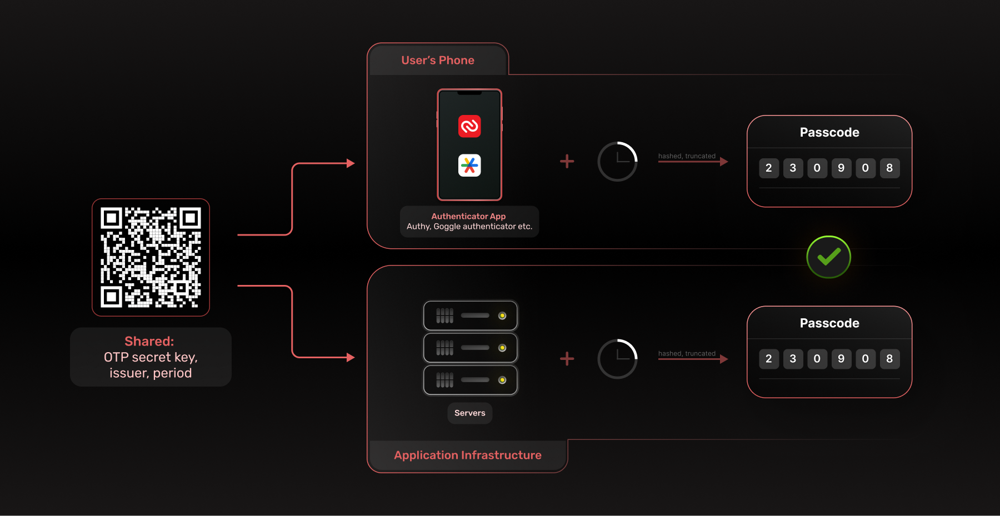

## Table of contents
- [Introduction](#introduction)
- [What is TOTP](#what-is-totp)
- [How does TOTP work?](#how-does-totp-work)
- [Conclusion](#conclusion)

## Introduction

Authentication asks users to prove their identity through the information that only the owner should know (user credentials like email and password) or verifying that the user has ownership of an account/device(Passwordless login with OTP through email/phones).

However these methods can be compromised. Database leaks can compromise users' credentials and pose a big risk to account security, but, coupling factors together can make it much harder for malicious actors to get access to a user's account. This is where Two-Factor authentication comes into the picture. 

Integrating Two-Factor Authentication (2FA) into your authentication flow brings a number of benefits to your application. From password recovery to account security, 2fa improves the user experience while also making it harder for malicious actors to access accounts with compromised credentials.

An example of this is the ongoing [youtube account hacks](https://www.wired.com/story/youtube-bitcoin-scam-account-hijacking-google-phishing/). Although YouTube has the option for 2fa, it is not required to change the account owner once a session is established. This resulted in several popular YouTube channels being compromised and the owners being locked out of their accounts through a session hijacking attack. If the “change ownership” action had been protected by 2fa, the effects of this attack could have been significantly reduced.

There are a number of different 2fa methods like OTP sent through email, sms, or biometrics but one of the most popular methods 2fa methods is TOTP.

## What is TOTP?

TOTP is a time-based one-time password algorithm that generates a unique password for each login attempt. It uses time as a counter and will generate a new password in a fixed interval of time. This solves issues that have plagued traditional factors for years and makes TOTP convenient and secure to use. Let's take a look at some of these issues:

Passwords in general could be better. They can be forgotten, stolen, or guessed through brute force and most people reuse them. Using One Time Passwords solves these issues but they need help with deliverability. OTPs sent through sms or email can be late or not arrive depending on latency and network issues making them less convenient. Finally, biometric-based authentication is one of the most secure methods and avoids the downsides of the other methods but requires dedicated hardware to work.  
This is where TOTP comes in. It avoids the pitfalls of passwords by generating unique one-time codes and since it uses a time-based counter, it is able to generate codes offline without the need for internet access. It is also cost-effective since all it requires is downloading an authenticator application on your phone.

## How does TOTP work?

To enable TOTP, you will first need to install an authenticator application. Some popular choices are Google Authenticator, Microsoft Authenticator, or Authy.
Once set up, the app will generate a unique, time-limited code that will be used as a second factor.

The code generated by the app is based on a shared secret key between the app and the online service. The key is a long string of characters unique to your account and generated when you enable TOTP. The key is then used to generate a new code every 30 seconds, and the code is valid only for a short time. This ensures that even if someone intercepts the code, they won't be able to use it to access your account due to the short lifetime.

**What are the benefits of TOTP?**

- **Security**: TOTP adds an extra layer of security to your online accounts, making it harder for hackers to gain access to your accounts. Since the codes generated are unique and are not sent over a network they are harder to intercept.
- **Convenience**: TOTP codes are generated locally on your mobile device making it extremely convenient. It does not need internet or network access.
- **Cost**: Unline SMS or email-based OTPs have infrastructure costs associated with delivering the OTP, TOTP is based on an Open Source algorithm and there are no costs associated with deliverability.

**What are the downsides of TOTP?**
The one major downside of TOTP is that the secret key is stored on both the user's device and the server. If either of these systems were to be compromised, a malicious actor would now be able to generate codes and have unfettered access to the user's account.

## Conclusion

With the rise in popularity of 2fa in recent years, securing your application with TOTP has become more important than ever. It reduces attack vectors, is easy to set up, and is cheaper when compared to other OTP methods.
