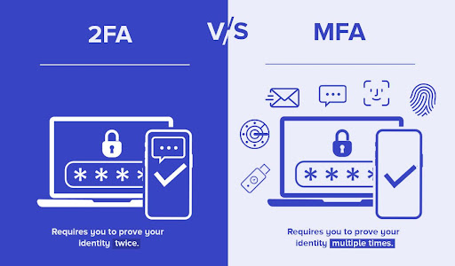
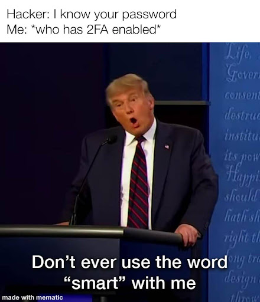
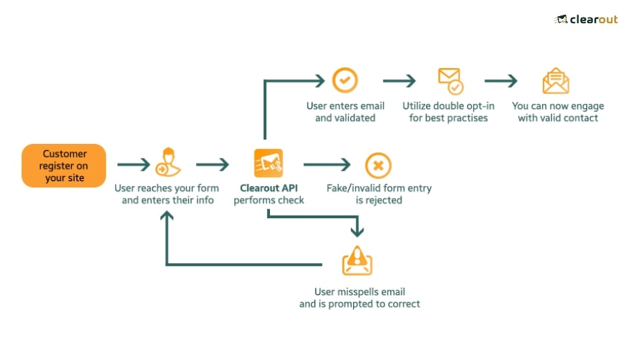
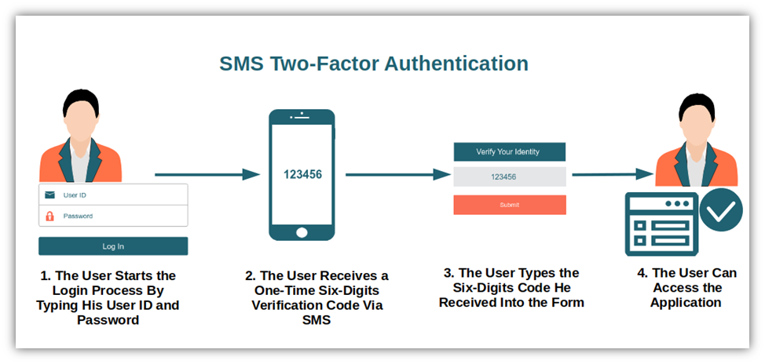
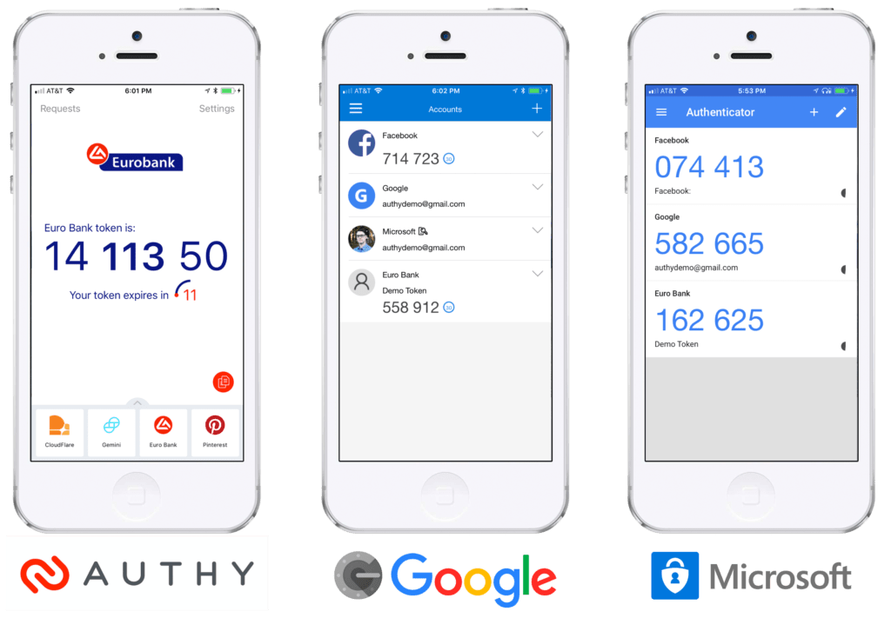
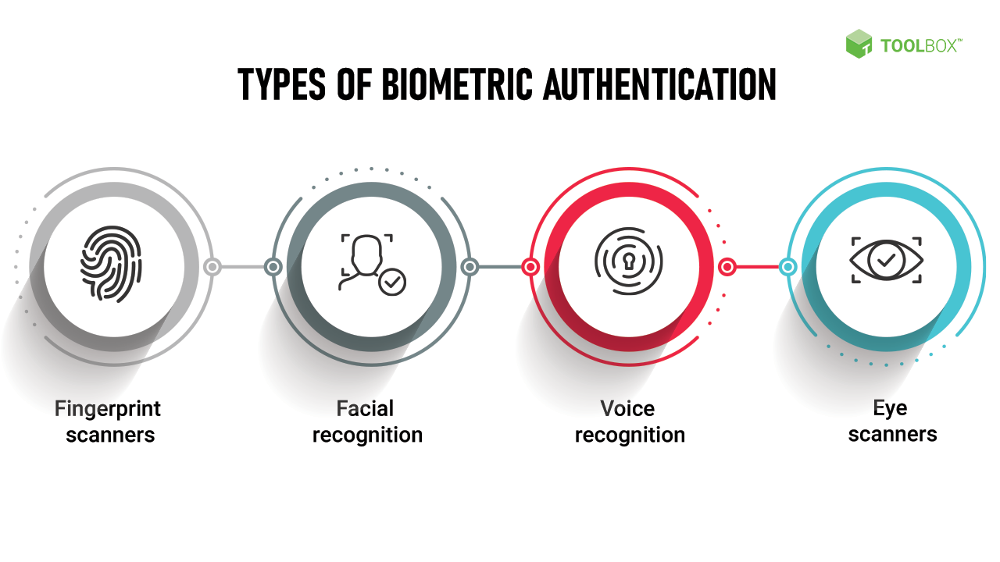
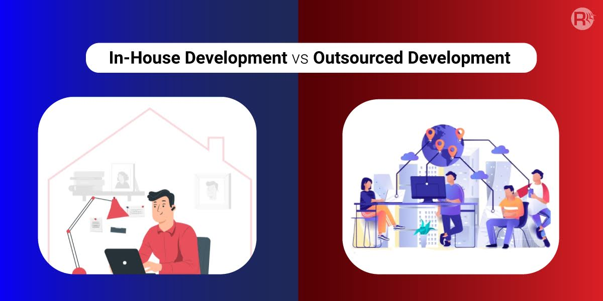

## Introduction

Nowadays, just using a password is not enough. There are numerous techniques for credential theft and unauthorized account access, ranging from basic relay and spray attacks to advanced tactics like [spear-phishing](https://supertokens.com/blog/phishing-attacks-in-2024) and [pharming](https://www.fortinet.com/resources/cyberglossary/pharming#:~:text=Pharming%20Meaning%20and%20Definition&text=Pharming%20is%20a%20two%2Dstep,a%20website%20or%20online%20service.). So, stop relying on your simple password that probably has a sequence of “123456” or is just “password” and use one of the most effective methods for enhancing security which is two-factor authentication (2FA) or multi-factor authentication (MFA).

As you may have guessed, Two-Factor Authentication (2FA) and Multi-Factor Authentication (MFA) are security processes that require users to provide two or more verification factors to access an account or system, such as using biometrics or generating a one-time code on your phone all in addition to your password.

## What’s the difference between 2FA and MFA?

Well, it’s simple really, 2FA is a subset of MFA, involving exactly two authentication factors, whereas MFA may involve two or more. For 2FA, this typically includes something the user knows (e.g., a password or PIN), combined with something the user has (e.g., a smartphone app that generates a code or a physical token), or something the user is (e.g., a fingerprint or another biometric factor).

MFA extends this concept by requiring two or more verification factors, which could include two factors as in 2FA or add additional layers of evidence, such as a location factor (e.g., being within a secure network) or behavioral biometrics (e.g., typing patterns). MFA provides a higher security level by adding more hurdles for potential attackers to overcome.

The primary benefit of 2FA and MFA is that they add an extra layer of security. Even if a hacker manages to obtain your password, they would still need access to your other authentication factors. This significantly reduces the risk of unauthorized access and prevents your sensitive information from being stolen. 2FA and MFA are effective against a wide range of common attacks, including phishing, social engineering, and brute force attacks, as accessing the account requires more than just guessing or stealing a password.

## Methods of 2FA and MFA

### Email based verification

Now, let’s talk a little bit about the methods used for authentication and their pros and cons.
Let us begin with Email-based verification, which sends a verification link or code to the user's registered email address, which they must click or enter to authenticate. Its pros would be that: 

- **Easy to implement and use**: since everyone has an email account making it a universally accessible method. 

However, there are also cons such as:

- **Email accounts can be compromised**: potentially allowing attackers access to other services authenticated through email. 
- **Loss of access to email**: some people might no longer have access to their email accounts.

## SMS based codes

Next up are SMS-based codes which are codes sent to the user's mobile phone via SMS, which they enter as a part of the authentication process. It has the same pros and cons as Email-based verification which is that everyone has a phone and they are probably familiar
with receiving and entering codes from SMS. 

On the other hand: 

- **SMS messages can be intercepted or redirected**: especially if the attacker manages to perform a SIM swap fraud.
- **Network dependant**: receiving your SMS code depends on your network service.

Next up are SMS-based codes which are codes sent to the user's mobile phone via SMS, which they enter as a part of the authentication process. It has the same pros and cons as Email-based verification which is that everyone has a phone and they are probably familiar
with receiving and entering codes from SMS. 

On the other hand: 

- **SMS messages can be intercepted or redirected**: especially if the attacker manages to perform a SIM swap fraud.
- **Network dependant**: receiving your SMS code depends on your network service.

## Time-Based One-Time Passwords (TOTP)

Then we come to Time-Based One-Time Passwords (TOTP) which works through Authenticator apps that generate time-based, one-time passwords based on a shared secret and the current time, providing a constantly changing code. Its pros would be:

- **Great security**: that it has better security than SMS-based codes.
- **Not network dependant**: no network is required to generate the codes.

Then again, like everything else, it has its cons and these are:

- **Working device required**: users must keep their device charged and available as losing access to the device complicates the login process.
- **Complex setup**: considered complex to set up for less tech-savvy individuals.

## Biometric Authentication

An additional authentication method that must be mentioned is Biometric Authentication and its pros are:

- **Highly secure**: uses unique biological characteristics of individuals, such as fingerprints, facial recognition, or iris scans, for verification.
- **Quick and easy**: often requiring just a touch or a look to authenticate.

The cons are:

- **Privacy concerns**: raises privacy concerns due to the fact that your biometric data is collected and stored, which could potentially lead to its misuse.
- **Requirement for specific hardware**: it requires specific hardware that can read and verify biometric data, which may not be available on all devices.

## What To Prioritize When Considering MFA & 2FA Providers?

**Prioritize security features**: it's best to look for providers offering a range of options like SMS, email, biometrics, hardware tokens, and software tokens. 

**Check provider's history**: make sure it doesn’t have any security breaches or issues. 

**Find solutions that offer flexible authentication methods**: it's also important to consider providers that are flexible and easy to use, with flexible methods such as biometrics, push notifications, or SMS codes, and that remember trusted devices to reduce the frequency of authentication prompts so you can have a frictionless experience.

**Minimal downtime and fast authentication processes**: it’s crucial to look for providers known for minimal downtime and fast authentication processes as reliability is essential to avoid wasting any of your productive time due to authentication failures.

**Evaluate the pricing structure**: ensure it fits your budget while meeting your security needs. Consider all costs, including setup, per-user fees, and any hardware expenses. Also, consider the potential cost savings from reduced security breaches and improved operational efficiency due to a more streamlined authentication process.

## Third-Party vs. In-House Development Authentication

Third-party Multi-Factor Authentication (MFA) and Two-Factor Authentication (2FA) solutions are popular among organizations looking to avoid handling the complex and tedious aspects of security, such as encryption, hashing, token generation, and verification all from scratch and relying on a third party to do it all for them which ultimately saves the time and effort of the organization as it would allow them to focus on different aspects of their applications.

### Third-party MFA/2FA Pros

**Specialize in security**: their solutions are developed, maintained, and updated by experts who are focused on cybersecurity, so without a doubt they are highly reliable. 

**Offer support and maintenance services**: providing help with any issues and ensuring the system is always running the latest, most secure version of the software.

### Third-party MFA/2FA Cons

- **High running cost**: while third-party solutions can save on development costs, they often come with subscription fees that can add up over time, especially for large organizations with many users. 

- **Offers limited customization options**: potentially not fitting perfectly with an organization’s unique needs or existing IT infrastructure. Since a third party built the security, organizations may find themselves reliant on the vendor for updates, improvements, and troubleshooting. This dependence can pose a risk if the vendor discontinues the service, increases prices, or experiences downtime.

### In-House development of MFA/2FA Pros

**Customizable security measures**: allows organizations to tailor security measures specifically to their needs. 

**Adjust scalability**: While developing in-house, organizations can architect their MFA/2FA solutions to be scalable from the beginning, ensuring they can handle an increasing number of users, transactions, and integration points without significant rework. 

**Quick adaptation**: security threats evolve rapidly, and regulatory requirements change. In-house solutions provide the ability to adapt quickly to these changes, incorporating new authentication methods or adjusting security protocols without waiting for a third-party vendor to release updates.

### In-House development of MFA/2FA Cons

**High initial cost**: building an MFA/2FA system in-house demands a significant upfront investment in terms of both time and money. Organizations need to allocate resources to research, design, development, and testing phases, ensuring the solution meets the desired security standards.

So, if your organization needs an authentication system but doesn’t have the time and effort to develop it for itself relying on a third party would be recommended, else if your organization has specific requirements for the system then it would be better to develop it for itself. However, a third-party solution can be the more strategic choice. If your organization lacks the in-house expertise in cybersecurity necessary to develop, maintain, and continuously update a robust MFA/2FA system, a third-party provider brings specialized knowledge and a track record of reliability that can significantly mitigate these challenges.

## Best MFA & 2FA Providers For Convenience & Simplicity

### Cisco Duo
In this section, we will talk about some of the most popular MFA/2FA providers and highlight some of their key features. Let's start off with Cisco Duo which Specializes in multi-factor authentication (MFA) with a strong emphasis on security. 

#### Key Features

**Diverse authentication methods**: including Duo Push which allows you to authenticate easily with just a single tap through their app, phone callback, and U2F tokens for secure access. 

**Detailed reporting capabilities**: for tracking authentication attempts, user behavior, and overall access security. 

**Real-time response to risks**: it also adapts and responds to risks in real-time making it best for larger organizations and enterprises with significant security requirements, particularly those needing strong user and device verification processes.

### Auth0
Moving on, we have the well-known Auth0.

#### Key Features

**Supports complex authentication flows**: for diverse application ecosystems, making it highly customizable

**Customizable authentication and authorization flows**: provides developers with the flexibility to customize authentication and authorization flows using its Rules, Hooks, and Extensions, which can handle complex requirements specific to business needs. Furthermore, It has built-in anomaly detection features that help protect against credential stuffing attacks and brute force attacks. 

**Offers a comprehensive set of APIs**: for user management tasks, such as creating, updating, retrieving, and deleting user identities. This is crucial for large-scale applications needing to handle a large number of user profiles efficiently, making Auth0 versatile enough to serve businesses of all sizes but shines in environments where complex user management and sophisticated identity solutions are required, such as SaaS platforms and large-scale e-commerce sites.

### SuperTokens

Finally, we come to SuperTokens, one of the rising open-source authentication solutions designed to help developers implement highly customizable, secure authentication systems within their applications. It focuses on providing both the flexibility of custom development and the ease of use typically associated with third-party services. 

#### Key Features

**Supporting a variety of authentication methods**: including email, password login, and social logins (like Google, Facebook, etc.).

**Magic link authentication**: a passwordless authentication option. 

**Open-source nature**: which means its source code is freely available for anyone to view, modify, and distribute. This approach encourages transparency and collaboration among developers.

**Growing community**: that offers support through various channels due to the open-source nature of the project which encourages contributions and feedback, helping to rapidly evolve and improve the platform. 

From our perspective, Supertokens is suited for startups and small to medium enterprises looking for an effective, budget-friendly solution that they can scale and adapt over time.

## Conclusion

So, as we mentioned above it is essential to look for the right MFA/2FA providers which offer reliability, flexibility, ease of use, a wide variety of options, and a clean history that doesn't have any security breaches or issues.

For all of that and more, we would recommend using third-party 2FA/MFA solutions as they would boost your organization’s security effortlessly and provide robust, continuously updated cybersecurity measures that protect against emerging threats. With easy integration and minimal operational disruption, third-party MFA allows your team to focus on core business tasks, enhancing productivity while securing sensitive data. One particular provider I would suggest using is Supertokens, which offers all the features mentioned above and more.

