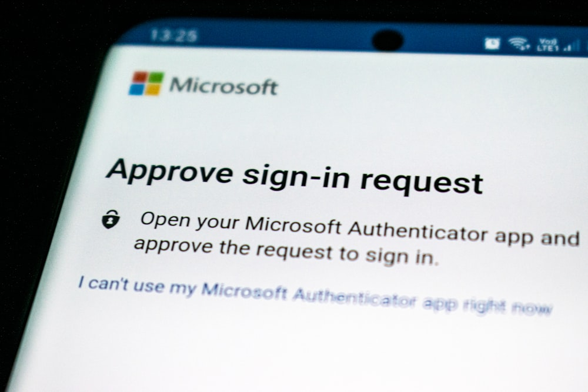
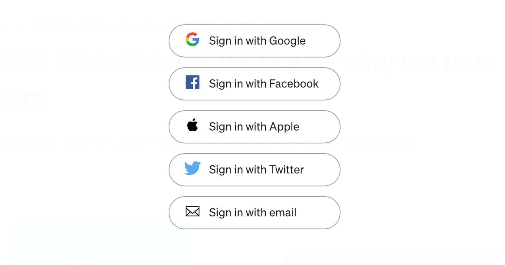

## Table of Content

- [Introduction](#introduction)
- [Types of Authentication](#types-of-authentication)
- [Multi-factor Authentication](#multi-factor-authentication-mfa)
- [Social Login](#social-sign-in)
- [Biometric Authentication](#biometric-authentication)
- [Passwordless Authentication](#passwordless-authentication)
- [Adaptive Authetication](#adaptive-authentication)
- [Single Sign-On(SSO)](#single-sign-on-sso)
- [Authentication Hierarchy: Security vs Usability](#authentication-hierarchy-security-vs-usability)
- [Choosing the Right Type of Authentication](#choosing-the-right-type-of-authentication)
- [Conclusion](#conclusion)

## Introduction

Verizon’s “[2023 Data Breach Investigations Report](https://www.verizon.com/business/resources/reports/dbir/)” revealed that hackers used stolen user credentials in 49% of data breaches. These statistics have expensive consequences for consumers and businesses, as 95% of data breaches result in financial loss. 

But how does a bad actor steal user credentials to gain access? Often, the cause is weak user authentication. At its core, user authentication verifies the identity of individuals accessing a system or application, typically with a username and password. However, the effectiveness of traditional password-based authentication has dwindled in the face of increasingly sophisticated cyber attacks resulting in data being accessed by unauthorized users. 

Passed-based authentication is one of the most common authentication methods, but stolen user credentials have become more pressing than ever. Implementing robust user authentication measures when developing modern systems and applications is crucial to mitigate the risks of unauthorized access and data breaches. This article will cover common types of authentication, discuss the theory of authentication hierarchy, and examine the delicate balance of authentication and user experience. 

## Types of Authentication

Password authentication protocol involves a user entering a unique username and password to access a system or application. While it is the most common form of confirming user identity, it is also the most vulnerable due to security risks.

Reports such as HYPR and Yubico’s “[Transcending Passwords: The Next Generation of Authentication](https://www.yubico.com/resource/transcending-passwords-the-next-generation-of-authentication/)” reveal a shift in how developers and security engineers view authentication. With data to back it up, this report shows that organizations using alternative authentication methods are less likely to be victims of cyber attacks. 

What alternatives do we have? Let’s explore some robust authentication options: 

## Multi-factor Authentication (MFA):

MFA or multi-factor authentication is an extensible authentication protocol that adds an extra layer of security on top of traditional username and password logins. You may have heard of 2FA or two factor authentication before. MFA builds on that by combining multiple authentication protocols and authentication factors, and requires users to provide at least two or more verification factors from different categories making it one of the most secure authentication methods: 

- **Something you know**: A password, PIN, or security question answer.

- **Something you have**: A security key, a one-time code sent via SMS or mobile authenticator app, or a hardware token 

- **Something you are**: Factors like fingerprints, facial recognition, or iris scans

An everyday use case for MFA requires the user to input a code from a mobile authenticator application after inputting their username and password. 

## Social Sign-in

Social sign-in allows third-party platforms like Facebook and Apple to authenticate users. This way users can leverage their existing social media accounts.

Social sign-in is commonly used for news and entertainment apps to allow users to leverage their existing accounts, interact with content using their social profiles, and reduce the need for duplicate accounts. 

## Biometric Authentication

This method verifies a user’s identity based on unique physical or behavioral characteristics. Common examples include: 

- **Fingerprint recognition**: Sensors scan the user’s fingerprint against a stored template for a match. 

- **Facial recognition**: Facial features are mapped and compared to a stored image. 

Mobile devices such as smartphones and tablets commonly utilize biometric authentication. Fingerprint recognition and facial and voice recognition technologies are built into most modern-day mobile devices, providing a secure and reliable method of biometric identification for accessing the device.

## Passwordless Authentication

 This method eliminates the need for passwords. Passwordless login implementations typically request an email or phone number to identify the user. Once the user inputs their email or phone number, the system sends them a magic link, and the user can open the link to log in to their account. 

 

 Passwordless login technologies are common in e-commerce and retail apps because users can check out faster and don’t need to remember complex passwords. 

 ## Adaptive Authentication

 This approach dynamically adjusts authentication requirements based on various factors. When one of the following factors is triggered, additional verification steps might be required: 

- **User location**: Login attempts from unusual locations

- **Device recognition**: Login attempts from unrecognized devices

- **Time of day**: Login attempts outside regular working hours

- **User behavior analysis**: Deviations from typical user behaviors, such as excessive login attempts 

Financial applications, like mobile banking apps, frequently utilize adaptive authentication due to the sensitive data they handle. For instance, the application may prompt additional authentication measures if a user initiates a large international money transfer.

## Single Sign-On (SSO)
SSO allows users to log into multiple applications within a trusted domain using a single set of credentials.

SSO is commonplace in educational institutions. Students and educators can use a single login to access systems, email, library resources, and other web applications in this use case.

## Authentication Hierarchy: Security vs Usability

The delicate balance between security and usability is a constant challenge for developers. Robust security measures are essential to protect user data and prevent unauthorized access. On the other hand, overly complex authentication methods can frustrate users and lead to a negative experience.

**Can security and user experience live in harmony when it comes to authentication?**

All signs point to **yes**. However, there’s no one-size-fits-all solution. The “most secure” option for user authentication depends entirely on your specific context. You must consider a variety of factors, including: 

- **Your users**: Who are they? What are their technical skills and comfort levels? 

- **Their needs**: What data are they accessing? What level of security is appropriate for accessing that data?

- **Compliance and legal requirements**: Do you need to meet any industry regulations or legal requirements? 

Instead of finding the overall “most secure” option, **you must find the “most secure” option for your specific user**. This is the key to achieving harmony between security and usability. 

## Choosing the Right Type of Authentication

Now that we've established the importance of knowing your user, let's look at how to choose the right authentication type when developing applications. In the following table, the authentication types discussed earlier are broken down, highlighting critical points for security, usability, example user profiles, and real-world examples. Security and usability were rated based on the following parameters:

**Security**: 

- **High**: Methods that add additional layers of security or use strong, non-replicable factors. 

- **Moderate**: Methods that offer decent security but might have some limitations. 

- **Low**: Methods with inherent weaknesses or are primarily focused on convenience. 

**Usability**:

- **High**: Methods that are easy to set up and use and don’t require significant technical knowledge from the user. 

- **Moderate**: Methods that offer a balance between security and usability. 

- **Low**: Methods that might require additional steps or technical expertise. 

| Authentication method 	| Security 	| Usability 	| User Profile 	| Real-world example 	|
|---	|---	|---	|---	|---	|
| Multi-factor authentication(MFA) 	| High 	| Moderate 	| Moderate User requires strong security for accessing sensitive data 	| Cloud-based application login 	|
| Social Sign-in  	| Moderate 	| High 	| User prefers a quick and familiar login process and doesn't mind using existing credentials. 	| Social media platforms 	|
| Biometric authentication  	| High 	| Moderate  	| User with a mobile device that prioritizes convenience  	| Smartphone apps 	|
| Passwordless authentication  	| High  	| High 	| User who accesses their account infrequently and doesn't want to manage a login and password. 	| E-commerce websites and applications 	|
| Adaptive authentication  	| High 	| Moderate  	| User who access the same applications from various locations and devices. 	| Banking websites and applications 	|
| Single Sign-On(SSO) 	| Moderate  	| High 	| User who needs seamless access to multiple internal applications without managing credentials for each individually 	| Enterprise systems and applications 	|

In the space of identity and access management solutions, SuperTokens empowers you with a flexible platform that supports various authentication methods to cater to a wide range of user needs. Whether you require the high security of MFA or the user-friendly convenience of SSO, [you can build your ideal authentication flow with SuperTokens](./https://supertokens.com/product). 

## Conclusion:
Authentication plays a crucial role in user experience. Choosing the right authentication type for your specific user needs can strike the perfect balance between security and usability. Remember, there’s no single “best” option. SuperTokens allows you to implement various authentication methods, ensuring you can tailor user access to your specific needs. 
