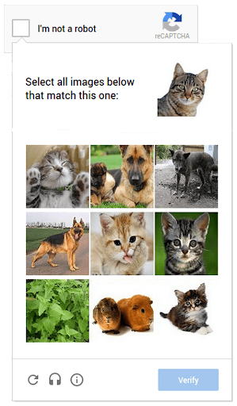
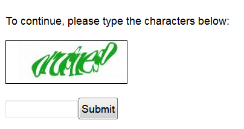
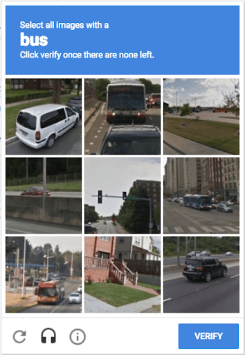
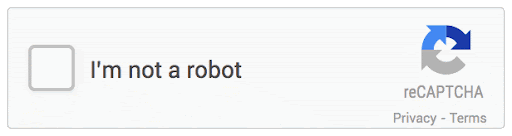
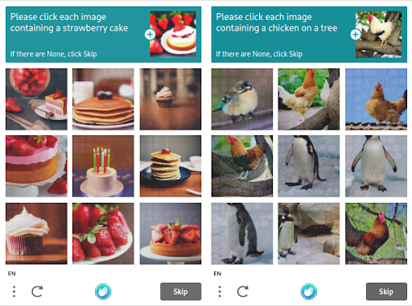

## Introduction
Ever wondered, 'What is CAPTCHA?' CAPTCHA (or more accurately CAPTTTCHA), standing for Completely Automated Public Turing Test to Tell Computers and Humans Apart, is a technology specifically developed to enhance web security.

The core purpose of CAPTCHA is to differentiate between human users and automated bots on the internet. This distinction is crucial in preventing spam and automated data extraction, and in securing online polls, registrations, and e-commerce transactions. 

So how does Captcha work exactly? CAPTCHAs challenge users with tasks that are easy for humans but difficult for computers, such as recognizing distorted text or identifying objects in images. 

By doing so, they serve as a gatekeeper, ensuring that online interactions and services are used by real people, thereby maintaining the integrity and security of websites.

## The Evolution of CAPTCHA Technology 

### Text-Based CAPTCHAs: The Early Days
When CAPTCHAs first entered the scene, they were fairly straightforward text-based puzzles. These early CAPTCHAs were like the first level of a video game, where the challenge was to read distorted text. 

Technically, this was done using algorithms that twisted or overlaid lines onto text, sort of like putting a puzzle together but with letters and numbers. This was tricky enough to confuse basic computer programs, which weren't very good at recognizing these jumbled characters, but sadly they do work no longer.

## Image-Based CAPTCHAs: A New Level of Complexity

But as in any game, as the player(bot) gets better, a new level of complexity is introduced to the game. Why do we need to do that? Because computers got smarter. Forcing the introduction of something called Optical Character Recognition (OCR). 

The thought process then shifted to a compelling question: "If computers have mastered text recognition, can they similarly navigate the complexities of image interpretation?" And thus, image-based CAPTCHAs were born. These new challenges were like asking, "Can you find the cat in a picture of a living room?" Easy for humans, but surprisingly tough for computers.

These image CAPTCHAs work because computers, while good at reading, weren't great at understanding complex images. Think of these as giving computers a pair of glasses and a detective hat, but the glasses are a bit foggy, and the hat doesn't quite fit. So, computers struggled to distinguish between a tree and a lamp post, for example.

### AudioBased CAPTCHAs: Deciphering Sounds in Digital Security
As for audio CAPTCHAs, imagine trying to listen to a given sentence, but with lots of background noise. The audio CAPTCHAs do something similar to that of CAPTCHAs with numbers and letters by adding noise to the audio message, making it hard for computers, which were just starting to get the hang of clean and clear audio, to decipher the jumbled sounds.

In recent years, CAPTCHA puzzles have become even trickier, almost like boss levels in games. They now adapt based on how you interact with them, constantly changing the rules of the game to keep the computers guessing. 

For instance, if a user successfully solves a few simple image-based CAPTCHAs, the system might then present more complex puzzles, perhaps featuring images with subtle distinctions or a higher level of visual noise. 

Similarly, if a user struggles with a particular type of CAPTCHA, the system may offer a different style, like switching from a text-based puzzle to an image recognition task. This dynamic adjustment makes it increasingly difficult for automated programs to predict and prepare for the next challenge.

One thing that we can say for sure is that with the rising complexity of CAPTCHAs, there's a growing sentiment that these challenges are becoming a bit tough for humans as well, or at least we could say that when it comes to solving such tricky CAPTCHAs, well…

## Analysis of Current CAPTCHA Systems

### Google’s ReCAPTCHA
Modern CAPTCHA systems, exemplified by Google's reCAPTCHA and hCaptcha, showcase an advanced blend of technology and psychology to distinguish between human users and automated bots. These systems have evolved from simple text or image recognition tasks to more sophisticated, user-behavior-based challenges.

Let's start with Google's reCAPTCHA. It's like a cyber detective, constantly observing how a user interacts with a website. The most recent version, reCAPTCHA v3, operates quietly in the background, scoring each user's interaction with a website on a scale of 0.0 to 1.0. This score reflects the likelihood of the user being human. A score closer to 1.0 suggests a human user, while a score leaning toward 0.0 raises red flags about potential bot activity.

How does it determine this score? reCAPTCHA v3 employs advanced risk analysis algorithms that analyze various parameters of user behavior. These include mouse movements, typing patterns, and even how quickly a user clicks on things. For instance, a user rapidly clicking through pages or moving the mouse in unnatural, predictable patterns might score lower, triggering a CAPTCHA challenge.

### hCaptcha

In contrast, hCaptcha, another popular system, focuses more on image-based tasks while also considering user behavior. When a user encounters an hCaptcha, they might be asked to identify specific objects in images. But here's the technical kicker: the decision to present a CAPTCHA, and its complexity, is influenced by the user's previous interactions on the site and across the web.

Behind the scenes, both systems are constantly processing a wealth of data. They look at things like IP addresses, session duration, and even the hardware and software being used. For example, a user with a brand-new IP address, or one known for spammy behavior, might be more likely to face a CAPTCHA challenge.

### Is it possible to bypass hCaptcha and reCaptcha?

Despite both ReCaptcha’s and hCaptcha's efficiency in distinguishing between humans and bots, it is not impervious to sophisticated AI technologies like Metabypass. 

Metabypass leverages deep learning and superior image recognition capabilities to swiftly decode hCaptcha's puzzles, offering accurate solutions in just a few seconds. 

This advancement allows users to bypass the Captcha process, granting quicker access to websites without the need to manually solve the challenges.

## User Experience, Accessibility, and Technical Trade-offs 

CAPTCHAs, while crucial for website security, significantly impact both website performance and user experience.

### CAPTCHAs and User Experience

From a user experience perspective, CAPTCHAs can be a source of frustration. Traditional text-based CAPTCHAs, notorious for their hard-to-read text, could take users an average of 10 seconds to solve. This interruption, though seemingly brief, can disrupt the user's flow, particularly in scenarios requiring quick interactions, like during checkouts in online shopping.

### CAPTCHAs and Technical TradeOffs

Technically, integrating a CAPTCHA system can affect a site's load time and user interaction flow. For instance, implementing Google's reCAPTCHA might add an additional network request to Google's servers, potentially increasing page load time by several hundred milliseconds.

While this may seem minor, in the realm of web performance, where fast load times are crucial for user retention, even a small delay can impact user satisfaction. Research has shown that a delay of even a second can lead to a 7% reduction in conversions.

### CAPTCHAs and Accessibility

The issue of accessibility in CAPTCHAs presents a complex technical challenge. Traditional text or image-based CAPTCHAs are not suitable for visually impaired users. Although audio CAPTCHAs offer an alternative, they are not always effective for users with hearing impairments or those who struggle with the language in which the CAPTCHA is presented. Designing a CAPTCHA system that is universally accessible, yet secure against automated attacks, is a significant technical hurdle.

### The Future of CAPTCHA: Technical Predictions and Innovations

In the near future of CAPTCHA technology, we're likely to witness a fascinating shift. The trajectory of making CAPTCHAs increasingly complex to outsmart bots has reached a critical point where it's starting to backfire - these CAPTCHAs are becoming too challenging even for humans. This predicament paves the way for the integration of machine learning (ML) to bring balance and efficiency to the CAPTCHA experience.

Another area of innovation could be the integration of biometric data into CAPTCHA systems. As facial recognition and fingerprint technology become more prevalent, we could see CAPTCHAs that ask users to verify their identity through a quick biometric scan. This approach, while raising potential privacy concerns, could offer a more seamless user experience and enhanced security.

## Conclusion and Final Thoughts
So the question that arises: “Should we actually use CAPTCHAs in our websites?” The core issue with CAPTCHAs lies in their inverse relationship with user experience and accessibility. Essentially, there's a tug-of-war between making CAPTCHAs robust enough to thwart bots and making them user-friendly. 

For instance, simplifying CAPTCHAs to enhance user experience can inadvertently make them more vulnerable to automated attacks.  On the flip side, complex CAPTCHAs that are difficult for bots to solve can also pose significant challenges for users, particularly in terms of time and effort. 

One thing that is clear is that a single solution does not fit all scenarios, especially in the context of CAPTCHAs. As a software developer, it's important to carefully consider both sides of this security equation. Sometimes, imposing such restrictions through CAPTCHAs may not be very beneficial and could even hinder the user experience. However, there are also instances where not using CAPTCHAs could lead to disastrous outcomes, such as increased vulnerability to automated attacks and security breaches. The decision to implement CAPTCHAs should be based on a thoughtful assessment of the specific needs and risks associated with your platform.

