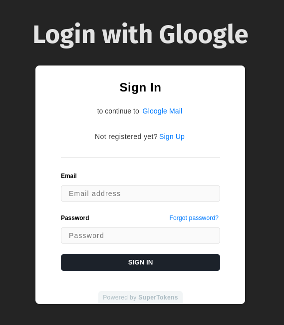

## Table of Contents

- [Introduction](#introduction)
- [**What's the Deal with Unified Login?**](#whats-the-deal-with-unified-login)
- [**Aside: Why Would You Even Need This? When Should You Use Unified Login?**](#aside-why-would-you-even-need-this-when-should-you-use-unified-login)
- [**The OAuth2 Cast of Characters**](#the-oauth2-cast-of-characters)
- [**Tokens, Tokens Everywhere!**](#tokens-tokens-everywhere)
- [**Setting Up Your Gloogle Empire**](#setting-up-your-gloogle-empire)
- [**An Overview of Our All Things Gloogle**](#an-overview-of-our-all-things-gloogle)
   * [**Our Backend**](#our-backend)
   * [**Gloogle Auth**](#gloogle-auth)
   * [**GloogleDocs - A VanillaJS App**](#gloogledocs-a-vanillajs-app)
   * [**GloogleMail - A React App**](#glooglemail-a-react-app)
   * [**GloogleCalendar - A SolidJS App**](#glooglecalendar-a-solidjs-app)
   * [**Putting it all together**](#putting-it-all-together)
- [**The Good, The Bad, and The OAuth2**](#the-good-the-bad-and-the-oauth2)
- [**Wrapping Up**](#wrapping-up)
- [**Key Takeaways**](#key-takeaways)

## Introduction

Ah, authentication. The bane of every developer's existence. Or is it? 🤔 Today, we're diving into the wonderful world of a new feature called Unified Login. Buckle up, folks—it's gonna be a wild ride!

## **What's the Deal with Unified Login?**

Picture this: you're building the next big thing. It's like Google, but cooler (obviously). You've got your GloogleDocs, GloogleMail, and GloogleCalendar all set up. But wait—how do you handle authentication across all these amazing services? Enter Unified Login. 🦸‍♀️

Unified Login is like that one friend who's great at introducing people at parties. It's a way to authenticate different types of applications using a common Authorization Server. In our case, that server is powered by SuperTokens.

## **Aside: Why Would You Even Need This? When Should You Use Unified Login?**

Great question! I'm glad you asked. Here are a few scenarios where Unified Login might be your new best friend:

1. You've got multiple frontend clients connecting to different backends 

2. You're juggling multiple frontend clients that all connect to the same backend 
 

(Hint: Gloogle, our demo below, uses this one) 

3. You want to use your website login for desktop and mobile apps too 
 
 

Basically, if you're building the next Google (or Gloogle), Unified Login is your jam. Or, if you've already grown to the size where you need a single source of truth for all your authentication and authorization needs.

## **The OAuth2 Cast of Characters**

Before we dive into the nitty-gritty, let's meet our OAuth2 stars:

* 👤 **Resource Owner**: The user (that's you!)
* 💻 **Client**: The application that wants to access protected resources
* 🗺️ **Resource Server**: The server hosting the protected resources (often, an API of some kind)
* 🔒 **Authorization Server**: The server issuing OAuth2 Access Tokens

Think of it like a fancy restaurant. You're the Resource Owner (the VIP), the Client is your personal assistant trying to get you a table, the Resource Server is the exclusive dining room, and the Authorization Server is the bouncer deciding who gets in (and get seated where, to stretch the analogy even further).

## **Tokens, Tokens Everywhere!**

In the world of OAuth2, tokens are like golden tickets. Here are the ones you need to know:

* **OAuth2 Access Token**: The VIP pass to access protected resources
* **OAuth2 Refresh Token**: The "I know a guy" token that gets you a new Access Token
* **ID Token**: The name tag that tells the Client who you are

## **Setting Up Your Gloogle Empire**

Now, let's get down to business. Here's how you can set up Unified Login for your Gloogle services:

1. Enable OAuth2 features in the SuperTokens Dashboard
2. Create OAuth2 Clients for each of your applications
3. Set up your Authorization Service
4. Configure session handling in each application
5. Update the login flow in your frontend apps
6. Test, test, and test again!

...But, the neat part is that you can just ignore all of the steps above if you're out to test drive this. In fact, if you're the hands-on type, here's a handy link for you - [Gloogle Repo](https://github.com/supertokens/Gloogle).

## **An Overview of Our All Things Gloogle**

As with most other tech empires, our Gloogle empire has multiple apps to offer. Otherwise, there's not much point in calling it an empire, right? Plus, the the apps were built in different time periods, using different frameworks. Common problem for a growing tech empire, wouldn't you agree? Luckily, we've moved away from using jQuery last year, so we're not *that* legacy.

Let's take a closer look at each component:

### **Our Backend**

The backbone of our Gloogle empire is, well, a backend. It's a server, handling request. Revolutionary, right? Under the hood, it's an express application relying on the SuperTokens [EmailPassword](https://supertokens.com/docs/emailpassword/quickstart/introduction), [Session](https://supertokens.com/docs/emailpassword/common-customizations/sessions/about) and [Unified Login](https://supertokens.com/docs/unified-login/introduction) recipes.

For a server that does all of the auth heavy lifting, it comes at a whopping 120 lines of code: [Gloogle Backend repository](https://github.com/supertokens/Gloogle/tree/main/backend).

### **Gloogle Auth**

Now, in OAuth2 land, servers also need to show a login screen somehow. There are two schools of thought with this one - some like co-locating their auth UI with the server, others like to keep the front-end part of the auth story separate. Team Gloogle, being cutting edge went for the second approach and went for a full fledged React app for the Auth screen:

Happily enough, SuperTokens' unified login comes with support for that scenario too. In fact, as long as you make the backend aware of the frontend via the [website config option](https://github.com/supertokens/Gloogle/blob/master/backend/src/app.js#L77-L78)(and [vice-versa](https://github.com/supertokens/Gloogle/blob/master/gloogle-auth/src/auth.ts#L10-L11)), it all just works.

Here's how that looks like: [Gloogle Auth](https://github.com/supertokens/Gloogle/tree/master/gloogle-auth).

### **GloogleDocs - A VanillaJS App**

GloogleDocs is our straightforward document editing application. We went for vanillaJS when we first decided to build it - it was a different time. But, that doesn't have to stop us from being able to put our app under a single auth roof:

<video src="./glg_docs.mp4" width="960" height="480" controls></video>

And here's the source for a peek under the hood: [GloogleDocs repository](https://github.com/supertokens/Gloogle/tree/main/GloogleDocs).

### **GloogleMail - A React App**

Of course, no self-respecting tech empire is complete without an email app. We built this one using React - and, as luck would have it, it was fairly easy to pull off putting this one under a unified login roof (in fact, easier than Gloogle Docs). Here's Gloogle Mail in action:

<video src="./glg_mail.mp4" width="960" height="480" controls></video>
 

[GloogleMail repository](https://github.com/supertokens/Gloogle/tree/main/GloogleMail) for the source and more details.

### **GloogleCalendar - A SolidJS App**

As the tech landscape evolved, so did Gloogle's tech choices. One of our newer addition is Gloogle Calendar - A SolidJS app, for that added `Signals` goodness. But, regardless of whether we're dealing with a modern, established or kinda outdated stack - SuperTokens's unified login just works. Here's Gloogle Calendar in action:

<video src="./glg_cal.mp4" width="960" height="480" controls></video>

[GloogleCalendar repository](https://github.com/supertokens/Gloogle/tree/main/GloogleCalendar) to see how it all works.

### **Putting it all together**

While you can clone the repo and run the Gloogle empire locally, here’s a video to see it in action:
<video src="./gloogle_full.mp4" width="960" height="480" controls></video>

Highlights:

* Pay attention to the URL - on our first login attempt, we get redirected to localhost:3001 - which is the address of Gloogle Auth. Once we enter the correct credentials, we’re back to localhost:5173 (Gloogle Docs), in a logged-in state.
* On our second login try, for Gloogle Mail, the login screen isn’t shown at all - Gloogle Auth already remembers who we are and redirects us back to Gloogle Mail. Neat right?
* The same scenario applies to our third attempt on the video, for Gloogle Calendar.

## **The Good, The Bad, and The OAuth2**

Now, I won't lie to you—setting up Unified Login isn't all sunshine and rainbows. There's a bit of red tape involved, especially when creating OAuth2 clients for each of your applications. But hey, that's the price we pay for security and convenience, right?

On the bright side, once you've got it all set up, managing authentication across your Gloogle empire becomes a breeze. Your users can log in once and access all your services seamlessly. It's like magic, but with more HTTP requests. 🧙‍♂️

## **Wrapping Up**

So there you have it, folks—Unified Login with SuperTokens in a nutshell. Is it a bit complex? Sure. Is it worth it? Absolutely. Just imagine the looks on your users' faces when they realize they only need to remember one password for all your Gloogle services. Priceless.

Remember, authentication doesn't have to be a nightmare. With the right tools and a bit of patience, you can create a login experience that's smoother than a freshly waxed surfboard. Now go forth and unify those logins! 🚀

## **Key Takeaways**

1. Unified Login is great for managing authentication across multiple applications.
2. OAuth2 is like a fancy restaurant—lots of roles and fancy passes.
3. Tokens are your new best friends.
4. Setting up Unified Login involves some steps, but it's worth it.
5. Always test your authentication flow thoroughly.

Now, if you'll excuse me, I need to go check my GloogleMail. Happy coding! 👩‍💻👨‍💻
