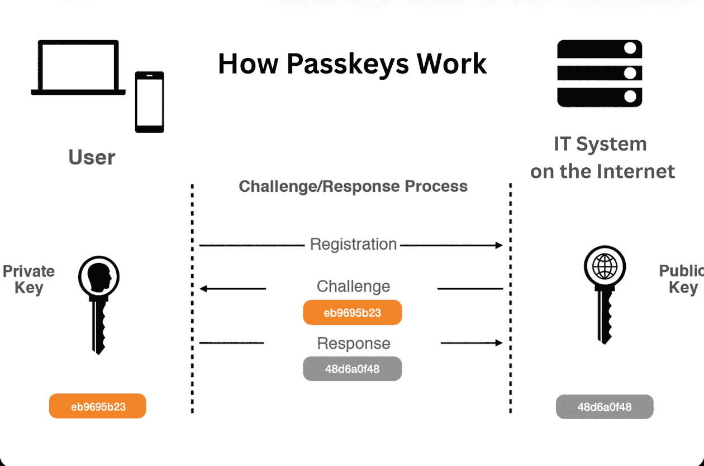
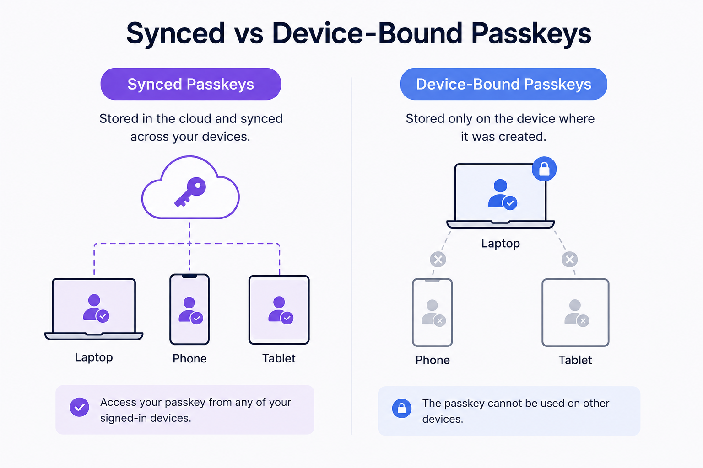
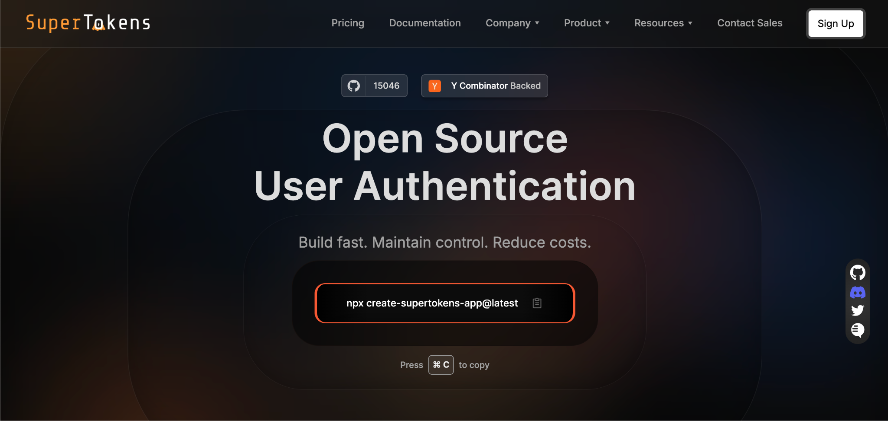

Passwords have a design flaw that no amount of complexity rules can fix: the server has to store a version of the same secret the user types in. Steal that stored secret, phish it, or intercept it, and the account is gone. Passkeys remove the shared secret entirely, and they are no longer a fringe technology. Every major platform now ships passkey support natively, including Apple, Google, and Microsoft, which means the authenticator hardware to run them is already in nearly every user's pocket.

This guide is for developers evaluating passkeys for their own product. It covers what a passkey actually is at a cryptographic level, how WebAuthn and FIDO2 fit together, what happens during a login, and where the real trade-offs live. No implementation code appears here. That belongs in the next post in this series.

## What a Passkey Actually Is

A passkey is a login credential based on a public/private key pair, where the private key never leaves the user's device, and only the public key is stored on the server. That single sentence contains the entire security advantage.

When a user creates a passkey for a site, the device generates a fresh key pair. The private key is written into secure hardware, a secure enclave, a Trusted Platform Module, or a hardware security key, and is designed never to be extractable. The matching public key is sent to the server and stored against the user's account. During login, the device proves it holds the private key by signing a one-time challenge, and the server checks that signature against the public key it already has.

The contrast with password authentication is the whole point. A password is a shared secret: the same value exists on the user's side and, in some hashed form, on the server's side. A passkey has no shared secret. The public key sitting in the database is useless to an attacker on its own, because it can verify a signature but can never produce one. A stolen passkey database does not hand over anyone's login the way a stolen password database does.

## How WebAuthn and FIDO2 Relate to Passkeys

These three terms get used interchangeably in casual writing, but they refer to different things, and a developer building an implementation should keep them straight.

WebAuthn is the browser API standard. Formally the [Web Authentication API](https://www.w3.org/TR/webauthn-2/), it is a specification published by the W3C, developed together with the FIDO Alliance, that gives web applications a standard way to request and verify public-key credentials. It is the interface application code actually calls.

FIDO2 is the umbrella specification. It combines WebAuthn with a second protocol called CTAP, the Client to Authenticator Protocol, which defines how a browser or operating system talks to an external authenticator such as a hardware security key. WebAuthn handles the website-to-browser side; CTAP handles the browser-to-authenticator side. Together they are FIDO2.

A passkey is the FIDO Alliance's consumer-friendly name for a [FIDO2 credential](https://fidoalliance.org/passkeys/), specifically one that follows the WebAuthn standard. The branding exists so that end users never have to hear the words "asymmetric cryptography." For a developer, a passkey is simply a WebAuthn credential, usually a discoverable one that the authenticator can present without the server naming it first.

**Quick Clarification:** WebAuthn is the standard, FIDO2 is the broader spec that includes it, and a passkey is the credential produced by using them. Describing a product as "passkey-enabled" and describing it as "WebAuthn-based" point to the same underlying capability from two different angles.

## The Registration and Authentication Ceremony

WebAuthn defines two core flows, and the specification calls each one a ceremony. Both are built around a server-issued challenge, a random value the server generates fresh each time so that a captured response can never be replayed.

Registration is how a passkey gets created and linked to an account:

- The server generates a random challenge and sends it to the browser, along with information identifying the site (the Relying Party) and the user.
- The browser passes this to the authenticator, which prompts the user to confirm with a biometric, a PIN, or a tap.
- The authenticator generates a new public/private key pair, stores the private key in secure hardware, and signs the challenge.
- The browser returns the new public key and an attestation statement to the server.
- The server verifies the response and stores the public key against the user's account. Registration is complete.

Authentication is how that passkey proves the user on a later login:

- The server generates a new random challenge and sends it to the browser.
- The browser passes the challenge to the authenticator, which again prompts the user to confirm.
- The authenticator signs the challenge with the private key it holds in secure hardware.
- The browser returns the signature to the server.
- The server verifies the signature against the stored public key. A valid signature proves the user's device holds the matching private key, and the login succeeds.

The private key never appears in either flow's network traffic. The only things that travel are a public key, at registration, and signatures over one-time challenges, at every login.

## Why Passkeys Resist Phishing

Phishing resistance is the property that makes passkeys worth the migration effort, and it comes from two design choices working together.

First, no shared secret is ever transmitted. Because authentication happens through a signature over a challenge rather than by sending a reusable secret, there is nothing on the wire for an attacker to capture and reuse. Even a perfect recording of the login exchange yields only a signature that was valid for one challenge and is worthless afterward.

Second, passkeys are origin-bound. Every credential is cryptographically tied to the Relying Party ID of the site that created it. A passkey registered for supertokens.com will not respond on a lookalike domain like supertokens-login.com, because the browser refuses to release it to any origin that does not match. The user cannot be tricked into using the real credential on a fake page, since the credential itself declines to participate.

This is exactly where one-time codes fall short. An OTP delivered by SMS or an authenticator app is still a secret the user reads and types, which means a convincing phishing page can ask for it and relay it to the real site in real time. Passkeys close that gap because there is no code for the user to hand over in the first place.

## Synced vs Device-Bound Passkeys

Not all passkeys live in the same place, and the distinction matters for both user experience and assurance level.

Synced passkeys are stored in a cloud keychain such as iCloud Keychain, Google Password Manager, or a Windows-linked account. The private key is encrypted and backed up to the provider, then made available across all of the user's devices signed into that account. Buy a new phone, sign in, and the passkeys are already there. This is the model most consumer products want, because it removes the single biggest friction point of hardware-bound credentials.

Device-bound passkeys never leave the single authenticator that created them. A hardware security key like a YubiKey is the classic example: the private key is generated on the key, stays on the key, and cannot be synced anywhere. This gives the highest assurance, since the credential physically cannot exist in two places, which suits high-security environments such as administrative access or regulated systems.

The trade-off is straightforward. Synced passkeys optimize for convenience and recoverability. Device-bound passkeys optimize for assurance at the cost of that convenience. For account recovery, the difference is significant: a synced passkey survives a lost device because it is restorable from the cloud keychain, while a device-bound passkey is gone with the hardware, so a separate recovery method must be planned in advance. The full recovery-flow design is a topic of its own and is covered later in this series.

## Frequently Asked Questions

- **Are Passkeys Passwords?** No. A password is a shared secret that both the user and the server know, while a passkey is a public/private key pair where the server only ever sees the public half. Nothing the user "knows" is transmitted or stored as a login secret.
- **Can Passkeys Be Stolen?** The private key is designed never to leave secure hardware, so it cannot be phished or copied off the wire the way a password can. Stealing the server's stored data yields only public keys, which cannot be used to log in. The realistic risk shifts to the account securing a synced keychain, not the passkey protocol itself.
- **Do Passkeys Need an Internet Connection?** The authenticator's job, generating and using keys, happens locally on the device and needs no internet. A connection is required only for the browser and server to exchange the challenge and response, the same as any normal login request.
- **What Happens If I Lose My Device?** With a synced passkey, the credential restores automatically on a new device once the user signs back into the same cloud keychain. With a device-bound passkey, the credential is lost with the hardware, which is why any production system should offer a backup authenticator or a recovery method before relying on passkeys alone.

## Getting Started With Passkeys

Understanding the concept is the first step. Building it is the next one. The companion post, "How to Implement Passkey Authentication in Next.js with SuperTokens," walks through a working registration and login flow end to end.

[SuperTokens](https://supertokens.com/) supports passkeys through its [WebAuthn recipe](https://supertokens.com/docs/authentication/passkeys/introduction) as part of a self-hosted, open-source authentication stack, so the entire flow described above can run on infrastructure the team controls, with no shared secret to leak and no vendor holding the keys.
