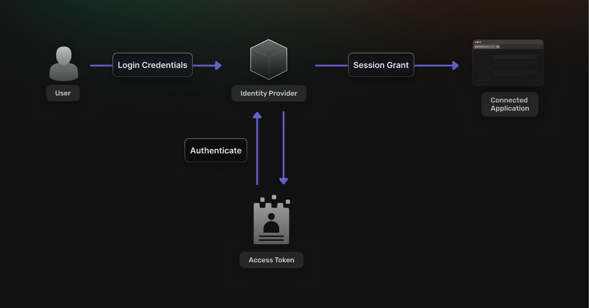

Today's users expect to log in with a single click, access services instantly, and do it all securely. Behind the scenes, delivering that experience depends on a foundational component of modern application architecture: the identity provider (IdP). Before diving into the how, let's understand what an IdP is&mdash;and why it\'s essential.

An IdP performs core functions such as authenticating users, managing session tokens, and integrating with external systems like social login providers or enterprise directories. It acts as the trust anchor for access control across your app or organization, ensuring consistency and security in how identities are handled.

Whether you\'re building SaaS, internal tooling, or APIs, having a robust IdP simplifies development, reduces vulnerabilities, and sets the stage for scalable user management.

## Top 5 Challenges Without a Central IdP

So what happens when identity isn\'t centralized? Without an identity provider, user management is often spread across isolated systems, each with its own logic and standards. Let's look at some of the most common and costly challenges developers and teams face in such environments.

1.  **Password Sprawl and User Fatigue**   Users forced to manage separate credentials for each system end up reusing weak passwords or forgetting them altogether. This leads to frequent password reset requests and growing support burdens.
2.  **Fragmented User Stores**   In decentralized setups, identity data is spread across multiple services&mdash;marketing tools, CRMs, product apps, and internal portals. This fragmentation makes it difficult to synchronize updates or revoke access on time.
3.  **Inconsistent Security Policies**   Security becomes uneven across services. One application might enforce MFA, while another does not. Session lifetimes, hashing algorithms, and logging mechanisms often vary, leading to blind spots and misconfigurations.
4.  **Integration Overhead**   Without an IdP, each application must implement authentication and session management independently. Supporting new providers like Google or Microsoft adds repetitive work and maintenance costs.
5.  **Poor Visibility and Compliance Gaps**   When logs are spread across systems, it becomes difficult to track who accessed what and when. This makes audits painful and introduces compliance risks with regulations like [GDPR](https://gdpr-info.eu/), [HIPAA](https://www.hhs.gov/hipaa/index.html), and [SOC2](https://secureframe.com/hub/soc-2/what-is-soc-2).

These issues compound over time&mdash;especially as your user base, product surface, or team grows.

## Core Capabilities of a Modern Identity Provider

Knowing the risks of not having a proper IdP, it's important to understand what a well-designed one brings to the table. A modern
identity provider goes far beyond login forms&mdash;it offers a comprehensive suite of tools for managing access, enforcing security
policies, and improving user experience. Here\'s what you should expect from a fully featured IdP.

### **Authentication and Token Issuance**

At its core, an IdP handles user sign-in and generates tokens to manage sessions. These tokens&mdash;often [JWTs (JSON Web Tokens)](https://supertokens.com/blog/what-is-jwt) or opaque session IDs&mdash;represent authenticated users and define what resources they can access. Most implementations use short-lived access tokens paired with long-lived refresh tokens, to balance security with usability.

### **Single Sign-On and Federation**

SSO allows users to authenticate once and access multiple services without repeated logins. A robust IdP supports:

-   [SAML](https://supertokens.com/blog/demystifying-saml) and [OIDC](https://supertokens.com/blog/oidc-token) for federating identity across enterprise systems
-   [OAuth-based social logins](https://supertokens.com/features/social-login) for platforms like Google, Facebook, or GitHub

Federation ensures that identity is not only centralized, but also portable across trusted ecosystems.

### **Multi-Factor and Adaptive Authentication**

To harden security, many IdPs offer MFA and adaptive access:

-   Time-based one-time passwords (TOTP)
-   Device-based biometrics via WebAuthn
-   Step-up authentication based on device reputation or IP address

Adaptive flows respond dynamically to risk, prompting additional verification only when necessary.

### **User Lifecycle and Provisioning**

Beyond authentication, IdPs handle the entire lifecycle of user accounts:

-   **Provisioning:** Create user records when a new employee joins or a customer signs up.
-   **Profile management:** Update metadata, roles, or linked accounts.
-   **Deprovisioning:** Immediately remove access upon offboarding.

This centralization ensures that users are always in sync with business rules and security policies.

### **Audit Logging and Compliance**

A mature IdP maintains a comprehensive audit trail of:

-   Login attempts and failures
-   Token creation and revocation
-   MFA and SSO events

This data is essential for security investigations, user behavior analytics, and meeting compliance standards.

## How SuperTokens Works as an Identity Provider

Now that we understand what an IdP does, let's explore how [SuperTokens](https://supertokens.com/) delivers these capabilities in a developer-friendly and scalable way. From out-of-the-box recipes to customizable flows, SuperTokens gives you full control over authentication and session management, without needing to start from scratch.

### **A Lightweight, Extensible Core**

SuperTokens offers "recipes"&mdash;modular components that handle everything from email-password sign-in to session tracking. You can start simple, then layer on complexity as needed:

-   Basic auth with secure password storage
-   Session management with access/refresh token rotation
-   Account linking across login methods

All of this is open-source and self-hostable, allowing full control over security and business logic.

### **Built-in Token Handling**

With secure, built-in session management:

-   JWT or database-stored session tokens are issued per login.
-   Automatic refresh and rotation protect against token theft.
-   Anti-CSRF and tenant-aware logic are included by default.

This eliminates the need to hand-roll session infrastructure or worry about best practices.

### **SSO and External Identity Integration**

SuperTokens supports OAuth for social login and extensions for SAML/OIDC federation. You can connect:

-   Enterprise IdPs such as Okta, Azure AD, or Auth0
-   Social providers such as Google, Apple, GitHub

Integrations are as simple as providing client IDs, secrets, and redirect URIs in your configuration.

### **MFA and Passwordless Support**

Need advanced login flows? SuperTokens supports:

-   TOTP for app-based authentication
-   WebAuthn for biometric or hardware key login
-   Email-based magic links for passwordless access

These can be enabled per tenant, role, or device type&mdash;giving you full control.

### **Custom Hooks and Event Analytics**

Every stage of the auth process can trigger custom hooks:

-   Sync new users to your CRM or analytics tool
-   Apply geo-fencing or device trust policies
-   Log session anomalies for risk scoring

This extensibility makes it easy to adapt SuperTokens to your infrastructure or regulatory needs.

## Step-by-Step: Implementing an Identity Provider with SuperTokens

Curious how everything fits together in a real-world setup? Whether you're starting fresh or transitioning from legacy systems, implementing identity providers like SuperTokens is easier than it sounds. With a modular architecture and developer-friendly design, SuperTokens helps you build secure, scalable authentication with full control. Below is a step-by-step guide to get you up and running confidently.

### **1. Install the Core Libraries and Recipes**

Begin by setting up the SuperTokens backend SDK in your server environment. Choose foundational recipes like `emailpassword` for traditional sign-up/login, and `session` for secure token-based session handling. These core modules handle the most common authentication
workflows out of the box.

### **2. Enable OAuth or SAML/OIDC Login**

To support social logins or enterprise identity federation, configure providers like Google, GitHub, or Azure AD. You'll need to specify
client credentials, redirect URIs, and scopes. These integrations allow your app to work seamlessly with external identity providers your users already trust. SuperTokens provides simple plug-and-play connectors and robust extensibility for enterprise use cases.

### **3. Configure MFA or Passwordless Login**

To enhance security, enable multi-factor authentication by using Time-Based One-Time Passwords (TOTP) or hardware-based methods like WebAuthn. Alternatively, support passwordless flows with magic links or device biometrics. These can be layered on top of existing login flows or used independently.

### **4. Add User Metadata and Provisioning Hooks**

Identity doesn't stop at login. Use SuperTokens\' backend hooks to customize sign-up behavior&mdash;for example, assigning user roles, mapping tenants in a multi-org setup, or syncing with an external user directory. You can also define custom fields and store metadata securely within your preferred database.

### **5. Enable Logging and Monitoring**

Visibility into authentication activity is crucial for security and compliance. SuperTokens emits granular auth events&mdash;such as login
attempts, token refreshes, or password resets&mdash;which can be forwarded to your SIEM, observability platform, or custom analytics pipeline.

### **6. Test Edge Cases Thoroughly**

Finally, rigorously validate the full authentication lifecycle. Test for expired sessions, failed token refreshes, social login fallbacks, MFA timeouts, and logout behaviors across web and mobile clients. This ensures a polished and secure user experience before going live.

This approach delivers secure and scalable identity functionality, without compromising flexibility.

## Business Benefits of SuperTokens as Your IdP

### **How does it reduce dev time?**

SuperTokens eliminates repetitive boilerplate with pre-built flows, session handling, and integrations. Your team can focus on product
features rather than authentication edge cases.

### **How does it boost security?**

It offers secure defaults&mdash;like rotating tokens and anti-CSRF&mdash;alongside advanced options like MFA and SAML integration.This ensures robust protection from the start.

### **How does it improve user experience?**

Users benefit from seamless login across platforms and services, with support for social sign-in, passwordless access, and automatic session refresh.

### **How does it aid compliance?**

SuperTokens enables centralized logging, configurable session lifetimes, and GDPR-aligned data flows&mdash;all essential for meeting regulatory requirements.

## Migration Tips: Replacing Legacy Auth with SuperTokens

Transitioning to a new IdP can be complex, but a thoughtful plan helps mitigate risk.

-   **Start by auditing your current identity flows**: Document endpoints, session logic, MFA, and user roles.
-   **Roll out gradually**: Begin with internal tools or low-risk apps before migrating core products.
-   **Handle password compatibility**: Use compatible hashing or invite-only resets for legacy users.
-   **Deprecate old endpoints** once new flows are stable and monitored.
-   **Train teams and update documentation** to ensure operational readiness across engineering, support, and DevOps.

## Best Practices and Pitfalls to Avoid

### **Best Practices**

-   Use secure cookies with HttpOnly and SameSite flags.
-   Whitelist allowed redirect URLs to prevent open redirects.
-   Monitor login activity and rotate secrets (OAuth keys, certificates) regularly.
-   Plan for user recovery&mdash;offer backup codes or alternate MFA options.

### **Pitfalls to Avoid**

-   Avoid building custom session logic---it's error-prone and insecure.
-   Don't overlook origin and CORS configuration&mdash;it can expose your app.
-   Resist hardcoding token TTLs without rotation mechanisms.
-   Don't delay logging integration&mdash;it's crucial for both security and debugging.

## Conclusion and Next Steps

A well-implemented identity provider is more than a login box. It's a secure, scalable backbone for managing who can access your apps and how. Centralized identity boosts security, reduces development overhead, and simplifies compliance&mdash;benefits no modern system can ignore.

With its open-source architecture, developer-friendly APIs, and robust feature set, **SuperTokens** offers a flexible way to implement a full-featured IdP without losing control or velocity.

Ready to get started?

-   Explore [SuperTokens Docs](https://supertokens.com/docs)

Whether you're modernizing legacy auth or launching a new product, SuperTokens can help you get identity right from day one.
