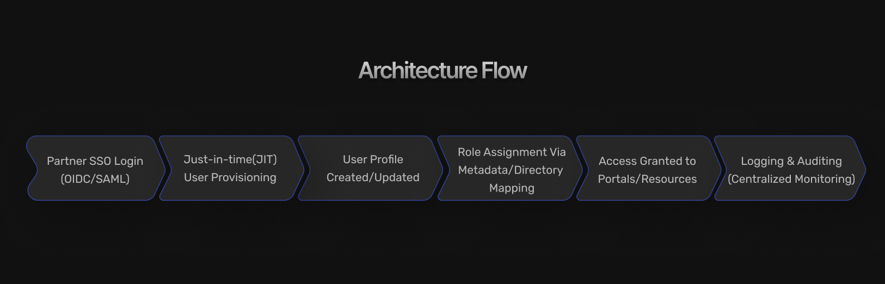

**How can you securely give external partners access to your systems &mdash; without losing control?**

That's the essential challenge B2B Identity and Access Management (IAM) aims to solve. As organizations become increasingly interconnected
through vendor ecosystems, client dashboards, partner APIs, and supply chain platforms, managing who gets access to what, when, and how is more complex than ever. Unlike employee IAM or consumer identity systems, B2B IAM sits in a critical middle ground &mdash; requiring both enterprise-grade security and scalable multi-tenant architecture.

Let's explore what B2B IAM is, why it matters, what challenges it presents, and how to approach implementation with modern tools like
SuperTokens.

## What Is B2B IAM and Why Does It Matter?

**B2B IAM** refers to business-to-business identity and access management, which can be tailored specifically for external organizations &mdash; clients, vendors, resellers,
contractors, or partners &mdash; rather than internal employees or retail consumers.

### **Key Use Cases for B2B IAM**

-   **Partner Portals** &mdash; Access-controlled dashboards for suppliers, agencies, or affiliates.
-   **Vendor Management Platforms** &mdash; Let suppliers upload documents or manage orders securely.
-   **Client Interfaces** &mdash; Portals or apps where enterprise customers log in to access services.
-   **API Gateways** &mdash; Identity-based access to backend services across third-party systems.
-   **Supply Chain Networks** &mdash; Coordinating identity across logistics, warehousing, and delivery nodes.

### **Why B2B IAM is Different**

Unlike Business-to-Consumer (B2C) or workforce IAM, B2B IAM involves:

|  **Dimension**      |  **B2C IAM**  |    **Workforce IAM**  |     **B2B IAM**               | 
|---------------------|---------------|-----------------------|-------------------------------|
| Target Users        | End consumers |   Employees           | External organizations        |                                           
|  Identity Scope     | Single-user   |   Single-organization | Cross-organization            |
|  Delegation         | Rare          |   Centralized IT admin| Delegated external admins     |
|  Multi-Tenancy      | Not needed    |   Internal departments|  Essential                    |
|  Federation and SSO | Optional      |   Internal            |  Common across organizations  |

Understanding and addressing the unique dimensions of B2B IAM is critical, as a poorly designed B2B IAM system can create compliance risks, slow down partner onboarding, or even compromise data privacy across tenants. The right architecture improves operational efficiency, customer satisfaction, and security posture at the same time.

## Unique Challenges in B2B Identity and Access Management

.png)

While the goal is simple &mdash; grant secure access to trusted external parties &mdash; the execution is anything but straightforward in a B2B context.

### **1. Cross-Organization Identity Models**

In B2B environments, users belong to different organizations, each with unique structures. Some have nested teams; others have branches or
departments. A robust B2B IAM system needs to support:

-   **[Multiple tenants](https://supertokens.com/features/multi-tenancy) per application**
-   Sub-accounts or team hierarchies
-   Role-based permissions scoped per tenant**\ **

### **2. Delegated Administration**

IT teams can't manage every external user manually. Instead, **delegated administration** allows external clients or vendors to:

-   Invite and manage their own users
-   Assign team-level roles (e.g., Viewer, Editor, Admin)
-   Reset passwords and manage sessions

This drastically improves scalability and operational load.

### **3. Flexible Access Control**

A one-size-fits-all permission model doesn't work. You need:

-   [Role-Based Access Control (RBAC)](https://supertokens.com/blog/what-is-roles-based-access-control-vs-abac) per organization
-   Fine-grained policies scoped to data partitions
-   Context-aware access: device, location, risk level

### **4. Compliance Across Entities**

Privacy regulations like [GDPR](https://gdpr-info.eu/), [HIPAA](https://www.hhs.gov/hipaa/index.html), or [SOC2](https://secureframe.com/hub/soc-2/what-is-soc-2) require secure, auditable, and partitioned access across entities:

-   Separate data domains for each tenant
-   Consent management and data portability
-   Audit logs per user and action

### **5. Integration at Scale**

Most partners already have an identity system. A B2B IAM platform must support:

-   SSO and Federation via [SAML](https://supertokens.com/blog/demystifying-saml) or [OIDC](https://supertokens.com/blog/oidc-token)
-   [SCIM](https://supertokens.com/blog/what-is-scim-provisioning) for directory sync
-   Custom provisioning workflows

## What to Look for in a B2B IAM Solution

When evaluating tools, consider both technical capabilities and long-term flexibility.

### **Core Features Checklist:**
 
|  **Feature**                         |                         **Why It Matters**                                     |  
|--------------------------------------|--------------------------------------------------------------------------------|
|  **Multi-Tenancy Support**           |  Keep tenant data, policies, and users isolated.                               |
|  **Custom Authentication Flows**               |  Support unique onboarding, invite, and role-mapping logic per tenant.         |
|  **Delegated Management Interfaces** |  External organizations should manage their own users.                         |
|  **Directory Sync and SSO**          |  Integrate with enterprise IdPs via SAML, OIDC.                                |  
|  **Security and  Auditability**      |  Session logs, anomaly detection, access reviews, and fine-grained visibility. |

Many solutions offer basic access control &mdash; but very few scale elegantly across hundreds of external organizations with varying needs.

## How SuperTokens Powers B2B IAM at Scale

[SuperTokens](https://supertokens.com/) is a developer-first, open-source authentication solution built to support **enterprise-grade B2B Identity and Access Management (IAM)**. It offers unmatched flexibility, customization, and control &mdash; empowering engineering teams to scale securely, without sacrificing simplicity or compliance.

### **Multi-Tenant Architecture: Built for Growth**

SuperTokens is designed with true multi-tenancy in mind, enabling seamless support for thousands of organizations:

-   **Tenant-Level Isolation:** Each tenant's data, sessions, and roles are cleanly separated at the architecture level.
-   **Horizontally Scalable:** Easily scale your authentication system as your number of tenants grows.
-   **Centralized or Decentralized Management:** Choose the right model for your business &mdash; central control for internal teams or delegated control for tenant admins.

### **Custom Workflows: Adaptable to Any B2B Use Case**

Tailor authentication flows to match your product's specific needs:

-   **Tenant-Based Invite Flows:** Allow external administrators to invite users within their own organizations.
-   **Dynamic Login Behavior:** Show tenant-specific branding, redirects, or logic during authentication.
-   **Custom Role and Session Logic:** Map roles and permissions per tenant, and define how sessions should be managed uniquely.

### **Enterprise-Grade Features: Built for Compliance and Control**

SuperTokens includes the core capabilities needed for secure and compliant B2B environments:

-   **Role-Based Access Control (RBAC) per Tenant:** Assign roles and scopes independently for each organization.
-   **[Secure Session Management](https://supertokens.com/docs/post-authentication/session-management/introduction):** Support for rotating refresh tokens, anti-CSRF protections, and per-tenant session tracking.
-   **Comprehensive Audit Logs:** Gain visibility into user activity across tenants, for auditing and incident response.
-   **SSO Support:** Enable Single Sign-On by using SAML or OIDC extensions, for enterprise federation.
-   **Plugin-Based Extensibility:** Hook into any part of the authentication lifecycle &mdash; from sign-up to session validation &mdash; for full customization.

### **Deployment Flexibility: Control How and Where You Deploy**

SuperTokens supports modern deployment models to meet the security and compliance requirements of any business:

-   **Cloud-Hosted:** Fully managed by SuperTokens, for minimal operational overhead.
-   **Self-Hosted:** Deploy on your own infrastructure, whether on-premises or in a private cloud.
-   **Hybrid Deployments:** Combine hosted and self-managed components to fit complex enterprise architectures.
-   **Tech Stack Agnostic:** Compatible with all major frontend and backend frameworks (e.g., React, Vue, Angular, Node.js, Go, Python).

### **Why It Matters**

With SuperTokens, **you own the code and the control** &mdash; avoiding vendor lock-in and enabling deep customization. This is especially critical for:

-   Enterprises in **compliance-heavy industries**
-   Products with **complex, multi-tenant architectures**
-   Teams that demand **full transparency and extensibility** in their IAM stack

## B2B IAM Architecture Patterns

B2B IAM isn't just about tools &mdash; it's also about choosing the right architecture for your business model.

### **Centralized vs Federated Identity**

-   **Centralized Identity**: All identities are managed within your system. Better control, simpler design.
-   **Federated Identity**: External organizations authenticate via their IdPs. Ideal for large partners with SAML/OIDC systems.

### **Tenant-Based Access Models**

Each organization is treated as an isolated tenant:

-   Users see only their data
-   RBAC, policies, and sessions scoped per tenant
-   Easier to enforce compliance and limit blast radius

### **Just-in-Time (JIT) User Provisioning**

Instead of pre-creating users, allow them to:

-   Authenticate via SSO
-   Be auto-provisioned with default roles
-   Avoid manual onboarding delays

### **SCIM for Directory Sync**

Enable external IT teams to manage users from their own directory services:

-   Real-time sync via SCIM (System for Cross-Domain Identity Management)
-   Automatic deactivation on HR offboarding
-   Reduce identity sprawl and shadow accounts

## Common Alternatives to SuperTokens for B2B IAM

Here\'s a neutral comparison of popular options in the market:

  
|  **Solution**                |           **Strengths**               |               **Drawbacks**                   |
|------------------------------|---------------------------------------|-----------------------------------------------|
| **Auth0 (Okta)**             | Polished UI, strong B2B features      | Closed source, expensive at scale             |
| **Keycloak**                 | Open-source, highly customizable      | Operational complexity, steep learning curve  |                  
| **FusionAuth**               | Dev-friendly, flexible APIs           | Proprietary core, limited community           |
| **ForgeRock / Ping Identity**| Enterprise-ready, legacy integrations | Heavyweight, costly                           |
| **Amazon Cognito**              | Scalable, native to AWS               | Limited documentation, inflexible setup       |

**Choosing the right solution** depends on your needs: control, cost, ease of integration, and long-term extensibility.

## Best Practices for B2B IAM Implementation

Even with the right platform, execution is critical. Here's how to implement B2B IAM effectively:

-   **Design for Delegation** from the beginning by creating administrative interfaces and workflows that empower partner organizations to manage their users effectively. This includes providing intuitive user interfaces that external administrators can use without extensive training, comprehensive self-service capabilities that reduce support burden, and clear documentation that enables partner organizations to onboard and train their administrators.
-   **Enforce Least Privilege** principles rigorously by implementing role-based access control that provides users with only the minimum access necessary to perform their job functions. This is particularly important in B2B scenarios where external users may have different risk profiles and where over-privileged access could impact multiple organizations.
-   **Secure Sessions Across Tenants** by implementing robust session management that maintains tenant isolation while providing appropriate user experience. This includes using tenant-specific session tokens that prevent cross-tenant access, implementing appropriate session timeouts based on risk profiles, and providing session monitoring capabilities that detect suspicious activity patterns.
-   **Log and Monitor Everything** by implementing comprehensive audit logging that captures all user activities, administrative actions,and system events with sufficient detail to support security investigations, compliance reporting, and operational analysis. Ensure that audit logs are immutable, properly protected, and retained according to compliance requirements.
-   **Build for Scale Early** by designing architecture, operational procedures, and administrative processes that can accommodate significant growth in partner organizations and user populations without requiring major redesign or operational disruption. This includes implementing horizontal scaling capabilities, designing efficient data models, and creating automation that reduces manual operational overhead.

## Conclusion

B2B IAM is no longer a niche requirement. It\'s foundational for SaaS, marketplaces, API providers, and enterprise tools alike. As partnerships grow and data becomes more distributed, access control must keep pace &mdash; securely, scalably, and with minimal overhead.

Whether you're just launching your B2B platform or scaling to thousands of external orgs, investing in a modern IAM foundation will pay off in control, compliance, and customer trust.
