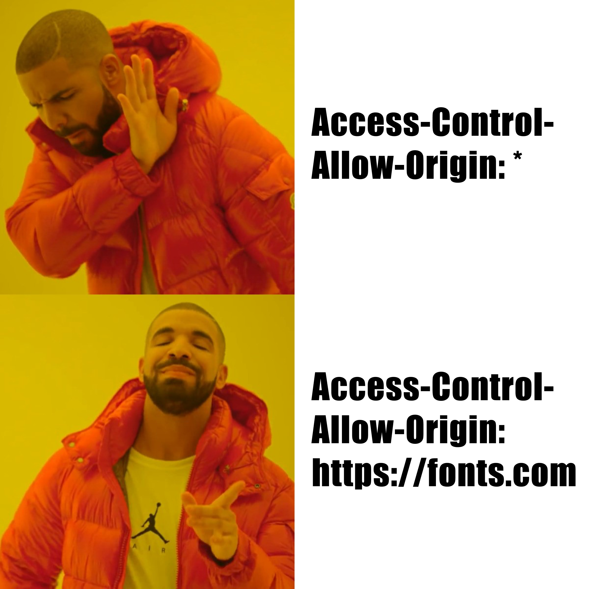

### What is CORS?

Cross-Origin Resource Sharing (CORS) is a mechanism that supports secure cross-origin requests and data transfers, allowing resources to be loaded from outside origins (domain, scheme, or port). 

For example, `example.com` uses a font that's hosted on `fonts.com`. When visiting `example.com`, the user's browser will make a request for the font from `fonts.com`. If `fonts.com` allows cross-origin resource sharing to `example.com`, then the browser will proceed with loading the font. Otherwise, the browser will cancel the request.

More concretely, CORS is a way for web servers to say “Accept cross-origin requests from this origin” or “Do not accept cross-origin requests from this origin”.

This is important because cross-origin requests can be quite scary. I could be logged into my bank account and on visiting a malicious site, it could make requests to the bank’s servers without my knowledge, and if CORS rules didn’t exist, the request would go through - potentially changing or leaking my account information.

CORS is a protocol that defines the limitations of cross-origin requests. These limitations are enforced by our browsers. As a result, we can still make cross-origin requests while still maintaining a high level of security. By specifying which origins are allowed to make requests and which methods and headers are allowed, the browser makes sure that malicious actors can’t retrieve sensitive data with cross-origin requests.

### CORS History

CORS was invented to extend and add flexibility to the Same Origin Policy (SOP).

Same origin policy is essentially what the name suggests. Resources can only be loaded from the same origin. Two origins are defined as the same if the protocol, port (if specified), and host are the same. 

From a technical perspective, an origin can still request a resource from another origin, but the browser prevents the response from being readable. 

However, sometimes, we still need to access resources from other origins - such as from `fonts.com`. That’s where CORS comes in. CORS relaxes the Same Origin Policy by defining trusted or allowed origins, methods, and headers.

### **CORS preflight request**

So now, let’s get into the actual motion of what happens when requesting resources from another domain. 

Let’s say we’re browsing `example.com` and we need to access data from `https://api.example.com`. 

What happens now is that the browser will first send a pre-flight request to find out if our login operation is allowed. More specifically, the preflight request is an OPTIONS request made to our API domain with a couple of headers -

- Origin — Where the request is coming from. For us, that would be `example.com`.
- Access-Control-Request-Method — The method of the request being made by the `example.com`. This can be any of the HTTP request methods, including `GET`, `POST`, `PUT`, `DELETE`, and `CONNECT`.
- Access-Control-Request-Headers — A comma-separated list of [HTTP headers](https://developer.mozilla.org/en-US/docs/Web/HTTP/Headers) that would be used in the actual request.

After getting this preflight request, our API domain would respond with the following headers -

- Access-Control-Allow-Origin — The whitelisted origin, `example.com`, or  a wildcard, `*`
- Access-Control-Allow-Methods — A comma-separated list of HTTP methods that the API domain allows for cross-origin requests.
- Access-Control-Allow-Headers — A comma-separated list of HTTP headers that the API domain allows for cross-origin requests

The browser then takes this response from the API domain to determine if the actual request should be sent. If the response from the API doesn’t include the requested origin, methods, or headers from the preflight request, then the browser will not send the actual request. 

### Wildcards in CORS

One common mistake in configuring CORS is around the use of wildcards. Often, developers will elect to use the wildcard, `*`, when defining the origins, methods, or headers allowed with CORS. 

While wildcards will work for simple requests (requests without [HTTP cookies](https://developer.mozilla.org/en-US/docs/Web/HTTP/Cookies) or HTTP authentication information), requests with credentials will often encounter a CORS not authorized error. 

That’s because in requests with credentials, the wildcard is treated as the literal method name "`*`" without special semantics. This occurs both in `access-control-allow-origin` and `access-control-allow-methods`. And some browsers like Safari simply don’t have support for wildcards at all, simple request or not. 

All in all, it’s good hygiene to avoid the wildcard and use a comma-separated list when configuring CORS.



### **CORS vulnerability**

When configured improperly, CORS can also lead to major vulnerabilities. Below, we’ll list a couple of common issues when configuring CORS. 

**Mishandling origin whitelist** 

One of the easiest mistakes to make when implementing CORS is mishandling the origin whitelist. When whitelisting origins, it’s often easy to do simple matches with URL prefixes of suffixes, or using regular expressions. However this can lead to quite a few issues. Let’s look at some examples below. 

Let’s say that we grant access to all websites with the prefix `whitelisted-website.com`. This helps us grant access to origins such as `whitelisted-website.com/blog` or `whitelisted-website.com/login`.

But a malicious actor might come around and use the origin - `whitelisted-website.com.malicious.com` and bypass our security measures. 

Another approach that we could use is to grant all websites with the suffix `whitelisted-website.com`. This makes it easy for us to grant access to `api.whitelisted-website.com`.

But an attacker could use a website such as `maliciouswhitelisted-website.com` and gain access. 

The best approach here to avoid potential abuse is to explicitly define origins on the whitelist for sensitive operations when implementing CORS - - for example, specify the string `https://whitelisted-website.com` which will grant access to all paths on that domain.

**Injecting JS to exploit CORS relationship**

Vulnerable websites can also be a target for CORS exploits. 

For example, if we had a website of `vulnerable.com` that has an xss vulnerability. And we also have a website of `trusting.com` that has `vulnerable.com` among the allowed origins. 

An attacked could use the following code to exploit that connection -

`https://vulnerable.com/?xss=<script>exploit-here</script>`

**Request with null origin**

Another common misconfiguration is whitelisting origins with the value `null`. Browsers might send the value `null` in the origin header in situations such as:

- Request with `file:`.
- Sandboxed cross-origin requests.

In this case, an attacker can use various tricks to generate a request containing the value `null` as the origin which is whitelisted in our configurations. For example, the attacker could use the following sandboxed iframe exploit -

```
<iframe src="data:text/html" sandbox="allow-scripts allow-top-navigation allow-forms allow-same-origin">
function reqlistener() { console.log(this.responseText) }
var req = new XMLHttpRequest();
req. = reqlistener();
req.open("GET", 'vulnerable.com/sensitive', true);
req.withCredentials = true;
req.send();
</iframe>
```

### **Conclusion**

CORS is one of the key pillars of our internet. 

We hope this article helps you understand the basic tenets behind CORS as well as some common pitfalls when implementing CORS. Happy hacking.