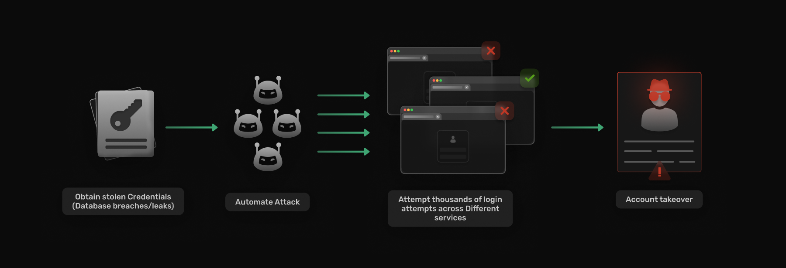

## Table of Content

- [Introduction](#introduction)
- [How does Credential Stuffing work?](#how-does-credential-stuffing-work)
- [How to protect against Credential Stuffing?](#how-to-protect-against-credential-stuffing)
- [Conclusion](#conclusion)

## Introduction

The early 2000's saw a large number of brute force attacks. Attackers would employ bots to generate passwords and try to gain access to user accounts. They would also employ a dictionary of commonly used passwords to supplement the attack.  Back then, users would employ simple passwords, that were easy to guess. Over the years websites began to institute password policies, forcing users to generate unique passwords between 8-12 characters, with numerals and special characters. This drastically lowered the success rate of brute force attacks. The problem that remains is that most users tend to reuse passwords across accounts. This makes users susceptible to an attack known as Credential Stuffing.

Credential Stuffing is a cyberattack method where attackers try to gain unauthorized access to user accounts by using lists of stolen usernames and passwords. It is similar to a brute force attack in the way attackers leverage automated scripts and tools to systemically to enter usernames and passwords, but, builds on it by using credentials stolen from database leaks hoping these users have reused the same login credentials across different services substantially increasing the success rate.  

## How Does Credential Stuffing Work?

### Step 1 Obtaining Credentials
The last decade has seen a record number of [database breaches](https://www.upguard.com/blog/biggest-data-breaches-us), with millions of users credentials being exposed. This makes it trivial for attackers and cybercriminals to get access to usernames and passwords.

### Step 2 Automated Attacks
Leveraging scripts to automate the process of logging into various online platforms using the stolen credentials is not new and has been done for decades, but, over the last decade websites have implemented measures to prevent against these attacks like captchas, ip blacklisting etc... There are now a [number of tools](https://pentestmag.com/credential-stuffing-2022-the-latest-attack-trends-and-tools/) to streamline the process of credential stuffing. 

### Step 3: Mass Login Attempts
Paired with these tools are a hosts of bots known as botnets, which allow attackers to conduct thousands or even millions of login attempts in a short period, exploiting the tendency of users to reuse passwords across multiple accounts.

### Step 4: Account Takeover 
Once the stolen credentials match an existing account, the attacker gains unauthorized access, potentially leading to identity theft, financial loss, or other malicious activities.

## How to Protect Against Credential Stuffing?

### Use Unique Passwords:

Avoid using the same password across multiple accounts. Instead, use a unique, strong password for each online service or platform. Employ password management tools to generate and store complex passwords securely. These tools can also help in detecting and replacing compromised credentials.

### Enable Multi-Factor Authentication (MFA):
Implement MFA wherever possible. This adds an extra layer of security by requiring users to provide additional verification beyond a password, such as a code sent to their phone.

### Captcha and bot detection
Implementing Captcha and IP blacklisting bot networks can act as an excellent deterrent to credential stuffing attacks

### Monitor and Detect Anomalies:
 Regularly monitor your accounts for any unusual activities, such as unrecognized login attempts or changes to account settings.

## Conclusion
Credential stuffing poses a significant threat to individuals and organizations alike, leveraging the lax security habits of users who reuse passwords across multiple accounts. By understanding how credential stuffing works and implementing robust security measures such as unique passwords, password managers, and multi-factor authentication, users can fortify their defenses against this pervasive threat.

In an era where digital security is paramount, proactive steps to protect against credential stuffing are essential. By staying vigilant and adopting best practices, individuals and businesses can mitigate the risks posed by credential stuffing and safeguard their valuable online assets. Remember, securing your accounts is not just about protecting your data—it's about safeguarding your digital identity in an increasingly interconnected world.
